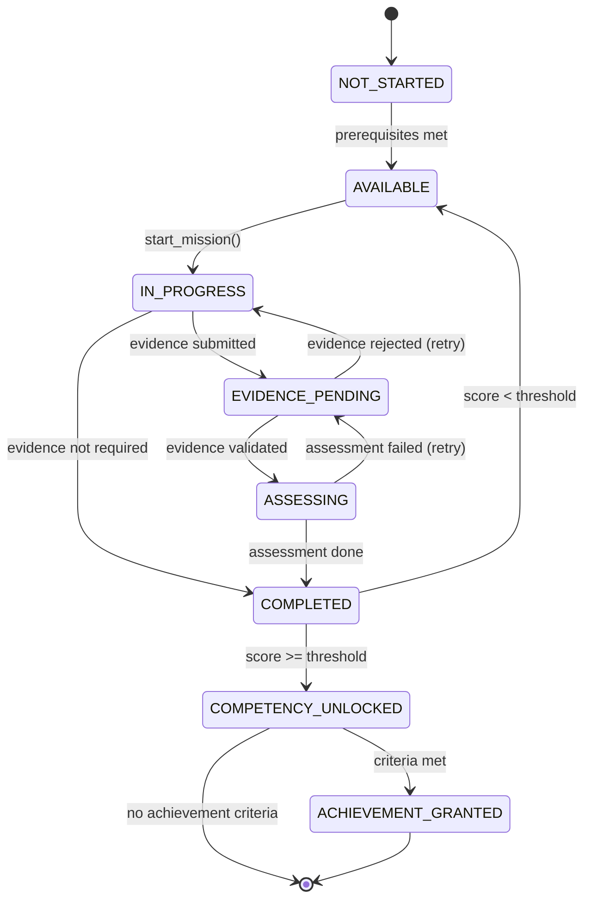
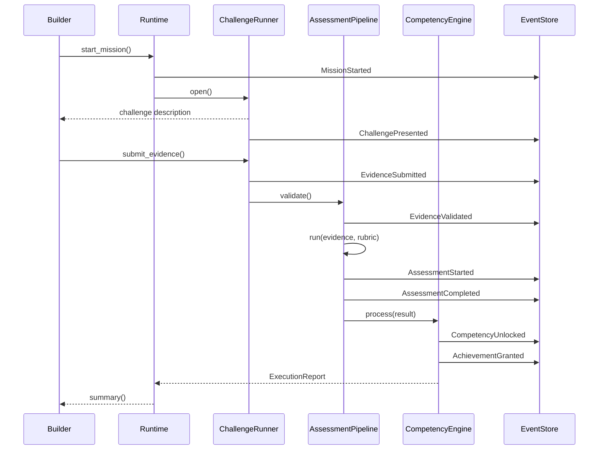
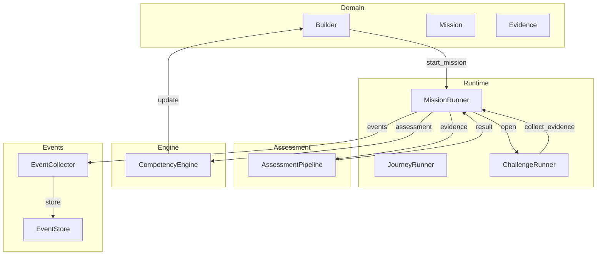

# ARCH-0008 — Competency Lifecycle

| Campo | Valor |
|-------|-------|
| **ID** | ARCH-0008 |
| **Nome** | Competency Lifecycle |
| **Versão** | 1.0 |
| **Status** | Approved |
| **Categoria** | Architecture |
| **Owner** | Chief Architect |
| **Derivado de** | DOC-0000 North Star, DOC-0003 First Principles, ARCH-0001, ARCH-0003, SPEC-0002 AEP |
| **Referenciado por** | Runtime Implementation, Assessment Pipeline, Agent Protocol |

---

## 1. Propósito

Este documento define o **modelo formal do ciclo de vida de uma competência** no ASCEND.

Diferente de plataformas tradicionais que seguem o fluxo:

```
Curso → Aula → Prova → Certificado
```

O ASCEND segue:

```
Competência
    ↓
Missão
    ↓
Desafio
    ↓
Evidência
    ↓
Avaliação
    ↓
Competência Comprovada
```

Este documento formaliza cada estado, cada transição, cada evento e cada responsável por essa orquestração. A partir dele, qualquer implementação — em qualquer linguagem — poderá reproduzir o mesmo ciclo de vida.

---

## 2. Filosofia do Ciclo de Vida

### 2.1 Evidência é o centro

Nenhuma transição ocorre sem uma evidência correspondente. O ciclo de vida não mede consumo de conteúdo — mede **capacidade demonstrada**.

### 2.2 Toda transição é um evento

Cada mudança de estado produz um `DomainEvent`. Isso garante auditabilidade, rastreabilidade e extensibilidade.

### 2.3 Responsabilidade única

Cada transição pertence a um componente específico. Nenhum componente acumula responsabilidade de múltiplas transições.

### 2.4 Falhas são estados, não exceções

O ciclo de vida trata falhas como estados válidos com transições de recuperação definidas.

---

## 3. State Machine Completa

```
                 NOT_STARTED
                      │
                    [prerequisites met]
                      ▼
                  AVAILABLE
                      │
                    [builder starts mission]
                      ▼
                IN_PROGRESS
                      │
                    [challenge presented]
                      ▼
            ┌── EVIDENCE_PENDING ──┐
            │                      │
     [evidence submitted]    [evidence rejected]
            │                      │
            ▼                      │
         ASSESSING                 │
            │                      │
     [assessment complete]         │
            │                      │
            ▼                      │
         COMPLETED ◄───────────────┘
            │
     [competency threshold met]
            │
            ▼
    COMPETENCY_UNLOCKED
            │
     [achievement criteria met]
            │
            ▼
    ACHIEVEMENT_GRANTED
```

### 3.1 Descrição dos Estados

| Estado | Definição | Duração | Dono |
|--------|-----------|---------|------|
| **NOT_STARTED** | O builder ainda não iniciou a missão. Pré-requisitos podem ou não estar satisfeitos. | Indeterminada | Domain |
| **AVAILABLE** | Missão pronta para execução. Pré-requisitos cumpridos. | Até o builder iniciar | Domain |
| **IN_PROGRESS** | Missão em execução. Builder recebeu o desafio. | Variável | Runner |
| **EVIDENCE_PENDING** | Builder submeteu evidência. Aguardando validação de formato. | Curta (segundos) | Pipeline |
| **ASSESSING** | Evidência sendo avaliada contra rubrica. | Determinada pelo método | Pipeline |
| **COMPLETED** | Missão concluída com sucesso. Builder ganhou XP. | Instantânea | Engine |
| **COMPETENCY_UNLOCKED** | Competência associada foi desbloqueada. | Instantânea | Engine |
| **ACHIEVEMENT_GRANTED** | Achievement concedido. Ciclo da missão encerrado. | Terminal | Engine |

### 3.2 Transições Válidas

| De | Para | Gatilho | Validação |
|----|------|---------|-----------|
| NOT_STARTED | AVAILABLE | Builder verifica pré-requisitos | `can_start()` == True |
| AVAILABLE | IN_PROGRESS | Builder chama `start_mission()` | Missão não foi iniciada antes |
| IN_PROGRESS | EVIDENCE_PENDING | Builder submete evidência | Evidência não vazia |
| IN_PROGRESS | COMPLETED | Missão sem exigência de evidência | `evidence_required == False` |
| EVIDENCE_PENDING | ASSESSING | Evidência validada estruturalmente | Formato, tamanho, tipo aceitos |
| EVIDENCE_PENDING | IN_PROGRESS | Evidência rejeitada na validação | Builder pode reenviar |
| ASSESSING | COMPLETED | Assessment finalizado (aprovado ou reprovado) | Score calculado |
| ASSESSING | EVIDENCE_PENDING | Falha técnica no assessment | Retry permitido |
| COMPLETED | COMPETENCY_UNLOCKED | Score >= mastery_threshold | Regra de negócio |
| COMPLETED | AVAILABLE | Score < mastery_threshold | Competência não desbloqueada |
| COMPETENCY_UNLOCKED | ACHIEVEMENT_GRANTED | Critérios do achievement satisfeitos | Regra textual avaliada |

### 3.3 Transições Inválidas (Proibidas)

| Tentativa | Motivo |
|-----------|--------|
| NOT_STARTED → ASSESSING | Pula desafio e evidência |
| AVAILABLE → EVIDENCE_PENDING | Pula IN_PROGRESS |
| IN_PROGRESS → COMPETENCY_UNLOCKED | Pula assessment |
| EVIDENCE_PENDING → COMPLETED | Pula assessment |
| ASSESSING → ACHIEVEMENT_GRANTED | Pula COMPLETED e COMPETENCY_UNLOCKED |
| COMPLETED → ASSESSING | Regressão de estado |

---

## 4. Eventos

### 4.1 Catálogo de Eventos

| Evento | Emissor | Payload | Consumidores |
|--------|---------|---------|--------------|
| **MissionStarted** | MissionRunner | `{ mission_id, builder_id, journey_id }` | EventStore, Hooks |
| **ChallengePresented** | ChallengeRunner | `{ mission_id, challenge_type, description }` | EventStore |
| **EvidenceSubmitted** | ChallengeRunner | `{ evidence_id, mission_id, builder_id, evidence_type }` | EventStore, Hooks |
| **EvidenceValidated** | AssessmentPipeline | `{ evidence_id, valid, reason }` | EventStore |
| **AssessmentStarted** | AssessmentPipeline | `{ mission_id, rubric_id, timestamp }` | EventStore, Hooks |
| **AssessmentCompleted** | AssessmentPipeline | `{ mission_id, score, percentage, passed, rubric_id }` | EventStore, Hooks, CompetencyEngine |
| **CompetencyUnlocked** | CompetencyEngine | `{ competency_id, builder_id, level, score }` | EventStore, Builder |
| **AchievementGranted** | CompetencyEngine | `{ achievement_id, builder_id, competency_id }` | EventStore, Builder |

### 4.2 Schema do Evento

```python
@dataclass
class DomainEvent:
    event_id: str        # Unique, prefixado
    event_type: EventType
    aggregate_id: str    # ID da entidade afetada
    payload: dict[str, Any]
    timestamp: datetime
    version: int = 1     # Para evolução futura do schema
```

### 4.3 Ordem Garantida

Os eventos seguem uma ordem causal estrita:

```
1. MissionStarted
2. ChallengePresented
3. EvidenceSubmitted
4. EvidenceValidated
     ├── 4a. EvidenceValidated.valid = true  → AssessmentStarted
     └── 4b. EvidenceValidated.valid = false → retorna ao IN_PROGRESS
5. AssessmentStarted
6. AssessmentCompleted
     ├── 6a. AssessmentCompleted.passed = true  → CompetencyUnlocked
     └── 6b. AssessmentCompleted.passed = false → COMPLETED sem unlock
7. CompetencyUnlocked
8. AchievementGranted
```

---

## 5. Responsáveis por Transições

### 5.1 Mapa Componente → Transição

```
NOT_STARTED ─────────────────────────────────── Domain (Builder.check_prerequisites)
     │
     ▼
AVAILABLE ───────────────────────────────────── Domain (Builder.start_mission)
     │
     ▼
IN_PROGRESS ─────────────────────────────────── ChallengeRunner.open()
     │
     ▼
EVIDENCE_PENDING ────────────────────────────── ChallengeRunner.collect_evidence()
     │
     ▼
ASSESSING ───────────────────────────────────── AssessmentPipeline.run()
     │
     ▼
COMPLETED ───────────────────────────────────── MissionRunner (após assessment)
     │
     ▼
COMPETENCY_UNLOCKED ─────────────────────────── CompetencyEngine.process()
     │
     ▼
ACHIEVEMENT_GRANTED ─────────────────────────── CompetencyEngine.process()
```

### 5.2 Responsabilidades Detalhadas

| Componente | Transições | Entrada | Saída |
|------------|-----------|---------|-------|
| **Builder** (Domain) | NOT_STARTED → AVAILABLE | `can_start(completed_ids)` | booleano |
| **Builder** (Domain) | AVAILABLE → IN_PROGRESS | `start_mission(mission)` | MissionStarted event |
| **ChallengeRunner** | IN_PROGRESS → EVIDENCE_PENDING | `collect_evidence(ctx)` | EvidenceSubmitted event |
| **AssessmentPipeline** | EVIDENCE_PENDING → ASSESSING | `validate_evidence(evidence)` | EvidenceValidated event |
| **AssessmentPipeline** | ASSESSING → COMPLETED | `run(evidence, rubric, mission_id)` | AssessmentCompleted event |
| **CompetencyEngine** | COMPLETED → COMPETENCY_UNLOCKED | `process(result, mission, package, builder)` | CompetencyUnlocked event |
| **CompetencyEngine** | COMPETENCY_UNLOCKED → ACHIEVEMENT_GRANTED | `check_achievements(unlocked, result)` | AchievementGranted event |

### 5.3 Contrato de cada componente

```python
class ChallengeRunner:
    def open(self, mission: RuntimeMission, ctx: RuntimeContext) -> str
    def collect_evidence(self, mission: RuntimeMission, ctx: RuntimeContext) -> str

class AssessmentPipeline:
    def validate(self, evidence: str) -> ValidationResult
    def run(self, evidence: str, rubric: RuntimeRubric | None, mission_id: str) -> AssessmentResult

class CompetencyEngine:
    def process(
        self,
        result: AssessmentResult,
        mission: RuntimeMission,
        package: RuntimePackage,
        current_xp: int,
        current_level: int,
        unlocked_competency_ids: set[str],
        earned_achievement_ids: set[str],
    ) -> CompetencyUpdate
```

---

## 6. Invariantes do Ciclo de Vida

### CL1 — Competência depende de Assessment aprovado

> Nenhuma competência pode ser desbloqueada sem um `AssessmentResult.passed == true`.

**Aplicação:** `CompetencyEngine.process()` verifica `result.passed` antes de unlock.

### CL2 — Achievement depende de Competency

> Nenhum achievement pode ser concedido sem que a competência correspondente tenha sido desbloqueada no mesmo ciclo.

**Aplicação:** `CompetencyEngine.process()` só verifica achievements se `unlocked == true`.

### CL3 — Assessment exige evidência real

> Nenhuma avaliação pode ser iniciada com evidência vazia, nula ou composta apenas de whitespace.

**Aplicação:** `AssessmentPipeline.run()` retorna `passed=False` se `evidence_text` for vazio.

### CL4 — Challenge precede Evidence

> Nenhuma evidência pode ser coletada sem que o desafio tenha sido apresentado primeiro.

**Aplicação:** `ChallengeRunner` executa `open()` antes de `collect_evidence()`.

### CL5 — Missão exige pré-requisitos

> Nenhuma missão pode ser iniciada sem que todos os seus pré-requisitos estejam cumpridos.

**Aplicação:** `JourneyRunner.run()` verifica pré-requisitos antes de executar missão.

### CL6 — Estado não regride

> Nenhuma transição pode retornar a um estado anterior no ciclo de vida da missão.

**Aplicação:** State machine proíbe ciclos regressivos. `Mission.start()` falha se `status != AVAILABLE`.

### CL7 — Eventos são imutáveis

> Uma vez emitido, um evento não pode ser alterado ou removido. Novos eventos corrigem o estado.

**Aplicação:** EventStore aceita apenas append. Eventos corrigem estado anterior por compensação.

---

## 7. Diagramas

### 7.1 State Machine (Mermaid)



### 7.2 Fluxo de Eventos (Mermaid)



### 7.3 Diagrama de Componentes (Mermaid)



---

## 8. Sequence Diagram: Missão Completa

```
Builder         Runtime         ChallengeRunner  AssessmentPipeline  CompetencyEngine  EventStore
   │               │                  │                  │                  │              │
   │  start        │                  │                  │                  │              │
   │──────────────>│                  │                  │                  │              │
   │               │ verify prereqs   │                  │                  │              │
   │               │─────────────────>│                  │                  │              │
   │               │ prereqs ok       │                  │                  │              │
   │               │<─────────────────│                  │                  │              │
   │               │ MissionStarted   │                  │                  │              │
   │               │──────────────────────────────────────────────────────>│              │
   │               │                  │                  │                  │              │
   │               │ open challenge   │                  │                  │              │
   │               │─────────────────>│                  │                  │              │
   │  challenge    │                  │                  │                  │              │
   │<──────────────│                  │                  │                  │              │
   │               │ ChallengePresented                                   │              │
   │               │──────────────────────────────────────────────────────>│              │
   │               │                  │                  │                  │              │
   │  evidence     │                  │                  │                  │              │
   │──────────────>│                  │                  │                  │              │
   │               │ collect          │                  │                  │              │
   │               │─────────────────>│                  │                  │              │
   │               │ EvidenceSubmitted│                  │                  │              │
   │               │──────────────────────────────────────────────────────>│              │
   │               │                  │ validate         │                  │              │
   │               │                  │─────────────────>│                  │              │
   │               │                  │ EvidenceValidated│                  │              │
   │               │                  │────────────────────────────────────>│              │
   │               │                  │ run assessment   │                  │              │
   │               │                  │─────────────────>│                  │              │
   │               │                  │ AssessmentStarted│                  │              │
   │               │                  │────────────────────────────────────>│              │
   │               │                  │                  │ score & rubric  │              │
   │               │                  │                  │─────────────────>│              │
   │               │                  │ AssessmentCompleted               │              │
   │               │                  │────────────────────────────────────>│              │
   │               │                  │                  │ process result  │              │
   │               │                  │                  │─────────────────>│              │
   │               │                  │                  │                  │ calc xp/level │
   │               │                  │                  │                  │──────┐       │
   │               │                  │                  │                  │      │       │
   │               │                  │                  │                  │<─────┘       │
   │               │                  │                  │ CompetencyUnlocked             │
   │               │                  │                  │────────────────────────────────>│
   │               │                  │                  │ AchievementGranted              │
   │               │                  │                  │────────────────────────────────>│
   │               │                  │                  │                  │              │
   │               │                  │                  │                  │              │
   │  report       │                  │                  │                  │              │
   │<──────────────│                  │                  │                  │              │
```

---

## 9. Failure Modes

### 9.1 Evidência Inválida

| Causa | Estado | Transição | Resposta |
|-------|--------|-----------|----------|
| Evidência vazia | EVIDENCE_PENDING | → IN_PROGRESS | `AssessmentResult.passed=false`, builder notificado |
| Formato incorreto | EVIDENCE_PENDING | → IN_PROGRESS | Validação rejeita, retry permitido |
| Evidência muito curta | EVIDENCE_PENDING | → IN_PROGRESS | Score baixo, baseline 60% aplicado |
| Tipo não suportado | EVIDENCE_PENDING | → IN_PROGRESS | Erro de validação, builder escolhe tipo válido |

### 9.2 Assessment Falha

| Causa | Estado | Transição | Resposta |
|-------|--------|-----------|----------|
| Score abaixo do threshold | ASSESSING | → COMPLETED | Missão concluída, sem unlock de competência |
| Rubrica não encontrada | ASSESSING | → COMPLETED | Assessment sem rubrica = aprovado automaticamente |
| Erro no pipeline | ASSESSING | → EVIDENCE_PENDING | Retry automático, erro logado |
| Timeout de avaliação | ASSESSING | → EVIDENCE_PENDING | Notificação, builder pode reenviar |

### 9.3 Builder Interrompe

| Causa | Estado | Transição | Resposta |
|-------|--------|-----------|----------|
| Builder fecha terminal | Qualquer | Perde contexto | Missão persiste no banco, retomável |
| Builder nunca submete | IN_PROGRESS | Fica neste estado | Missão expira após N dias (não implementado) |
| Builder desiste | IN_PROGRESS | Abandono voluntário | Missão marcada como ABANDONED (estado futuro) |

### 9.4 Pacote Inválido

| Causa | Estado | Transição | Resposta |
|-------|--------|-----------|----------|
| package.yaml mal formatado | NOT_STARTED | Não inicia | `ExecutionReport.errors` com detalhes |
| Competência não definida | NOT_STARTED | Não inicia | Erro de validação: competency-not-found |
| Rubrica não encontrada | NOT_STARTED | Inicia com warning | Assessment sem rubrica = aprovado automático |
| XP negativo | NOT_STARTED | Não inicia | Erro de validação: negative-xp |

### 9.5 Runtime Interrompe

| Causa | Estado | Transição | Resposta |
|-------|--------|-----------|----------|
| Kernel falha no meio da execução | Qualquer | Aborta jornada | `ExecutionReport.success=false`, erros capturados |
| Orquestrador encontra exceção | Qualquer | Continua próxima journey | Erro logado no report, jornada marcada como falha |
| Disco cheio ao salvar | Qualquer | Operação falha | Rollback via UnitOfWork, erro no report |

### 9.6 Missão Cancelada

| Causa | Estado | Transição | Resposta |
|-------|--------|-----------|----------|
| Administrador cancela | Qualquer | → CANCELLED | Estado terminal, sem XP, sem unlock |
| Pré-requisito perdido | AVAILABLE | → LOCKED | Se requisito for desabilitado (futuro) |
| Pacote descontinuado | Qualquer | → CANCELLED | Notificação, transição manual |

### 9.7 Tabela de Resposta a Falhas

| Failure Mode | Impacto | Recuperação | Estado Final |
|-------------|---------|-------------|--------------|
| Evidência inválida | Baixo | Retry | IN_PROGRESS |
| Assessment falha | Médio | Nova tentativa | COMPLETED (sem unlock) |
| Builder interrompe | Médio | Retomada | Estado atual preservado |
| Pacote inválido | Alto | Correção do pacote | NOT_STARTED |
| Runtime interrompe | Crítico | Reinício | Report de erro |
| Missão cancelada | Alto | Nenhuma | CANCELLED |

---

## 10. Integração com a Implementação Atual

### 10.1 Mapeamento para o Código Existente

| Estado ARCH-0008 | Implementação Atual | Status |
|------------------|---------------------|--------|
| NOT_STARTED | `MissionStatus.AVAILABLE` (indireto) | ⚠️ Estado implícito |
| AVAILABLE | `MissionStatus.AVAILABLE` | ✅ |
| IN_PROGRESS | `MissionStatus.STARTED` | ⚠️ Nome diferente |
| EVIDENCE_PENDING | Inline no `MissionRunner` | ⚠️ Não é estado explícito |
| ASSESSING | Inline no `AssessmentPipeline` | ⚠️ Não é estado explícito |
| COMPLETED | `MissionStatus.COMPLETED` | ✅ |
| COMPETENCY_UNLOCKED | `CompetencyUpdate.unlocked` | ⚠️ Evento sem estado |
| ACHIEVEMENT_GRANTED | `AchievementEarned` event | ⚠️ Evento sem estado |

### 10.2 Lacunas na Implementação Atual

| Lacuna | Descrição | Prioridade |
|--------|-----------|------------|
| `EVIDENCE_PENDING` não é estado explícito | `MissionStatus` não tem esse valor | Alta |
| `ASSESSING` não é estado explícito | Pipeline roda inline sem transição de estado | Alta |
| `COMPETENCY_UNLOCKED` sem estado de domínio | `Builder.competencies` é atualizado, mas sem estado transacional | Média |
| `ACHIEVEMENT_GRANTED` sem estado de domínio | `Achievement.earned_at` indica, sem máquina de estados | Média |
| Sem estado `CANCELLED` | Missão não pode ser cancelada formalmente | Baixa |

### 10.3 Recomendações de Evolução

1. Adicionar `EVIDENCE_PENDING` e `ASSESSING` ao `MissionStatus` enum
2. Criar `CompetencyStatus` enum (LOCKED, UNLOCKED, MASTERED)
3. Criar `AchievementStatus` (NOT_EARNED, EARNED, REVOKED)
4. Refatorar `AssessmentPipeline` para emitir `AssessmentStarted` antes de `AssessmentCompleted`
5. Adicionar `CANCELLED` como estado terminal em todos os enums

---

## 11. Glossário do Ciclo de Vida

| Termo | Definição |
|-------|-----------|
| **Missão** | Unidade atômica de execução. Contém um desafio e produz uma evidência. |
| **Desafio** | Problema ou tarefa que o builder deve resolver para demonstrar competência. |
| **Evidência** | Artefato produzido pelo builder como resultado do desafio. |
| **Assessment** | Processo de avaliação da evidência contra uma rubrica. |
| **Rubrica** | Conjunto de critérios ponderados que definem como uma evidência é avaliada. |
| **Competência** | Capacidade demonstrável de aplicar conhecimento. Unidade de progressão do builder. |
| **Achievement** | Conquista especial concedida quando critérios específicos são atingidos. |
| **XP** | Pontos de experiência acumulados por missões completas. Determinam o level. |
| **Level** | Indicador de progressão global do builder. Calculado como (XP // 500) + 1. |

---

## 12. Declaração Final

> **O Ciclo de Vida da Competência não é um detalhe de implementação.**
>
> É o modelo formal que distingue o ASCEND de qualquer plataforma de ensino existente.
>
> Enquanto plataformas tradicionais medem **consumo**, o ASCEND mede **capacidade**.
>
> Enquanto plataformas tradicionais emitem **certificados**, o ASCEND rastreia **evidências**.
>
> Enquanto plataformas tradicionais têm fluxos lineares, o ASCEND tem um **ciclo de vida com estados, eventos, invariantes e recuperação de falhas**.
>
> Este documento é o contrato que qualquer implementação — hoje em Python, amanhã em qualquer linguagem — deve respeitar.

---

## Appendix A: Comparação com Plataformas Tradicionais

| Aspecto | Plataforma Tradicional | ASCEND |
|---------|----------------------|--------|
| Modelo | Curso → Aula → Prova | Competência → Missão → Desafio → Evidência → Assessment |
| Unidade | Hora de conteúdo | Capacidade demonstrada |
| Avaliação | Prova objetiva (score) | Rubrica multi-critério com evidência |
| Certificação | Certificado de conclusão | Competência comprovada + achievements |
| Falha | Repetir a prova | Revisão da evidência com feedback |
| Progressão | Linear (pular aulas = perder conteúdo) | Baseada em competências e pré-requisitos |
| Dados do usuário | Centralizado na plataforma | Local-first, propriedade do usuário |
| Extensibilidade | Apenas o provedor cria conteúdo | Comunidade cria pacotes (APS) |
