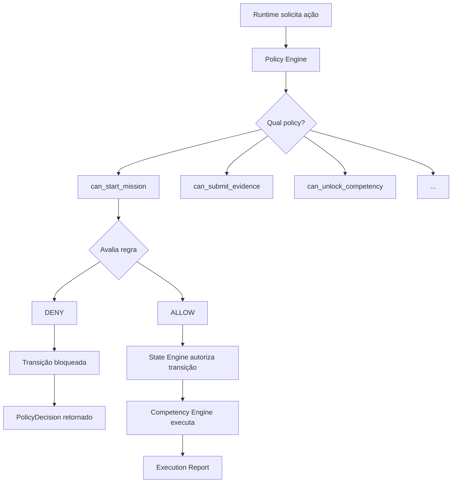
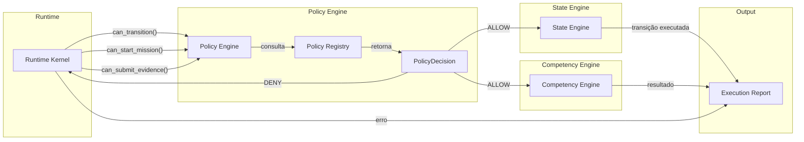
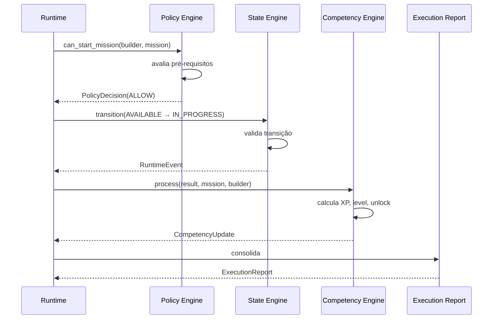

# ARCH-0010 — Policy Engine

| Campo | Valor |
|-------|-------|
| **ID** | ARCH-0010 |
| **Nome** | Policy Engine |
| **Versão** | 1.0 |
| **Status** | Approved |
| **Categoria** | Architecture |
| **Owner** | Chief Architect |
| **Derivado de** | Constituição, ARCH-0001, ARCH-0003, ARCH-0008, ARCH-0009, ADR-001, ADR-002, ADR-003, ADR-004 |
| **Referenciado por** | State Engine, Runtime Kernel, PROTOCOL-0004 |

---

## 1. Objetivos

### 1.1 O que é o Policy Engine

O **Policy Engine** é o componente que responde perguntas sobre autorização.

Ele não executa lógica de negócio. Ele não modifica estado. Ele não orquestra fluxos.

Ele apenas responde:

> *"Esta ação é permitida?"*

### 1.2 O que o Policy Engine nunca fará

- ❌ Executar missões
- ❌ Modificar estado do Builder
- ❌ Avaliar evidências
- ❌ Calcular XP
- ❌ Orquestrar fluxos
- ❌ Emitir eventos de domínio
- ❌ Acessar banco de dados
- ❌ Chamar APIs externas
- ❌ Tomar decisões não autorizadas

### 1.3 O que o Policy Engine sempre fará

- ✅ Receber uma pergunta de autorização
- ✅ Avaliar a pergunta contra políticas registradas
- ✅ Retornar um `PolicyDecision` (ALLOW ou DENY)
- ✅ Registrar o trace da decisão
- ✅ Ser stateless (não mantém estado entre chamadas)

---

## 2. Responsabilidades

### 2.1 Catálogo de Perguntas

| Pergunta | Política | Domínio |
|----------|----------|---------|
| `can_start_mission(builder, mission)` | Mission Policy | Missão |
| `can_submit_evidence(builder, mission, evidence)` | Evidence Policy | Evidência |
| `can_assess(evidence, reviewer)` | Assessment Policy | Avaliação |
| `can_unlock_competency(builder, competency, result)` | Competency Policy | Competência |
| `can_grant_achievement(builder, achievement, result)` | Achievement Policy | Achievement |
| `can_cancel_execution(runtime_context)` | Runtime Policy | Runtime |
| `can_repeat_mission(builder, mission)` | Mission Policy | Missão |
| `can_transition(from_state, to_state, context)` | State Policy | Runtime |
| `can_load_package(path)` | Package Policy | Pacote |
| `can_validate_package(pkg)` | Package Policy | Pacote |
| `can_convert_package(pkg)` | Package Policy | Pacote |
| `can_start_journey(builder, journey)` | Mission Policy | Jornada |
| `can_skip_mission(builder, mission)` | Mission Policy | Missão |
| `can_retry_assessment(evidence)` | Assessment Policy | Avaliação |
| `can_edit_evidence(evidence_id)` | Evidence Policy | Evidência |
| `can_delete_evidence(evidence_id)` | Evidence Policy | Evidência |

---

## 3. Catálogo de Policies

### 3.1 Mission Policies

| Policy | Pergunta | Regra | Invariante |
|--------|----------|-------|------------|
| `can_start_mission` | O builder pode iniciar esta missão? | Pré-requisitos cumpridos, missão AVAILABLE | CL5 |
| `can_repeat_mission` | O builder pode repetir esta missão? | Missão já COMPLETED, pacote permite repetição | — |
| `can_skip_mission` | O builder pode pular esta missão? | Missão não é obrigatória na journey | — |
| `can_start_journey` | O builder pode iniciar esta jornada? | Jornada existe, builder não iniciou | — |

### 3.2 Evidence Policies

| Policy | Pergunta | Regra | Invariante |
|--------|----------|-------|------------|
| `can_submit_evidence` | O builder pode submeter esta evidência? | Missão em IN_PROGRESS, evidência não vazia | CL3, CL4 |
| `can_edit_evidence` | O builder pode editar esta evidência? | Evidência não foi avaliada ainda | — |
| `can_delete_evidence` | O builder pode remover esta evidência? | Evidência não vinculada a assessment | — |
| `can_validate_evidence` | O sistema pode validar esta evidência? | Evidência submetida, formato aceito | CL3 |

### 3.3 Assessment Policies

| Policy | Pergunta | Regra | Invariante |
|--------|----------|-------|------------|
| `can_assess` | O sistema pode avaliar esta evidência? | Evidência validada, rubric existe ou não | CL1 |
| `can_retry_assessment` | O builder pode tentar novamente? | Assessment anterior falhou, retry permitido | — |
| `can_auto_assess` | O sistema pode avaliar sem agente externo? | Modo built-in ativado, sem IA configurada | I5 |

### 3.4 Competency Policies

| Policy | Pergunta | Regra | Invariante |
|--------|----------|-------|------------|
| `can_unlock_competency` | Esta competência pode ser desbloqueada? | Assessment aprovado, threshold atingido | CL1, I2 |
| `can_increase_level` | O nível da competência pode aumentar? | Múltiplas evidências aprovadas no mesmo domínio | — |
| `can_grant_xp` | O builder pode ganhar XP? | Missão COMPLETED com assessment aprovado | — |

### 3.5 Achievement Policies

| Policy | Pergunta | Regra | Invariante |
|--------|----------|-------|------------|
| `can_grant_achievement` | O achievement pode ser concedido? | Competência desbloqueada, critérios satisfeitos | CL2 |
| `can_revoke_achievement` | O achievement pode ser revogado? | Evidência invalidada, revisão de auditoria | — |

### 3.6 Runtime Policies

| Policy | Pergunta | Regra | Invariante |
|--------|----------|-------|------------|
| `can_cancel_execution` | A execução pode ser cancelada? | Runtime em EXECUTING, autorização válida | — |
| `can_transition` | A transição de estado é válida? | Transição na máquina de estados, política satisfeita | ARCH-0009 |
| `can_report` | O relatório pode ser gerado? | Todas as journeys processadas | — |

### 3.7 Package Policies

| Policy | Pergunta | Regra | Invariante |
|--------|----------|-------|------------|
| `can_load_package` | O pacote pode ser carregado? | Path existe, package.yaml parseável | I4 |
| `can_validate_package` | O pacote pode ser validado? | Pacote carregado, 13 regras aplicáveis | — |
| `can_convert_package` | O pacote pode ser convertido? | Pacote validado com sucesso | — |

---

## 4. PolicyDecision

### 4.1 Definição Formal

```python
@dataclass
class PolicyDecision:
    result: PolicyResult       # ALLOW | DENY
    reason: str                # Explicação legível
    failed_invariant: str | None  # Invariante violado (se DENY)
    severity: PolicySeverity   # CRITICAL | HIGH | MEDIUM | LOW | INFO
    trace_id: str              # Correlação com a execução
    policy_name: str           # Nome da policy que decidiu
    evaluated_at: datetime     # Timestamp da decisão
    context_snapshot: dict     # Estado relevante no momento da decisão
```

### 4.2 PolicyResult

| Resultado | Significado | Ação do Sistema |
|-----------|-------------|-----------------|
| **ALLOW** | A ação é permitida | Executa a transição |
| **DENY** | A ação é proibida | Bloqueia a transição, retorna erro |

### 4.3 REASON

String legível que explica o motivo da decisão.

Exemplos:
- `"Pré-requisitos não cumpridos: linux-001, linux-002"`
- `"Evidência vazia ou inválida"`
- `"Transição não autorizada pela máquina de estados"`
- `"Competência já desbloqueada"`

### 4.4 FAILED_INVARIANT

Se `result == DENY`, este campo identifica qual invariante foi violado.

| Invariante | Quando ocorre |
|------------|---------------|
| `CL-001` | Tentativa de unlock sem assessment aprovado |
| `CL-002` | Tentativa de achievement sem competency unlock |
| `CL-003` | Assessment com evidência vazia |
| `CL-004` | Evidence coletada sem challenge apresentado |
| `CL-005` | Missão iniciada sem pré-requisitos |
| `CL-006` | Tentativa de regressão de estado |
| `CL-007` | Tentativa de alterar evento imutável |
| `I-001` | Domain importa Infrastructure |
| `I-002` | Competência sem evidência |
| `I-004` | Conteúdo como código (não YAML) |
| `I-005` | IA alterando regras de negócio |
| `ARCH-0009-001` | Transição inválida na máquina de estados do Runtime |

### 4.5 SEVERITY

| Severidade | Quando usar | Impacto |
|------------|-------------|---------|
| **CRITICAL** | Violação de invariante arquitetural (I1–I10) | Bloqueia execução |
| **HIGH** | Violação de invariante de ciclo de vida (CL1–CL7) | Bloqueia transição |
| **MEDIUM** | Violação de regra de negócio não-invariante | Bloqueia ação |
| **LOW** | Violação de recomendação ou warning | Permite com aviso |
| **INFO** | Decisão informacional, sem bloqueio | Log apenas |

### 4.6 TRACE_ID

Identificador único que correlaciona:
- A pergunta de policy
- A decisão tomada
- O contexto avaliado
- A execução do Runtime

Formato: `pol-{hash}-{timestamp}`

---

## 5. Invariantes

### 5.1 Matriz Policy → Invariante

| Policy | Invariante(s) | Fonte |
|--------|---------------|-------|
| `can_start_mission` | CL-005 | ARCH-0008 |
| `can_submit_evidence` | CL-003, CL-004 | ARCH-0008 |
| `can_assess` | CL-001, CL-003 | ARCH-0008 |
| `can_unlock_competency` | CL-001, I-002 | ARCH-0008, Constituição |
| `can_grant_achievement` | CL-002 | ARCH-0008 |
| `can_transition` | CL-006, ARCH-0009-001 | ARCH-0008, ARCH-0009 |
| `can_load_package` | I-004 | Constituição, ADR-002 |
| `can_auto_assess` | I-005 | Constituição, ADR-003 |
| `can_cancel_execution` | — | ARCH-0009 |
| `can_repeat_mission` | — | Regra de negócio |
| `can_retry_assessment` | — | Regra de negócio |
| `can_grant_xp` | — | Regra de negócio |
| `can_increase_level` | — | Regra de negócio |
| `can_edit_evidence` | — | Regra de negócio |
| `can_delete_evidence` | — | Regra de negócio |
| `can_revoke_achievement` | — | Regra de governança |
| `can_validate_package` | — | Regra de validação |
| `can_convert_package` | — | Regra de pipeline |

### 5.2 Invariantes da Constituição Mapeados

| Invariante | Texto | Policies que o protegem |
|------------|-------|--------------------------|
| I1 | Domain nunca depende de Infrastructure | (verificado em tempo de compilação/review) |
| I2 | Competência só existe quando há evidência | `can_unlock_competency` |
| I3 | Todo comportamento relevante gera um evento | (verificado pelo State Engine) |
| I4 | Conteúdo é dado, nunca código | `can_load_package` |
| I5 | IA nunca altera regras de negócio | `can_auto_assess` |
| I6 | Núcleo deve funcionar sem internet | (verificado em runtime) |
| I7 | Toda funcionalidade deve ser testável sem GUI | (verificado em CI) |
| I8 | Dados pertencem ao usuário | (verificado em infra) |
| I9 | Camadas comunicam-se apenas para dentro | (verificado em review) |
| I10 | Repositórios são contratos, não implementações | (verificado em review) |

---

## 6. Prioridade entre Policies

### 6.1 Hierarquia de Decisão

Quando múltiplas policies se aplicam a uma mesma ação, a prioridade é:

```
1. SECURITY                  (sempre vence)
2. INTEGRITY                 (invariantes arquiteturais)
3. BUSINESS_RULES            (regras de domínio)
4. CONVENIENCE               (experiência do usuário)
```

### 6.2 Exemplos de Conflito

| Cenário | Policy A | Policy B | Resultado |
|---------|----------|----------|-----------|
| Builder tenta iniciar missão sem pré-requisitos | `can_start_mission` → DENY (Integrity) | UX → ALLOW (Convenience) | **DENY** |
| Admin tenta cancelar execução em andamento | `can_cancel_execution` → ALLOW (Security) | `can_transition` → DENY (Integrity) | **ALLOW** (admin override) |
| Builder tenta submeter evidência vazia | `can_submit_evidence` → DENY (Integrity) | UX → ALLOW (Convenience) | **DENY** |
| Sistema tenta unlock sem assessment | `can_unlock_competency` → DENY (Integrity) | Performance → ALLOW (Convenience) | **DENY** |

### 6.3 Regra de Resolução

```
1. Se qualquer policy SECURITY retorna DENY → decisão final = DENY
2. Se qualquer policy INTEGRITY retorna DENY → decisão final = DENY
3. Se BUSINESS_RULES retorna DENY → decisão final = DENY
4. Se CONVENIENCE retorna DENY → decisão final = ALLOW (apenas warning)
5. Se todas retornam ALLOW → decisão final = ALLOW
```

---

## 7. Diagramas

### 7.1 Fluxo de Decisão



### 7.2 Arquitetura do Policy Engine



### 7.3 Fluxo Completo: Runtime → Policy → State → Competency → Report



---

## 8. Failure Modes

### 8.1 Pacote Inválido

| Condição | Policy | Decision | Resposta |
|----------|--------|----------|----------|
| package.yaml mal formatado | `can_load_package` | DENY (HIGH) | `"Pacote inválido: YAML mal formatado"` |
| Campo obrigatório ausente | `can_validate_package` | DENY (HIGH) | `"Pacote inválido: campo 'id' ausente"` |
| Competência não definida | `can_validate_package` | DENY (HIGH) | `"Competência 'linux-admin' não definida"` |
| XP negativo | `can_validate_package` | DENY (HIGH) | `"XP negativo na missão 'linux-001'"` |

### 8.2 Builder Inexistente

| Condição | Policy | Decision | Resposta |
|----------|--------|----------|----------|
| Builder não encontrado | `can_start_mission` | DENY (CRITICAL) | `"Builder não encontrado"` |
| Builder sem permissão | `can_start_mission` | DENY (HIGH) | `"Builder não autorizado para esta jornada"` |

### 8.3 Evidência Inválida

| Condição | Policy | Decision | Resposta |
|----------|--------|----------|----------|
| Evidência vazia | `can_submit_evidence` | DENY (HIGH) | `"Evidência vazia ou inválida"` |
| Tipo não suportado | `can_submit_evidence` | DENY (MEDIUM) | `"Tipo de evidência não suportado: 'video'"` |
| Evidência muito curta | `can_submit_evidence` | ALLOW (LOW) | `"Evidência muito curta, score pode ser baixo"` |

### 8.4 Assessment Ausente

| Condição | Policy | Decision | Resposta |
|----------|--------|----------|----------|
| Tentativa de unlock sem assessment | `can_unlock_competency` | DENY (CRITICAL) | `"Violação CL-001: unlock sem assessment aprovado"` |
| Assessment em andamento | `can_assess` | DENY (MEDIUM) | `"Assessment já em andamento para esta evidência"` |

### 8.5 Missão Bloqueada

| Condição | Policy | Decision | Resposta |
|----------|--------|----------|----------|
| Pré-requisitos não cumpridos | `can_start_mission` | DENY (HIGH) | `"Pré-requisitos não cumpridos: linux-001, linux-002"` |
| Missão já completada | `can_start_mission` | DENY (MEDIUM) | `"Missão já foi completada anteriormente"` |
| Missão não disponível | `can_start_mission` | DENY (HIGH) | `"Missão não está no estado AVAILABLE"` |

### 8.6 Transição Inválida

| Condição | Policy | Decision | Resposta |
|----------|--------|----------|----------|
| Pular etapa do pipeline | `can_transition` | DENY (CRITICAL) | `"Transição inválida: IDLE → EXECUTING"` |
| Regressão de estado | `can_transition` | DENY (CRITICAL) | `"Regressão de estado: COMPLETED → EXECUTING"` |

---

## 9. Extensibilidade

### 9.1 Open/Closed Principle

O Policy Engine segue o **Open/Closed Principle**: aberto para extensão, fechado para modificação.

### 9.2 Como adicionar uma nova Policy

```python
# 1. Definir a função de policy
def can_delegate_mission(builder: Builder, mission: Mission) -> PolicyDecision:
    if not builder.has_role("mentor"):
        return PolicyDecision(
            result=PolicyResult.DENY,
            reason="Apenas mentores podem delegar missões",
            failed_invariant=None,
            severity=PolicySeverity.HIGH,
            trace_id=generate_trace_id(),
            policy_name="can_delegate_mission",
            evaluated_at=now(),
            context_snapshot={"builder_role": builder.role},
        )
    return PolicyDecision(
        result=PolicyResult.ALLOW,
        reason="Mentor autorizado a delegar",
        failed_invariant=None,
        severity=PolicySeverity.INFO,
        trace_id=generate_trace_id(),
        policy_name="can_delegate_mission",
        evaluated_at=now(),
        context_snapshot={"builder_role": builder.role},
    )

# 2. Registrar no Policy Registry
policy_registry.register("can_delegate_mission", can_delegate_mission)

# 3. Usar
decision = policy_registry.evaluate("can_delegate_mission", builder=builder, mission=mission)
```

### 9.3 Contrato do Policy Registry

```python
class PolicyRegistry(Protocol):
    def register(self, name: str, policy: Callable[..., PolicyDecision]) -> None: ...
    def evaluate(self, name: str, **context) -> PolicyDecision: ...
    def evaluate_all(self, **context) -> list[PolicyDecision]: ...
    def list_policies(self) -> list[str]: ...
    def remove(self, name: str) -> None: ...
```

### 9.4 Regras de Extensão

1. **Nova policy nunca altera policy existente** — adicionar, nunca modificar
2. **Nova policy deve retornar `PolicyDecision`** — contrato obrigatório
3. **Nova policy pode consultar policies existentes** — composição permitida
4. **Nova policy deve ser registrada** — sem registro, sem efeito
5. **Nova policy pode ter prioridade própria** — respeitando a hierarquia Security > Integrity > Business > Convenience

---

## 10. Compliance Matrix

| Policy | Constituição | ARCH | SPEC | Código Atual |
|--------|-------------|------|------|--------------|
| `can_start_mission` | P1, P2 | ARCH-0008 (CL5) | AEP | `JourneyRunner` (inline) |
| `can_submit_evidence` | P1, P7 | ARCH-0008 (CL3, CL4) | AEP | `ChallengeRunner` (inline) |
| `can_assess` | P1, P5 | ARCH-0008 (CL1, CL3) | AEP, AAP | `AssessmentPipeline` (inline) |
| `can_unlock_competency` | P1, I2 | ARCH-0008 (CL1) | AEP | `CompetencyEngine` (inline) |
| `can_grant_achievement` | P1 | ARCH-0008 (CL2) | AEP | `CompetencyEngine` (inline) |
| `can_transition` | — | ARCH-0009 | AEP | Inexistente |
| `can_cancel_execution` | — | ARCH-0009 | AEP | Inexistente |
| `can_load_package` | I4 | ARCH-0001, ADR-002 | APS | `PackageLoader` (inline) |
| `can_validate_package` | I4 | ARCH-0001 | APS | `PackageValidator` (inline) |
| `can_auto_assess` | P3, I5 | ARCH-0004, ADR-003 | AAP | Inexistente |
| `can_repeat_mission` | — | — | — | Inexistente |
| `can_retry_assessment` | — | ARCH-0008 | AEP | Inexistente |
| `can_grant_xp` | — | ARCH-0003 | — | `CompetencyEngine` (inline) |
| `can_edit_evidence` | — | — | — | Inexistente |
| `can_delete_evidence` | — | — | — | Inexistente |
| `can_revoke_achievement` | — | — | — | Inexistente |

---

## 11. Declaração Final

> **O Policy Engine não executa. Ele autoriza.**
>
> Ele é a camada que garante que nenhuma ação ocorra sem validação explícita.
>
> Ele protege:
> - Os invariantes da Constituição
> - As regras do Ciclo de Vida da Competência (ARCH-0008)
> - As transições da Máquina de Estados do Runtime (ARCH-0009)
> - As decisões de negócio registradas nos ADRs
>
> Sem o Policy Engine, o ASCEND seria um sistema que age primeiro e pergunta depois.
>
> Com o Policy Engine, toda ação é precedida de uma pergunta:
>
> > *"Esta ação é permitida?"*
>
> E a resposta é sempre um `PolicyDecision` — rastreável, justificável, invariante.
