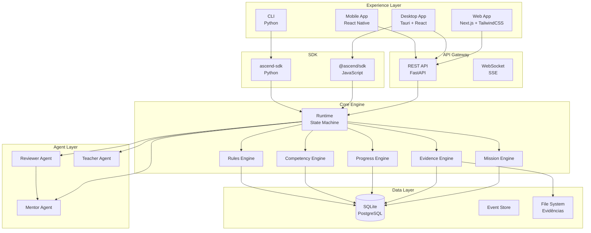
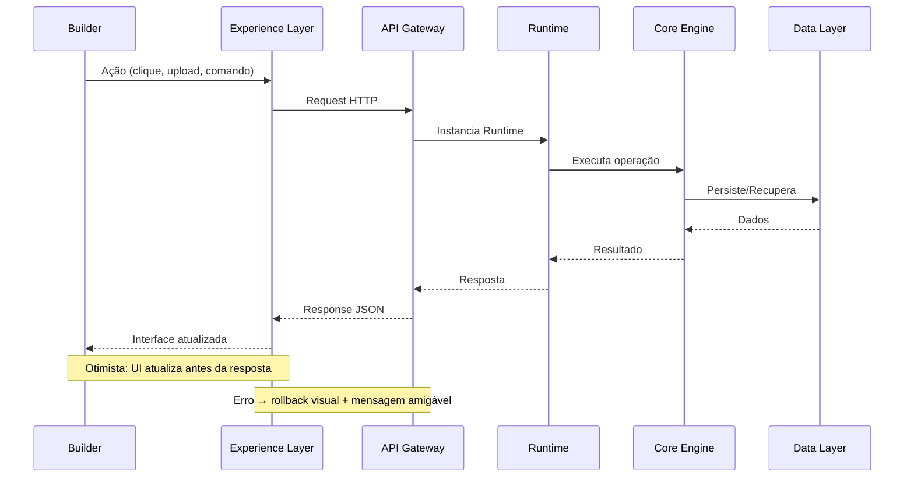

# ARCH-0011 — Experience Layer

| Campo | Valor |
|-------|-------|
| **ID** | ARCH-0011 |
| **Nome** | Experience Layer |
| **Versão** | 1.0-DRAFT |
| **Status** | Draft |
| **Categoria** | Architecture |
| **Owner** | Chief Architect |
| **Derivado de** | DOC-0000 North Star, DOC-0003 First Principles, DOC-0007 Engineering Philosophy, ARCH-0001 System Architecture Overview, ARCH-0003 Core Engine Spec, ARCH-0006 MVP Technical Specification |
| **Será utilizado por** | UI-0001 Design System, UI-0002 Builder Journey, UI-0003 Information Architecture, UI-0004 Component Library, Frontend Implementation |

---

## 1. Experience Layer Definition

A **Experience Layer** é a superfície de contato entre o Builder e o ASCEND Core.

Ela não é apenas uma interface gráfica.

Ela é o **veículo** que transforma a potência do Core Engine em uma experiência que o Builder quer viver todos os dias.

### Missão da Interface

> Tornar o desenvolvimento de competências tão envolvente quanto um jogo, tão rápido quanto um terminal, tão organizado quanto um sistema bem projetado e tão pessoal quanto um mentor dedicado.

A interface deve:

- **Reduzir atrito** — cada ação deve ser óbvia e instantânea
- **Criar momentum** — o progresso deve ser visível em tempo real
- **Gerar belonging** — o Builder precisa sentir que pertence a algo maior
- **Celebrar evolução** — cada conquista deve ser um momento de payoff
- **Manter foco** — o sistema nunca deve distrair do que importa: aprender e evoluir

---

## 2. Frontend Responsibilities

A camada Frontend é responsável por:

| Responsabilidade | Descrição |
|-----------------|-----------|
| **Apresentação** | Renderizar dados do Core Engine em interfaces compreensíveis |
| **Interação** | Capturar ações do Builder (cliques, comandos, uploads) |
| **Estado local** | Gerenciar estado de UI (tema, navegação, preferências) |
| **Otimismo** | Responder instantaneamente, sincronizar em background |
| **Offline first** | Funcionar sem rede, sincronizar quando reconectar |
| **Roteamento** | Navegação entre páginas e seções |
| **Animações** | Transições, micro-interações, feedback visual |
| **Acessibilidade** | WCAG 2.1 AA mínimo |
| **Responsividade** | Desktop primeiro, tablet, mobile |

### O que NÃO pertence ao Frontend

| Não pertence | Motivo |
|-------------|--------|
| Regras de negócio | Pertencem ao Core Engine |
| Cálculo de XP | Pertencem ao Progress Engine |
| Validação de evidências | Pertencem ao Evidence Engine |
| Lógica de desbloqueio | Pertencem ao Rules Engine |
| Persistência principal | Pertence à API/Backend |
| Decisões de IA | Pertencem à Agent Layer |

---

## 3. API Responsibilities

A API é a ponte entre a Experience Layer e o Core Engine.

| Responsabilidade | Descrição |
|-----------------|-----------|
| **Autenticação** | Login, sessão, tokens |
| **Autorização** | O que cada Builder pode ver/fazer |
| **Orquestração** | Chamar serviços do Core Engine |
| **Persistência** | Salvar e recuperar dados |
| **Eventos** | Emitir eventos para o frontend (SSE/WebSocket) |
| **Cache** | Otimizar respostas frequentes |
| **Rate limiting** | Proteger contra abuso |

### Contrato Frontend ↔ API

```
┌─────────────────┐         HTTP/SSE        ┌─────────────────┐
│                 │ ◄──────────────────────► │                 │
│  Frontend       │         JSON             │  API Layer      │
│  (Experience)   │         WebSocket        │  (Ponte)        │
│                 │                          │                 │
└─────────────────┘                          └────────┬────────┘
                                                       │
                                                       ▼
                                               ┌─────────────────┐
                                               │                 │
                                               │  Core Engine    │
                                               │                 │
                                               └─────────────────┘
```

---

## 4. Como o Runtime Será Consumido

O Runtime (ARCH-0009) é o executor do Core Engine. A Experience Layer o consome de duas formas:

### 4.1 Via API (Principal)

```
Frontend → API → Runtime → Core Engine
```

O frontend chama a API, que instancia o Runtime para executar operações.

### 4.2 Via SDK Direto (Avançado)

Para cenários onde o Builder quer executar operações localmente (CLI-like):

```
Frontend → SDK → Runtime (embarcado)
```

O SDK (`packages/sdk`) expõe o Runtime como biblioteca JavaScript.

### 4.3 Fluxo de Execução

```
Builder clica "Iniciar Missão"
         │
         ▼
Frontend: POST /api/missions/start
         │
         ▼
API: instancia Runtime
         │
         ▼
Runtime: MissionEngine.startMission(id)
         │
         ▼
Runtime: retorna estado inicial
         │
         ▼
API: response { mission, progress, nextActions }
         │
         ▼
Frontend: renderiza MissionViewer
```

---

## 5. Evolução Web → Desktop → Mobile

### Fase 1 — Web (MVP)

```
Stack: Next.js + TailwindCSS + shadcn/ui
Alcance: Desktop browsers
Entrega: Todas as funcionalidades core
```

**Características:**
- Responsivo para tablet
- PWA para mobile básico
- Foco em produtividade via teclado
- Command Palette onipresente

### Fase 2 — Desktop (Adoção)

```
Stack: Tauri + React (aproveita frontend existente)
Alcance: Windows, macOS, Linux
```

**Características:**
- Performance nativa
- Notificações do sistema
- Atalhos globais
- Execução local do Runtime
- Deep links (`ascend://`)
- Modo offline completo

### Fase 3 — Mobile (Expansão)

```
Stack: React Native (compartilha types/lógica)
Alcance: iOS, Android
```

**Características:**
- Core: missões, evidências, progresso
- Micro-learning: quick missions
- Notificações push
- Câmera para captura de evidências
- Compartilhamento de conquistas

### Estratégia de Evolução

```
Web (100% funcional)
   │
   ├── Desktop (Tauri)
   │      └── Reaproveita: componentes, estilos, store, hooks, SDK
   │
   └── Mobile (React Native)
          └── Reaproveita: tipos, schemas, lógica de estado, SDK
```

**Princípio:** O Core Engine nunca muda. Apenas a camada de apresentação evolui.

---

## 6. Fluxo Completo do Builder

### Fluxo de Primeiro Acesso

```
Landing Page
     │
     ▼
Onboarding rápido (3 passos)
     │
     ├── "Qual seu objetivo?"
     ├── "Qual sua área?"
     └── "Qual seu nível?"
     │
     ▼
Dashboard vazio com próximos passos
     │
     ▼
Primeira jornada sugerida
     │
     ▼
Primeira missão
```

### Fluxo de Retorno

```
Login
     │
     ▼
Dashboard
     │
     ├── Missão atual (continuar de onde parou)
     ├── Próxima conquista (progresso)
     ├── Atividade recente
     └── Sugestão do Mentor
```

### Fluxo de Missão

```
Ver catálogo de missões
     │
     ▼
Selecionar missão
     │
     ▼
Ler briefing
     │
     ▼
Executar (pode ser fora do sistema)
     │
     ▼
Submeter evidência
     │
     ▼
Aguardar review
     │
     ▼
Receber feedback
     │
     ▼
XP + Progresso atualizados
     │
     ▼
Nova missão desbloqueada
```

### Fluxo de Evidência

```
Selecionar missão
     │
     ▼
Upload de arquivo(s)
     │
     ▼
Preencher descrição
     │
     ▼
Pré-visualizar
     │
     ▼
Submeter
     │
     ▼
Status: UNDER_REVIEW
     │
     ▼
Notificação de conclusão
     │
     ▼
Feedback disponível
```

### Fluxo de Level Up

```
XP acumulado atinge threshold
     │
     ▼
Animação de level up
     │
     ▼
Novas habilidades desbloqueadas
     │
     ▼
Badge conquistado
     │
     ▼
Compartilhamento opcional
```

---

## 7. Architecture Diagram



### Fluxo de Dados entre Camadas



---

## 8. Non-Functional Requirements

### Performance

| Métrica | Alvo |
|---------|------|
| Time to First Paint | < 1.5s |
| Time to Interactive | < 3s |
| API Response (p95) | < 200ms |
| Upload de evidência | < 5s (10MB) |

### Disponibilidade

| Métrica | Alvo |
|---------|------|
| Uptime | 99.5% |
| Offline mode | Navegação + cache de missões |

### Segurança

| Requisito | Implementação |
|-----------|---------------|
| Autenticação | JWT + refresh token |
| HTTPS | Obrigatório |
| XSS | Content Security Policy |
| CSRF | SameSite cookies + tokens |

### Acessibilidade

| Critério | Nível |
|----------|-------|
| WCAG | 2.1 AA |
| Navegação por teclado | Completa |
| Screen reader | Suporte total |
| Contraste | 4.5:1 mínimo |

---

## 9. Technology Stack

### Frontend (Web)

| Camada | Tecnologia | Motivo |
|--------|-----------|--------|
| Framework | Next.js 15 | SSR, router, performance |
| Linguagem | TypeScript | Type safety |
| Estilos | TailwindCSS | Utility-first, rápido |
| Componentes | shadcn/ui | Acessível, customizável |
| Estado server | React Query | Cache, sincronização |
| Estado client | Zustand | Leve, simples |
| Animação | Framer Motion | Declarativa, performática |
| Gráficos | Recharts | Leve, composable |
| Ícones | Lucide Icons | Consistente, MIT |

### Monorepo

```
apps/
    web/          → Next.js application
packages/
    ui/           → Shared UI components
    types/        → TypeScript types/schemas
    sdk/          → JavaScript SDK
```

---

## 10. Design Principles

Cada decisão de design deve responder a quatro perguntas:

| Pergunta | Critério |
|----------|----------|
| Melhora a aprendizagem do Builder? | Se não, não entra |
| Respeita a Constituição e os Protocolos? | Alinhamento com DOC-0000 a DOC-0008 |
| Sustentável pela arquitetura existente? | Sem acoplamentos desnecessários |
| Mantém a experiência simples e intuitiva? | Sem complexidade desnecessária |

### Referências de Experiência

| Inspiração | O que buscar |
|------------|--------------|
| **GitHub** | Clareza da navegação, foco em conteúdo |
| **Linear** | Minimalismo, velocidade, atalhos de teclado |
| **Notion** | Organização flexível, blocos |
| **Duolingo** | Motivação, gamificação, streaks |
| **Raycast** | Command palette, produtividade |
| **Arc Browser** | Acabamento visual, transições |

---

## 11. Definition of Done

ARCH-0011 aprovado quando:

- [ ] Experiência está definida como camada independente
- [ ] Responsabilidades Frontend vs API estão claras
- [ ] Consumo do Runtime está especificado
- [ ] Estratégia Web → Desktop → Mobile está documentada
- [ ] Fluxo completo do Builder está mapeado
- [ ] Diagrama Mermaid da arquitetura está completo
- [ ] Non-functional requirements estão definidos
- [ ] Technology stack está escolhida e justificada
- [ ] Design principles estão documentados

---

## Status

**ARCH-0011 — Experience Layer**

- Estado: 🟡 Draft técnico
- Resultado: Camada de experiência definida — missão, responsabilidades, arquitetura, fluxos, stack, princípios
- Próximo: UI-0001 — Design System
