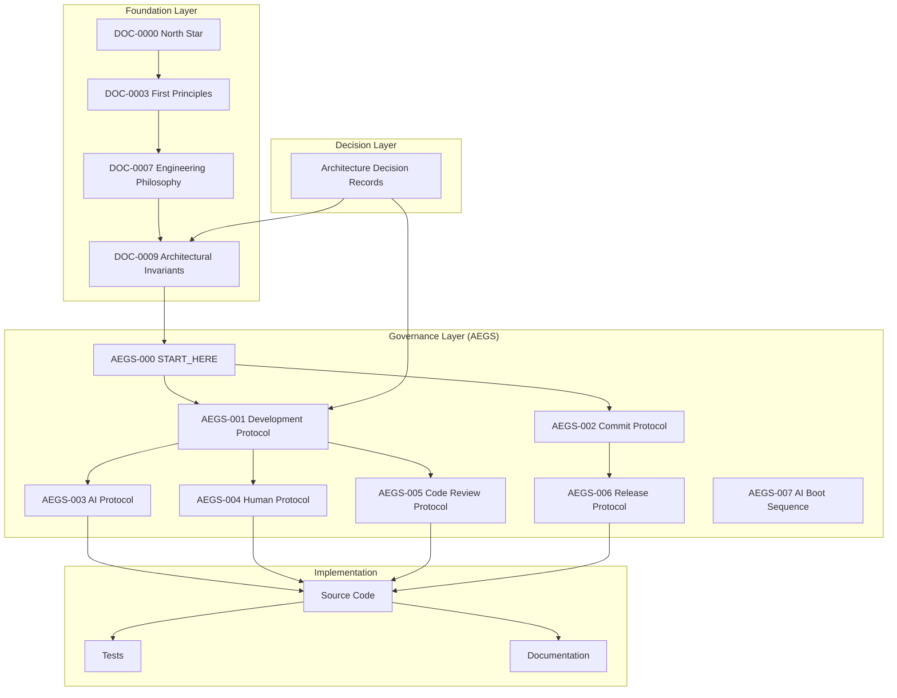
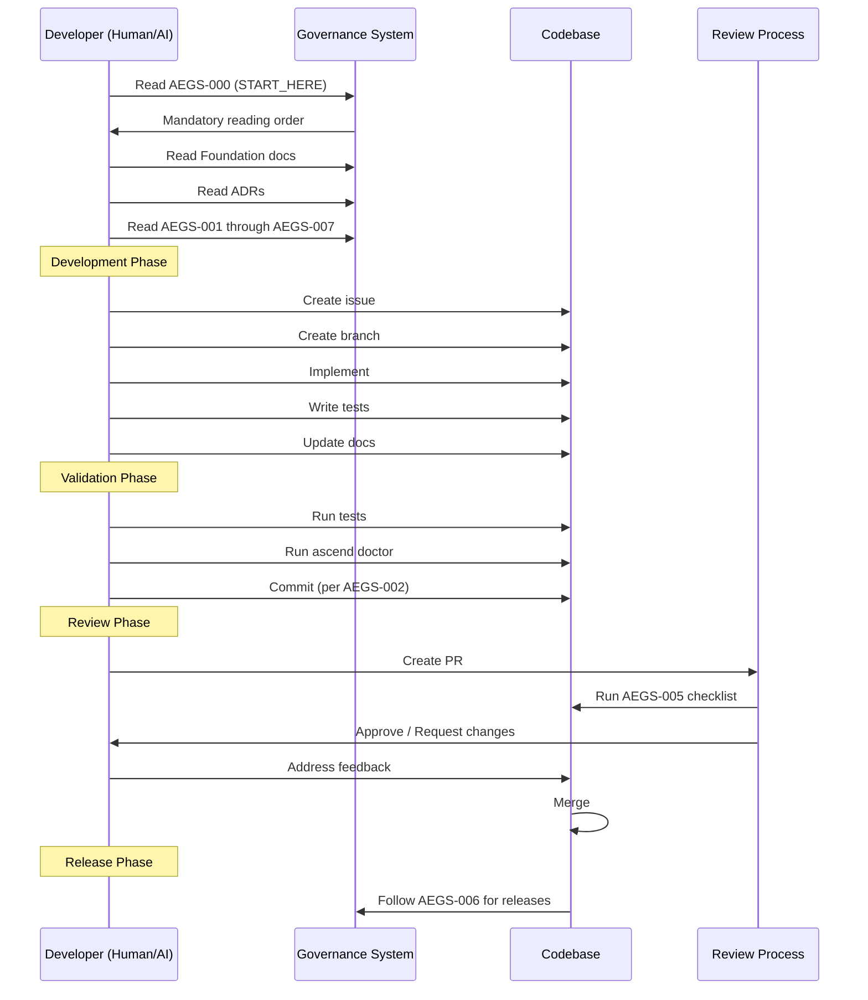

# ARCH-0012 — ASCEND Engineering Governance System (AEGS)

| Field | Value |
|-------|-------|
| **ID** | ARCH-0012 |
| **Name** | ASCEND Engineering Governance System |
| **Version** | 1.0 |
| **Status** | Approved |
| **Category** | Architecture |
| **Owner** | Chief Architect |
| **Derived from** | DOC-0000 North Star, DOC-0003 First Principles, DOC-0007 Engineering Philosophy, DOC-0009 Architectural Invariants |
| **Referenced by** | AEGS-000 through AEGS-007, README, CONTRIBUTING, GOVERNANCE |

---

## 1. Purpose

The **ASCEND Engineering Governance System (AEGS)** is the official onboarding and governance framework for every developer — human or AI — who participates in the ASCEND project.

This document integrates the AEGS into the project's architecture.

---

## 2. Why AEGS Exists

| Reason | Explanation |
|--------|-------------|
| **Consistency** | Every contribution follows the same rules, regardless of who or what creates it |
| **Quality** | Standardized processes prevent regression, technical debt, and architectural drift |
| **AI-readiness** | Clear protocols enable AI agents to contribute safely without violating invariants |
| **Onboarding** | New developers can ramp up in minutes instead of weeks |
| **Traceability** | Every decision is documented, every change is justified |
| **Accountability** | Clear rules mean clear responsibility |

---

## 3. How AEGS Works



---

## 4. Document Architecture

```
.ascend/                           # AEGS root
├── START_HERE.md                  # AEGS-000 — Mandatory first read
├── DEVELOPMENT_PROTOCOL.md         # AEGS-001 — Dev conventions
├── COMMIT_PROTOCOL.md              # AEGS-002 — Commit rules
├── AI_DEVELOPMENT_PROTOCOL.md      # AEGS-003 — AI agent rules
├── HUMAN_DEVELOPMENT_PROTOCOL.md   # AEGS-004 — Human dev workflow
├── CODE_REVIEW_PROTOCOL.md         # AEGS-005 — Review checklist
├── RELEASE_PROTOCOL.md             # AEGS-006 — Release lifecycle
└── AI_BOOT_SEQUENCE.md             # AEGS-007 — AI startup sequence
```

---

## 5. Relationship with Constitution

The Foundation documents (DOC-0000 through DOC-0009) define **what** the project believes.

The AEGS defines **how** those beliefs are enforced in daily development.

| Foundation Principle | AEGS Enforcement |
|----------------------|-----------------|
| Competence requires evidence (DOC-0003) | Every commit must be tested and documented |
| Simplicity before sophistication (DOC-0007) | Forbidden practices prevent complexity |
| Architectural Invariants (DOC-0009) | Code review checks every invariant |
| AI amplifies, does not replace (DOC-0003) | AI protocol limits scope and requires human review |
| Clean Architecture (DOC-0007) | Development protocol enforces layer boundaries |

---

## 6. Relationship with ADRs

ADRs document **why** an architectural decision was made.

AEGS documents define **how** to operate within those decisions.

```
ADR: "We chose SQLite for local-first storage"
     │
     ▼
AEGS-001: "Repositories are Protocols, not implementations"
AEGS-005: "Review check: Is Infrastructure properly abstracted?"
```

---

## 7. Relationship with Runtime

The AEGS does **not** modify the Runtime.

It governs **how** the Runtime can be changed:

| AEGS Rule | Runtime Impact |
|-----------|----------------|
| AEGS-001 §11 | Runtime modifications require an ADR |
| AEGS-001 §11 | v1 architecture frozen — TSC approval needed |
| AEGS-003 §3 | AI cannot modify Runtime without justification |
| AEGS-005 §3 | Review must verify Runtime changes don't break invariants |

---

## 8. Relationship with Experience Layer

The AEGS governs Experience Layer development through:

| AEGS Rule | Experience Layer Impact |
|-----------|------------------------|
| AEGS-000 §8 | Builder First Principle — every UI change must improve learning |
| AEGS-001 §12 | UI must follow Design System, no business logic in frontend |
| AEGS-005 §3 | Review must check Builder benefit |

---

## 9. Full Onboarding Flow



---

## 10. AEGS Versioning

The AEGS follows its own versioning:

| Version | Status | Changes |
|---------|--------|---------|
| 1.0 | Current | Initial release — 7 protocols + boot sequence |

AEGS versions are independent of Runtime versions. A protocol change requires an ADR.

---

## 11. Compliance

To be AEGS-compliant, a contribution must:

- [ ] Follow the mandatory reading order (AEGS-000)
- [ ] Follow development conventions (AEGS-001)
- [ ] Use the correct commit format (AEGS-002)
- [ ] Respect AI/human rules (AEGS-003/004)
- [ ] Pass code review checklist (AEGS-005)
- [ ] Follow release process if applicable (AEGS-006)

---

## 12. Definition of Done

ARCH-0012 aprovado quando:

- [ ] AEGS exists as a formal governance system
- [ ] All 7 protocol documents exist in `.ascend/`
- [ ] Relations with Constitution, ADRs, Runtime, and Experience Layer are documented
- [ ] Onboarding flow has Mermaid diagram
- [ ] Compliance criteria are defined
- [ ] AEGS has its own versioning

---

## 13. Change History

| Version | Date | Author | Change |
|---------|------|--------|--------|
| 1.0 | 2026-07-20 | Chief Architect | Initial version |
