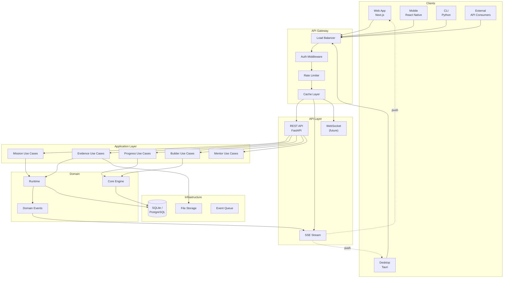

# ARCH-0015 — API Architecture

| Field | Value |
|-------|-------|
| **ID** | ARCH-0015 |
| **Name** | API Architecture |
| **Version** | 1.0 |
| **Status** | Draft |
| **Category** | Architecture |
| **Owner** | Chief Architect |
| **Derived from** | ARCH-0001, ARCH-0011, ARCH-0012 |
| **Referenced by** | ARCH-0016, ARCH-0019, ARCH-0021 |

---

## 1. Purpose

Define the complete API architecture for ASCEND — the contract layer between all interfaces and the Core Engine.

---

## 2. Protocol Decision: Hybrid (REST + WebSocket/SSE)

### 2.1 Candidates Evaluated

| Protocol | Strengths | Weaknesses |
|----------|-----------|------------|
| **Pure REST** | Universal, cacheable, familiar, tooling-rich | No push, N+1 problem, over-fetching |
| **GraphQL** | Precise queries, single endpoint, introspection | Complexity, caching hard, no built-in push |
| **gRPC** | Fast, typed, streaming, polyglot | HTTP/2 required, browser support limited |
| **tRPC** | Type-safe, easy, no schema DSL | TypeScript-only, young ecosystem |
| **Hybrid REST + SSE/WS** | Best of both: request-response + push | Two transport mechanisms to maintain |

### 2.2 Decision: Hybrid (REST + SSE)

| Decision | Rationale |
|----------|-----------|
| **REST** for CRUD operations | Universal, cacheable, familiar, works everywhere |
| **SSE** for real-time events | Simpler than WebSocket for server→client, auto-reconnect, native HTTP |
| **WebSocket** for bidirectional (future) | Mentor chat, collaborative features |

### 2.3 When to use what

| Operation | Protocol | Why |
|-----------|----------|-----|
| List journeys | REST GET | Cacheable, paginated |
| Get mission detail | REST GET | Cacheable |
| Submit evidence | REST POST | Request-response |
| Mission status update | SSE Event | Server pushes to client |
| Achievement unlocked | SSE Event | Immediate notification |
| Mentor chat (future) | WebSocket | Bidirectional required |
| Review result | SSE Event | Server-initiated |

---

## 3. API Design Principles

| Principle | Statement |
|-----------|-----------|
| **Resource-oriented** | URLs represent resources, not actions |
| **Plural nouns** | `/missions`, `/journeys` (not `/getMission`) |
| **Version in URL** | `/api/v1/missions` (easy to evolve) |
| **Consistent errors** | RFC 9457 (Problem Details) |
| **Idempotent where possible** | PUT, DELETE are idempotent |
| **Stateless** | No session state on server (tokens carry identity) |
| **Encrypted** | TLS mandatory for all production traffic |

---

## 4. API Independence Principle

> *No interface knows the Runtime directly. Only the Application Layer.*

**This is a constitutional rule.** The API is the sole contract between interfaces and the Core Engine. No UI, CLI, or external system may import, instantiate, or depend on the Runtime or any domain component directly.

```
Interfaces (Web, Desktop, Mobile, CLI, SDK)
    │
    ▼
API Layer (REST + SSE)
    │
    ▼
Application Layer (Use Cases)
    │
    ▼
Runtime / Domain / Infrastructure
```

This preserves the architecture for decades by ensuring the Core can evolve without breaking any interface.

---

## 5. URL Structure

```
/api/v1/
├── builders/
│   ├── GET    /me               → Current builder profile
│   ├── PATCH  /me               → Update profile
│   └── GET    /me/progress      → Progress summary
│
├── journeys/
│   ├── GET    /                 → List journeys (paginated)
│   ├── GET    /{id}             → Journey detail
│   ├── GET    /{id}/missions    → Missions in journey
│   └── GET    /{id}/competencies → Competencies in journey
│
├── missions/
│   ├── GET    /                 → List missions (filtered, paginated)
│   ├── GET    /{id}             → Mission detail
│   ├── POST   /{id}/start       → Start mission
│   ├── POST   /{id}/evidence    → Submit evidence
│   └── GET    /{id}/feedback    → Get feedback
│
├── competencies/
│   ├── GET    /                 → Competency tree
│   └── GET    /{id}             → Competency detail
│
├── evidence/
│   ├── GET    /                 → List evidence (filtered, paginated)
│   └── GET    /{id}             → Evidence detail
│
├── achievements/
│   ├── GET    /                 → List achievements
│   └── GET    /{id}             → Achievement detail
│
├── mentor/
│   ├── POST   /ask              → Ask the mentor
│   └── GET    /suggestions      → Get mentor suggestions
│
├── analytics/
│   ├── GET    /summary          → Dashboard summary
│   ├── GET    /xp-history       → XP over time
│   └── GET    /velocity         → Learning velocity
│
├── community/
│   ├── GET    /leaderboard      → Leaderboard
│   └── GET    /feed             → Activity feed
│
├── marketplace/
│   ├── GET    /packages         → Package catalog
│   └── POST   /packages/{id}/install → Install package
│
├── auth/
│   ├── POST   /login            → Login
│   ├── POST   /register         → Register
│   ├── POST   /refresh          → Refresh token
│   └── POST   /logout           → Logout
│
└── events/
    └── GET    /stream           → SSE stream
```

---

## 6. Versioning Strategy

| Version | Status | Changes |
|---------|--------|---------|
| **v1** | Current | Initial release |
| **v2** | Planned | Breaking changes aggregated |
| **v3** | Future | Major evolution |

**Strategy:**
- Version is in URL path (`/api/v1/`)
- New fields added to responses without bumping version
- Breaking changes (field removal, type change) require a new version
- Old version is maintained for 6 months after new version is released
- Deprecation header: `Sunset: Sat, 20 Jan 2027 00:00:00 GMT`

---

## 7. Request/Response Envelope

### 7.1 Success

```json
{
  "data": { ... },
  "meta": {
    "request_id": "req_abc123",
    "timestamp": "2026-07-20T10:30:00Z",
    "version": "1.0"
  }
}
```

### 7.2 List (Paginated)

```json
{
  "data": [ ... ],
  "meta": {
    "page": 1,
    "per_page": 20,
    "total": 156,
    "total_pages": 8,
    "has_next": true,
    "has_prev": false
  }
}
```

### 7.3 Error (RFC 9457 Problem Details)

```json
{
  "type": "https://api.ascend.dev/errors/validation-error",
  "title": "Validation Error",
  "status": 422,
  "detail": "Mission title is required",
  "instance": "/api/v1/missions",
  "errors": [
    {
      "field": "title",
      "message": "is required",
      "code": "REQUIRED_FIELD"
    }
  ]
}
```

---

## 8. Standard Errors

| HTTP | Code | Title | When |
|------|------|-------|------|
| 400 | BAD_REQUEST | Bad Request | Malformed request |
| 401 | UNAUTHORIZED | Unauthorized | Missing or invalid auth |
| 403 | FORBIDDEN | Forbidden | Authenticated but not allowed |
| 404 | NOT_FOUND | Not Found | Resource doesn't exist |
| 409 | CONFLICT | Conflict | State conflict (e.g. mission already started) |
| 422 | VALIDATION_ERROR | Validation Error | Invalid input |
| 429 | RATE_LIMITED | Rate Limited | Too many requests |
| 500 | INTERNAL_ERROR | Internal Error | Unexpected server error |
| 502 | BAD_GATEWAY | Bad Gateway | Upstream failure |
| 503 | SERVICE_UNAVAILABLE | Service Unavailable | Temporary outage |

### Domain Errors

```json
{
  "type": "https://api.ascend.dev/errors/domain-error",
  "title": "Mission Not Available",
  "status": 409,
  "code": "MISSION_LOCKED",
  "detail": "This mission requires completing 'Linux Basics: Mission 3' first.",
  "prerequisite": "Linux Basics: Mission 3"
}
```

---

## 9. Pagination

| Parameter | Type | Default | Description |
|-----------|------|---------|-------------|
| `page` | int | 1 | Page number |
| `per_page` | int | 20 | Items per page (max 100) |
| `sort` | string | `-created_at` | Field to sort by. Prefix `-` for desc |
| `filter` | string | — | See filtering section |

**Response headers:**
```
X-Total-Count: 156
X-Total-Pages: 8
Link: <.../missions?page=2>; rel="next"
```

---

## 10. Filtering & Sorting

### 10.1 Filter syntax

```
GET /missions?filter=status:eq:active,difficulty:gte:medium
```

Pattern: `field:operator:value`

| Operator | Meaning |
|----------|---------|
| `eq` | Equals |
| `neq` | Not equals |
| `gt` | Greater than |
| `gte` | Greater than or equal |
| `lt` | Less than |
| `lte` | Less than or equal |
| `in` | In list |
| `like` | Contains (text search) |

### 10.2 Sorting

```
GET /missions?sort=-created_at,+title
```

`-` = descending, `+` or no prefix = ascending.

---

## 11. Streaming (SSE)

### 11.1 Event Stream

```
GET /api/v1/events/stream

Headers:
  Accept: text/event-stream
  Cache-Control: no-cache
  Connection: keep-alive

Response:
  event: mission_status
  data: {"mission_id": "m4", "status": "reviewed", "xp_earned": 150}

  event: achievement
  data: {"badge_id": "speed-demon", "name": "Speed Demon"}

  event: mentor_suggestion
  data: {"tip": "Try using -m flag with useradd."}
```

### 11.2 Event Types

| Event | Payload | Trigger |
|-------|---------|---------|
| `mission_status` | mission_id, status, xp_earned | Mission state change |
| `achievement` | badge_id, name, rarity | New achievement |
| `level_up` | level, title, unlocked | Level threshold hit |
| `evidence_reviewed` | evidence_id, status, score | Review complete |
| `mentor_suggestion` | tip, type, context | Mentor has insight |
| `streak_update` | streak_days, milestone | Streak change |
| `heartbeat` | timestamp | Connection alive (30s interval) |

### 11.3 Reconnection

```
Last-Event-Id: 42
```

Client sends last received event ID on reconnect. Server replays missed events from a buffer (last 100 events, max 5 minutes).

---

## 12. Rate Limiting

| Tier | Limit | Window |
|------|-------|--------|
| Anonymous | 60 req/min | 1 minute |
| Authenticated | 300 req/min | 1 minute |
| SDK/Internal | 1000 req/min | 1 minute |

**Headers:**
```
X-RateLimit-Limit: 300
X-RateLimit-Remaining: 287
X-RateLimit-Reset: 1626789000
```

---

## 13. Caching Strategy

| Resource | Cache | TTL | Invalidation |
|----------|-------|-----|-------------|
| Journey list | Public | 5 min | On new journey |
| Mission detail | Public | 2 min | On state change |
| Competency tree | Private | 10 min | On XP change |
| Builder profile | Private | 1 min | On profile update |
| Evidence list | Private | 30s | On new submission |
| Achievement gallery | Private | 5 min | On new achievement |

---

## 14. DTO Naming Convention

```
{Resource}{Action}Request/Response
```

| Direction | Pattern | Example |
|-----------|---------|---------|
| Request | `{Resource}Request` | `StartMissionRequest` |
| Response | `{Resource}Response` | `MissionResponse` |
| List | `{Resource}ListResponse` | `MissionListResponse` |
| Create | `Create{Resource}Request` | `CreateEvidenceRequest` |
| Update | `Update{Resource}Request` | `UpdateProfileRequest` |

---

## 15. Architecture Diagram



---

## 16. Definition of Done

ARCH-0015 aprovado quando:

- [ ] Protocol decision documented with trade-offs
- [ ] API Independence Principle stated
- [ ] URL structure for all resources defined
- [ ] Versioning strategy defined
- [ ] Request/Response envelope specified
- [ ] Error format (RFC 9457) specified
- [ ] Standard errors cataloged
- [ ] Domain errors defined
- [ ] Pagination, filtering, sorting specified
- [ ] SSE event types and reconnection defined
- [ ] Rate limiting specified
- [ ] Caching strategy defined
- [ ] DTO naming convention defined
- [ ] Architecture diagram complete

---

## 17. Change History

| Version | Date | Author | Change |
|---------|------|--------|--------|
| 1.0 | 2026-07-20 | Chief Architect | Initial version |
