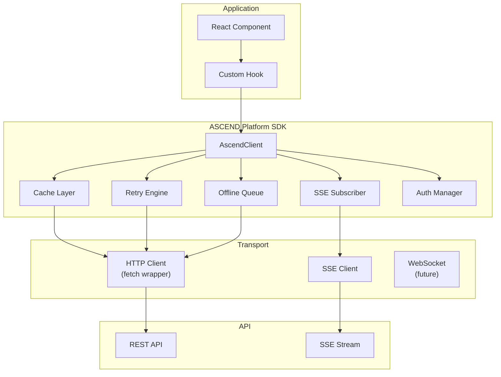

# ARCH-0016 — Frontend SDK

| Field | Value |
|-------|-------|
| **ID** | ARCH-0016 |
| **Name** | Frontend SDK |
| **Version** | 1.0 |
| **Status** | Draft |
| **Category** | Architecture |
| **Owner** | Chief Architect |
| **Derived from** | ARCH-0015 API Architecture |
| **Referenced by** | ARCH-0018, ARCH-0019, ARCH-0020 |

---

## 1. Purpose

Define the **ASCEND Platform SDK** — the single JavaScript client that all interfaces (Web, Desktop, Mobile, CLI) use to communicate with the API.

> *No component ever calls fetch() or axios() directly. Everything goes through the SDK.*

---

## 2. The Platform SDK Concept

The SDK is not just a HTTP client. It is the **official contract** between any interface and the ASCEND backend.

```
Web App     Desktop     Mobile     CLI     External
    │           │          │        │         │
    └───────────┴──────────┴────────┴─────────┘
                        │
              ASCEND Platform SDK
                        │
                    API Layer
                        │
                 Application Layer
                        │
                  Runtime + Domain
```

Every platform uses **exactly the same SDK**. The SDK is the single source of truth for API communication.

---

## 3. Client Interface

```typescript
const client = createAscendClient({
  baseUrl: 'https://api.ascend.dev',
  token: '...',              // JWT token
  onTokenRefresh: async () => '...',  // Auto-refresh
  retry: { maxRetries: 3, backoff: 'exponential' },
  cache: { ttl: 5000 },     // 5s default cache
  offline: { enabled: true, queueSize: 50 },
  telemetry: false,          // Opt-in only
})
```

---

## 4. Full API Surface

```typescript
interface AscendClient {
  // ── Builder ─────────────────────────────────────
  builder: {
    current(): Promise<BuilderResponse>
    update(data: UpdateBuilderRequest): Promise<BuilderResponse>
    progress(): Promise<BuilderProgressResponse>
    settings(): Promise<BuilderSettingsResponse>
    updateSettings(data: UpdateSettingsRequest): Promise<void>
  }

  // ── Journeys ────────────────────────────────────
  journeys: {
    list(params?: JourneysListParams): Promise<JourneyListResponse>
    get(id: string): Promise<JourneyResponse>
    missions(id: string): Promise<MissionListResponse>
    competencies(id: string): Promise<CompetencyListResponse>
  }

  // ── Missions ────────────────────────────────────
  missions: {
    list(params?: MissionsListParams): Promise<MissionListResponse>
    get(id: string): Promise<MissionResponse>
    start(id: string): Promise<MissionResponse>
    submitEvidence(id: string, data: EvidenceSubmission): Promise<EvidenceResponse>
    feedback(id: string): Promise<FeedbackResponse>
  }

  // ── Competencies ────────────────────────────────
  competencies: {
    tree(): Promise<CompetencyTreeResponse>
    get(id: string): Promise<CompetencyResponse>
    evidence(id: string): Promise<EvidenceListResponse>
  }

  // ── Evidence ────────────────────────────────────
  evidence: {
    list(params?: EvidenceListParams): Promise<EvidenceListResponse>
    get(id: string): Promise<EvidenceResponse>
    upload(missionId: string, files: File[], description: string): Promise<EvidenceResponse>
  }

  // ── Achievements ────────────────────────────────
  achievements: {
    list(): Promise<AchievementListResponse>
    badges(): Promise<BadgeListResponse>
    certificates(): Promise<CertificateListResponse>
  }

  // ── Mentor ───────────────────────────────────────
  mentor: {
    ask(query: string): Promise<MentorResponse>
    suggestions(): Promise<MentorSuggestionListResponse>
    history(): Promise<MentorMessageListResponse>
  }

  // ── Analytics ───────────────────────────────────
  analytics: {
    summary(): Promise<AnalyticsSummaryResponse>
    xpHistory(params?: TimeRange): Promise<XpHistoryResponse>
    velocity(): Promise<VelocityResponse>
    weeklyReport(): Promise<WeeklyReportResponse>
  }

  // ── Community ───────────────────────────────────
  community: {
    leaderboard(params?: LeaderboardParams): Promise<LeaderboardResponse>
    feed(params?: FeedParams): Promise<FeedResponse>
    builders(params?: BuildersListParams): Promise<BuilderListResponse>
    getBuilder(id: string): Promise<BuilderProfileResponse>
  }

  // ── Marketplace ─────────────────────────────────
  marketplace: {
    packages(params?: PackagesListParams): Promise<PackageListResponse>
    getPackage(id: string): Promise<PackageResponse>
    install(id: string): Promise<void>
    installed(): Promise<PackageListResponse>
  }

  // ── Auth ────────────────────────────────────────
  auth: {
    login(credentials: LoginRequest): Promise<LoginResponse>
    register(data: RegisterRequest): Promise<RegisterResponse>
    refresh(): Promise<TokenResponse>
    logout(): Promise<void>
    session(): SessionInfo
  }

  // ── Events (SSE) ────────────────────────────────
  events: {
    subscribe(event: string, handler: EventHandler): () => void  // returns unsubscribe
    unsubscribeAll(): void
  }

  // ── Stream (experimental, future) ───────────────
  stream: {
    mentorChat(): WebSocket  // future bidirectional chat
  }
}
```

---

## 5. Core Behaviors

### 5.1 Retry Policy

| Condition | Retry | Backoff |
|-----------|-------|---------|
| Network error | Yes (3x) | Exponential (1s, 2s, 4s) |
| 429 (Rate Limited) | Yes (3x) | Exponential with Retry-After |
| 5xx (Server Error) | Yes (3x) | Exponential (1s, 2s, 4s) |
| 4xx (Client Error) | No | — |
| Timeout | Yes (2x) | Immediate |

### 5.2 Timeout

| Operation | Timeout |
|-----------|---------|
| Standard requests | 10s |
| Evidence upload | 60s |
| Mentor ask | 30s |
| SSE connection | Infinite (auto-reconnect) |

### 5.3 Cache

| Strategy | Description |
|----------|-------------|
| **In-memory** | Default TTL 5s for read requests |
| **Stale-while-revalidate** | Show cached data, refresh in background |
| **Bypass** | `{ cache: false }` per request |
| **Clear** | On mutation (POST, PATCH, DELETE) |

### 5.4 Offline Queue

```typescript
client.configure({
  offline: {
    enabled: true,
    queueSize: 50,
    onSync: (item) => { /* progress callback */ },
    conflictStrategy: 'last-write-wins'
  }
})
```

Actions queued offline: evidence submission (critical), profile update, mentor ask. Queued actions replay in order when connection restores.

### 5.5 Optimistic Updates

Mutations update local state immediately, then sync with server:

```typescript
// Optimistic: mission appears as "started" instantly
const mission = await client.missions.start('m4')
// If server rejects: rollback + show error toast
```

---

## 6. Error Mapping

| SDK Error | HTTP Status | Client Action |
|-----------|-------------|---------------|
| `NetworkError` | — | Show "No connection" + retry button |
| `AuthError` | 401 | Auto-refresh token; if fails, redirect to login |
| `ForbiddenError` | 403 | Show "Access denied" |
| `NotFoundError` | 404 | Show "Not found" |
| `ValidationError` | 422 | Show field-level errors |
| `RateLimitError` | 429 | Show "Too many requests, slow down" |
| `ServerError` | 5xx | Show "Something went wrong" + auto-retry |
| `OfflineError` | — | Queue action, show "Saved offline" |

---

## 7. Interceptors

```typescript
client.interceptors.request.use((config) => {
  config.headers['X-Client-Version'] = '1.0.0'
  return config
})

client.interceptors.response.use(
  (response) => {
    // Track successful requests (if telemetry enabled)
    return response
  },
  (error) => {
    // Log errors (if telemetry enabled)
    return Promise.reject(error)
  }
)
```

---

## 8. Telemetry (Opt-in)

| Event | Data | Default |
|-------|------|---------|
| Request timing | duration, endpoint, status | Disabled |
| Error rate | error type, count | Disabled |
| Feature usage | feature name, frequency | Disabled |
| Performance | page load, SDK init | Disabled |

Telemetry is **always opt-in**. Disabled by default. No telemetry leaves the client without explicit consent.

---

## 9. Build Targets

| Target | Format | Use |
|--------|--------|-----|
| `@ascend/sdk` | ESM + CJS | Web (Next.js) |
| `@ascend/sdk-desktop` | ESM | Desktop (Tauri) |
| `@ascend/sdk-react-native` | ESM | Mobile (React Native) |
| `@ascend/sdk-node` | CJS | CLI, scripts |

All share the same API surface. Only the transport adapter differs.

---

## 10. Architecture Diagram



---

## 11. Definition of Done

ARCH-0016 aprovado quando:

- [ ] Platform SDK concept defined
- [ ] Complete API surface documented (builder, journeys, missions, competencies, evidence, achievements, mentor, analytics, community, marketplace, auth, events)
- [ ] Retry policy specified
- [ ] Timeout policy specified
- [ ] Cache strategy specified
- [ ] Offline queue specified
- [ ] Optimistic updates specified
- [ ] Error mapping defined
- [ ] Interceptors documented
- [ ] Telemetry policy defined
- [ ] Build targets defined
- [ ] Architecture diagram complete

---

## 12. Change History

| Version | Date | Author | Change |
|---------|------|--------|--------|
| 1.0 | 2026-07-20 | Chief Architect | Initial version |
