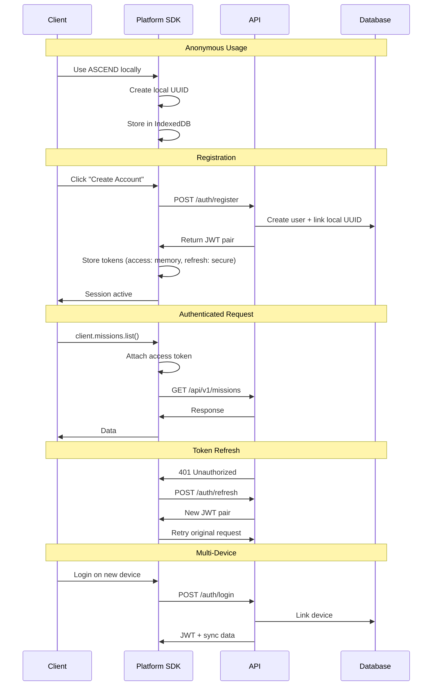

# ARCH-0017 — Authentication Model

| Field | Value |
|-------|-------|
| **ID** | ARCH-0017 |
| **Name** | Authentication Model |
| **Version** | 1.0 |
| **Status** | Draft |
| **Category** | Architecture |
| **Owner** | Chief Architect |
| **Derived from** | ARCH-0011, ARCH-0015, ARCH-0016 |
| **Referenced by** | ARCH-0018, ARCH-0021 |

---

## 1. Purpose

Define how ASCEND handles identity, authentication, sessions, and authorization — designed for local-first operation with future multi-device sync.

---

## 2. Authentication Philosophy

| Principle | Statement |
|-----------|-----------|
| **Local First** | Core system works offline without authentication |
| **Identity Optional** | Builder can use ASCEND locally without an account |
| **Sync Requires Identity** | Cloud sync, multi-device, and community features require authentication |
| **Builder Owns Identity** | Identity can be exported, imported, and backed up by the Builder |
| **No Phone Home** | No mandatory telemetry or "call home" on auth |

---

## 3. Identity Model

### 3.1 Local Identity (Anonymous)

When the Builder runs ASCEND for the first time, a **local identity** is created:

```
local_identity:
  - UUID (v4)
  - Created timestamp
  - Builder name (default: "Builder")
  - Local keys
```

This identity works completely offline. All progress is tied to this local UUID. No server required.

### 3.2 Registered Identity (Synced)

When the Builder chooses to create an account:

```
registered_identity:
  - Email
  - Password hash (bcrypt)
  - JWT token pair (access + refresh)
  - Local UUID merged to account
  - Recovery email
```

### 3.3 Identity Linking

```
Local UUID ───► Registered Account
                    │
              ┌─────┼─────┐
              │     │     │
            Device  Device  Device A
             1      2      3
```

Multiple devices link to the same registered account. All progress merges.

---

## 4. Token Strategy

### 4.1 Token Types

| Token | Lifetime | Storage | Purpose |
|-------|----------|---------|---------|
| **Access Token** | 15 min | Memory (Zustand) | API authorization |
| **Refresh Token** | 30 days | Secure HTTP-only cookie or encrypted storage | Obtain new access token |
| **Recovery Token** | Single use | — | Password reset / account recovery |

### 4.2 Token Flow

```
Client                          API
  │                              │
  │  POST /auth/login            │
  │  { email, password }         │
  │ ──────────────────────────►  │
  │                              │  Verify credentials
  │                              │
  │  { access_token,            │
  │    refresh_token,            │
  │    expires_in: 900 }         │
  │ ◄──────────────────────────  │
  │                              │
  │  ── 15 minutes later ──     │
  │                              │
  │  POST /auth/refresh          │
  │  { refresh_token }          │
  │ ──────────────────────────►  │
  │                              │  Verify refresh token
  │                              │
  │  { access_token,            │
  │    refresh_token,            │
  │    expires_in: 900 }         │
  │ ◄──────────────────────────  │
```

### 4.3 Offline Token

When offline, the SDK uses a **local session token**:

```
local_session:
  - local_uuid
  - last_sync_timestamp
  - encrypted_credential_cache
```

This allows the SDK to serve authenticated requests from cache while offline.

---

## 5. Session Model

### 5.1 Session States

```
┌──────────┐
│ ANONYMOUS│  ──► REGISTERING ──► AUTHENTICATED
└──────────┘                              │
     │                                     │
     │                                     ▼
     │                               TOKEN_EXPIRED
     │                                     │
     │                                     ▼
     │                               REFRESHING
     │                                     │
     │                              ┌──────┴──────┐
     │                              │             │
     │                          SUCCESS         FAIL
     │                              │             │
     │                              ▼             ▼
     │                       AUTHENTICATED    UNAUTHENTICATED
     │                                            │
     └────────────────────────────────────────────┘
```

### 5.2 Session Storage

| State | Storage | Duration |
|-------|---------|----------|
| Anonymous | IndexedDB / LocalStorage | Permanent (until cleared) |
| Access token | Memory only | 15 min |
| Refresh token | Secure storage | 30 days |
| Session preference | Zustand | Browser session |

---

## 6. Registration Flow

```
┌──────────────────┐
│ Open ASCEND      │
│ (local identity  │
│  auto-created)   │
└────────┬─────────┘
         │
         ▼
┌──────────────────┐
│ Use locally      │
│ ── OR ──         │
│ "Create account" │
└────────┬─────────┘
         │
         ▼
┌──────────────────┐
│ 1. Email         │
│ 2. Password      │
│ 3. Confirm       │
│ 4. Builder Name  │
└────────┬─────────┘
         │
         ▼
┌──────────────────┐
│ Local UUID       │
│ linked to account│
│ Progress synced  │
└────────┬─────────┘
         │
         ▼
┌──────────────────┐
│ JWT issued       │
│ Session active   │
└──────────────────┘
```

---

## 7. Multi-Device Strategy

| Scenario | Behavior |
|----------|----------|
| **New device, existing account** | Login → create device link → sync progress from cloud |
| **Conflict: same mission done on two devices** | Last submission wins |
| **Device offline for months** | Queue changes → sync on reconnect → resolve conflicts |
| **Device lost** | Login on new device → revoke old device → sync |

### 7.1 Conflict Resolution

| Situation | Strategy |
|-----------|----------|
| Same evidence submitted twice | Keep both, mark as duplicate |
| Profile edited on two devices | Last-write-wins per field |
| Mission started on device A, completed on device B | Merge (start from A, complete from B) |

---

## 8. Recovery

| Scenario | Flow |
|----------|------|
| **Forgot password** | Email recovery link → reset → new tokens |
| **Lost device** | Login → revoke old sessions → re-sync |
| **Account recovery** | Recovery token → regain access → re-link devices |
| **Export identity** | Download JSON with identity data + progress |
| **Import identity** | Upload JSON → merge with current device |

### 8.1 Export Format

```json
{
  "version": 1,
  "exported_at": "2026-07-20T10:30:00Z",
  "identity": {
    "local_uuid": "abc-123-def",
    "builder_name": "BuilderName",
    "email": "..."  // if registered
  },
  "progress": {
    "level": 5,
    "xp": 4500,
    "missions_completed": 24,
    "competencies": [...],
    "evidence": [...],
    "achievements": [...]
  }
}
```

---

## 9. Authorization Model

| Role | Permissions |
|------|-------------|
| **Builder** | Own profile, own missions, own evidence, public community access |
| **Admin** | All Builder permissions + manage packages, manage users, view analytics |
| **System** | Internal service accounts |

Authorization is **resource-based**, not role-based. A Builder always owns their data.

---

## 10. Security Considerations

| Concern | Mitigation |
|---------|------------|
| Token theft | Short-lived access tokens, refresh token rotation |
| CSRF | SameSite cookies + custom header requirement |
| XSS | Tokens never accessible via `document.cookie` (memory-only for access token) |
| Password storage | bcrypt with cost factor 12 |
| Rate limiting on auth | 5 attempts per minute per IP |
| Session revocation | Server-side session blacklist |

---

## 11. Architecture Diagram



---

## 12. Definition of Done

ARCH-0017 aprovado quando:

- [ ] Authentication philosophy defined
- [ ] Local identity model documented
- [ ] Registered identity model documented
- [ ] Identity linking strategy defined
- [ ] Token strategy (access, refresh, recovery) defined
- [ ] Session state machine documented
- [ ] Registration flow documented
- [ ] Multi-device strategy defined
- [ ] Conflict resolution strategy defined
- [ ] Recovery flows (password, lost device, export, import) defined
- [ ] Authorization model defined
- [ ] Security mitigations documented
- [ ] Architecture diagram (sequence) complete

---

## 13. Change History

| Version | Date | Author | Change |
|---------|------|--------|--------|
| 1.0 | 2026-07-20 | Chief Architect | Initial version |
