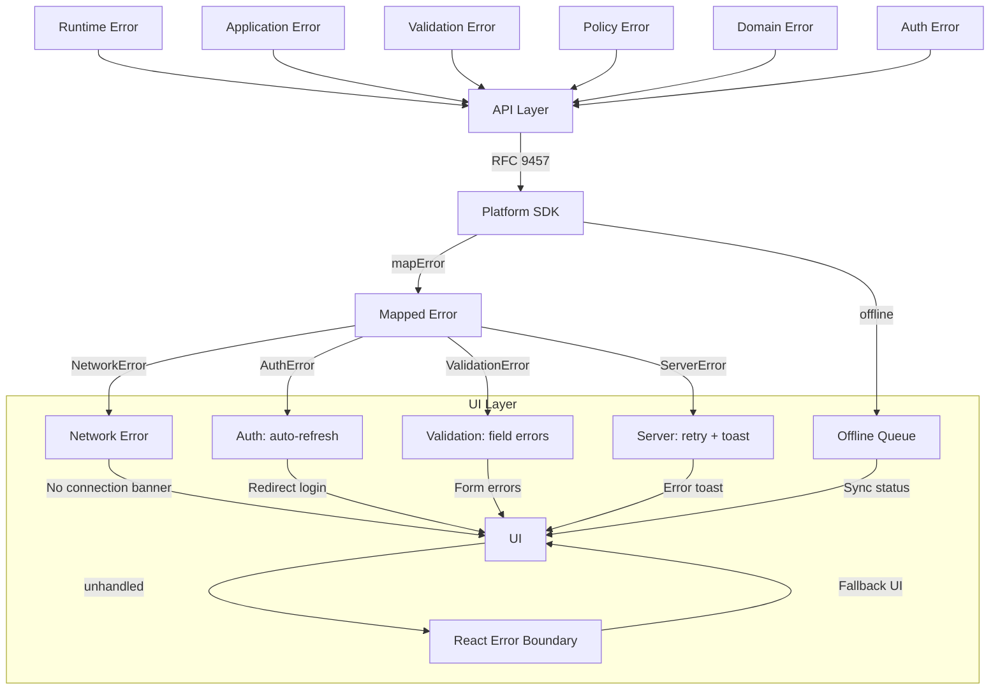
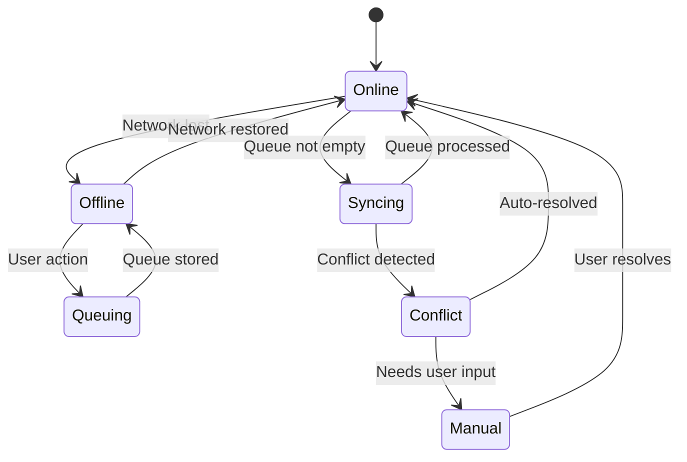

# ARCH-0021 — Error Architecture

| Field | Value |
|-------|-------|
| **ID** | ARCH-0021 |
| **Name** | Error Architecture |
| **Version** | 1.0 |
| **Status** | Draft |
| **Category** | Architecture |
| **Owner** | Chief Architect |
| **Derived from** | ARCH-0015, ARCH-0016, ARCH-0019 |
| **Referenced by** | ARCH-0022, Frontend Implementation |

---

## 1. Purpose

Define how every error in ASCEND is classified, communicated, and recovered — from the Runtime all the way to the UI.

---

## 2. Error Classification

```
ERROR
├── Runtime Error       → Core Engine failure
├── Application Error   → Use case violation
├── Validation Error    → Invalid input
├── Policy Error        → Rule violation
├── Domain Error        → Business logic violation
├── Auth Error          → Authentication / authorization
├── Network Error       → Connection failure
├── Offline Error       → Operation not available offline
└── UI Error            → Rendering / state inconsistency
```

---

## 3. Error by Layer

### Layer 1 — Runtime

```typescript
// Source: Core Engine (Python)
// Example: Mission state machine rejects invalid transition
class RuntimeError extends Error {
  code: string        // e.g. 'INVALID_TRANSITION'
  detail: string
  context: Record<string, unknown>
}
```

**When it reaches the UI:** Mapped to `ServerError` — generic "something went wrong" + auto-retry. Details are logged server-side.

### Layer 2 — Application

```typescript
// Source: Use Cases
// Example: Builder tries to start a locked mission
class ApplicationError extends Error {
  code: string        // e.g. 'MISSION_NOT_AVAILABLE'
  message: string
  statusCode: number  // e.g. 409
}
```

**When it reaches the UI:** Mapped to specific error message + actionable CTA.

### Layer 3 — Validation

```typescript
// Source: Input validation
// Example: Missing required field
class ValidationError extends Error {
  code: 'VALIDATION_ERROR'
  errors: Array<{
    field: string
    message: string
    code: string     // e.g. 'REQUIRED_FIELD', 'INVALID_FORMAT'
  }>
}
```

**When it reaches the UI:** Field-level errors shown inline on forms.

### Layer 4 — Policy

```typescript
// Source: Rules Engine
// Example: Prerequisite not met
class PolicyError extends Error {
  code: string         // e.g. 'PREREQUISITE_NOT_MET'
  message: string
  prerequisite?: string
}
```

**When it reaches the UI:** Shown as policy violation message with explanation.

### Layer 5 — Domain

```typescript
// Source: Domain entities
// Example: Cannot submit evidence for completed mission
class DomainError extends Error {
  code: string
  message: string
  currentState: string
  expectedState: string
}
```

**When it reaches the UI:** Mapped to user-friendly "This action is not available right now."

### Layer 6 — Auth

```typescript
// Source: Auth middleware
// Example: Expired token
class AuthError extends Error {
  code: 'UNAUTHORIZED' | 'FORBIDDEN' | 'TOKEN_EXPIRED'
  message: string
}
```

**When it reaches the UI:** Auto-refresh token. If refresh fails → redirect to login.

### Layer 7 — Network

```typescript
// Source: SDK / HTTP client
// Example: No internet connection
class NetworkError extends Error {
  code: 'NETWORK_ERROR'
  message: string
  retryable: true
}
```

**When it reaches the UI:** "No connection" banner + auto-retry when online.

### Layer 8 — Offline

```typescript
// Source: SDK
// Example: Write operation attempted offline
class OfflineError extends Error {
  code: 'OFFLINE'
  message: string
  queued: boolean  // true if action was queued
}
```

**When it reaches the UI:** "Saved offline" message with sync status.

### Layer 9 — UI

```typescript
// Source: React rendering
// Example: State inconsistency
class UIError extends Error {
  code: 'RENDER_ERROR' | 'STATE_MISMATCH'
  message: string
  component: string
}
```

**When it happens:** Error boundary catches → fallback UI → log + optional retry.

---

## 4. Error Propagation



---

## 5. Retry Policy

| Error Type | Retry? | Strategy |
|-----------|--------|----------|
| Network Error | Yes (3x) | Exponential backoff (1s, 2s, 4s) |
| 429 Rate Limited | Yes (3x) | Retry-After header |
| 5xx Server Error | Yes (3x) | Exponential backoff |
| 4xx Client Error | No | Never retry |
| Auth Error (401) | Yes (1x) | Refresh token then retry |
| Offline | Yes | Queue, retry when online |

---

## 6. Toast Policy

| Error Type | Toast | Duration | Action |
|-----------|-------|----------|--------|
| Network Error | "You're offline. Changes will sync when connected." | Persistent | Dismiss |
| Server Error | "Something went wrong. Retrying..." | 5s | Retry |
| Validation Error | (shown inline, no toast) | — | — |
| Auth Error | "Session expired. Logging in again..." | 3s | Auto-redirect |
| Offline Queue | "Saved offline." | 3s | — |
| Success | "Mission started!" | 2s | — |

---

## 7. Recovery Actions

| Error | Recovery | User Action |
|-------|----------|-------------|
| Network Error | Auto-retry on reconnect | Wait or work offline |
| Token Expired | Auto-refresh | None (transparent) |
| 429 Rate Limited | Wait + retry | "Slow down" message |
| 5xx Server Error | Auto-retry (3x) | "Retrying..." + manual retry button |
| Validation Error | Fix fields | Correct input |
| Policy Error | Complete prerequisites | Navigate to prerequisite |
| Render Error | Error boundary | "Reload" button |

---

## 8. Offline Recovery



---

## 9. Error Codes Catalog

| Code | Layer | HTTP | Toast | Retry |
|------|-------|------|-------|-------|
| `NETWORK_ERROR` | Network | — | ✅ | ✅ |
| `TIMEOUT` | Network | — | ✅ | ✅ |
| `OFFLINE` | Network | — | ✅ | — |
| `UNAUTHORIZED` | Auth | 401 | ✅ | ✅ (refresh) |
| `FORBIDDEN` | Auth | 403 | ✅ | — |
| `TOKEN_EXPIRED` | Auth | 401 | — | ✅ (refresh) |
| `NOT_FOUND` | Application | 404 | ✅ | — |
| `CONFLICT` | Application | 409 | ✅ | — |
| `MISSION_LOCKED` | Domain | 409 | ✅ | — |
| `MISSION_ALREADY_STARTED` | Domain | 409 | ✅ | — |
| `INVALID_TRANSITION` | Runtime | 500 | ✅ | ✅ |
| `PREREQUISITE_NOT_MET` | Policy | 409 | ✅ | — |
| `VALIDATION_ERROR` | Validation | 422 | — (inline) | — |
| `RATE_LIMITED` | API | 429 | ✅ | ✅ |
| `INTERNAL_ERROR` | Runtime | 500 | ✅ | ✅ |
| `BAD_GATEWAY` | API | 502 | ✅ | ✅ |
| `SERVICE_UNAVAILABLE` | API | 503 | ✅ | ✅ |
| `RENDER_ERROR` | UI | — | ✅ | — |

---

## 10. Definition of Done

ARCH-0021 aprovado quando:

- [ ] Error classification tree complete (9 types)
- [ ] All 9 error types documented with code examples
- [ ] Error propagation diagram complete
- [ ] Retry policy defined per error type
- [ ] Toast policy defined per error type
- [ ] Recovery actions defined per error type
- [ ] Offline recovery state diagram complete
- [ ] Error codes catalog complete (18 codes)

---

## 11. Change History

| Version | Date | Author | Change |
|---------|------|--------|--------|
| 1.0 | 2026-07-20 | Chief Architect | Initial version |
