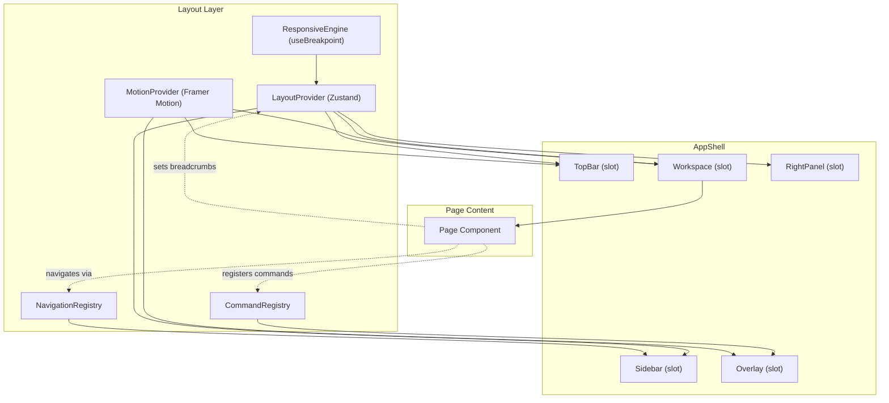

# ARCH-0023 — Layout Architecture

| Field | Value |
|-------|-------|
| **ID** | ARCH-0023 |
| **Name** | Layout Architecture |
| **Version** | 1.0 |
| **Status** | Draft |
| **Category** | Architecture |
| **Owner** | Chief Architect |
| **Derived from** | ARCH-0011, ARCH-0022 |
| **Referenced by** | Frontend Implementation |
| **Principle** | Layout Invariance — Layout is permanent, content is transient |

---

## 1. Purpose

Define the permanent layout regions of ASCEND, their responsibilities, communication model, and constraints. This is the **Constitution of the Experience Layer**.

---

## 2. Layout Regions

```
┌─────────────────────────────────────────────────────┐
│                     TopBar                           │
│  [☰] [Breadcrumbs]                    [Theme][User] │
├──────────┬──────────────────────────────────────────┤
│          │                                          │
│ Sidebar  │              Workspace                   │
│          │                                          │
│  Nav     │       ┌──────────────────────┐           │
│  Items   │       │                      │           │
│          │       │    Page Content       │           │
│  Focus   │       │                      │           │
│  Mode    │       └──────────────────────┘           │
│          │                                          │
├──────────┴──────────────────────────────────────────┤
│                     Overlay Layer                    │
│    [Command Palette] [Modals] [Toasts] [Sheets]     │
└─────────────────────────────────────────────────────┘
```

### 2.1 Region Definitions

| Region | Role | Responsabilities | Never Contains |
|--------|------|-----------------|----------------|
| **TopBar** | Navigation anchor | Breadcrumbs, theme toggle, user menu, search trigger, focus toggle | Business data, mission state |
| **Sidebar** | Primary navigation | Nav items, ascension ring (mini), workspace switcher | Mission content, evidence |
| **Workspace** | Main content area | All page content, mission viewer, forms, dashboards | Navigation, chrome |
| **RightPanel** | Contextual supplement | AI Mentor, mission details, reference material | Primary navigation |
| **Overlay** | Temporary modals | Command palette, modals, toasts, sheets, dialogs | Persistent content |

### 2.2 Layout Invariance

> **The Layout is permanent. The content is transient.**

- Layout regions never import from features (missions, journeys, competencies, etc.)
- Layout regions never call the API directly
- Layout regions never access the Runtime
- Layout regions never hold domain state
- Content slides into the Workspace slot and leaves when navigation changes

---

## 3. Slot Architecture

The AppShell is slot-based. Composition is explicit, never implicit.

```tsx
<AppShell
  topbar={<TopBar />}
  sidebar={<Sidebar />}
  workspace={<Workspace />}
  rightPanel={rightPanelOpen ? <RightPanel /> : undefined}
  overlay={overlay}
/>
```

### 3.1 Slot Policy

| Rule | Description |
|------|-------------|
| **S1** | Every slot is optional. The AppShell renders nothing for undefined slots |
| **S2** | Slots receive no domain props. They receive only layout state (collapsed, mode, etc.) |
| **S3** | Workspace is the only required slot at runtime |
| **S4** | Overlay is always rendered last, above everything |
| **S5** | No slot can reach into another slot |

### 3.2 Slot Communication

```
TopBar ─────► LayoutContext ◄──── Sidebar
                 │
                 ▼
            Workspace
                 │
       RightPanel◄┘
```

Regions never talk to each other directly. They communicate exclusively through the LayoutContext (see §4).

---

## 4. Layout Context

The LayoutContext is a Zustand store holding only layout state. Zero domain state.

```typescript
interface LayoutState {
  sidebar: { open: boolean; collapsed: boolean; pinned: boolean }
  topbar: { transparent: boolean; hidden: boolean }
  workspace: { fullscreen: boolean; focusMode: boolean }
  rightPanel: { open: boolean; width: number }
  breadcrumbs: Breadcrumb[]
  layoutMode: 'desktop' | 'tablet' | 'mobile' | 'ultrawide'
  reducedMotion: boolean
}
```

### 4.1 Context Rules

| Rule | Description |
|------|-------------|
| **C1** | LayoutContext never holds mission, journey, competency, user, or any domain data |
| **C2** | Components read layout state, never write domain state |
| **C3** | Layout state is ephemeral (not persisted to disk) |
| **C4** | Layout state resets on full page navigation |

---

## 5. Responsive Engine

The Responsive Engine determines LayoutMode and exposes hooks. No component checks `window.innerWidth` directly.

```typescript
type LayoutMode = 'desktop' | 'tablet' | 'mobile' | 'ultrawide'

function useBreakpoint(): LayoutMode
function useViewport(): { width: number; height: number; scrollY: number }
```

### 5.1 Breakpoint Map

| Mode | Width | Layout Behavior |
|------|-------|-----------------|
| `ultrawide` | >= 1536px | Full sidebar, workspace centered, right panel open |
| `desktop` | >= 1024px | Full sidebar, right panel toggleable |
| `tablet` | >= 768px | Sidebar collapsed (icons only), workspace full width |
| `mobile` | < 768px | Bottom nav, sidebar hidden, sheets instead of panels |

### 5.2 Responsive Rules

| Rule | Description |
|------|-------------|
| **R1** | LayoutMode is derived from viewport, never manually set |
| **R2** | Components react to LayoutMode, never to hardcoded breakpoints |
| **R3** | Sidebar collapses automatically at tablet, hides at mobile |

---

## 6. Navigation Model

Navigation is typed. Every route is a `NavigationItem`.

```typescript
interface NavigationItem {
  id: string
  icon: LucideIcon
  label: string
  href: string
  permissions?: string[]       // future
  badge?: number | string
  hidden?: boolean
  children?: NavigationItem[]
}
```

### 6.1 Navigation Rules

| Rule | Description |
|------|-------------|
| **N1** | Navigation is data-driven. Adding a route means adding an item, not editing a component |
| **N2** | No screen navigates to another screen directly. Always through Navigation |
| **N3** | Active state is determined by `usePathname()` |

---

## 7. Command Registry

Commands are the action layer of the Layout. Even before real commands exist, the structure must be in place.

```typescript
interface Command {
  id: string
  category: CommandCategory
  label: string
  description?: string
  icon?: LucideIcon
  shortcut?: string
  disabled?: boolean
  execute: () => void
}

type CommandCategory = 'navigation' | 'actions' | 'pages' | 'recent'
```

### 7.1 Command Rules

| Rule | Description |
|------|-------------|
| **M1** | Every command is registered, never hardcoded in a component |
| **M2** | The Command Palette is the UI for the Command Registry |
| **M3** | Features register their commands at mount, unregister at unmount |

---

## 8. Motion Provider

All animations go through a single MotionProvider.

```typescript
interface MotionConfig {
  speed: 'instant' | 'fast' | 'normal' | 'slow' | 'hero'
  reducedMotion: boolean
  pageTransition: Transition
  modalTransition: Transition
  springPreset: Spring
}
```

### 8.1 Motion Rules

| Rule | Description |
|------|-------------|
| **P1** | No component defines its own animation duration or easing |
| **P2** | Every animation reads from MotionProvider |
| **P3** | `prefers-reduced-motion` propagates through MotionProvider |
| **P4** | Framer Motion `features` are centralized, not imported per-component |

---

## 9. Lifecycle

```
App Init
   │
   ▼
LayoutProvider mounts
   │
   ├── Reads system preferences (reduced motion, color scheme)
   ├── Determines LayoutMode from viewport
   └── Initializes LayoutStore
   │
   ▼
AppShell renders
   │
   ├── TopBar renders (empty if no children)
   ├── Sidebar renders Navigation
   ├── Workspace renders {children} (page content)
   ├── RightPanel renders if open
   └── Overlay renders last (portals)
   │
   ▼
Navigation Change
   │
   ├── Workspace content swaps
   ├── Breadcrumbs update
   ├── Overlay closes (if open)
   └── LayoutMode re-evaluated on resize

Page Unmount
   │
   ├── LayoutStore resets
   └── LayoutProvider stays mounted (persists across pages)
```

---

## 10. Architectural Constraints

| Constraint | Description | Violation Penalty |
|------------|-------------|-------------------|
| **No domain in layout** | Layout components never import domain types | Block PR |
| **No API in layout** | Layout components never call fetch | Block PR |
| **No Runtime in layout** | Layout components never import Runtime | Block PR |
| **Slots only** | Layout composition is always through slots | Architecture review |
| **No inter-slot coupling** | Sidebar can't reach into TopBar | Block PR |
| **No hardcoded breakpoints** | Always use useBreakpoint() | Lint rule |
| **No inline transitions** | Always use MotionProvider | Lint rule |
| **No direct navigation** | Pages navigate through Navigation model | Architecture review |

---

## 11. Mermaid Diagram



---

## 12. Definition of Done

ARCH-0023 aprovado quando:

- [ ] 5 layout regions defined with responsibilities
- [ ] Layout Invariance principle documented
- [ ] Slot architecture with 5 rules
- [ ] LayoutContext state interface defined
- [ ] Responsive Engine with 4 LayoutModes
- [ ] Navigation Model with typed interface
- [ ] Command Registry structure defined
- [ ] Motion Provider with centralized config
- [ ] AppShell lifecycle documented
- [ ] 8 architectural constraints with violation penalties
- [ ] Mermaid diagram complete

---

## 13. Change History

| Version | Date | Author | Change |
|---------|------|--------|--------|
| 1.0 | 2026-07-20 | Chief Architect | Initial version |
