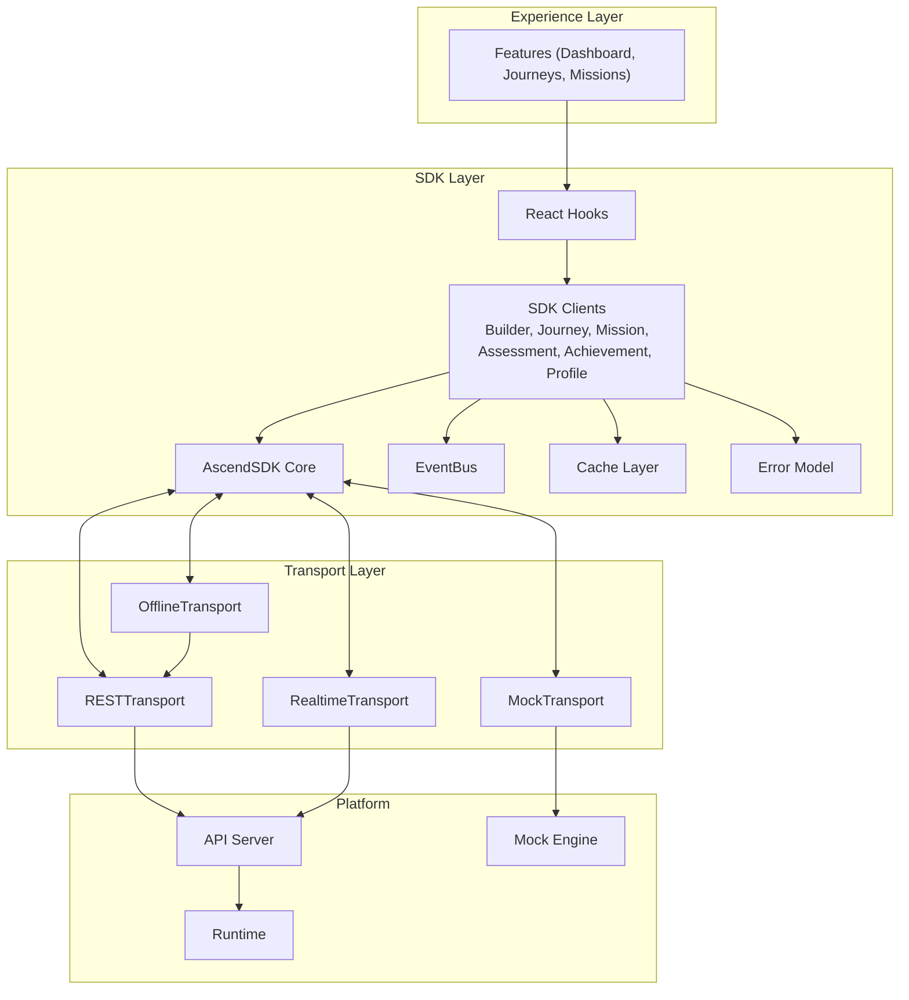

# ARCH-0024 — Frontend SDK Architecture

| Field | Value |
|-------|-------|
| **ID** | ARCH-0024 |
| **Name** | Frontend SDK Architecture |
| **Version** | 1.0 |
| **Status** | Draft |
| **Category** | Architecture |
| **Owner** | Chief Architect |
| **Derived from** | ARCH-0011, ARCH-0016, ARCH-0019, ARCH-0022, ARCH-0023 |
| **Referenced by** | SDK-0001, SDK-0002, SDK-0003, SDK-0004, Frontend Implementation |
| **Principle** | SDK Independence — The Frontend never knows the API |

---

## 1. Purpose

Define the architecture, responsibilities, lifecycle, and constraints of the **ASCEND Frontend SDK** — the single contract between the Experience Layer and the Platform Layer.

The SDK is the **only** bridge between UI and data. No Feature, no Component, no Hook ever imports an HTTP library, calls `fetch`, or knows the transport mechanism.

---

## 2. Why a Frontend SDK

### 2.1 The Problem

```
Experience
    │
    ▼
Feature ──► REST API ──► Runtime
```

This is the standard pattern in most projects. The frontend knows the API. Every feature imports `axios`, `fetch`, or HTTP helpers. Changing the backend means changing the frontend. The layers are coupled.

### 2.2 The Solution

```
Experience
    │
    ▼
Feature ──► SDK Client ──► Transport ──► API/Runtime
```

The Feature knows only the SDK Client. The SDK Client knows only the Transport interface. The Transport is swappable (Mock → REST → Offline → Realtime). The Frontend never imports HTTP.

### 2.3 Sovereignty

This separation allows:

| Property | Benefit |
|----------|---------|
| **Transport agnostic** | Mock → REST → Runtime without frontend changes |
| **Multi-platform** | Web, Desktop, Mobile share the same SDK |
| **Offline-first** | Same interface, different transport |
| **Third-party clients** | External developers use the same contract |
| **Parallel development** | UI works against Mock Engine before any API exists |

---

## 3. Architecture Overview

```
┌─────────────────────────────────────────────────────────┐
│                   Experience Layer                       │
│  ┌──────────┐ ┌──────────┐ ┌──────────┐ ┌──────────┐  │
│  │ Dashboard│ │ Journeys │ │ Missions │ │Builder   │  │
│  │ Feature  │ │ Feature  │ │ Feature  │ │Profile   │  │
│  └────┬─────┘ └────┬─────┘ └────┬─────┘ └────┬─────┘  │
│       │            │            │            │         │
│       ▼            ▼            ▼            ▼         │
│  ┌─────────────────────────────────────────────────┐   │
│  │           Frontend SDK Layer                     │   │
│  │                                                   │   │
│  │  ┌──────────────┐  ┌──────────────────────────┐  │   │
│  │  │  AscendSDK   │  │      Event Bus           │  │   │
│  │  │  (Core)      │  │  MissionStarted          │  │   │
│  │  │              │  │  AchievementUnlocked      │  │   │
│  │  │  initialize  │  │  BuilderUpdated           │  │   │
│  │  │  shutdown    │  │  ThemeChanged             │  │   │
│  │  │  health      │  └──────────────────────────┘  │   │
│  │  │  version     │                                 │   │
│  │  └──────┬───────┘                                 │   │
│  │         │                                          │   │
│  │  ┌──────┴──────────────────────────────────────┐  │   │
│  │  │              SDK Clients                     │  │   │
│  │  │                                              │  │   │
│  │  │  BuilderClient     JourneyClient            │  │   │
│  │  │  MissionClient     AssessmentClient          │  │   │
│  │  │  AchievementClient ProfileClient            │  │   │
│  │  └──────┬──────────────────────────────────────┘  │   │
│  │         │                                          │   │
│  │  ┌──────┴──────────────────────────────────────┐  │   │
│  │  │              Transport Layer                 │  │   │
│  │  │                                              │  │   │
│  │  │  MockTransport   RESTTransport               │  │   │
│  │  │  OfflineTransport RealtimeTransport          │  │   │
│  │  └──────────────────────────────────────────────┘  │   │
│  │                                                   │   │
│  │  ┌──────────┐ ┌──────────┐ ┌──────────┐          │   │
│  │  │  Cache   │ │  Errors  │ │  Hooks   │          │   │
│  │  │  Layer   │ │  Model   │ │  (React) │          │   │
│  │  └──────────┘ └──────────┘ └──────────┘          │   │
│  └─────────────────────────────────────────────────┘   │
│                                                         │
│  ┌─────────────────────────────────────────────────┐   │
│  │              Transport Implementations            │   │
│  │                                                   │   │
│  │  ┌──────────────┐  ┌──────────────┐              │   │
│  │  │  Mock Engine  │  │  REST API    │              │   │
│  │  │  (in-memory)  │  │  (Fastify)   │              │   │
│  │  └──────────────┘  └──────────────┘              │   │
│  │                                                   │   │
│  │  ┌──────────────┐  ┌──────────────┐              │   │
│  │  │  Offline      │  │  Realtime    │              │   │
│  │  │  (IndexedDB)  │  │  (SSE/WS)    │              │   │
│  │  └──────────────┘  └──────────────┘              │   │
│  └─────────────────────────────────────────────────┘   │
└─────────────────────────────────────────────────────────┘
```

---

## 4. Layer Responsibilities

### 4.1 AscendSDK Core

| Responsibility | Description |
|----------------|-------------|
| `initialize()` | Boot transports, load config, create clients |
| `shutdown()` | Graceful teardown of all transports |
| `health()` | Ping current transport, return status |
| `version()` | Return SDK version string |

### 4.2 SDK Clients

| Client | Responsibilities |
|--------|-----------------|
| `BuilderClient` | Builder profile, XP, level, timeline |
| `JourneyClient` | Journey CRUD, progress, tree structure |
| `MissionClient` | Mission CRUD, evidence submission, feedback |
| `AssessmentClient` | Assessments, rubrics, scoring |
| `AchievementClient` | Badges, certificates, achievements |
| `ProfileClient` | Settings, preferences, account management |

### 4.3 Transport Layer

| Transport | Use Case |
|-----------|----------|
| **MockTransport** | Development, testing, UI prototyping |
| **RESTTransport** | Production API communication |
| **OfflineTransport** | Offline-first with sync queue |
| **RealtimeTransport** | SSE/WebSocket for live updates |

### 4.4 Cache Layer

| Component | Responsibility |
|-----------|----------------|
| `CacheStore` | In-memory cache with TTL |
| `CachePolicy` | Per-endpoint cache rules (stale-while-revalidate, ttl, invalidation) |
| `CacheEntry` | Typed cache entry with metadata |
| `CacheKey` | Deterministic key generation from method + args |

### 4.5 Event Bus

| Component | Responsibility |
|-----------|----------------|
| `EventBus` | Publish/subscribe, typed events |
| `Event` | Base event interface |
| `EventHandler` | Handler registration and lifecycle |

### 4.6 Error Model

| Error | When |
|-------|------|
| `AscendError` | Base error for all SDK errors |
| `ValidationError` | Invalid input |
| `NetworkError` | Transport failure |
| `AuthenticationError` | Unauthenticated/unauthorized |
| `ConflictError` | Version conflict, duplicate |
| `OfflineError` | Operation unavailable offline |

### 4.7 Hooks

| Hook | Purpose |
|------|---------|
| `useBuilder()` | Reactive builder profile |
| `useMissions()` | Mission list with cache |
| `useMission(id)` | Single mission detail |
| `useJourneys()` | Journey list |
| `useAchievements()` | Achievement gallery |
| `useSubmitEvidence()` | Evidence upload mutation |

---

## 5. Lifecycle

```
Application Start
    │
    ▼
AscendSDK.initialize({ transport: 'mock' })
    │
    ├── Transport factory creates MockTransport
    ├── MockEngine boot (preload seed data)
    ├── Clients instantiated with transport
    ├── EventBus initialized
    └── CacheStore ready
    │
    ▼
Features mount
    │
    ├── Hooks call SDK Clients
    ├── Clients call Transport
    ├── Transport returns data (mock or real)
    ├── Cache stores responses per policy
    └── Events published on mutations
    │
    ▼
Transport Switch (dev only)
    │
    ├── AscendSDK.switchTransport('rest')
    ├── RESTTransport created
    ├── Clients point to new transport
    └── Cache invalidated
    │
    ▼
Application Shutdown
    │
    ├── EventBus drained
    ├── CacheStore cleared
    ├── Transport shutdown
    └── AscendSDK.shutdown()
```

---

## 6. Transport Interface

Every transport implements the same contract:

```typescript
interface Transport {
  name: string
  status: TransportStatus

  // Core
  connect(): Promise<void>
  disconnect(): Promise<void>
  health(): Promise<HealthStatus>

  // Generic request
  request<T>(config: RequestConfig): Promise<Result<T>>

  // Lifecycle
  onStatusChange(handler: (status: TransportStatus) => void): void
}

type TransportStatus = 'disconnected' | 'connecting' | 'connected' | 'error'
```

---

## 7. Migration Strategy

```
Phase 1 (Now)
    MockTransport only
    MockEngine simulates all data
    All UI development runs against Mock
    │
    ▼
Phase 2 (API Ready)
    RESTTransport added
    Dual mode: Mock ↔ REST via config
    Features work with both
    │
    ▼
Phase 3 (Offline)
    OfflineTransport wraps RESTTransport
    Queue operations when offline
    Sync on reconnect
    │
    ▼
Phase 4 (Realtime)
    RealtimeTransport added
    SSE/WebSocket for live updates
    Falls back to RESTTransport
```

---

## 8. Architectural Constraints

| Constraint | Description | Violation Penalty |
|------------|-------------|-------------------|
| **No HTTP in Features** | Features never import fetch, axios, or any HTTP library | Block PR |
| **No Transport leak** | Clients never expose transport internals | Block PR |
| **Clients are stateless** | All state lives in Cache or Transport | Architecture review |
| **Errors are typed** | Every error is an AscendError subclass | Architecture review |
| **Events are typed** | Every event has a name and payload type | Block PR |
| **Transport is swappable** | No feature depends on a specific transport | Block PR |
| **Mock is always available** | MockTransport must work without any backend | Block PR |
| **Cache is transparent** | Features don't know if data is cached or fresh | Architecture review |

---

## 9. Mermaid Diagram



---

## 10. File Structure

```
packages/sdk/
├── core/
│   ├── ascend-sdk.ts           # AscendSDK class
│   ├── types.ts                # Core types
│   └── config.ts               # SDK configuration
│
├── transport/
│   ├── transport.interface.ts  # Transport contract
│   ├── mock-transport.ts       # MockTransport
│   ├── rest-transport.ts       # RESTTransport
│   ├── offline-transport.ts    # OfflineTransport
│   ├── realtime-transport.ts   # RealtimeTransport
│   └── transport-factory.ts    # Transport factory
│
├── clients/
│   ├── builder.client.ts       # BuilderClient
│   ├── journey.client.ts       # JourneyClient
│   ├── mission.client.ts       # MissionClient
│   ├── assessment.client.ts    # AssessmentClient
│   ├── achievement.client.ts   # AchievementClient
│   └── profile.client.ts       # ProfileClient
│
├── hooks/
│   ├── use-builder.ts
│   ├── use-missions.ts
│   ├── use-mission.ts
│   ├── use-journeys.ts
│   ├── use-achievements.ts
│   ├── use-submit-evidence.ts
│   └── index.ts
│
├── cache/
│   ├── cache-store.ts
│   ├── cache-policy.ts
│   ├── cache-entry.ts
│   └── cache-key.ts
│
├── errors/
│   ├── ascend.error.ts
│   ├── validation.error.ts
│   ├── network.error.ts
│   ├── authentication.error.ts
│   ├── conflict.error.ts
│   └── offline.error.ts
│
├── events/
│   ├── event-bus.ts
│   ├── events.ts               # Event type definitions
│   └── handlers.ts
│
├── mocks/
│   ├── mock-engine.ts           # MockEngine
│   ├── seed-data.ts             # Seed data
│   ├── builder.mock.ts
│   ├── journey.mock.ts
│   ├── mission.mock.ts
│   ├── competency.mock.ts
│   ├── achievement.mock.ts
│   ├── notification.mock.ts
│   └── timeline.mock.ts
│
└── types/
    ├── builder.types.ts
    ├── journey.types.ts
    ├── mission.types.ts
    ├── assessment.types.ts
    ├── achievement.types.ts
    └── profile.types.ts
```

---

## 11. Definition of Done

ARCH-0024 aprovado quando:

- [ ] SDK layer responsibilities defined (Core, Clients, Transport, Cache, Events, Errors, Hooks, Mocks)
- [ ] Architecture diagram documented
- [ ] Layer separation with 4 transport types specified
- [ ] Transport interface contract defined
- [ ] Migration strategy (Mock → REST → Offline → Realtime) documented
- [ ] 8 architectural constraints with violation penalties
- [ ] Mermaid diagram complete
- [ ] File structure defined for all SDK modules
- [ ] Lifecycle documented (init → runtime → shutdown)

---

## 12. Change History

| Version | Date | Author | Change |
|---------|------|--------|--------|
| 1.0 | 2026-07-20 | Chief Architect | Initial version — OPERAÇÃO TITAN |
