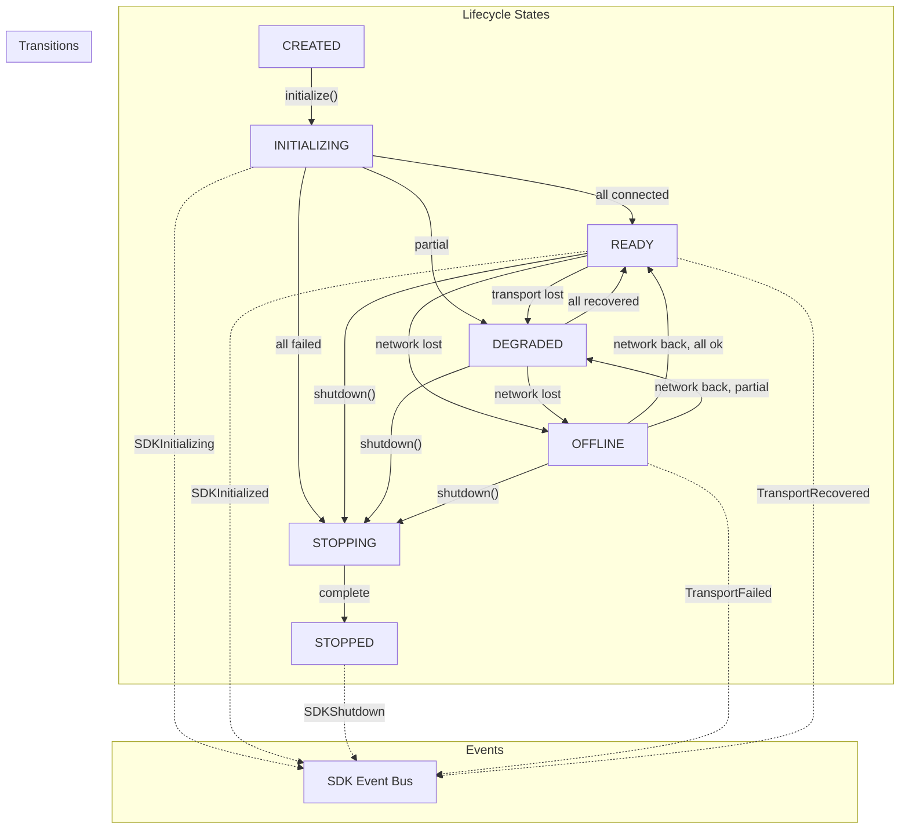

# ARCH-0025 — SDK Lifecycle

| Field | Value |
|-------|-------|
| **ID** | ARCH-0025 |
| **Name** | SDK Lifecycle |
| **Version** | 1.0 |
| **Status** | Draft |
| **Category** | Architecture |
| **Owner** | Chief Architect |
| **Derived from** | ARCH-0024, SDK-0001 |
| **Principle** | Everything Replaceable — every component is a plugin |

---

## 1. Purpose

Define the formal lifecycle of the ASCEND Frontend SDK: states, transitions, events, invariants, startup sequence, shutdown protocol, and recovery mechanisms. This is the **state machine** that governs every SDK operation.

---

## 2. States

The SDK has exactly **7 states**:

```
CREATED ──► INITIALIZING ──► READY
                                 │
                          ┌──────┼──────┐
                          ▼      ▼      ▼
                      DEGRADED  OFFLINE  STOPPING
                          │      │         │
                          └──────┘         ▼
                                         STOPPED
```

| State | Code | Description |
|-------|------|-------------|
| `CREATED` | `0` | Instance exists, not yet initialized |
| `INITIALIZING` | `1` | Running `initialize()` sequence |
| `READY` | `2` | Fully operational, all transports connected |
| `DEGRADED` | `3` | Operational with degraded capabilities |
| `OFFLINE` | `4` | No network, operating in offline mode |
| `STOPPING` | `5` | Running `shutdown()` sequence |
| `STOPPED` | `6` | Fully shut down, no methods available |

---

## 3. Transitions

| From | To | Trigger | Guard |
|------|----|---------|-------|
| `CREATED` | `INITIALIZING` | `initialize()` called | Config valid, not already initialized |
| `INITIALIZING` | `READY` | All transports connected | All transports healthy |
| `INITIALIZING` | `DEGRADED` | Some transports failed | At least one transport connected |
| `INITIALIZING` | `STOPPING` | `shutdown()` during init | Always allowed |
| `READY` | `DEGRADED` | Transport failure | At least one backup transport active |
| `READY` | `OFFLINE` | Network lost | Offline transport available |
| `READY` | `STOPPING` | `shutdown()` called | Always allowed |
| `DEGRADED` | `READY` | All transports recovered | All transports healthy |
| `DEGRADED` | `OFFLINE` | Network lost | Offline transport available |
| `DEGRADED` | `STOPPING` | `shutdown()` called | Always allowed |
| `OFFLINE` | `READY` | Network regained | All transports healthy |
| `OFFLINE` | `DEGRADED` | Network regained, partial failure | At least one transport healthy |
| `OFFLINE` | `STOPPING` | `shutdown()` called | Always allowed |
| `STOPPING` | `STOPPED` | Shutdown sequence complete | All resources released |

### 3.1 Invalid Transitions

Any transition not listed above throws `AscendError`. Examples:
- Calling `initialize()` from `READY`
- Calling `shutdown()` from `STOPPED`
- Calling any client method from `CREATED` or `STOPPED`

---

## 4. State Machine Interface

```typescript
interface Lifecycle {
  readonly state: SDKState
  readonly previousState: SDKState | null

  transition(to: SDKState): Promise<void>
  canTransition(to: SDKState): boolean
  onStateChange(handler: StateChangeHandler): () => void
  reset(): void
}

type SDKState = 'CREATED' | 'INITIALIZING' | 'READY'
              | 'DEGRADED' | 'OFFLINE' | 'STOPPING' | 'STOPPED'

interface StateChangeEvent {
  from: SDKState
  to: SDKState
  timestamp: number
  reason?: string
}

type StateChangeHandler = (event: StateChangeEvent) => void
```

---

## 5. State Invariants

| Invariant | Description | Violation |
|-----------|-------------|-----------|
| **S1** | No method executes outside `READY`, `DEGRADED`, or `OFFLINE` | Throws `AscendError` |
| **S2** | `initialize()` only from `CREATED` | Throws `AscendError` |
| **S3** | `shutdown()` only from `READY`, `DEGRADED`, `OFFLINE`, or `INITIALIZING` | Throws `AscendError` |
| **S4** | All client methods block during `INITIALIZING` | Queue or throw |
| **S5** | All client methods throw during `STOPPING` or `STOPPED` | Throws `AscendError` |
| **S6** | Transport switch only from `READY` or `DEGRADED` | Throws `AscendError` |
| **S7** | State transitions are atomic (no partial transitions) | Assertion |

---

## 6. Startup Sequence

```
CREATED
    │
    ▼
INITIALIZING
    │
    ├── 1. Validate config
    │     └── Fail → transition(STOPPING) → STOPPED, emit SDKInitializationFailed
    │
    ├── 2. Register built-in transports (mock)
    │
    ├── 3. Resolve transport from registry
    │
    ├── 4. CacheStore initialize
    │
    ├── 5. EventBus initialize
    │
    ├── 6. Create all clients (inject transport, cache, events)
    │
    ├── 7. Connect transport
    │     ├── Success → transition(READY)
    │     ├── Partial  → transition(DEGRADED)
    │     └── Fail     → transition(STOPPED), emit SDKInitializationFailed
    │
    └── 8. Emit SDKInitialized
```

---

## 7. Shutdown Sequence

```
READY | DEGRADED | OFFLINE | INITIALIZING
    │
    ▼
STOPPING
    │
    ├── 1. Emit SDKShuttingDown
    │
    ├── 2. Drain EventBus (flush pending events)
    │
    ├── 3. Clear CacheStore
    │
    ├── 4. Disconnect transport
    │
    ├── 5. Release all resources
    │
    └── 6. transition(STOPPED)
          └── Emit SDKShutdown
```

---

## 8. Recovery

### 8.1 Transport Recovery

When a transport fails during `READY` state:

```
READY
    │
    ├── Transport emits 'disconnected'
    ├── SDK detects and transitions to DEGRADED
    ├── SDK tries alternate transport (if registered)
    │     ├── Success → READY
    │     └── Fail on all → OFFLINE
    └── SDK starts reconnection timer
          ├── Every N ms, attempt reconnect
          ├── On success → READY or DEGRADED
          └── On max retries → emit TransportFailed, stay OFFLINE
```

### 8.2 Reconnection Policy

```typescript
interface ReconnectionConfig {
  baseDelay: number           // ms, default 1000
  maxDelay: number            // ms, default 30000
  maxAttempts: number         // default 10
  jitter: boolean             // default true
}
```

---

## 9. Event Emissions

Every state transition emits infrastructure events:

| Event | When | Payload |
|-------|------|---------|
| `SDKInitializing` | `CREATED → INITIALIZING` | `{ config }` |
| `SDKInitialized` | `INITIALIZING → READY` | `{ health }` |
| `SDKInitializationFailed` | `INITIALIZING → STOPPED` | `{ error }` |
| `SDKShuttingDown` | entering `STOPPING` | `{ reason }` |
| `SDKShutdown` | entering `STOPPED` | `{ uptime }` |
| `TransportChanged` | transport switched | `{ from, to }` |
| `TransportFailed` | transport error | `{ transport, error }` |
| `TransportRecovered` | transport reconnected | `{ transport }` |
| `StateChanged` | any state transition | `{ from, to, reason }` |
| `CacheCleared` | cache cleared | `{ entries }` |
| `CacheMiss` | cache miss | `{ key }` |
| `CacheHit` | cache hit | `{ key, ttl }` |

---

## 10. Mermaid Diagram



---

## 11. Lifecycle Rules

| Rule | Description |
|------|-------------|
| **L1** | Every transition is logged via Logger |
| **L2** | Every transition emits a `StateChanged` event |
| **L3** | `STOPPED` is a terminal state (no recovery) |
| **L4** | `DEGRADED` must expose which transports are degraded |
| **L5** | `OFFLINE` must queue mutations for later sync |
| **L6** | State transitions must complete within 5000ms or timeout |
| **L7** | The lifecycle machine is deterministic (same input → same transitions) |

---

## 12. Definition of Done

ARCH-0025 aprovado quando:

- [ ] 7 states documented with codes
- [ ] All valid transitions enumerated with guards
- [ ] Invalid transitions documented
- [ ] State interface defined
- [ ] 7 state invariants with violation handling
- [ ] Startup sequence detailed
- [ ] Shutdown sequence detailed
- [ ] Recovery mechanism documented
- [ ] All 11 infrastructure events listed
- [ ] Mermaid diagram complete
- [ ] 7 lifecycle rules with descriptions

---

## 13. Change History

| Version | Date | Author | Change |
|---------|------|--------|--------|
| 1.0 | 2026-07-20 | Chief Architect | Initial version — OPERAÇÃO TITAN II |
