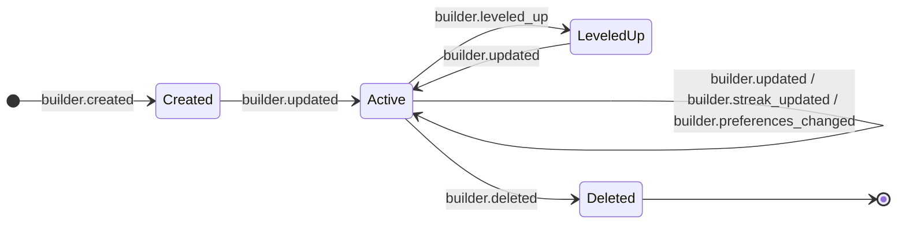
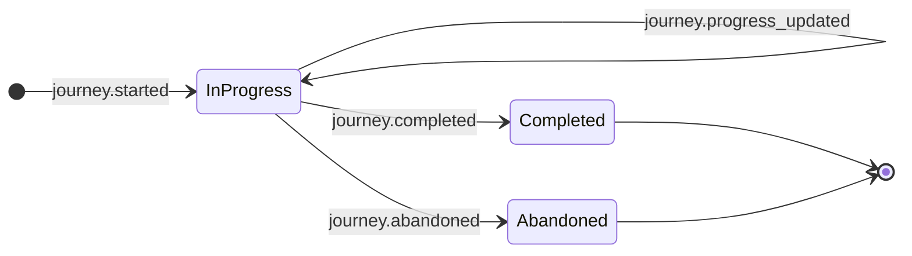
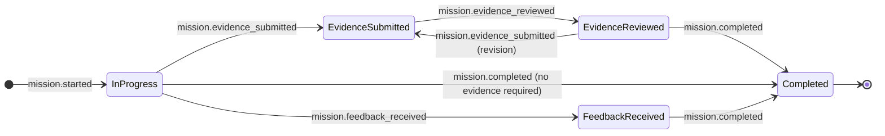
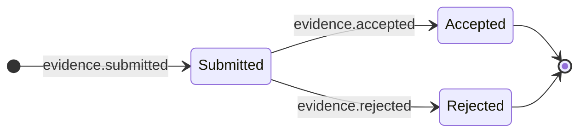
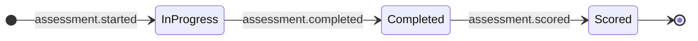
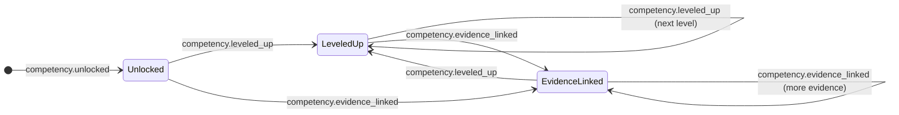
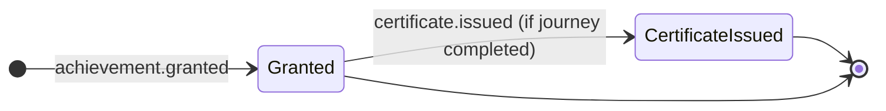
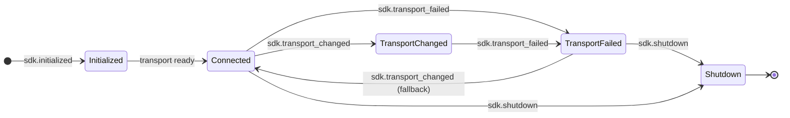
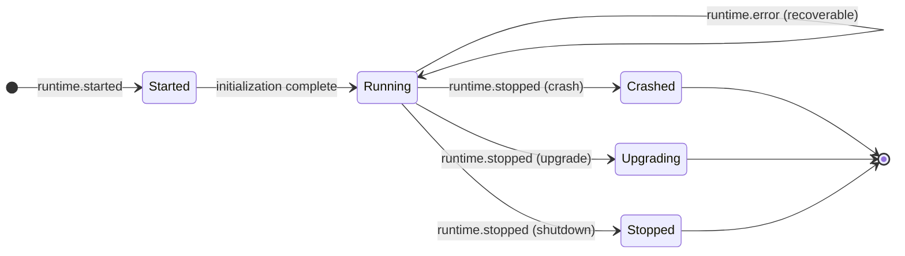
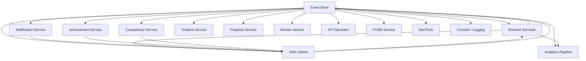

# ARCH-0026 — Domain Event Catalog

| Field | Value |
|-------|-------|
| **ID** | ARCH-0026 |
| **Name** | Domain Event Catalog |
| **Version** | 2.0 |
| **Status** | Draft |
| **Category** | Architecture |
| **Owner** | Chief Architect |
| **Derived from** | DOC-0009, ARCH-0004, ARCH-0024 |
| **Principle** | Every relevant behavior generates an event |

---

## 1. Purpose

Define every event in the ASCEND platform: origin, destination, payload, consumers, guarantees, idempotency, ordering, persistence, and versioning. This is the formal specification of the **ASCEND Event Bus** — the central nervous system through which all domain state changes, infrastructure lifecycle signals, and analytics telemetry flow.

The Event Bus guarantees:
- **Observability** — every meaningful state change produces an event
- **Traceability** — every event carries correlation and causation identifiers
- **Recoverability** — events are persisted and replayable
- **Decoupling** — producers and consumers never know each other directly

---

## 2. Event Classification

Events are classified into three tiers based on criticality, persistence requirements, and ordering guarantees:

| Tier | Category | Persistence | Ordering | Delivery | Examples |
|------|----------|-------------|----------|----------|----------|
| **Domain** | Business state change | Required — Event store (immutable) | Total order per aggregate | At-least-once | BuilderCreated, MissionStarted |
| **Infrastructure** | System lifecycle | Optional — Log only | Per-source | Best-effort | SDKInitialized, RuntimeStarted |
| **Analytics** | Telemetry & usage | Best-effort — Optional sink | None | Best-effort | PageViewed, FeatureUsed |

---

## 3. Event Envelope

Every event shares this envelope interface:

```typescript
interface DomainEvent {
  /** UUID v4 — globally unique event identifier */
  id: string

  /** Dot-notation event type, e.g. "builder.created" */
  type: string

  /** Event schema version (positive integer, monotonic) */
  version: number

  /** ISO 8601 UTC timestamp of when the event occurred */
  timestamp: string

  /** Service or component that produced the event */
  source: string

  /** UUID propagated across all events in a single operation chain */
  correlationId: string

  /** UUID of the parent event that caused this event (for causation tracing) */
  causationId?: string

  /** UUID of the builder/actor who caused this event */
  actorId?: string

  /** Type-safe payload specific to the event type */
  payload: Record<string, unknown>
}
```

### Envelope Rules

| Rule | Description |
|------|-------------|
| `id` | Must be UUID v4, generated at emission time |
| `type` | Must match `^[a-z]+\.[a-z_]+$` (category.event_name) |
| `version` | Must increment on breaking schema changes |
| `timestamp` | Must be UTC, ISO 8601, millisecond precision |
| `correlationId` | Must propagate unchanged across all chained events |
| `causationId` | Must be set to the `id` of the directly triggering event |
| `actorId` | Must be set when the event is caused by a builder action |

---

## 4. Event Catalog

### 4.1 Builder Events

| Event Name | Version | Category | Source | Consumers | Idempotent? | Ordered? | Repeatable? | Persistence |
|---|---|---|---|---|---|---|---|---|
| `builder.created` | 1 | Domain | Runtime | SDK, Analytics, Achievement, Notification | Yes | Total | No | Event store |
| `builder.updated` | 1 | Domain | Runtime | SDK, Analytics | Yes | Per-builder | Yes | Event store |
| `builder.deleted` | 1 | Domain | Runtime | SDK, Analytics, Notification | Yes | Total | No | Event store |
| `builder.leveled_up` | 1 | Domain | Runtime | SDK, Analytics, Achievement, Notification, Timeline | Yes | Total | Yes | Event store |
| `builder.streak_updated` | 1 | Domain | Runtime | SDK, Timeline | Yes | Per-builder | Yes | Event store |
| `builder.preferences_changed` | 1 | Domain | SDK | Runtime | Yes | Per-builder | Yes | Event store |

---

#### builder.created

**Payload:**

```typescript
interface BuilderCreatedPayload {
  builderId: string
  name: string
  email: string
  joinedAt: string
  initialLevel: number
  referrer?: string
}
```

**Example:**

```json
{
  "builderId": "bld_a1b2c3d4-e5f6-7890-abcd-ef1234567890",
  "name": "Ada Lovelace",
  "email": "ada@example.com",
  "joinedAt": "2026-07-20T08:00:00.000Z",
  "initialLevel": 1,
  "referrer": "bld_x9y8z7w6"
}
```

**Consumers:** SDKClient, AnalyticsPipeline, AchievementService, NotificationService
**Guarantees:**
- **Delivery:** At-least-once — consumer must handle duplicates
- **Ordering:** Total order — all consumers see events in emission order
- **Idempotency:** Yes — skip if `builderId` already exists in local state
- **Persistence:** Event store — immutable record, indefinite retention
**Versioning Notes:** v1 — initial release. Adding fields is backwards-compatible. Removing fields requires v2.

---

#### builder.updated

**Payload:**

```typescript
interface BuilderUpdatedPayload {
  builderId: string
  previousValues: Record<string, unknown>
  newValues: Record<string, unknown>
  updatedAt: string
}
```

**Example:**

```json
{
  "builderId": "bld_a1b2c3d4-e5f6-7890-abcd-ef1234567890",
  "previousValues": { "name": "Ada L." },
  "newValues": { "name": "Ada Lovelace" },
  "updatedAt": "2026-07-20T12:30:00.000Z"
}
```

**Consumers:** SDKClient, AnalyticsPipeline
**Guarantees:**
- **Delivery:** At-least-once
- **Ordering:** Per-builder — events for the same builder are ordered
- **Idempotency:** Yes — compare `updatedAt` to skip stale updates
- **Persistence:** Event store
**Versioning Notes:** v1 — initial. Payload is intentionally generic; specific fields are negotiated between source and consumers.

---

#### builder.deleted

**Payload:**

```typescript
interface BuilderDeletedPayload {
  builderId: string
  deletedAt: string
  reason?: string
}
```

**Example:**

```json
{
  "builderId": "bld_a1b2c3d4-e5f6-7890-abcd-ef1234567890",
  "deletedAt": "2026-07-20T18:00:00.000Z",
  "reason": "user_requested_account_removal"
}
```

**Consumers:** SDKClient, AnalyticsPipeline, NotificationService
**Guarantees:**
- **Delivery:** At-least-once
- **Ordering:** Total order — sentinel event, must be last
- **Idempotency:** Yes — skip if `builderId` already deleted
- **Persistence:** Event store — tombstone record
**Versioning Notes:** v1 — initial.

---

#### builder.leveled_up

**Payload:**

```typescript
interface BuilderLeveledUpPayload {
  builderId: string
  previousLevel: number
  newLevel: number
  xpAtLevel: number
  unlockedAchievements: string[]
}
```

**Example:**

```json
{
  "builderId": "bld_a1b2c3d4-e5f6-7890-abcd-ef1234567890",
  "previousLevel": 4,
  "newLevel": 5,
  "xpAtLevel": 2450,
  "unlockedAchievements": ["ach_rising_star", "ach_level_5"]
}
```

**Consumers:** SDKClient, AnalyticsPipeline, AchievementService, NotificationService, TimelineService
**Guarantees:**
- **Delivery:** At-least-once
- **Ordering:** Total order — level progression must be sequential
- **Idempotency:** Yes — compare `newLevel` against current level
- **Persistence:** Event store
**Versioning Notes:** v1 — initial.

---

#### builder.streak_updated

**Payload:**

```typescript
interface BuilderStreakUpdatedPayload {
  builderId: string
  currentStreak: number
  longestStreak: number
  lastActivityDate: string
}
```

**Example:**

```json
{
  "builderId": "bld_a1b2c3d4-e5f6-7890-abcd-ef1234567890",
  "currentStreak": 7,
  "longestStreak": 14,
  "lastActivityDate": "2026-07-20"
}
```

**Consumers:** SDKClient, TimelineService
**Guarantees:**
- **Delivery:** At-least-once
- **Ordering:** Per-builder — streak events are ordered per builder
- **Idempotency:** Yes — skip if `lastActivityDate` is not newer
- **Persistence:** Event store
**Versioning Notes:** v1 — initial.

---

#### builder.preferences_changed

**Payload:**

```typescript
interface BuilderPreferencesChangedPayload {
  builderId: string
  preferences: Record<string, unknown>
  changedAt: string
}
```

**Example:**

```json
{
  "builderId": "bld_a1b2c3d4-e5f6-7890-abcd-ef1234567890",
  "preferences": {
    "theme": "dark",
    "notifications": { "email": true, "push": false },
    "language": "pt-BR"
  },
  "changedAt": "2026-07-20T14:00:00.000Z"
}
```

**Consumers:** Runtime (applies preferences)
**Guarantees:**
- **Delivery:** At-least-once
- **Ordering:** Per-builder — preference changes are ordered per builder
- **Idempotency:** Yes — compare `changedAt` timestamp
- **Persistence:** Event store
**Versioning Notes:** v1 — initial. Payload is opaque to the bus; schema is SDK-contract specific.

---

**State Flow:**



---

### 4.2 Journey Events

| Event Name | Version | Category | Source | Consumers | Idempotent? | Ordered? | Repeatable? | Persistence |
|---|---|---|---|---|---|---|---|---|
| `journey.started` | 1 | Domain | SDK | Runtime, Analytics, Progress | Yes | Total | No | Event store |
| `journey.completed` | 1 | Domain | Runtime | SDK, Analytics, Achievement, Competency, Timeline | Yes | Total | No | Event store |
| `journey.abandoned` | 1 | Domain | SDK | Runtime, Analytics, Progress | Yes | Total | No | Event store |
| `journey.progress_updated` | 1 | Domain | Runtime | SDK, Progress | No | Per-journey | Yes | Event store |

---

#### journey.started

**Payload:**

```typescript
interface JourneyStartedPayload {
  journeyId: string
  builderId: string
  journeyName: string
  startedAt: string
  prerequisites: string[]
}
```

**Example:**

```json
{
  "journeyId": "jny_f1e2d3c4-b5a6-7890-1234-ef567890abcd",
  "builderId": "bld_a1b2c3d4-e5f6-7890-abcd-ef1234567890",
  "journeyName": "Python Fundamentals",
  "startedAt": "2026-07-20T09:00:00.000Z",
  "prerequisites": ["basic_programming_concepts"]
}
```

**Consumers:** Runtime (initializes journey state), AnalyticsPipeline, ProgressService
**Guarantees:**
- **Delivery:** At-least-once
- **Ordering:** Total order — per-journey lifecycle
- **Idempotency:** Yes — deduplicate by `(builderId, journeyId)`
- **Persistence:** Event store
**Versioning Notes:** v1 — initial.

---

#### journey.completed

**Payload:**

```typescript
interface JourneyCompletedPayload {
  journeyId: string
  builderId: string
  completedAt: string
  xpEarned: number
  competenciesAdvanced: Array<{
    competencyId: string
    name: string
    newLevel: number
  }>
  certificateId?: string
}
```

**Example:**

```json
{
  "journeyId": "jny_f1e2d3c4-b5a6-7890-1234-ef567890abcd",
  "builderId": "bld_a1b2c3d4-e5f6-7890-abcd-ef1234567890",
  "completedAt": "2026-08-15T16:30:00.000Z",
  "xpEarned": 2500,
  "competenciesAdvanced": [
    { "competencyId": "cmp_python_basics", "name": "Python Basics", "newLevel": 3 },
    { "competencyId": "cmp_algorithms", "name": "Algorithms", "newLevel": 2 }
  ],
  "certificateId": "cert_python_fundamentals_001"
}
```

**Consumers:** SDKClient, AnalyticsPipeline, AchievementService, CompetencyService, TimelineService
**Guarantees:**
- **Delivery:** At-least-once
- **Ordering:** Total order — per-journey lifecycle
- **Idempotency:** Yes — check certificate not already issued
- **Persistence:** Event store
**Versioning Notes:** v1 — initial.

---

#### journey.abandoned

**Payload:**

```typescript
interface JourneyAbandonedPayload {
  journeyId: string
  builderId: string
  abandonedAt: string
  progressPercent: number
  reason?: string
}
```

**Example:**

```json
{
  "journeyId": "jny_f1e2d3c4-b5a6-7890-1234-ef567890abcd",
  "builderId": "bld_a1b2c3d4-e5f6-7890-abcd-ef1234567890",
  "abandonedAt": "2026-08-01T11:00:00.000Z",
  "progressPercent": 45,
  "reason": "time_constraints"
}
```

**Consumers:** Runtime (marks journey as abandoned), AnalyticsPipeline, ProgressService
**Guarantees:**
- **Delivery:** At-least-once
- **Ordering:** Total order — per-journey lifecycle
- **Idempotency:** Yes — deduplicate by `(builderId, journeyId)`
- **Persistence:** Event store
**Versioning Notes:** v1 — initial.

---

#### journey.progress_updated

**Payload:**

```typescript
interface JourneyProgressUpdatedPayload {
  journeyId: string
  builderId: string
  progressPercent: number
  completedMissions: number
  totalMissions: number
  updatedAt: string
}
```

**Example:**

```json
{
  "journeyId": "jny_f1e2d3c4-b5a6-7890-1234-ef567890abcd",
  "builderId": "bld_a1b2c3d4-e5f6-7890-abcd-ef1234567890",
  "progressPercent": 60,
  "completedMissions": 6,
  "totalMissions": 10,
  "updatedAt": "2026-08-05T14:00:00.000Z"
}
```

**Consumers:** SDKClient, ProgressService
**Guarantees:**
- **Delivery:** At-least-once
- **Ordering:** Per-journey — progress updates are ordered per journey
- **Idempotency:** No — each progress update is a state delta
- **Persistence:** Event store
**Versioning Notes:** v1 — initial.

---

**State Flow:**



---

### 4.3 Mission Events

| Event Name | Version | Category | Source | Consumers | Idempotent? | Ordered? | Repeatable? | Persistence |
|---|---|---|---|---|---|---|---|---|
| `mission.started` | 1 | Domain | SDK | Runtime, Progress | Yes | Total | No | Event store |
| `mission.completed` | 1 | Domain | Runtime | SDK, Analytics, Achievement, XPCalculator, Timeline | Yes | Total | No | Event store |
| `mission.evidence_submitted` | 1 | Domain | SDK | Runtime, Review | Yes | Per-mission | Yes | Event store |
| `mission.evidence_reviewed` | 1 | Domain | Runtime | SDK, Review | Yes | Per-mission | Yes | Event store |
| `mission.feedback_received` | 1 | Domain | Runtime | SDK | No | Per-mission | Yes | Event store |

---

#### mission.started

**Payload:**

```typescript
interface MissionStartedPayload {
  missionId: string
  builderId: string
  journeyId?: string
  startedAt: string
  missionType: string
}
```

**Example:**

```json
{
  "missionId": "msn_a2b3c4d5-e6f7-8901-2345-abcdef123456",
  "builderId": "bld_a1b2c3d4-e5f6-7890-abcd-ef1234567890",
  "journeyId": "jny_f1e2d3c4-b5a6-7890-1234-ef567890abcd",
  "startedAt": "2026-07-21T10:00:00.000Z",
  "missionType": "coding_challenge"
}
```

**Consumers:** Runtime (initializes mission state), ProgressService
**Guarantees:**
- **Delivery:** At-least-once
- **Ordering:** Total order — per-mission lifecycle
- **Idempotency:** Yes — deduplicate by `(builderId, missionId)`
- **Persistence:** Event store
**Versioning Notes:** v1 — initial.

---

#### mission.completed

**Payload:**

```typescript
interface MissionCompletedPayload {
  missionId: string
  builderId: string
  journeyId?: string
  completedAt: string
  xpEarned: number
  evidenceCount: number
  feedbackCount: number
}
```

**Example:**

```json
{
  "missionId": "msn_a2b3c4d5-e6f7-8901-2345-abcdef123456",
  "builderId": "bld_a1b2c3d4-e5f6-7890-abcd-ef1234567890",
  "journeyId": "jny_f1e2d3c4-b5a6-7890-1234-ef567890abcd",
  "completedAt": "2026-07-22T14:30:00.000Z",
  "xpEarned": 500,
  "evidenceCount": 3,
  "feedbackCount": 2
}
```

**Consumers:** SDKClient, AnalyticsPipeline, AchievementService, XPCalculator, TimelineService
**Guarantees:**
- **Delivery:** At-least-once
- **Ordering:** Total order — per-mission lifecycle
- **Idempotency:** Yes — deduplicate by `(builderId, missionId)`
- **Persistence:** Event store
**Versioning Notes:** v1 — initial.

---

#### mission.evidence_submitted

**Payload:**

```typescript
interface MissionEvidenceSubmittedPayload {
  missionId: string
  builderId: string
  evidenceId: string
  submittedAt: string
}
```

**Example:**

```json
{
  "missionId": "msn_a2b3c4d5-e6f7-8901-2345-abcdef123456",
  "builderId": "bld_a1b2c3d4-e5f6-7890-abcd-ef1234567890",
  "evidenceId": "evd_11111111-2222-3333-4444-555555555555",
  "submittedAt": "2026-07-21T18:00:00.000Z"
}
```

**Consumers:** Runtime (associates evidence with mission), ReviewService
**Guarantees:**
- **Delivery:** At-least-once
- **Ordering:** Per-mission — evidence submission order is relevant
- **Idempotency:** Yes — deduplicate by `evidenceId`
- **Persistence:** Event store
**Versioning Notes:** v1 — initial.

---

#### mission.evidence_reviewed

**Payload:**

```typescript
interface MissionEvidenceReviewedPayload {
  missionId: string
  builderId: string
  evidenceId: string
  reviewedAt: string
  verdict: 'accepted' | 'rejected'
  reviewerId?: string
}
```

**Example:**

```json
{
  "missionId": "msn_a2b3c4d5-e6f7-8901-2345-abcdef123456",
  "builderId": "bld_a1b2c3d4-e5f6-7890-abcd-ef1234567890",
  "evidenceId": "evd_11111111-2222-3333-4444-555555555555",
  "reviewedAt": "2026-07-22T09:00:00.000Z",
  "verdict": "accepted",
  "reviewerId": "bld_reviewer_001"
}
```

**Consumers:** SDKClient, ReviewService
**Guarantees:**
- **Delivery:** At-least-once
- **Ordering:** Per-mission — review order is relevant per mission
- **Idempotency:** Yes — deduplicate by `(evidenceId, verdict)`
- **Persistence:** Event store
**Versioning Notes:** v1 — initial.

---

#### mission.feedback_received

**Payload:**

```typescript
interface MissionFeedbackReceivedPayload {
  missionId: string
  builderId: string
  feedbackId: string
  rating: number
  receivedAt: string
}
```

**Example:**

```json
{
  "missionId": "msn_a2b3c4d5-e6f7-8901-2345-abcdef123456",
  "builderId": "bld_a1b2c3d4-e5f6-7890-abcd-ef1234567890",
  "feedbackId": "fbk_aaaaaaaa-bbbb-cccc-dddd-eeeeeeeeeeee",
  "rating": 4,
  "receivedAt": "2026-07-22T10:00:00.000Z"
}
```

**Consumers:** SDKClient
**Guarantees:**
- **Delivery:** At-least-once
- **Ordering:** Per-mission — feedback order is relevant
- **Idempotency:** No — each feedback is a unique interaction
- **Persistence:** Event store
**Versioning Notes:** v1 — initial.

---

**State Flow:**



---

### 4.4 Evidence Events

| Event Name | Version | Category | Source | Consumers | Idempotent? | Ordered? | Repeatable? | Persistence |
|---|---|---|---|---|---|---|---|---|
| `evidence.submitted` | 1 | Domain | SDK | Runtime, Review, Notification | Yes | Per-mission | No | Event store |
| `evidence.accepted` | 1 | Domain | Runtime | SDK, Competency, Notification | Yes | Per-mission | No | Event store |
| `evidence.rejected` | 1 | Domain | Runtime | SDK, Notification | Yes | Per-mission | No | Event store |

---

#### evidence.submitted

**Payload:**

```typescript
interface EvidenceSubmittedPayload {
  evidenceId: string
  missionId: string
  builderId: string
  type: string
  contentUri: string
  contentType: string
  submittedAt: string
}
```

**Example:**

```json
{
  "evidenceId": "evd_11111111-2222-3333-4444-555555555555",
  "missionId": "msn_a2b3c4d5-e6f7-8901-2345-abcdef123456",
  "builderId": "bld_a1b2c3d4-e5f6-7890-abcd-ef1234567890",
  "type": "code_repository",
  "contentUri": "https://github.com/ada/ascend-project",
  "contentType": "application/vnd.github.v3+json",
  "submittedAt": "2026-07-21T18:00:00.000Z"
}
```

**Consumers:** Runtime (stores evidence), ReviewService, NotificationService
**Guarantees:**
- **Delivery:** At-least-once
- **Ordering:** Per-mission — evidence order within a mission is relevant
- **Idempotency:** Yes — deduplicate by `evidenceId`
- **Persistence:** Event store
**Versioning Notes:** v1 — initial.

---

#### evidence.accepted

**Payload:**

```typescript
interface EvidenceAcceptedPayload {
  evidenceId: string
  missionId: string
  builderId: string
  acceptedAt: string
  reviewedBy: string
  score?: number
}
```

**Example:**

```json
{
  "evidenceId": "evd_11111111-2222-3333-4444-555555555555",
  "missionId": "msn_a2b3c4d5-e6f7-8901-2345-abcdef123456",
  "builderId": "bld_a1b2c3d4-e5f6-7890-abcd-ef1234567890",
  "acceptedAt": "2026-07-22T09:00:00.000Z",
  "reviewedBy": "bld_reviewer_001",
  "score": 85
}
```

**Consumers:** SDKClient, CompetencyService, NotificationService
**Guarantees:**
- **Delivery:** At-least-once
- **Ordering:** Per-mission — acceptance order is relevant
- **Idempotency:** Yes — deduplicate by `(evidenceId, "accepted")`
- **Persistence:** Event store
**Versioning Notes:** v1 — initial.

---

#### evidence.rejected

**Payload:**

```typescript
interface EvidenceRejectedPayload {
  evidenceId: string
  missionId: string
  builderId: string
  rejectedAt: string
  reviewedBy: string
  reason: string
}
```

**Example:**

```json
{
  "evidenceId": "evd_11111111-2222-3333-4444-555555555555",
  "missionId": "msn_a2b3c4d5-e6f7-8901-2345-abcdef123456",
  "builderId": "bld_a1b2c3d4-e5f6-7890-abcd-ef1234567890",
  "rejectedAt": "2026-07-22T09:15:00.000Z",
  "reviewedBy": "bld_reviewer_001",
  "reason": "evidence_does_not_demonstrate_required_skill"
}
```

**Consumers:** SDKClient, NotificationService
**Guarantees:**
- **Delivery:** At-least-once
- **Ordering:** Per-mission — rejection order is relevant
- **Idempotency:** Yes — deduplicate by `(evidenceId, "rejected")`
- **Persistence:** Event store
**Versioning Notes:** v1 — initial.

---

**State Flow:**



---

### 4.5 Assessment Events

| Event Name | Version | Category | Source | Consumers | Idempotent? | Ordered? | Repeatable? | Persistence |
|---|---|---|---|---|---|---|---|---|
| `assessment.started` | 1 | Domain | SDK | Runtime, Analytics, Progress | Yes | Total | No | Event store |
| `assessment.completed` | 1 | Domain | Runtime | SDK, Analytics, Competency, Achievement, Timeline | Yes | Total | No | Event store |
| `assessment.scored` | 1 | Domain | Runtime | SDK, Achievement | Yes | Per-assessment | No | Event store |

---

#### assessment.started

**Payload:**

```typescript
interface AssessmentStartedPayload {
  assessmentId: string
  builderId: string
  missionId?: string
  assessmentType: string
  startedAt: string
  timeLimit?: number
}
```

**Example:**

```json
{
  "assessmentId": "asmt_c3d4e5f6-a7b8-9012-3456-abcdef789012",
  "builderId": "bld_a1b2c3d4-e5f6-7890-abcd-ef1234567890",
  "missionId": "msn_a2b3c4d5-e6f7-8901-2345-abcdef123456",
  "assessmentType": "quiz",
  "startedAt": "2026-07-22T08:00:00.000Z",
  "timeLimit": 3600
}
```

**Consumers:** Runtime (initializes assessment session), AnalyticsPipeline, ProgressService
**Guarantees:**
- **Delivery:** At-least-once
- **Ordering:** Total order — per-assessment lifecycle
- **Idempotency:** Yes — deduplicate by `(builderId, assessmentId)`
- **Persistence:** Event store
**Versioning Notes:** v1 — initial.

---

#### assessment.completed

**Payload:**

```typescript
interface AssessmentCompletedPayload {
  assessmentId: string
  builderId: string
  missionId?: string
  score: number
  total: number
  passed: boolean
  completedAt: string
}
```

**Example:**

```json
{
  "assessmentId": "asmt_c3d4e5f6-a7b8-9012-3456-abcdef789012",
  "builderId": "bld_a1b2c3d4-e5f6-7890-abcd-ef1234567890",
  "missionId": "msn_a2b3c4d5-e6f7-8901-2345-abcdef123456",
  "score": 18,
  "total": 20,
  "passed": true,
  "completedAt": "2026-07-22T09:00:00.000Z"
}
```

**Consumers:** SDKClient, AnalyticsPipeline, CompetencyService, AchievementService, TimelineService
**Guarantees:**
- **Delivery:** At-least-once
- **Ordering:** Total order — per-assessment lifecycle
- **Idempotency:** Yes — deduplicate by `(builderId, assessmentId)`
- **Persistence:** Event store
**Versioning Notes:** v1 — initial.

---

#### assessment.scored

**Payload:**

```typescript
interface AssessmentScoredPayload {
  assessmentId: string
  builderId: string
  score: number
  total: number
  percentage: number
  passed: boolean
  gradedAt: string
  graderId?: string
}
```

**Example:**

```json
{
  "assessmentId": "asmt_c3d4e5f6-a7b8-9012-3456-abcdef789012",
  "builderId": "bld_a1b2c3d4-e5f6-7890-abcd-ef1234567890",
  "score": 18,
  "total": 20,
  "percentage": 90,
  "passed": true,
  "gradedAt": "2026-07-22T09:05:00.000Z",
  "graderId": "grading_engine_v2"
}
```

**Consumers:** SDKClient, AchievementService
**Guarantees:**
- **Delivery:** At-least-once
- **Ordering:** Per-assessment — scoring is the final step
- **Idempotency:** Yes — deduplicate by `(builderId, assessmentId)`
- **Persistence:** Event store
**Versioning Notes:** v1 — initial.

---

**State Flow:**



---

### 4.6 Competency Events

| Event Name | Version | Category | Source | Consumers | Idempotent? | Ordered? | Repeatable? | Persistence |
|---|---|---|---|---|---|---|---|---|
| `competency.unlocked` | 1 | Domain | Runtime | SDK, Analytics, Achievement, Notification, Timeline | Yes | Total | No | Event store |
| `competency.leveled_up` | 1 | Domain | Runtime | SDK, Analytics, Achievement, Notification, Timeline | Yes | Total | Yes | Event store |
| `competency.evidence_linked` | 1 | Domain | Runtime | SDK, Timeline | Yes | Per-competency | Yes | Event store |

---

#### competency.unlocked

**Payload:**

```typescript
interface CompetencyUnlockedPayload {
  competencyId: string
  builderId: string
  name: string
  level: number
  unlockedAt: string
  evidenceIds: string[]
}
```

**Example:**

```json
{
  "competencyId": "cmp_python_basics",
  "builderId": "bld_a1b2c3d4-e5f6-7890-abcd-ef1234567890",
  "name": "Python Basics",
  "level": 1,
  "unlockedAt": "2026-07-22T09:00:00.000Z",
  "evidenceIds": ["evd_11111111-2222-3333-4444-555555555555"]
}
```

**Consumers:** SDKClient, AnalyticsPipeline, AchievementService, NotificationService, TimelineService
**Guarantees:**
- **Delivery:** At-least-once
- **Ordering:** Total order — competency lifecycle is globally ordered
- **Idempotency:** Yes — check if competency already unlocked for builder
- **Persistence:** Event store
**Versioning Notes:** v1 — initial.

---

#### competency.leveled_up

**Payload:**

```typescript
interface CompetencyLeveledUpPayload {
  competencyId: string
  builderId: string
  name: string
  previousLevel: number
  newLevel: number
  leveledUpAt: string
}
```

**Example:**

```json
{
  "competencyId": "cmp_python_basics",
  "builderId": "bld_a1b2c3d4-e5f6-7890-abcd-ef1234567890",
  "name": "Python Basics",
  "previousLevel": 2,
  "newLevel": 3,
  "leveledUpAt": "2026-08-15T16:30:00.000Z"
}
```

**Consumers:** SDKClient, AnalyticsPipeline, AchievementService, NotificationService, TimelineService
**Guarantees:**
- **Delivery:** At-least-once
- **Ordering:** Total order — level progression must be sequential
- **Idempotency:** Yes — compare `newLevel` against current level
- **Persistence:** Event store
**Versioning Notes:** v1 — initial.

---

#### competency.evidence_linked

**Payload:**

```typescript
interface CompetencyEvidenceLinkedPayload {
  competencyId: string
  builderId: string
  evidenceId: string
  linkedAt: string
}
```

**Example:**

```json
{
  "competencyId": "cmp_python_basics",
  "builderId": "bld_a1b2c3d4-e5f6-7890-abcd-ef1234567890",
  "evidenceId": "evd_22222222-3333-4444-5555-666666666666",
  "linkedAt": "2026-08-15T16:31:00.000Z"
}
```

**Consumers:** SDKClient, TimelineService
**Guarantees:**
- **Delivery:** At-least-once
- **Ordering:** Per-competency — evidence linking order is relevant
- **Idempotency:** Yes — deduplicate by `(competencyId, evidenceId)`
- **Persistence:** Event store
**Versioning Notes:** v1 — initial.

---

**State Flow:**



---

### 4.7 Achievement Events

| Event Name | Version | Category | Source | Consumers | Idempotent? | Ordered? | Repeatable? | Persistence |
|---|---|---|---|---|---|---|---|---|
| `achievement.granted` | 1 | Domain | Runtime | SDK, Analytics, Notification, Profile, Timeline | Yes | Total | No | Event store |
| `certificate.issued` | 1 | Domain | Runtime | SDK, Analytics, Profile, Timeline | Yes | Total | No | Event store |

---

#### achievement.granted

**Payload:**

```typescript
interface AchievementGrantedPayload {
  achievementId: string
  builderId: string
  name: string
  category: string
  rarity: 'common' | 'uncommon' | 'rare' | 'epic' | 'legendary'
  grantedAt: string
  description?: string
}
```

**Example:**

```json
{
  "achievementId": "ach_rising_star",
  "builderId": "bld_a1b2c3d4-e5f6-7890-abcd-ef1234567890",
  "name": "Rising Star",
  "category": "milestone",
  "rarity": "rare",
  "grantedAt": "2026-07-22T09:00:00.000Z",
  "description": "Completed first assessment with 90%+ score"
}
```

**Consumers:** SDKClient, AnalyticsPipeline, NotificationService, ProfileService, TimelineService
**Guarantees:**
- **Delivery:** At-least-once
- **Ordering:** Total order — achievement lifecycle is globally ordered
- **Idempotency:** Yes — deduplicate by `(builderId, achievementId)`
- **Persistence:** Event store
**Versioning Notes:** v1 — initial. `rarity` enum may be extended with new values in a minor version.

---

#### certificate.issued

**Payload:**

```typescript
interface CertificateIssuedPayload {
  certificateId: string
  builderId: string
  journeyId: string
  certificateType: string
  issuedAt: string
  expiresAt?: string
  competencies: string[]
}
```

**Example:**

```json
{
  "certificateId": "cert_python_fundamentals_001",
  "builderId": "bld_a1b2c3d4-e5f6-7890-abcd-ef1234567890",
  "journeyId": "jny_f1e2d3c4-b5a6-7890-1234-ef567890abcd",
  "certificateType": "journey_completion",
  "issuedAt": "2026-08-15T16:30:00.000Z",
  "expiresAt": "2028-08-15T16:30:00.000Z",
  "competencies": ["cmp_python_basics", "cmp_algorithms"]
}
```

**Consumers:** SDKClient, AnalyticsPipeline, ProfileService, TimelineService
**Guarantees:**
- **Delivery:** At-least-once
- **Ordering:** Total order — certificate issuance is globally ordered
- **Idempotency:** Yes — deduplicate by `certificateId`
- **Persistence:** Event store
**Versioning Notes:** v1 — initial.

---

**State Flow:**



---

### 4.8 SDK Events

| Event Name | Version | Category | Source | Consumers | Idempotent? | Ordered? | Repeatable? | Persistence |
|---|---|---|---|---|---|---|---|---|
| `sdk.initialized` | 1 | Infrastructure | SDK | Console, DevTools | No | Per-session | No | Log only |
| `sdk.shutdown` | 1 | Infrastructure | SDK | Console, DevTools | No | Per-session | No | Log only |
| `sdk.transport_changed` | 1 | Infrastructure | SDK | DevTools | No | Per-session | Yes | Log only |
| `sdk.transport_failed` | 1 | Infrastructure | SDK | DevTools | No | Per-session | Yes | Log only |

---

#### sdk.initialized

**Payload:**

```typescript
interface SDKInitializedPayload {
  clientId: string
  sdkVersion: string
  platform: string
  initializedAt: string
  transport: string
}
```

**Example:**

```json
{
  "clientId": "sdk_web_001",
  "sdkVersion": "1.2.3",
  "platform": "web",
  "initializedAt": "2026-07-20T08:00:00.000Z",
  "transport": "websocket"
}
```

**Consumers:** Console (startup log), DevTools (session tracking)
**Guarantees:**
- **Delivery:** Best-effort
- **Ordering:** Per-session — initialization is the first event
- **Idempotency:** No — each SDK session is a new instance
- **Persistence:** Log only — 7 day retention
**Versioning Notes:** v1 — initial. `platform` values are open-ended.

---

#### sdk.shutdown

**Payload:**

```typescript
interface SDKShutdownPayload {
  clientId: string
  uptimeMs: number
  eventsEmitted: number
  shutdownAt: string
  reason?: string
}
```

**Example:**

```json
{
  "clientId": "sdk_web_001",
  "uptimeMs": 36000000,
  "eventsEmitted": 142,
  "shutdownAt": "2026-07-20T18:00:00.000Z",
  "reason": "tab_closed"
}
```

**Consumers:** Console (shutdown log), DevTools (session end)
**Guarantees:**
- **Delivery:** Best-effort
- **Ordering:** Per-session — shutdown is the last event
- **Idempotency:** No — each shutdown is unique per session
- **Persistence:** Log only — 7 day retention
**Versioning Notes:** v1 — initial.

---

#### sdk.transport_changed

**Payload:**

```typescript
interface SDKTransportChangedPayload {
  clientId: string
  from: string
  to: string
  timestamp: string
}
```

**Example:**

```json
{
  "clientId": "sdk_web_001",
  "from": "websocket",
  "to": "longpoll",
  "timestamp": "2026-07-20T09:15:00.000Z"
}
```

**Consumers:** DevTools (transport debugging)
**Guarantees:**
- **Delivery:** Best-effort
- **Ordering:** Per-session — transport changes are sequential
- **Idempotency:** No — each transport change is unique
- **Persistence:** Log only — 7 day retention
**Versioning Notes:** v1 — initial.

---

#### sdk.transport_failed

**Payload:**

```typescript
interface SDKTransportFailedPayload {
  clientId: string
  transport: string
  errorCode: string
  errorMessage: string
  timestamp: string
  retryCount: number
}
```

**Example:**

```json
{
  "clientId": "sdk_web_001",
  "transport": "websocket",
  "errorCode": "ERR_CONNECTION_LOST",
  "errorMessage": "WebSocket connection closed unexpectedly",
  "timestamp": "2026-07-20T09:14:00.000Z",
  "retryCount": 3
}
```

**Consumers:** DevTools (error diagnostics)
**Guarantees:**
- **Delivery:** Best-effort
- **Ordering:** Per-session — failures are sequential
- **Idempotency:** No — each failure event is unique
- **Persistence:** Log only — 7 day retention
**Versioning Notes:** v1 — initial.

---

**State Flow:**



---

### 4.9 Infrastructure Events

| Event Name | Version | Category | Source | Consumers | Idempotent? | Ordered? | Repeatable? | Persistence |
|---|---|---|---|---|---|---|---|---|
| `runtime.started` | 1 | Infrastructure | Runtime | Console, HealthCheck | No | Per-instance | No | Log only |
| `runtime.stopped` | 1 | Infrastructure | Runtime | Console, HealthCheck | No | Per-instance | No | Log only |
| `runtime.error` | 1 | Infrastructure | Runtime | Console, SDK, Alerting | No | Per-instance | Yes | Log only |

---

#### runtime.started

**Payload:**

```typescript
interface RuntimeStartedPayload {
  instanceId: string
  runtimeVersion: string
  startedAt: string
  mode: 'server' | 'cli' | 'embedded'
  configHash: string
}
```

**Example:**

```json
{
  "instanceId": "rt_001",
  "runtimeVersion": "1.0.0",
  "startedAt": "2026-07-20T08:00:00.000Z",
  "mode": "server",
  "configHash": "sha256:a1b2c3d4e5f6..."
}
```

**Consumers:** Console (startup log), HealthCheck (uptime tracking)
**Guarantees:**
- **Delivery:** Best-effort
- **Ordering:** Per-instance — started is the first event
- **Idempotency:** No — each instance start is unique
- **Persistence:** Log only — 30 day retention
**Versioning Notes:** v1 — initial.

---

#### runtime.stopped

**Payload:**

```typescript
interface RuntimeStoppedPayload {
  instanceId: string
  uptimeMs: number
  stoppedAt: string
  reason: 'shutdown' | 'crash' | 'upgrade'
}
```

**Example:**

```json
{
  "instanceId": "rt_001",
  "uptimeMs": 86400000,
  "stoppedAt": "2026-07-21T08:00:00.000Z",
  "reason": "upgrade"
}
```

**Consumers:** Console (shutdown log), HealthCheck (deregister)
**Guarantees:**
- **Delivery:** Best-effort
- **Ordering:** Per-instance — stopped is the last event
- **Idempotency:** No — each instance stop is unique
- **Persistence:** Log only — 30 day retention
**Versioning Notes:** v1 — initial.

---

#### runtime.error

**Payload:**

```typescript
interface RuntimeErrorPayload {
  instanceId: string
  code: string
  message: string
  recoverable: boolean
  timestamp: string
  stackTrace?: string
}
```

**Example:**

```json
{
  "instanceId": "rt_001",
  "code": "ERR_STORE_CONNECTION",
  "message": "Failed to connect to event store after 3 retries",
  "recoverable": true,
  "timestamp": "2026-07-20T10:30:00.000Z",
  "stackTrace": "RuntimeError: ..."
}
```

**Consumers:** Console (error log), SDK (error notification), Alerting (pager)
**Guarantees:**
- **Delivery:** Best-effort
- **Ordering:** Per-instance — errors are sequential
- **Idempotency:** No — each error occurrence is unique
- **Persistence:** Log only — 30 day retention
**Versioning Notes:** v1 — initial.

---

**State Flow:**



---

## 5. Event Guarantees

| Guarantee | Domain Events | Infrastructure Events | Analytics Events |
|---|---|---|---|
| **Delivery** | At-least-once | Best-effort | Best-effort |
| **Ordering** | Total order per aggregate | Per-source | None |
| **Persistence** | Event store (immutable) | Log only | Optional sink |
| **Idempotency** | Required — idempotency key | Not required | Not required |
| **Retention** | Indefinite | 30 days | 90 days |
| **Schema version** | Required — must be declared | Optional | Optional |
| **Replayability** | Full event replay supported | Not replayable | Not replayable |
| **Deduplication window** | By idempotency key, no expiry | None | None |
| **Latency SLA** | < 100ms p99 | < 500ms p99 | Best-effort |
| **Security** | Encrypted at rest, signed | Plaintext | Anonymized |

---

## 6. Event Consumer Map

The following diagram shows how events flow from the Event Store to all consuming subsystems:



### Consumer Responsibilities

| Consumer | Subscribes To | Action |
|---|---|---|
| **Runtime Services** | All Domain events | Process state changes, enforce rules, emit downstream events |
| **SDK Clients** | All Domain events + runtime.error | Update UI, show notifications, maintain local cache |
| **Analytics Pipeline** | All Domain events + analytics events | Aggregate metrics, generate reports, feed dashboards |
| **AchievementService** | builder.leveled_up, journey.completed, mission.completed, assessment.completed, competency.unlocked | Evaluate and grant achievements |
| **CompetencyService** | journey.completed, evidence.accepted, assessment.completed | Update competency levels and evidence links |
| **NotificationService** | builder.created, builder.deleted, builder.leveled_up, evidence.submitted, evidence.accepted, evidence.rejected, competency.unlocked, competency.leveled_up, achievement.granted | Send push/email/in-app notifications |
| **TimelineService** | builder.leveled_up, journey.completed, mission.completed, assessment.completed, competency.unlocked, competency.leveled_up, competency.evidence_linked, achievement.granted, certificate.issued | Build builder activity timeline |
| **ProgressService** | journey.started, journey.abandoned, journey.progress_updated, mission.started, assessment.started | Track completion progress |
| **ReviewService** | mission.evidence_submitted, mission.evidence_reviewed, evidence.submitted | Manage evidence review workflow |
| **XPCalculator** | mission.completed | Calculate experience points |
| **ProfileService** | achievement.granted, certificate.issued | Update builder profile and portfolio |
| **DevTools** | All SDK events, runtime.error | Developer debugging and diagnostics |
| **Console / Logging** | All Infrastructure events | System logging |

---

## 7. Event Rules

| Rule | Description |
|---|---|
| **E1** | Every domain mutation must publish exactly one event — no silent state changes |
| **E2** | Events are immutable once stored — no editing, no deleting, no updating |
| **E3** | Consumers must handle duplicate delivery — every consumer implements idempotency via the event `id` or a domain-specific key |
| **E4** | Event schema must be versioned — the `version` field in every envelope is mandatory |
| **E5** | Breaking schema changes require a new event type version — adding required fields, removing fields, or changing types constitutes a breaking change |
| **E6** | Infrastructure events never cross process boundaries — they are local to the emitting process |
| **E7** | `correlationId` must propagate across all chained events — every event triggered as a consequence of another event must carry the same `correlationId` |
| **E8** | Consumers must not block event emission — event publishing is asynchronous and non-blocking |
| **E9** | Event payloads must be serializable to JSON — no functions, no circular references, no undefined values |
| **E10** | Events must not contain secrets — tokens, passwords, API keys, and personal identifiable information (PII) beyond the builder identity must never appear in event payloads |

---

## 8. Versioning Strategy

### 8.1 Schema Version

Every event carries a `version` field in its envelope. This version refers to the **event schema**, not the application version.

| Version Change | Allowed? | Examples |
|---|---|---|
| Adding optional fields | Yes — minor change | Adding `referrer` to `BuilderCreatedPayload` |
| Adding required fields | No — must increment version | Cannot add required field without v2 |
| Removing fields | No — must increment version | Deprecate, do not remove |
| Changing field types | No — must increment version | `string` → `number` requires v2 |
| Renaming fields | No — must increment version | Use new field, deprecate old |

### 8.2 Version Numbering

- Schema versions start at **1** and increment by **1** for breaking changes
- Version is an **integer** — no semver (no minor/patch within event schema)
- Consumers must process events of any version they understand
- Producers must not emit events with a schema version consumers cannot handle
- An event may be marked `deprecated` but must never be removed from the store

### 8.3 Backward Compatibility

A new version is backward-compatible if:

1. All previously existing fields remain present with the same types
2. No field is removed (deprecated fields are kept for a grace period)
3. New fields are optional or have sensible defaults

### 8.4 Schema Registry

All event schemas are registered in the **ASCEND Schema Registry**:

```typescript
interface SchemaRegistryEntry {
  eventType: string
  version: number
  status: 'active' | 'deprecated' | 'sunset'
  schema: Record<string, unknown> // JSON Schema definition
  deprecationNotice?: string
  sunsetAt?: string
}
```

### 8.5 Migration Flow

```
event.type = "builder.created"  version = 2 (new)
event.type = "builder.created"  version = 1 (old, still in store)

Consumer reads version 1 → uses legacy parser
Consumer reads version 2 → uses current parser
Consumer must support both during migration window
```

---

## 9. Definition of Done

ARCH-0026 is approved when:

- [ ] All domain events cataloged (Builder, Journey, Mission, Evidence, Assessment, Competency, Achievement)
- [ ] All SDK events cataloged
- [ ] All Infrastructure events cataloged
- [ ] Event envelope defined with all fields (id, type, version, timestamp, source, correlationId, causationId, actorId, payload)
- [ ] Event classification table defines three tiers (Domain, Infrastructure, Analytics)
- [ ] Each event has a formal TypeScript payload interface
- [ ] Each event has a real JSON example with realistic data
- [ ] Each event has consumers listed
- [ ] Each event has guarantees documented (delivery, ordering, idempotency, persistence, versioning)
- [ ] Each event has a versioning note
- [ ] Per-category summary table includes all 9 columns (Event Name, Version, Category, Source, Consumers, Idempotent?, Ordered?, Repeatable?, Persistence)
- [ ] Each category has a Mermaid state diagram showing event flow
- [ ] Event Guarantees table covers delivery, ordering, persistence, idempotency, retention, schema version, replayability, deduplication, latency SLA, security
- [ ] Event Consumer Map includes Mermaid graph and consumer responsibility table
- [ ] 10 event rules defined (E1–E10)
- [ ] Versioning strategy documented with schema registry and migration flow

---

## 10. Change History

| Version | Date | Author | Change |
|---------|------|--------|--------|
| 2.0 | 2026-07-20 | Chief Architect | Complete rewrite — formal Event Bus specification. Added per-category Mermaid state diagrams, SDK Events section, Infrastructure Events section, enhanced guarantees table, consumer responsibilities, versioning strategy with schema registry, E8–E10 rules, JSON examples, expanded payload interfaces |
| 1.0 | 2026-07-20 | Chief Architect | Initial version — OPERAÇÃO APOLLO |
