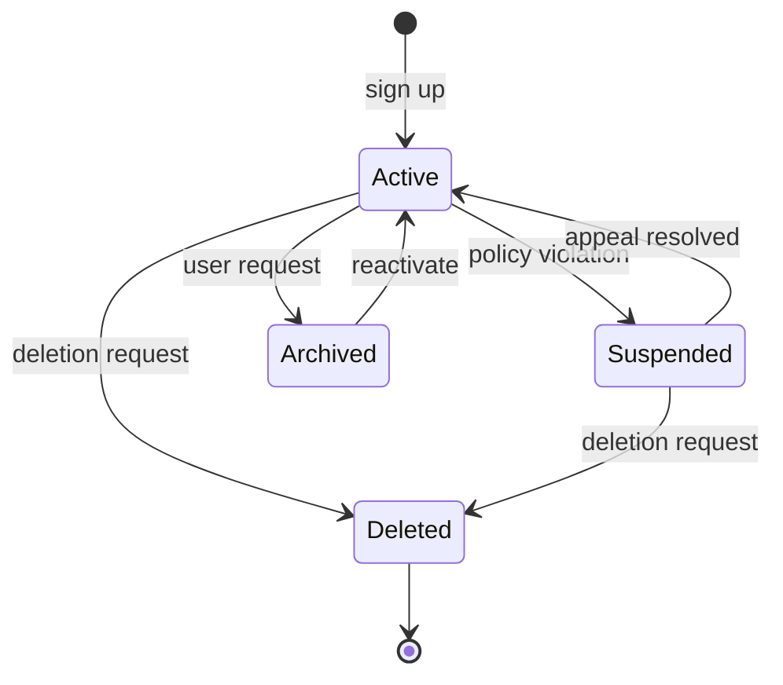
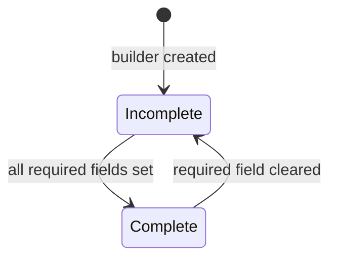
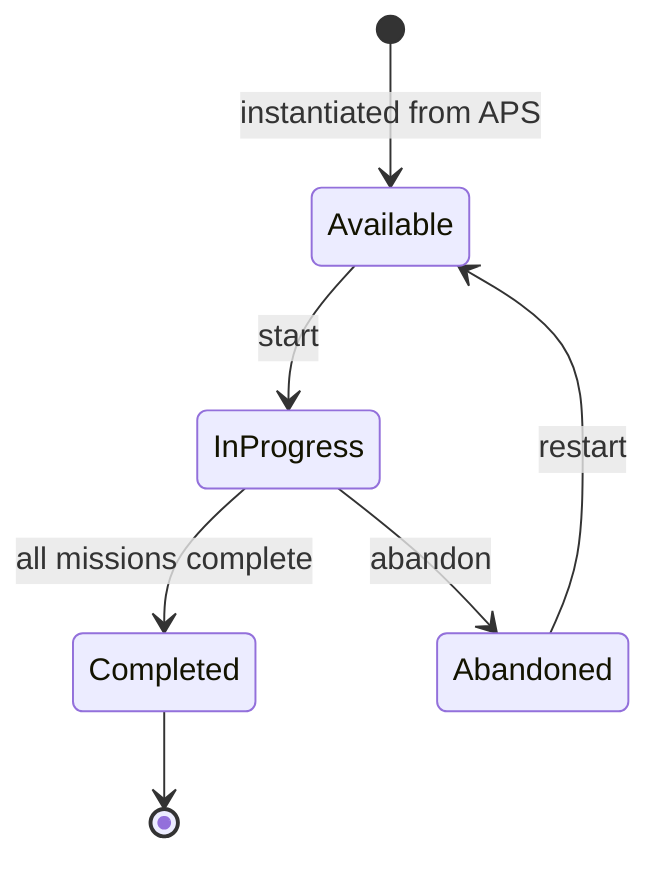
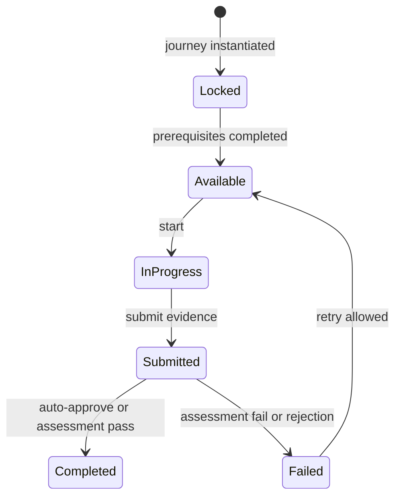
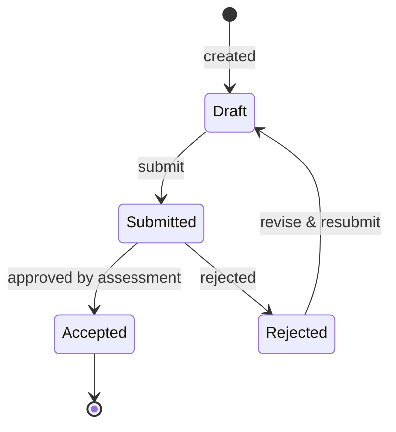
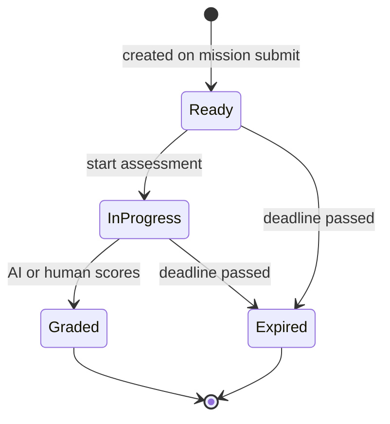
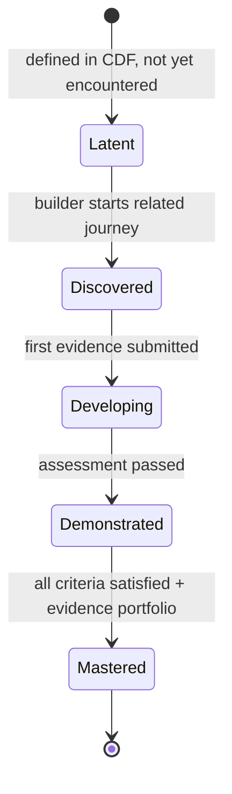
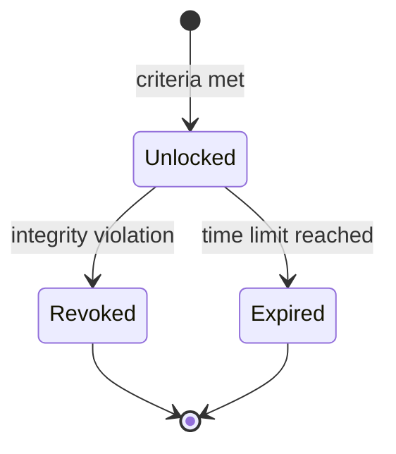

# ARCH-0028 — API Resource Model

| Field | Value |
|-------|-------|
| **ID** | ARCH-0028 |
| **Name** | API Resource Model |
| **Version** | 2.0 |
| **Status** | Draft |
| **Category** | Architecture |
| **Owner** | Chief Architect |
| **Derived from** | ARCH-0015, ARCH-0024, ARCH-0027 |
| **Principle** | Content is data, API is contract |

---

## 1. Purpose

Define the canonical resource model **before any implementation**. Every resource is modeled as a first-class domain concept — with its identity, relationships, lifecycle, state machine, ownership, and versioning strategy. Endpoints flow from the model, not the reverse.

---

## 2. API Design Principles

| Principle | Description |
|-----------|-------------|
| **Resource-oriented** | Everything is a resource, identified by URL |
| **Model-first** | Endpoints are derived from the resource model, not invented ad-hoc |
| **Canonical types** | All resources use types from `@ascend/contracts` |
| **Consistent pagination** | Every list endpoint uses the same pagination pattern |
| **Consistent errors** | Every error uses the same error envelope |
| **Versionless (for now)** | No URL versioning; evolve via additive changes |
| **Idempotent mutations** | PUT for full replace, PATCH for partial |

---

## 3. URL Structure

```
/api/v1/
├── /builder                    # Current builder (self)
├── /builders                   # Other builders (public)
│   └── /:builderId
│       ├── /profile
│       ├── /competencies
│       ├── /achievements
│       ├── /timeline
│       └── /stats
├── /journeys
│   ├── /:journeyId
│   │   ├── /progress
│   │   ├── /tree
│   │   └── /missions
│   └── /:journeyId/missions
├── /missions
│   └── /:missionId
│       ├── /evidence
│       └── /feedback
├── /evidence
│   └── /:evidenceId
├── /assessments
│   └── /:assessmentId
│       ├── /start
│       ├── /submit
│       └── /rubric
├── /competencies
│   └── /:competencyId
├── /achievements
│   ├── /badges
│   └── /certificates
│       └── /:certificateId/download
├── /profile
│   ├── /settings
│   └── /preferences
├── /health
├── /events                     # SSE endpoint
└── /export
```

---

## 4. Common Patterns

### 4.1 Pagination

```typescript
// Request
interface PaginationParams {
  limit?: number                 // max 100, default 20
  offset?: number                // default 0
  sort?: string                  // field name
  order?: 'asc' | 'desc'        // default 'desc'
}

// Response wrapper
interface PaginatedResponse<T> {
  data: T[]
  pagination: {
    total: number
    limit: number
    offset: number
    hasMore: boolean
  }
}
```

### 4.2 Response Envelope

```typescript
interface ApiResponse<T> {
  success: boolean
  data: T
  timestamp: string
}
```

### 4.3 Error Envelope

```typescript
interface ApiError {
  success: false
  error: {
    code: string                 // e.g. "VALIDATION_ERROR"
    message: string
    details?: unknown
    correlationId: string
    timestamp: string
  }
}
```

### 4.4 Resource Identifiers

All resource IDs are UUID v4, represented as strings.

```typescript
type BuilderId = string
type ProfileId = string
type JourneyId = string
type MissionId = string
type EvidenceId = string
type AssessmentId = string
type CompetencyId = string
type AchievementId = string
type CertificateId = string
type BadgeId = string
type SettingsId = string
```

---

## 5. Per-Resource Modeling

### 5.1 Builder

The **Builder** is the root entity. Every resource in the system belongs to exactly one Builder. The Builder represents a human being who is developing competencies.

#### Identifier

```typescript
type BuilderId = string   // UUID v4
```

#### Relationships

| Direction | Resource | Cardinality | Notes |
|-----------|----------|-------------|-------|
| **self** | — | 1 | The Builder is the root |
| **has** | Profile | 1 | Extension of the Builder |
| **has** | Journey | 0..N | Learning journeys |
| **has** | Mission | 0..N | Individual missions |
| **has** | Evidence | 0..N | Submitted evidence |
| **has** | Assessment | 0..N | Assessment sessions |
| **has** | Competency | 0..N | Competency records |
| **has** | Achievement | 0..N | Earned achievements |
| **has** | Settings | 1 | User preferences & configuration |

#### Mutable Fields

| Field | Type | Notes |
|-------|------|-------|
| `name` | `string` | Display name |
| `avatar` | `string?` | URL to avatar image |
| `bio` | `string?` | Short biography |

#### Read-only Fields

| Field | Type | Notes |
|-------|------|-------|
| `id` | `BuilderId` | Immutable |
| `level` | `number` | Derived from XP |
| `xp` | `XPMetrics` | Computed by engine |
| `streak` | `StreakMetrics` | Computed by engine |
| `joinedAt` | `string` | ISO 8601, set at creation |
| `updatedAt` | `string` | ISO 8601, set on mutation |

#### Lifecycle

```
Created on first sign-up → Active → Archived or Deleted
```

#### State Machine



#### Ownership

The Builder owns **all** their resources. No resource exists without a parent Builder. The Builder is always the authenticated principal.

#### Versioning

Builder is not versioned as a content package. Changes are tracked via `updatedAt`. Previous states are not retained — the current state is the source of truth.

#### Endpoints

```
GET    /api/v1/builder           → BuilderProfile
PATCH  /api/v1/builder           → BuilderProfile
DELETE /api/v1/builder           → void
```

```typescript
type BuilderProfile = {
  id: BuilderId
  name: string
  avatar?: string
  bio?: string
  level: number
  xp: XPMetrics
  streak: StreakMetrics
  joinedAt: string
  updatedAt: string
}

// PATCH request body
type BuilderPatch = {
  name?: string
  avatar?: string
  bio?: string
}
```

```
GET    /api/v1/builder/competencies    → CompetencyNode[]
GET    /api/v1/builder/achievements    → AchievementList
GET    /api/v1/builder/achievements/badges → Badge[]
GET    /api/v1/builder/achievements/certificates → Certificate[]
GET    /api/v1/builder/achievements/certificates/:id/download → Blob
GET    /api/v1/builder/timeline        → PaginatedResponse<TimelineEntry>
GET    /api/v1/builder/stats           → BuilderStats

GET    /api/v1/builders/:builderId/profile        → PublicProfile
GET    /api/v1/builders/:builderId/competencies   → CompetencyNode[]
GET    /api/v1/builders/:builderId/achievements   → AchievementList
GET    /api/v1/builders/:builderId/timeline       → PaginatedResponse<TimelineEntry>
GET    /api/v1/builders/:builderId/stats          → BuilderStats
```

---

### 5.2 Profile

The **Profile** extends the Builder with additional personal information. It is always a 1:1 extension of a Builder and follows the same lifecycle.

#### Identifier

```typescript
type ProfileId = BuilderId   // Same UUID as the owning Builder
```

#### Relationships

| Direction | Resource | Cardinality | Notes |
|-----------|----------|-------------|-------|
| **extends** | Builder | 1 | Profile is a child of Builder |
| **contains** | Settings | 1 | Configuration sub-resource |

#### Mutable Fields

| Field | Type | Notes |
|-------|------|-------|
| `displayName` | `string` | Public-facing name |
| `tagline` | `string?` | Short personal motto or focus |
| `website` | `string?` | Personal URL |
| `location` | `string?` | Free-text location |
| `socialLinks` | `SocialLink[]` | Array of platform + URL |
| `avatar` | `string?` | URL to profile image |
| `coverImage` | `string?` | URL to cover image |

#### Read-only Fields

| Field | Type | Notes |
|-------|------|-------|
| `id` | `ProfileId` | Same as Builder ID |
| `builderId` | `BuilderId` | Owning builder |
| `joinedAt` | `string` | ISO 8601 |
| `updatedAt` | `string` | ISO 8601 |

#### Lifecycle

Bound to the Builder lifecycle. Deletion of Builder triggers deletion of Profile.

#### State Machine



Required fields: `displayName`. All others are optional.

#### Ownership

Owned by the Builder. Only the owning Builder can modify their profile.

#### Versioning

Not versioned independently. Tracked via `updatedAt` on Profile.

#### Endpoints

```
GET    /api/v1/builders/:builderId/profile   → PublicProfile
```

```typescript
type PublicProfile = {
  id: ProfileId
  builderId: BuilderId
  displayName: string
  tagline?: string
  website?: string
  location?: string
  socialLinks: SocialLink[]
  avatar?: string
  coverImage?: string
  joinedAt: string
  updatedAt: string
}

type SocialLink = {
  platform: 'github' | 'linkedin' | 'twitter' | 'website' | 'other'
  url: string
}
```

The self-builder can also access their full profile (includes private fields) at `/api/v1/builder`.

---

### 5.3 Journey

A **Journey** is a structured learning path composed of Missions. Journeys are loaded from APS (ASCEND Package Specification) packages and instantiated for a Builder. A Journey represents a container of Missions that collectively build one or more Competencies.

#### Identifier

```typescript
type JourneyId = string   // UUID v4
```

#### Relationships

| Direction | Resource | Cardinality | Notes |
|-----------|----------|-------------|-------|
| **belongs to** | Builder | 1 | Owning builder |
| **contains** | Mission | 1..N | Ordered missions |
| **builds** | Competency | 1..N | Competencies this journey develops |
| **rewards** | Achievement | 0..N | Achievements earned on completion |
| **derived from** | APS Package | 1 | Source package reference |

#### Mutable Fields

| Field | Type | Notes |
|-------|------|-------|
| `title` | `string?` | Override display title |
| `description` | `string?` | Override description |
| `customGoals` | `string[]?` | Builder-defined goals |

#### Read-only Fields

| Field | Type | Notes |
|-------|------|-------|
| `id` | `JourneyId` | Immutable |
| `builderId` | `BuilderId` | Owning builder |
| `packageRef` | `string` | `{namespace}/{package}@{version}` |
| `state` | `JourneyState` | Current lifecycle state |
| `missions` | `MissionSummary[]` | Contained missions |
| `progress` | `JourneyProgress` | Aggregate progress |
| `startedAt` | `string?` | ISO 8601 |
| `completedAt` | `string?` | ISO 8601 |
| `createdAt` | `string` | ISO 8601 |
| `updatedAt` | `string` | ISO 8601 |

#### Lifecycle

A Journey is created from an APS package, started by the Builder, worked through, and eventually completed or abandoned.

```
Instantiated → Available → InProgress → Completed | Abandoned
```

#### State Machine



Transitions:

| From | To | Trigger | Conditions |
|------|----|---------|------------|
| Available | InProgress | `start` | Builder has capacity |
| InProgress | Completed | system | All missions in `Completed` state |
| InProgress | Abandoned | `abandon` | Builder explicitly abandons |
| Abandoned | Available | `restart` | Only allowed if journey content unchanged |

#### Ownership

Owned by the Builder who instantiated it. The Journey instance is private to that Builder.

#### Versioning

The Journey content is defined by the APS package it was instantiated from. Version pinning follows `{package}@{version}`. If a new version of the APS package is published, existing Journey instances are NOT upgraded automatically — the Builder may choose to migrate.

```typescript
type JourneyVersion = {
  packageRef: string      // e.g. "ascend/core@1.2.0"
  upgradedAt?: string    // If migrated from an earlier version
}
```

#### Endpoints

```
GET    /api/v1/journeys                       → PaginatedResponse<JourneySummary>
GET    /api/v1/journeys/:journeyId            → JourneyDetail
POST   /api/v1/journeys/:journeyId/start      → JourneyDetail
POST   /api/v1/journeys/:journeyId/abandon    → void
POST   /api/v1/journeys/:journeyId/restart    → JourneyDetail
GET    /api/v1/journeys/:journeyId/progress   → JourneyProgress
GET    /api/v1/journeys/:journeyId/tree       → JourneyNode[]
```

```typescript
type JourneyState = 'Available' | 'InProgress' | 'Completed' | 'Abandoned'

type JourneySummary = {
  id: JourneyId
  title: string
  state: JourneyState
  progress: JourneyProgress
  missionCount: number
  completedCount: number
  startedAt?: string
  completedAt?: string
}

type JourneyDetail = JourneySummary & {
  builderId: BuilderId
  packageRef: string
  description: string
  customGoals?: string[]
  missions: MissionSummary[]
  competencies: CompetencySummary[]
  createdAt: string
  updatedAt: string
}

type JourneyProgress = {
  overall: number              // 0.0 – 1.0
  byMission: {
    missionId: MissionId
    title: string
    progress: number
  }[]
}

type JourneyNode = {
  missionId: MissionId
  title: string
  order: number
  state: MissionState
  prerequisites: MissionId[]
  children: JourneyNode[]
}
```

---

### 5.4 Mission

A **Mission** is a single competency-building unit within a Journey. It defines a concrete task or challenge that the Builder must complete, often requiring evidence submission.

#### Identifier

```typescript
type MissionId = string   // UUID v4
```

#### Relationships

| Direction | Resource | Cardinality | Notes |
|-----------|----------|-------------|-------|
| **belongs to** | Journey | 1 | Parent journey |
| **belongs to** | Builder | 1 | Via journey |
| **has** | Evidence | 0..N | Submitted evidence |
| **triggers** | Assessment | 0..1 | Optional assessment |
| **depends on** | Mission | 0..N | Prerequisite missions |

#### Mutable Fields

| Field | Type | Notes |
|-------|------|-------|
| `notes` | `string?` | Builder's personal notes |
| `reflection` | `string?` | Post-completion reflection |

#### Read-only Fields

| Field | Type | Notes |
|-------|------|-------|
| `id` | `MissionId` | Immutable |
| `journeyId` | `JourneyId` | Parent journey |
| `builderId` | `BuilderId` | Owning builder |
| `title` | `string` | From APS package |
| `description` | `string` | From APS package |
| `order` | `number` | Position in journey |
| `state` | `MissionState` | Current lifecycle state |
| `evidence` | `EvidenceRecord[]` | Submitted evidence |
| `feedback` | `Feedback[]` | AI or peer feedback |
| `startedAt` | `string?` | ISO 8601 |
| `completedAt` | `string?` | ISO 8601 |
| `createdAt` | `string` | ISO 8601 |
| `updatedAt` | `string` | ISO 8601 |

#### Lifecycle

A Mission starts locked (prerequisites not met), becomes available, moves through in-progress and submitted states, and ends completed or failed.

```
Locked → Available → InProgress → Submitted → Completed | Failed
```

#### State Machine



Transitions:

| From | To | Trigger | Conditions |
|------|----|---------|------------|
| Locked | Available | system | All prerequisite missions are `Completed` |
| Available | InProgress | `start` | Builder actively starts |
| InProgress | Submitted | `submit` | Evidence is submitted |
| Submitted | Completed | system | Assessment passes OR evidence auto-approved |
| Submitted | Failed | system | Assessment fails OR evidence rejected |
| Failed | Available | `retry` | Max retries not exceeded |

#### Ownership

Owned by the Builder through the parent Journey.

#### Versioning

Mission content is part of the APS package version. Missions are not versioned independently. If the APS package changes, existing missions remain on their instantiated version unless the Builder migrates the parent Journey.

#### Endpoints

```
GET    /api/v1/journeys/:journeyId/missions   → MissionSummary[]
GET    /api/v1/missions/:missionId            → MissionDetail
POST   /api/v1/missions/:missionId/start      → MissionDetail
POST   /api/v1/missions/:missionId/submit     → MissionResult
POST   /api/v1/missions/:missionId/evidence   → EvidenceRecord
GET    /api/v1/missions/:missionId/evidence   → EvidenceRecord[]
GET    /api/v1/missions/:missionId/feedback   → Feedback[]
POST   /api/v1/missions/:missionId/complete   → MissionResult
```

```typescript
type MissionState = 'Locked' | 'Available' | 'InProgress' | 'Submitted' | 'Completed' | 'Failed'

type MissionSummary = {
  id: MissionId
  journeyId: JourneyId
  title: string
  order: number
  state: MissionState
  progress: number        // 0.0 – 1.0
}

type MissionDetail = MissionSummary & {
  builderId: BuilderId
  description: string
  instructions: string
  prerequisites: MissionId[]
  evidence: EvidenceRecord[]
  feedback: Feedback[]
  notes?: string
  reflection?: string
  startedAt?: string
  completedAt?: string
  createdAt: string
  updatedAt: string
}

type MissionResult = {
  missionId: MissionId
  state: MissionState
  xpEarned: number
  feedback: Feedback[]
}

type Feedback = {
  id: string
  type: 'ai' | 'peer' | 'system'
  message: string
  rating?: number
  createdAt: string
}
```

---

### 5.5 Evidence

**Evidence** is the unit of proof in ASCEND. Every competency claim must be backed by evidence. Evidence is attached to a Mission and can be used in Assessments. It may be a file upload, a text entry, a URL, or a combination.

#### Identifier

```typescript
type EvidenceId = string   // UUID v4
```

#### Relationships

| Direction | Resource | Cardinality | Notes |
|-----------|----------|-------------|-------|
| **belongs to** | Builder | 1 | Uploading builder |
| **belongs to** | Mission | 1 | Parent mission |
| **used in** | Assessment | 0..N | Assessments referencing this evidence |
| **attachments** | File | 0..N | Uploaded files |

#### Mutable Fields

| Field | Type | Notes |
|-------|------|-------|
| `title` | `string` | Human-readable title |
| `description` | `string?` | Optional description |
| `content` | `string?` | Text content (for text-based evidence) |
| `urls` | `string[]` | Associated URLs |
| `tags` | `string[]` | Free-form tags |

#### Read-only Fields

| Field | Type | Notes |
|-------|------|-------|
| `id` | `EvidenceId` | Immutable |
| `builderId` | `BuilderId` | Owning builder |
| `missionId` | `MissionId` | Parent mission |
| `state` | `EvidenceState` | Current state |
| `files` | `FileAttachment[]` | Uploaded files with metadata |
| `submittedAt` | `string` | ISO 8601 |
| `reviewedAt` | `string?` | ISO 8601 |
| `createdAt` | `string` | ISO 8601 |
| `updatedAt` | `string` | ISO 8601 |

#### Lifecycle

Evidence starts as a draft, is submitted for review, and is either accepted (counts toward competency) or rejected (needs revision).

```
Draft → Submitted → Accepted | Rejected
```

#### State Machine



Transitions:

| From | To | Trigger | Conditions |
|------|----|---------|------------|
| Draft | Submitted | `submit` | Evidence is complete |
| Submitted | Accepted | system | Assessment passes validation |
| Submitted | Rejected | system | Assessment fails |
| Rejected | Draft | `revise` | Builder edits and resubmits |

#### Ownership

Owned by the Builder who created it. Evidence is private until attached to a competency claim.

#### Versioning

Evidence is not versioned. Previous submissions are replaced on revision. The audit trail stores original submission timestamps.

#### Endpoints

```
GET    /api/v1/evidence                       → PaginatedResponse<EvidenceRecord>
GET    /api/v1/evidence/:evidenceId           → EvidenceRecord
POST   /api/v1/evidence                       → EvidenceRecord
PATCH  /api/v1/evidence/:evidenceId           → EvidenceRecord
DELETE /api/v1/evidence/:evidenceId           → void
POST   /api/v1/evidence/:evidenceId/submit    → EvidenceRecord
POST   /api/v1/evidence/:evidenceId/revise    → EvidenceRecord
```

```typescript
type EvidenceState = 'Draft' | 'Submitted' | 'Accepted' | 'Rejected'

type EvidenceRecord = {
  id: EvidenceId
  builderId: BuilderId
  missionId: MissionId
  title: string
  description?: string
  content?: string
  urls: string[]
  tags: string[]
  state: EvidenceState
  files: FileAttachment[]
  submittedAt: string
  reviewedAt?: string
  createdAt: string
  updatedAt: string
}

type FileAttachment = {
  id: string
  filename: string
  mimeType: string
  sizeBytes: number
  url: string
}

// POST /api/v1/evidence
type CreateEvidenceRequest = {
  missionId: MissionId
  title: string
  description?: string
  content?: string
  urls?: string[]
  tags?: string[]
}
```

---

### 5.6 Assessment

An **Assessment** evaluates submitted evidence against a rubric to determine whether a competency has been demonstrated. Assessments can be AI-driven, peer-reviewed, or self-assessed depending on the APS package configuration.

#### Identifier

```typescript
type AssessmentId = string   // UUID v4
```

#### Relationships

| Direction | Resource | Cardinality | Notes |
|-----------|----------|-------------|-------|
| **belongs to** | Builder | 1 | Assessed builder |
| **evaluates** | Evidence | 1..N | Evidence being assessed |
| **references** | Mission | 1 | Triggering mission |
| **produces** | Competency | 0..1 | Competency record if passed |
| **governed by** | Rubric | 1 | Scoring rubric |

#### Mutable Fields

| Field | Type | Notes |
|-------|------|-------|
| — | — | Assessments are immutable once created |

#### Read-only Fields

| Field | Type | Notes |
|-------|------|-------|
| `id` | `AssessmentId` | Immutable |
| `builderId` | `BuilderId` | Assessed builder |
| `missionId` | `MissionId` | Triggering mission |
| `evidenceIds` | `EvidenceId[]` | Evidence under evaluation |
| `state` | `AssessmentState` | Current state |
| `rubric` | `Rubric` | Scoring rubric used |
| `score` | `number?` | Final score (0.0 – 1.0) |
| `passed` | `boolean?` | Whether competency was demonstrated |
| `feedback` | `string?` | Assessment summary feedback |
| `startedAt` | `string?` | ISO 8601 |
| `completedAt` | `string?` | ISO 8601 |
| `expiresAt` | `string?` | ISO 8601 deadline |
| `createdAt` | `string` | ISO 8601 |

#### Lifecycle

An Assessment is created when a Mission is submitted. It moves through evaluation states and ends with a pass/fail result. If not completed by the deadline, it expires.

```
Ready → InProgress → Graded | Expired
```

#### State Machine



Transitions:

| From | To | Trigger | Conditions |
|------|----|---------|------------|
| Ready | InProgress | `start` | Assessment session begins |
| InProgress | Graded | system | All rubric criteria scored |
| Ready | Expired | system | Deadline reached |
| InProgress | Expired | system | Deadline reached |

#### Ownership

Owned by the Builder being assessed. Assessment results are private to the Builder.

#### Versioning

The Rubric used for the Assessment is versioned as part of the APS package. The Assessment record retains a snapshot of the Rubric at time of evaluation.

```typescript
type Rubric = {
  version: string
  criteria: RubricCriterion[]
}

type RubricCriterion = {
  id: string
  name: string
  description: string
  weight: number         // 0.0 – 1.0, must sum to 1.0
  score: number?         // 0.0 – 1.0, set during grading
  feedback?: string
}
```

#### Endpoints

```
GET    /api/v1/assessments                    → PaginatedResponse<AssessmentSummary>
GET    /api/v1/assessments/:assessmentId      → AssessmentDetail
POST   /api/v1/assessments/:assessmentId/start → AssessmentSession
POST   /api/v1/assessments/:assessmentId/submit → AssessmentResult
GET    /api/v1/assessments/:assessmentId/rubric → Rubric
```

```typescript
type AssessmentState = 'Ready' | 'InProgress' | 'Graded' | 'Expired'

type AssessmentSummary = {
  id: AssessmentId
  missionId: MissionId
  state: AssessmentState
  score?: number
  passed?: boolean
  startedAt?: string
  completedAt?: string
}

type AssessmentDetail = AssessmentSummary & {
  builderId: BuilderId
  evidenceIds: EvidenceId[]
  rubric: Rubric
  feedback?: string
  expiresAt?: string
  createdAt: string
}

type AssessmentSession = {
  id: AssessmentId
  state: 'InProgress'
  rubric: Rubric
  startedAt: string
}

type AssessmentResult = {
  id: AssessmentId
  state: 'Graded'
  score: number
  passed: boolean
  feedback: string
  completedAt: string
  xpEarned: number
}
```

---

### 5.7 Competency

A **Competency** is a demonstrable skill or knowledge area. Competency records track the Builder's progress toward mastery. Competencies are defined in CDF packages and instantiated per Builder when first encountered.

#### Identifier

```typescript
type CompetencyId = string   // UUID v4
```

#### Relationships

| Direction | Resource | Cardinality | Notes |
|-----------|----------|-------------|-------|
| **belongs to** | Builder | 1 | Owning builder |
| **built by** | Journey | 0..N | Journeys that develop this competency |
| **demonstrated by** | Assessment | 0..N | Assessments that validate progress |
| **unlocks** | Achievement | 0..N | Achievements tied to mastery level |
| **parent** | Competency | 0..1 | Parent in competency tree |
| **children** | Competency | 0..N | Sub-competencies |
| **defined by** | CDF Package | 1 | Source package reference |

#### Mutable Fields

| Field | Type | Notes |
|-------|------|-------|
| — | — | Competency records are system-managed |

#### Read-only Fields

| Field | Type | Notes |
|-------|------|-------|
| `id` | `CompetencyId` | Immutable |
| `builderId` | `BuilderId` | Owning builder |
| `cdfRef` | `string` | `{namespace}/{package}/{competencyId}` |
| `title` | `string` | From CDF package |
| `description` | `string` | From CDF package |
| `category` | `string` | Technical, Behavioral, Domain, etc. |
| `state` | `CompetencyState` | Current mastery stage |
| `progress` | `number` | 0.0 – 1.0 |
| `journeys` | `JourneySummary[]` | Contributing journeys |
| `assessments` | `AssessmentSummary[]` | Completed assessments |
| `discoveredAt` | `string?` | ISO 8601 |
| `masteredAt` | `string?` | ISO 8601 |
| `createdAt` | `string` | ISO 8601 |
| `updatedAt` | `string` | ISO 8601 |

#### Lifecycle

A Competency starts latent (undiscovered), becomes discovered when the Builder first engages with related content, progresses through developing and demonstrated stages, and culminates in mastery.

```
Latent → Discovered → Developing → Demonstrated → Mastered
```

#### State Machine



Transitions:

| From | To | Trigger | Conditions |
|------|----|---------|------------|
| Latent | Discovered | system | Builder interacts with related content |
| Discovered | Developing | system | First evidence submitted for this competency |
| Developing | Demonstrated | system | Assessment passes with score >= threshold |
| Demonstrated | Mastered | system | Multiple assessments + portfolio review passed |

#### Ownership

Owned by the Builder. Competency records are private until the Builder chooses to share them.

#### Versioning

The Competency definition is versioned via the CDF package. The Builder's competency record tracks which version was used for each assessment.

```typescript
type CompetencyVersion = {
  cdfRef: string
  assessedAtVersion: string   // CDF package version at time of assessment
}
```

#### Endpoints

```
GET    /api/v1/competencies                   → PaginatedResponse<CompetencySummary>
GET    /api/v1/competencies/:competencyId     → CompetencyDetail
```

```typescript
type CompetencyState = 'Latent' | 'Discovered' | 'Developing' | 'Demonstrated' | 'Mastered'

type CompetencySummary = {
  id: CompetencyId
  title: string
  category: string
  state: CompetencyState
  progress: number
}

type CompetencyDetail = CompetencySummary & {
  builderId: BuilderId
  cdfRef: string
  description: string
  parentId?: CompetencyId
  children: CompetencySummary[]
  journeys: JourneySummary[]
  assessments: AssessmentSummary[]
  discoveredAt?: string
  masteredAt?: string
  createdAt: string
  updatedAt: string
}
```

---

### 5.8 Achievement

An **Achievement** is a recognition awarded to a Builder when they reach a milestone. Achievements include badges (granular, frequent) and certificates (formal, infrequent).

#### Identifier

```typescript
type AchievementId = string    // UUID v4
type BadgeId = string          // UUID v4
type CertificateId = string    // UUID v4
```

#### Relationships

| Direction | Resource | Cardinality | Notes |
|-----------|----------|-------------|-------|
| **belongs to** | Builder | 1 | Recipient |
| **awarded for** | Competency | 0..1 | Competency milestone |
| **awarded for** | Journey | 0..1 | Journey completion |
| **awarded for** | Mission | 0..N | Mission streak or milestone |

#### Mutable Fields

| Field | Type | Notes |
|-------|------|-------|
| — | — | Achievements are system-awarded and immutable |

#### Read-only Fields

| Field | Type | Notes |
|-------|------|-------|
| `id` | `AchievementId / BadgeId / CertificateId` | Immutable |
| `builderId` | `BuilderId` | Recipient |
| `type` | `'badge' \| 'certificate'` | Achievement class |
| `title` | `string` | Achievement name |
| `description` | `string` | What was achieved |
| `icon` | `string?` | Icon or badge image URL |
| `criteria` | `string` | How it was earned |
| `state` | `AchievementState` | Current state |
| `earnedAt` | `string` | ISO 8601 |
| `expiresAt` | `string?` | ISO 8601, if time-limited |
| `createdAt` | `string` | ISO 8601 |

#### Lifecycle

An Achievement is earned (unlocked) and may be revoked under certain conditions (e.g., content integrity violation). Certificates may expire.

```
Unlocked → Revoked | Expired
```

#### State Machine



Transitions:

| From | To | Trigger | Conditions |
|------|----|---------|------------|
| Unlocked | Revoked | system | Integrity check fails |
| Unlocked | Expired | system | Expiry date passed |

#### Ownership

Owned by the Builder. Achievements are visible on the public profile by default.

#### Versioning

Achievement definitions are part of the CDF package. The earned record is a snapshot of the definition at time of award. Certificates include a versioned template reference.

#### Endpoints

```
GET    /api/v1/achievements                   → PaginatedResponse<Achievement>
GET    /api/v1/achievements/badges             → Badge[]
GET    /api/v1/achievements/certificates       → Certificate[]
GET    /api/v1/achievements/certificates/:certificateId/download → Blob
```

```typescript
type AchievementState = 'Unlocked' | 'Revoked' | 'Expired'

type Achievement = {
  id: AchievementId
  builderId: BuilderId
  type: 'badge' | 'certificate'
  title: string
  description: string
  icon?: string
  criteria: string
  state: AchievementState
  earnedAt: string
  expiresAt?: string
  createdAt: string
}

type Badge = Achievement & {
  type: 'badge'
  category: string
  rarity: 'common' | 'uncommon' | 'rare' | 'legendary'
}

type Certificate = Achievement & {
  type: 'certificate'
  templateVersion: string
  issuedBy: string
  downloadUrl: string
}
```

---

### 5.9 Settings

**Settings** store the Builder's application configuration and preferences. Unlike other resources, Settings has no state machine — it is purely a bag of mutable key/value pairs.

#### Identifier

```typescript
type SettingsId = BuilderId   // Same UUID as the owning Builder
```

#### Relationships

| Direction | Resource | Cardinality | Notes |
|-----------|----------|-------------|-------|
| **belongs to** | Builder | 1 | Owning builder |
| **belongs to** | Profile | 1 | Via profile |

#### Mutable Fields

| Field | Type | Notes |
|-------|------|-------|
| `theme` | `'light' \| 'dark' \| 'system'` | UI theme |
| `language` | `string` | Locale code, default `'en'` |
| `timezone` | `string` | IANA timezone |
| `notifications` | `NotificationPreferences` | Push/email notification config |
| `privacy` | `PrivacySettings` | Profile visibility controls |
| `accessibility` | `AccessibilityPreferences` | A11y settings |

#### Read-only Fields

| Field | Type | Notes |
|-------|------|-------|
| `id` | `SettingsId` | Same as Builder ID |
| `builderId` | `BuilderId` | Owning builder |
| `updatedAt` | `string` | ISO 8601 |

#### Lifecycle

Settings are created when the Builder is created. They persist for the lifetime of the Builder and have no terminal state. Deletion of Builder cascades to Settings.

#### State Machine

None. Settings is a data bag, not a stateful resource.

#### Ownership

Owned by the Builder. Only the owning Builder can read or modify their settings.

#### Versioning

Not versioned. Only the current state is meaningful. Changes are tracked via `updatedAt`.

#### Endpoints

```
GET    /api/v1/profile/settings               → UserSettings
PATCH  /api/v1/profile/settings               → UserSettings
GET    /api/v1/profile/preferences            → UserPreferences
PATCH  /api/v1/profile/preferences            → UserPreferences
```

```typescript
type UserSettings = {
  id: SettingsId
  builderId: BuilderId
  theme: 'light' | 'dark' | 'system'
  language: string
  timezone: string
  notifications: NotificationPreferences
  privacy: PrivacySettings
  accessibility: AccessibilityPreferences
  updatedAt: string
}

type NotificationPreferences = {
  email: boolean
  push: boolean
  weeklyDigest: boolean
  achievementAlerts: boolean
  journeyReminders: boolean
}

type PrivacySettings = {
  profileVisible: boolean
  showJourneys: boolean
  showAchievements: boolean
  showCompetencies: boolean
}

type AccessibilityPreferences = {
  reducedMotion: boolean
  highContrast: boolean
  fontSize: 'small' | 'medium' | 'large'
}

// PATCH request body
type SettingsPatch = {
  theme?: 'light' | 'dark' | 'system'
  language?: string
  timezone?: string
  notifications?: Partial<NotificationPreferences>
  privacy?: Partial<PrivacySettings>
  accessibility?: Partial<AccessibilityPreferences>
}

type UserPreferences = {
  onboardingComplete: boolean
  seenFeatures: string[]
  dismissedAlerts: string[]
  lastActiveJourneyId?: JourneyId
}
```

---

## 6. Health Endpoint

```
GET    /api/v1/health                         → HealthReport
```

```typescript
interface HealthReport {
  status: 'healthy' | 'degraded' | 'unhealthy'
  version: string
  uptime: number
  timestamp: string
  checks: {
    database: boolean
    runtime: boolean
    cache: boolean
  }
}
```

---

## 7. Events (SSE)

```
GET    /api/v1/events                         → EventSource (SSE)
```

Server-Sent Events stream. Each event follows the domain event envelope.

```typescript
// SSE event format
event: mission.completed
data: {"missionId":"...","builderId":"...","xpEarned":150}
```

Supported event types:

| Event | Payload | Trigger |
|-------|---------|---------|
| `journey.started` | `{ journeyId, builderId }` | Journey started |
| `journey.completed` | `{ journeyId, builderId, xpEarned }` | All missions done |
| `journey.abandoned` | `{ journeyId, builderId }` | Journey abandoned |
| `mission.started` | `{ missionId, journeyId, builderId }` | Mission started |
| `mission.submitted` | `{ missionId, builderId }` | Evidence submitted |
| `mission.completed` | `{ missionId, builderId, xpEarned }` | Mission passed |
| `mission.failed` | `{ missionId, builderId }` | Mission failed |
| `evidence.submitted` | `{ evidenceId, missionId, builderId }` | Evidence submitted |
| `evidence.accepted` | `{ evidenceId, builderId }` | Evidence approved |
| `evidence.rejected` | `{ evidenceId, builderId, reason }` | Evidence rejected |
| `assessment.started` | `{ assessmentId, builderId }` | Assessment begins |
| `assessment.graded` | `{ assessmentId, builderId, passed, score }` | Assessment complete |
| `competency.demonstrated` | `{ competencyId, builderId }` | Competency level up |
| `competency.mastered` | `{ competencyId, builderId }` | Mastery achieved |
| `achievement.unlocked` | `{ achievementId, builderId, type, title }` | Badge or certificate earned |

---

## 8. Export

```
GET    /api/v1/export                         → BuilderExport (JSON download)
```

Returns the full Builder export as defined in ARCH-0027. Includes all resources owned by the Builder.

```typescript
type BuilderExport = {
  builder: BuilderProfile
  profile: PublicProfile
  settings: UserSettings
  journeys: JourneyDetail[]
  missions: MissionDetail[]
  evidence: EvidenceRecord[]
  assessments: AssessmentDetail[]
  competencies: CompetencyDetail[]
  achievements: Achievement[]
  exportedAt: string
  formatVersion: '2.0'
}
```

---

## 9. HTTP Status Codes

| Code | Usage |
|------|-------|
| 200 | Success (GET, PATCH) |
| 201 | Created (POST) |
| 204 | No Content (DELETE) |
| 400 | Bad Request (validation error) |
| 401 | Unauthenticated |
| 403 | Forbidden |
| 404 | Not Found |
| 409 | Conflict (idempotency, duplicate) |
| 422 | Unprocessable Entity (validation) |
| 429 | Too Many Requests |
| 500 | Internal Server Error |
| 503 | Service Unavailable |

---

## 10. API Resource Rules

| Rule | Description |
|------|-------------|
| **R1** | Every response uses the canonical envelope |
| **R2** | Every error uses the canonical error format |
| **R3** | Every list endpoint supports pagination |
| **R4** | IDs are always UUID v4 strings |
| **R5** | Dates are always ISO 8601 strings |
| **R6** | Mutations return the updated resource |
| **R7** | Unknown fields in requests are ignored (forward compat) |
| **R8** | No HTML, no XML — only JSON |
| **R9** | Every resource models its lifecycle as a documented state machine |

---

## 11. Definition of Done

ARCH-0028 aprovado quando:

- [ ] URL structure documented for all resources
- [ ] Pagination pattern defined
- [ ] Response envelope defined
- [ ] Error envelope defined
- [ ] Every resource has its Identifier, Relationships, Mutable Fields, Read-only Fields documented
- [ ] Every resource has a Lifecycle and State Machine documented with Mermaid diagrams
- [ ] Every resource has Ownership and Versioning strategy documented
- [ ] All resource endpoints documented with request/response types
- [ ] Health endpoint specified
- [ ] SSE endpoint with event catalog specified
- [ ] Export endpoint specified
- [ ] HTTP status code map complete
- [ ] 9 API resource rules defined (R1–R9)
- [ ] Resource model is protocol-agnostic (models the domain, not the HTTP protocol)

---

## 12. Change History

| Version | Date | Author | Change |
|---------|------|--------|--------|
| 1.0 | 2026-07-20 | Chief Architect | Initial version — OPERAÇÃO APOLLO |
| 2.0 | 2026-07-20 | Chief Architect | Rewritten with per-resource domain modeling (state machines, relationships, ownership, versioning) — ADOÇÃO v2 |
