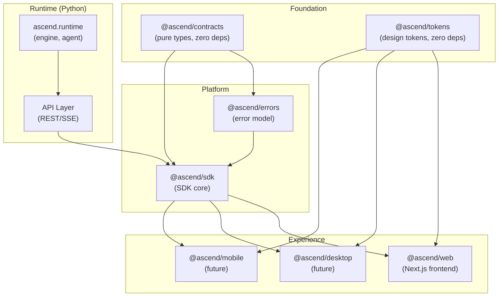
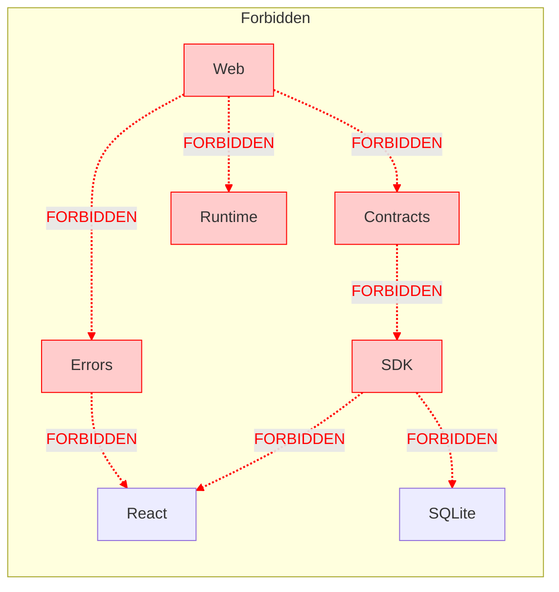
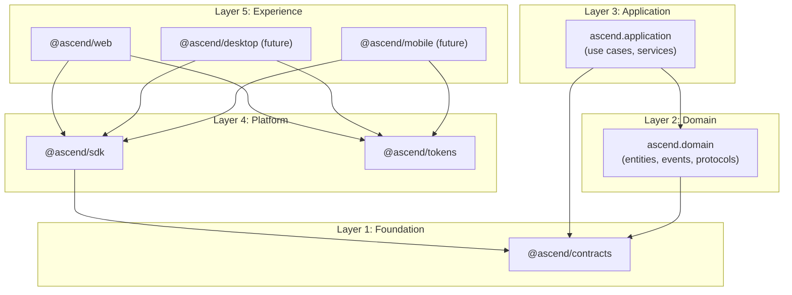
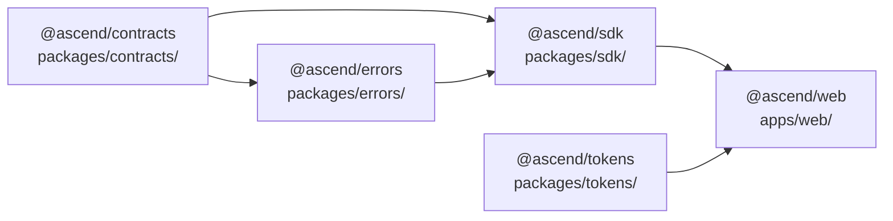
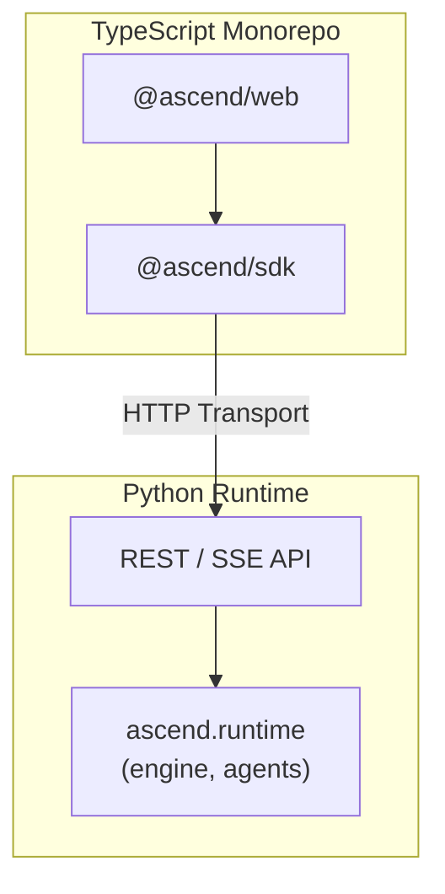
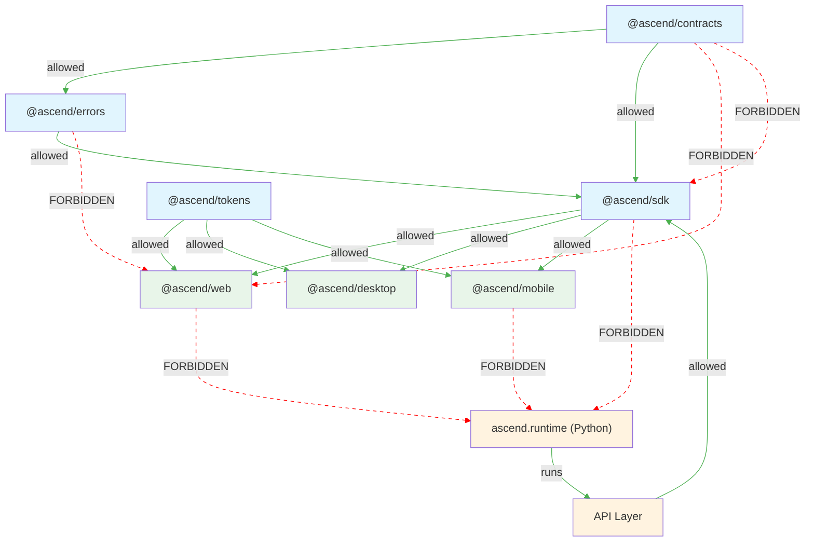

# ARCH-0029 — Dependency Graph

| Field | Value |
|-------|-------|
| **ID** | ARCH-0029 |
| **Name** | Dependency Graph |
| **Version** | 1.0 |
| **Status** | Draft |
| **Category** | Architecture |
| **Owner** | Chief Architect |
| **Derived from** | DOC-0009, ARCH-0001, ARCH-0024, ARCH-0025 |
| **Principle** | Layers communicate inward only (I9) |

---

## 1. Purpose

Define the canonical dependency graph across all ASCEND layers. Every package's allowed and forbidden imports are enumerated so that:

- No circular dependencies emerge
- No layer-skipping import is introduced
- The compiler and CI can enforce the graph automatically
- New contributors understand what goes where without ambiguity

The dependency graph is the **physical encoding** of Architectural Invariants I9 (Layers communicate inward only), I11 (API Independence), and I12 (SDK Independence).

---

## 2. Layer Model

ASCEND is organized in five logical layers, bottom to top:

```
Experience Layer  (apps/web, apps/desktop, apps/mobile)
         |
Platform Layer    (packages/sdk, packages/tokens)
         |
Application Layer (ascend.application — use cases, services)
         |
Domain Layer      (ascend.domain — entities, events, repository protocols)
         |
Foundation Layer  (packages/contracts — types, interfaces, enums)
```

The dependency rule follows **I9 — Camadas comunicam-se apenas para dentro**:

```
Experience → Platform → Application → Domain → Foundation
```

Each layer may only depend on layers beneath it. No layer may skip the layer immediately above it.

---

## 3. Package Dependency Graph (Concrete)

### 3.1 Current Package Map

| Package | Path | Role |
|---------|------|------|
| `@ascend/contracts` | `packages/contracts/` | Pure types, domain interfaces, enums — **zero runtime dependencies** |
| `@ascend/errors` | `packages/errors/` | Canonical error model (AscendError, error codes, envelope) |
| `@ascend/sdk` | `packages/sdk/` | SDK core (Transport, Cache, Lifecycle, Events, Logger, Clock) |
| `@ascend/tokens` | `packages/tokens/` | Design tokens (spacing, colors, typography, motion, CSS generation) |
| `@ascend/web` | `apps/web/` | Next.js frontend application |

### 3.2 Mermaid Dependency Graph



### 3.3 Dependencies per Package (as specified in `package.json`)

| Package | Declared `dependencies` | Declared `devDependencies` |
|---------|------------------------|---------------------------|
| `@ascend/contracts` | *(none)* | `typescript` |
| `@ascend/errors` | *(none currently)* | `typescript` |
| `@ascend/sdk` | *(none currently)* | `vitest`, `@vitest/coverage-v8`, `typescript` |
| `@ascend/tokens` | *(none)* | *(none)* |
| `@ascend/web` | `next`, `react`, `react-dom`, `zod`, `zustand`, `@tanstack/react-query`, `framer-motion`, radix UI components, `tailwind-merge`, et al. | `typescript`, `eslint`, `tailwindcss`, `postcss`, et al. |

> **Note:** The `@ascend/contracts`, `@ascend/errors`, and `@ascend/sdk` packages are not yet declared as workspace dependencies in each other's `package.json`. The graph below represents the **intended** architecture. As v2 Adoption progresses, these cross-package dependencies must be declared explicitly via the workspace package manager (pnpm / npm workspaces).

---

## 4. Allowed Dependencies

### 4.1 Per-Package Allowed & Forbidden Imports

| Package | Can Import | Cannot Import |
|---------|-----------|---------------|
| `@ascend/contracts` | *(nothing — it is the foundation)* | Everything (no `@ascend/*`, no runtime libraries, no frameworks) |
| `@ascend/errors` | `@ascend/contracts` | HTTP (`fetch`, `axios`, `ky`), React, SQLite, Next.js, any UI library |
| `@ascend/sdk` | `@ascend/contracts`, `@ascend/errors` | HTTP directly (must use Transport abstraction), React, SQLite, Next.js |
| `@ascend/tokens` | *(nothing — standalone)* | Everything (no `@ascend/*`, no runtime libraries) |
| `@ascend/web` | `@ascend/sdk`, `@ascend/tokens` | `@ascend/contracts` directly, `@ascend/errors` directly, `ascend.runtime` directly |
| `@ascend/desktop` (future) | `@ascend/sdk`, `@ascend/tokens` | Same as Web |
| `@ascend/mobile` (future) | `@ascend/sdk`, `@ascend/tokens` | Same as Web |
| `ascend.runtime` (Python) | *(nothing within the TS monorepo)* | Any TypeScript package (Runtime is Python) |
| API Layer | `@ascend/sdk` | `@ascend/web`, `@ascend/desktop`, React |

### 4.2 Layer-Level Allowed Imports

| Layer | Can Import From |
|-------|-----------------|
| **Experience** | Platform Layer, Foundation Layer (via Platform only) |
| **Platform** | Foundation Layer |
| **Application** | Domain Layer, Foundation Layer |
| **Domain** | Foundation Layer |
| **Foundation** | *(nothing — no internal imports across packages)* |

### 4.3 Enforced Pattern for `@ascend/web`

Web apps must follow the **I12 — SDK Independence** pattern:

```
Feature/Component → SDK Client → Transport → API/Runtime
```

No feature, component, or hook may:

- Import `fetch`, `axios`, `ky`, or any HTTP library directly
- Import from `@ascend/contracts` directly
- Import from `@ascend/errors` directly
- Instantiate transports directly
- Import or instantiate the Runtime

---

## 5. Forbidden Dependencies

### 5.1 Absolute Forbidden Edges

These imports are **never allowed** under any circumstances:

| From | To | Reason |
|------|----|--------|
| `@ascend/errors` | React | Error model must be framework-agnostic |
| `@ascend/errors` | SQLite | Error model must not depend on infrastructure |
| `@ascend/errors` | `fetch` | Error model must not depend on HTTP |
| `@ascend/sdk` | React directly | SDK must be framework-agnostic |
| `@ascend/sdk` | SQLite | SDK must not depend on specific storage |
| `@ascend/sdk` | Next.js | SDK must be framework-agnostic |
| `@ascend/contracts` | Any `@ascend/*` package | Contracts must be the bottom of the dependency graph |
| `@ascend/contracts` | Any runtime library | Contracts are pure types only |
| `@ascend/web` | `@ascend/contracts` directly | Must go through `@ascend/sdk` |
| `@ascend/web` | `@ascend/errors` directly | Must go through `@ascend/sdk` |
| `@ascend/web` | `ascend.runtime` directly | Violates I11 — must go through API |
| Any TS package | `ascend.runtime` | Runtime is Python; communication is via API only |

### 5.2 Mermaid Forbidden Edges



---

## 6. Circular Dependency Rules

### 6.1 Rules

| ID | Rule | Enforced By |
|----|------|-------------|
| C1 | Foundation (`@ascend/contracts`, `@ascend/tokens`) must never import any other `@ascend/*` package | `tsc --noEmit`, import lint |
| C2 | `@ascend/contracts` must never import `@ascend/sdk` or any higher-layer package | `tsc --noEmit`, import lint |
| C3 | `@ascend/errors` must never import `@ascend/sdk` | `tsc --noEmit`, import lint |
| C4 | `@ascend/web` must never import `@ascend/contracts` or `@ascend/errors` directly | `tsc --noEmit`, import lint |
| C5 | `@ascend/sdk` must never import `@ascend/web` or any Experience-layer package | `tsc --noEmit`, import lint |
| C6 | Any circular dependency detected in CI must block the PR | CI pipeline |
| C7 | Circular dependencies that require an exception must be approved by TSC via a signed RFC | Governance |

### 6.2 Cycle Detection

The dependency graph is a **Directed Acyclic Graph (DAG)**. Cycles are detected by:

1. **TypeScript compiler** — `tsc --noEmit` fails on circular imports between source files
2. **Import linting** — ESLint `import/no-cycle` rule or equivalent
3. **CI pipeline** — `madge` or `dependency-cruiser` scan across all packages

### 6.3 Exception Process

If a circular dependency is deemed necessary:

1. File an RFC with the rationale
2. Submit for TSC review
3. If approved, document the exception in this document's Change History
4. Add a lint ignore directive with a reference to the TSC decision

---

## 7. Visual Diagrams

### 7.1 Layer Dependency Graph (Top-Down)



### 7.2 Concrete Package Dependency Graph (Monorepo)



### 7.3 Runtime & API Dependency Graph



### 7.4 Full Dependency Graph with All Constraints



---

## 8. Dependency Arrows Summary

| Direction | Arrow | Meaning |
|-----------|-------|---------|
| `A --> B` | Solid | **Allowed** — A may import B |
| `A -.-> B` | Dashed | **Forbidden** — A must never import B |

---

## 9. Invariants Enforced

| Invariant | How the Dependency Graph Enforces It |
|-----------|--------------------------------------|
| **I1** — Domain never depends on Infrastructure | Domain (`@ascend/contracts`) has zero dependencies |
| **I9** — Layers communicate inward only | Graph is strictly top-down; no upward edges exist |
| **I11** — API Independence | Web/Desktop/Mobile may not import Runtime directly; must go through SDK → API |
| **I12** — SDK Independence | Web may not import HTTP libraries directly; must use SDK Transport abstraction |

---

## 10. Verification

### 10.1 TypeScript Compiler

Each package runs `tsc --noEmit` as part of its `typecheck` script. The compiler catches:

- Imports from packages not listed in `dependencies`
- Circular imports between source files within a package

```bash
# Per-package
cd packages/contracts && npm run typecheck
cd packages/errors && npm run typecheck
cd packages/sdk && npm run typecheck
cd apps/web && npm run typecheck

# Aggregate (future — root typecheck script)
npm run typecheck:all
```

### 10.2 Import Linting

ESLint rules (to be added):

- `import/no-extraneous-dependencies` — prevents importing packages not listed in `package.json`
- `import/no-cycle` — detects circular imports across files
- `import/no-unresolved` — verifies all imports resolve correctly
- `import/no-restricted-paths` — enforces layer boundaries

### 10.3 Dependency Cruiser

A `dependency-cruiser` configuration will be added to the monorepo root to validate the graph:

```javascript
// .dependency-cruiser.js (planned)
module.exports = {
  forbidden: [
    {
      name: 'web-must-not-import-contracts-directly',
      from: { path: '^apps/web' },
      to:   { path: '^packages/contracts' },
    },
    {
      name: 'sdk-must-not-import-react',
      from: { path: '^packages/sdk' },
      to:   { path: 'react' },
    },
    {
      name: 'no-circular-deps',
      from: {},
      to:   { circular: true },
    },
  ],
};
```

### 10.4 CI Checks

The CI pipeline must run the following before merging any PR:

| Check | Command | What It Catches |
|-------|---------|-----------------|
| TypeScript typecheck | `tsc --noEmit` (per package) | Wrong imports, type mismatches |
| Import linting | `eslint --rule 'import/no-cycle: error'` | Circular deps, forbidden imports |
| Dependency validation | `depcruise --ts-config tsconfig.json src` | Violations of allowed/forbidden edges |
| Build | `npm run build` (per package) | Runtime import resolution failures |

### 10.5 Manual Review Checklist

Before approving any PR that adds or changes imports:

- [ ] Does the import respect the Allowed Dependencies table (Section 4)?
- [ ] Does the import violate any Forbidden Dependency (Section 5)?
- [ ] Does the import create a circular dependency (Section 6)?
- [ ] Does the import comply with I9, I11, and I12?
- [ ] Is the new dependency declared in `package.json`?

---

## 11. Definition of Done

ARCH-0029 aprovado quando:

- [ ] Allowed dependencies table complete for all current packages
- [ ] Forbidden dependencies table complete with rationale
- [ ] Circular dependency rules defined (C1–C7)
- [ ] Mermaid diagrams rendered for all views (layer, package, forbidden edges, runtime)
- [ ] Verification section includes typecheck, lint, dependency-cruiser, and CI steps
- [ ] All architectural invariants (I1, I9, I11, I12) are cross-referenced
- [ ] The document is reviewed by the Chief Architect

---

## 12. Change History

| Version | Date | Author | Change |
|---------|------|--------|--------|
| 1.0 | 2026-07-20 | Chief Architect | Initial version — ADOÇÃO v2 |
