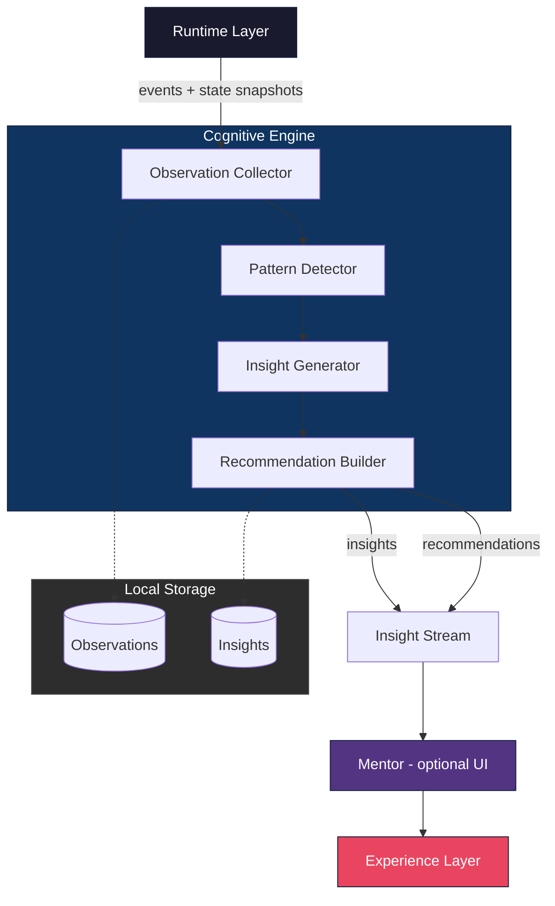
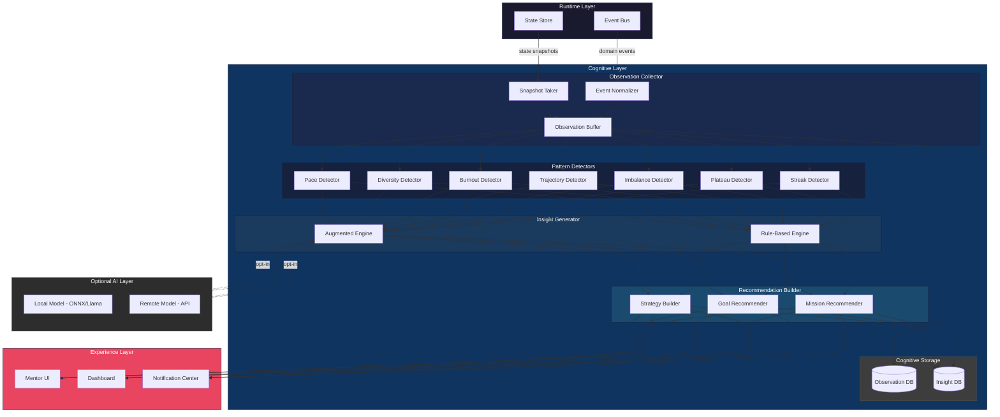

# ARCH-0030 — Cognitive Architecture

| Campo | Valor |
|-------|-------|
| **ID** | ARCH-0030 |
| **Nome** | Cognitive Architecture |
| **Versão** | 1.0-DRAFT |
| **Status** | Draft |
| **Categoria** | Architecture |
| **Owner** | Chief Architect |
| **Derivado de** | DOC-0000 North Star, DOC-0003 First Principles, DOC-0007 Engineering Philosophy, DOC-0009 Architectural Invariants, ARCH-0001 System Architecture Overview, ARCH-0003 Core Engine Specification |
| **Será utilizado por** | V2-0001 Adoption Strategy, Experience Layer, Mentor Component, Implementation Phase |

---

## 1. Mission of the Cognitive Layer

The Cognitive Layer exists for one reason: **to transform Runtime data into structured understanding.**

It is NOT the "AI layer." It is NOT the "smart layer." It is the **observation and analysis layer** — a structured, principled system that watches what happens inside the Runtime, detects meaningful patterns, generates insights, and produces recommendations. It does all of this without modifying state, without altering domain truths, and without requiring any AI model whatsoever.

The Cognitive Layer is to the Runtime what a dashboard is to an engine: it does not drive, but it informs the driver. It does not steer, but it illuminates the road ahead. It does not guarantee the destination, but it makes the journey legible.

This layer is the bridge between the mechanical execution of competencies and the human understanding of growth. The Runtime processes evidence, updates states, and fires events. The Cognitive Layer watches, synthesizes, and reflects back to the Builder what their trajectory reveals.

In the absence of any AI, the Cognitive Layer still operates using rule-based heuristics, statistical aggregations, and deterministic pattern detectors. It is fully functional with zero external dependencies. When AI is connected — with explicit consent — the same architecture amplifies its analytical power, but never cedes control.

The mission is captured in a single axiom:

> *The Runtime executes. The Cognitive Layer understands. The Builder decides.*

---

## 2. Why It Exists

The Cognitive Layer exists for three irreducible reasons.

### 2.1 Raw Data Is Not Insight

The Runtime generates a rich stream of events: evidence submitted, competencies updated, milestones reached, streaks broken, goals achieved. These events are precise, structured, and complete — but they are not understanding.

A list of 500 events tells the Builder *what* happened. It does not tell them *what it means*. Did they plateau? Are they accelerating? Is there a pattern in their mission choices? Are they avoiding certain competency families? Raw data is the noise; insight is the signal. The Cognitive Layer exists to extract signal from noise.

Without this layer, the Builder is left with an ledger of facts and no interpretation. The Runtime gives them the map; the Cognitive Layer gives them the guide.

### 2.2 Builders Need Guidance

Competency development is not linear. It is recursive, messy, and deeply personal. The Runtime executes competencies mechanically — it does not care about trajectory, burnout, stagnation, or strategic gaps. It processes one mission, one evidence, one review at a time.

Builders need more than execution. They need to know:
- Am I growing in the right direction?
- Am I spreading myself too thin?
- Where are my knowledge gaps?
- What should I focus on next?
- Am I at risk of stagnation or burnout?

The Runtime cannot answer these questions. It was not designed to. The Cognitive Layer exists to answer them — not with certainty, but with structured, confidence-scored observations that the Builder can accept, reject, or ignore.

### 2.3 The System Must Learn Without Compromising Sovereignty

Architectural Invariant I8 (DOC-0009) states: *Data belongs to the user.* Invariant I6 states: *The core must work without internet.*

The Cognitive Layer respects both invariants absolutely. All observations are collected locally. All analysis happens locally by default. No data leaves the Builder's device without explicit, informed, reversible consent.

Even when a model is connected — whether local or remote — the observations remain private. The model receives what the Builder explicitly authorizes, nothing more. The Cognitive Layer never phones home, never telemetries, never sells insight.

This is not just compliance. It is a first-principles commitment: learning augmentation must never come at the cost of autonomy.

---

## 3. Responsibilities

The Cognitive Layer has five responsibilities, no more, no less.

### 3.1 Observe Runtime Events and State (Read-Only)

The Cognitive Layer subscribes to the Runtime event stream and takes periodic state snapshots. It never writes, never mutates, never calls command methods. Observation is strictly passive.

```
Runtime ──emit(event)──→ Cognitive Layer
Runtime ──snapshot(state)──→ Cognitive Layer
```

### 3.2 Analyze Patterns Across Observations

Aggregated observations are analyzed for:
- Temporal patterns (streaks, plateaus, bursts)
- Structural patterns (competency family imbalances, skill gaps)
- Behavioral patterns (mission type preferences, avoidance tendencies)
- Trajectory patterns (acceleration, deceleration, stagnation)

Analysis is performed by pluggable detectors. Each detector produces a strongly-typed `Pattern` object with a confidence score.

### 3.3 Generate Insights

Patterns are synthesized into insights. An insight is a structured, typed, confidence-scored observation about the Builder's competency journey. Unlike raw patterns, insights carry interpretation:
- Pattern: "No missions completed in 14 days"
- Insight: "Stagnation risk detected — 14-day inactivity period, previous average was 1 mission per 3 days"

Insights are the primary output of the Cognitive Layer. They are consumed by the Experience Layer for presentation and by the Builder for decision-making.

### 3.4 Produce Recommendations

Some insights can be paired with recommendations. A recommendation is an optional, explainable, reversible suggestion:
- Insight: Knowledge gap in "System Design"
- Recommendation: "Consider attempting the 'Design a Distributed Cache' mission in the System Architecture package"

Recommendations are always:
- **Optional** — never required
- **Explainable** — the reasoning chain is fully visible
- **Reversible** — accepting never locks the Builder into a path

### 3.5 Deliver Insights to the Experience Layer

The Cognitive Layer publishes insights to a structured stream that the Experience Layer subscribes to. The stream is typed, ordered, and replayable. The Experience Layer decides how to present insights — as notifications, dashboards, weekly summaries, or mentor dialogs.

### Architecture Diagram

```
Runtime ─────────────────────────────────────┐
    │                                         │
    │  event stream                           │  state snapshots
    ▼                                         ▼
┌─────────────────────────────────────────────────┐
│              Cognitive Engine                     │
│                                                   │
│  ┌─────────────────┐    ┌──────────────────┐    │
│  │ Observation      │    │  Pattern          │    │
│  │ Collector        │───▶│  Detector         │    │
│  └─────────────────┘    └────────┬─────────┘    │
│                                  │               │
│                                  ▼               │
│  ┌─────────────────┐    ┌──────────────────┐    │
│  │ Recommendation   │◀───│  Insight          │    │
│  │ Builder          │    │  Generator        │    │
│  └────────┬────────┘    └──────────────────┘    │
│           │                                      │
└───────────┼──────────────────────────────────────┘
            │
            ▼
┌─────────────────────────────────────────────────┐
│              Insight Stream                       │
│  (structured, typed, confidence-scored)          │
└──────────────────────┬──────────────────────────┘
                       │
                       ▼
┌─────────────────────────────────────────────────┐
│              Mentor (optional UI layer)          │
│                                                   │
│  ┌─────────────────┐    ┌──────────────────┐    │
│  │ Insight          │    │  Recommendation   │    │
│  │ Presentation     │    │  Interface        │    │
│  └─────────────────┘    └──────────────────┘    │
└──────────────────────┬──────────────────────────┘
                       │
                       ▼
┌─────────────────────────────────────────────────┐
│              Experience Layer                    │
│  (React, Next.js, shadcn/ui, framer-motion)     │
└─────────────────────────────────────────────────┘
```



---

## 4. Responsibilities Prohibited

The Cognitive Layer is defined as much by what it **cannot** do as by what it can. These prohibitions are absolute and non-negotiable. They exist to protect Runtime sovereignty, data integrity, and Builder autonomy.

### 4.1 The Cognitive Layer Can NEVER Alter Domain Entities or State

The Cognitive Layer has read-only access to domain entities. It can observe a `Competency` object, but it can never call `Competency.claim()`, `Competency.prove()`, or any mutating method. Domain state is sovereign and belongs exclusively to the Runtime.

### 4.2 The Cognitive Layer Can NEVER Modify Runtime Execution

The Cognitive Layer cannot start, stop, pause, or reorder missions. It cannot cancel evidence reviews. It cannot change the active competency tree. The Runtime executes; the Cognitive Layer watches.

### 4.3 The Cognitive Layer Can NEVER Change Competency or XP Values

Experience points, competency progress percentages, levels, and ranks are Runtime-owned values. The Cognitive Layer can observe and analyze them, but never adjust them — not even to "correct" a perceived error. If the Cognitive Layer detects an anomaly in XP, it reports an insight. It does not perform a correction.

### 4.4 The Cognitive Layer Can NEVER Write to the Database

The Cognitive Layer maintains its own observation and insight stores, but these are logically separate from the Runtime database. The Cognitive Layer never writes to `ascend.db` or any Runtime-managed persistence layer. Cross-layer data flow is strictly one-way: Runtime → Cognitive.

### 4.5 The Cognitive Layer Can NEVER Override Builder Decisions

When the Cognitive Layer produces a recommendation, the Builder is free to accept, dismiss, or ignore it. The Cognitive Layer cannot re-offer a dismissed recommendation, cannot nag, cannot surface the same insight in progressively louder ways. Once dismissed, it is recorded and archived.

More importantly, the Cognitive Layer cannot veto Builder actions. If the Builder chooses a path that the Cognitive Layer considers suboptimal, the Cognitive Layer records its observation and remains silent. The Builder always decides.

### 4.6 The Cognitive Layer Can NEVER Block or Prevent Runtime Operations

Under no circumstances can a Cognitive Layer failure, timeout, or error prevent the Runtime from executing. If the Cognitive Layer crashes, the Runtime continues. If the Cognitive Layer deadlocks, the Runtime continues. If the Cognitive Layer produces conflicting insights, the Runtime continues.

This is not optional. The Cognitive layer must be deployed as a sidecar or observer — never in the critical path of Runtime execution.

### 4.7 The Cognitive Layer Can NEVER Leak Observations to External Services Without Explicit Consent

Architectural Invariant I8 prohibits mandatory telemetry. The Cognitive Layer extends this principle to all observation data. No batch, no sync, no analytics ping, no "anonymized usage statistics" — unless the Builder has explicitly, knowingly, and reversibly opted in.

---

## 5. Cognitive Principles (CP-1 through CP-7)

These seven principles govern every design decision in the Cognitive Layer. They are derived from the Architectural Invariants (DOC-0009) and the First Principles (DOC-0003).

### CP-1 — Every Recommendation Is Explainable

A recommendation without justification is noise. Every recommendation produced by the Cognitive Layer must carry a human-readable explanation chain that traces back to specific observations and patterns.

**Example:**
```
Recommendation: Try mission "Design a Distributed Cache"
Explanation chain:
  1. Observation: Completed 8 of 8 missions in "Web Fundamentals"
  2. Observation: 0 of 6 missions in "System Architecture"
  3. Pattern: Competency family imbalance detected (Web: 80%, Systems: 0%)
  4. Insight: Knowledge gap in System Architecture
  5. Recommendation: "Design a Distributed Cache" is the introductory mission
```

The Builder can inspect this chain at any time. There is no black box.

### CP-2 — Every Decision Can Be Ignored

No insight, recommendation, or alert can force the Builder's attention. Every cognitive output is skippable, dismissable, and ignorable without penalty. The Cognitive Layer never uses dark patterns — no unread badges that won't clear, no notification counts that climb, no urgency manipulation.

If the Builder dismisses an insight, the Cognitive Layer may record the dismissal for pattern analysis, but it must not re-surface the same insight for a configurable cooldown period.

### CP-3 — Builder Always Decides

This is the cognitive corollary of DOC-0003's First Principle of human centricity. The Cognitive Layer advises. The Builder decides. Period.

This applies to:
- Goal setting: the Builder sets goals; the Cognitive Layer predicts and suggests
- Mission selection: the Builder chooses; the Cognitive Layer recommends
- Pace: the Builder moves at their pace; the Cognitive Layer observes and adapts
- Feedback: the Builder decides what feedback is useful; the Cognitive Layer learns preferences

### CP-4 — AI Never Alters Truth

Observations are subjective in the sense that they represent one analytical perspective. But domain facts — competency states, evidence records, review outcomes — are sovereign truths owned by the Runtime.

No AI, no model, no cognitive algorithm can alter a domain fact. If an AI analysis concludes that a competency assessment was wrong, it can generate an insight and recommendation. It cannot change the competency state. Only a new evidence submission followed by a new review — flowing through the Runtime's standard pathways — can update domain truth.

### CP-5 — Every Inference Has a Confidence Score

Every pattern, insight, and recommendation must carry a confidence score between 0.0 and 1.0. The score is computed from:
- Data quality (how many observations support the inference)
- Temporal recency (how current the supporting observations are)
- Detector reliability (historical accuracy of the specific detector)
- Model confidence (if a model was used, its reported confidence)

Confidence scores allow the Experience Layer to present insights appropriately: high-confidence insights can be surfaced; low-confidence insights can be shown on demand or used for internal pattern discovery only.

### CP-6 — No Model Is Mandatory

The Cognitive Layer must function with zero AI dependencies. Every detector, generator, and builder must have a deterministic fallback that produces valid output without any external model.

This is not an theoretical requirement. The Cognitive Layer architecture defines two operational modes:

| Mode | Model Dependency | Capability |
|------|------------------|------------|
| **Rule-Based** | None | All patterns, insights, recommendations using heuristics |
| **Augmented** | Optional (local or remote) | Enhanced pattern detection, natural language, deeper analysis |

No feature in the Cognitive Layer can require "Augmented" mode. All features must work in "Rule-Based" mode. Augmented mode is always additive, never essential.

### CP-7 — Offline First

Architectural Invariant I6 applies absolutely. The Cognitive Layer operates fully offline. Observations are collected locally. Analysis runs locally. Insights are generated locally. Recommendations are built locally.

Online capabilities — model inference via API, cross-Builder pattern discovery, cloud sync — are exclusively opt-in additions that never reduce offline functionality.

---

## 6. Architecture

### 6.1 Layer Overview

```
Runtime ─────────────────────────────────────────────┐
    │                                                 │
    │  Domain Events          State Snapshots        │
    ▼                                                 ▼
┌─────────────────────────────────────────────────────────┐
│  OBSERVATION COLLECTOR                                   │
│                                                          │
│  Buffers events from Runtime event stream                │
│  Takes periodic state snapshots (configurable interval)  │
│  Normalizes observation format                           │
│  Persists observations to local observation store        │
└──────────────────────────┬──────────────────────────────┘
                           │
                           ▼
┌─────────────────────────────────────────────────────────┐
│  PATTERN DETECTOR                                        │
│                                                          │
│  Receives: stream of normalized observations             │
│  Produces: typed Pattern objects with confidence scores  │
│                                                          │
│  Built-in detectors:                                     │
│  ┌─────────────────────────────────────────────────┐    │
│  │ • StreakDetector      — activity streaks/bursts │    │
│  │ • PlateauDetector     — stagnation periods      │    │
│  │ • ImbalanceDetector   — competency gaps         │    │
│  │ • TrajectoryDetector  — acceleration/deceleration│   │
│  │ • BurnoutDetector     — disengagement risk      │    │
│  │ • DiversityDetector   — mission type variety    │    │
│  │ • PaceDetector        — velocity vs. historical  │    │
│  └─────────────────────────────────────────────────┘    │
│                                                          │
│  Each detector is independently pluggable                │
│  New detectors can be registered at runtime              │
└──────────────────────────┬──────────────────────────────┘
                           │
                           ▼
┌─────────────────────────────────────────────────────────┐
│  INSIGHT GENERATOR                                       │
│                                                          │
│  Receives: patterns from Pattern Detector                │
│  Produces: typed Insight objects with confidence scores  │
│                                                          │
│  Insights are synthesized from one or more patterns.     │
│  Example:                                                │
│    Pattern(PlateauDetector, 14d inactivity)              │
│    + Pattern(BurnoutDetector, declining session length)  │
│    → Insight(stagnation_risk, confidence=0.82)           │
│                                                          │
│  Insight types:                                           │
│  ┌─────────────────────────────────────────────────┐    │
│  │ • progress_insight        — trajectory analysis │    │
│  │ • gap_insight             — knowledge gaps      │    │
│  │ • risk_insight            — stagnation/burnout  │    │
│  │ • pattern_insight         — behavioral patterns │    │
│  │ • strategy_insight        — study strategy      │    │
│  │ • milestone_insight       — achievement context │    │
│  │ • goal_insight            — goal prediction     │    │
│  └─────────────────────────────────────────────────┘    │
└──────────────────────────┬──────────────────────────────┘
                           │
                           ▼
┌─────────────────────────────────────────────────────────┐
│  RECOMMENDATION BUILDER                                   │
│                                                          │
│  Receives: insights from Insight Generator               │
│  Produces: typed Recommendation objects                   │
│                                                          │
│  Each recommendation includes:                            │
│  • target (mission, package, competency)                 │
│  • action (try, review, explore, practice)               │
│  • rationale (traceable explanation chain)               │
│  • confidence (inherited from source insight)            │
│  • optional (default: true)                              │
│                                                          │
│  Recommendations are never pushed; they are published    │
│  to the Insight Stream for the Experience Layer to pull. │
└──────────────────────────┬──────────────────────────────┘
                           │
                           ▼
┌─────────────────────────────────────────────────────────┐
│  INSIGHT STREAM                                          │
│                                                          │
│  Typed, ordered, replayable stream of insights and       │
│  recommendations.                                        │
│                                                          │
│  Subscribers:                                            │
│  • Experience Layer (for UI presentation)                │
│  • Mentor component (if enabled)                         │
│  • Local insight store (for persistence)                 │
│                                                          │
│  Stream contracts are defined in @ascend/contracts.     │
└─────────────────────────────────────────────────────────┘
```

### 6.2 Detailed Component Specifications

#### 6.2.1 Observation Collector

**Responsibility:** Bridge between Runtime events and the Cognitive Layer's internal observation model.

**Inputs:**
- Runtime domain events (subscribed via event bus)
- Periodic state snapshots (polled at configurable intervals)

**Processing:**
1. Normalize Runtime events to `Observation` canonical type
2. Enrich with metadata (timestamp, session ID, builder ID)
3. Store in local observation store
4. Batch-route to Pattern Detector

**Configuration:**
| Parameter | Default | Description |
|-----------|---------|-------------|
| snapshot_interval | 300s | How often to take full state snapshots |
| batch_size | 50 | Max observations per batch to detector |
| max_observations | 10000 | Max stored observations before rotation |

**Contracts:**
```python
@dataclass
class Observation:
    id: UUID
    type: ObservationType
    timestamp: datetime
    builder_id: UUID
    session_id: UUID
    payload: dict[str, Any]
    source: ObservationSource  # RUNTIME_EVENT | STATE_SNAPSHOT

class ObservationType(Enum):
    MISSION_STARTED = "mission.started"
    MISSION_COMPLETED = "mission.completed"
    EVIDENCE_SUBMITTED = "evidence.submitted"
    EVIDENCE_REVIEWED = "evidence.reviewed"
    COMPETENCY_UPDATED = "competency.updated"
    SESSION_STARTED = "session.started"
    SESSION_ENDED = "session.ended"
    GOAL_SET = "goal.set"
    GOAL_ACHIEVED = "goal.achieved"
    MILESTONE_REACHED = "milestone.reached"
```

#### 6.2.2 Pattern Detector

**Responsibility:** Analyze observations to detect meaningful patterns.

**Inputs:** Stream of `Observation` objects

**Outputs:** List of `Pattern` objects

**Contracts:**
```python
@dataclass
class Pattern:
    id: UUID
    detector_id: str
    type: PatternType
    confidence: float  # 0.0 - 1.0
    observations: list[UUID]  # supporting observation IDs
    timestamp: datetime
    data: dict[str, Any]

class PatternType(Enum):
    STREAK = "streak"
    PLATEAU = "plateau"
    BURST = "burst"
    IMBALANCE = "imbalance"
    DECELERATION = "deceleration"
    ACCELERATION = "acceleration"
    AVOIDANCE = "avoidance"
    BURNOUT_RISK = "burnout_risk"
    DIVERSITY_GAP = "diversity_gap"
    CONSISTENCY_SHIFT = "consistency_shift"
```

**Detector Interface:**
```python
class PatternDetector(Protocol):
    """Interface for all pattern detectors."""
    detector_id: str

    def analyze(
        self,
        observations: list[Observation],
        context: AnalysisContext
    ) -> list[Pattern]: ...
```

#### 6.2.3 Insight Generator

**Responsibility:** Synthesize patterns into structured insights.

**Inputs:** List of `Pattern` objects

**Outputs:** List of `Insight` objects

**Contracts:**
```python
@dataclass
class Insight:
    id: UUID
    type: InsightType
    confidence: float
    patterns: list[UUID]  # supporting pattern IDs
    title: str
    summary: str
    detail: str
    timestamp: datetime
    actionable: bool
    metadata: dict[str, Any]

class InsightType(Enum):
    PROGRESS = "progress_insight"
    GAP = "gap_insight"
    RISK = "risk_insight"
    PATTERN = "pattern_insight"
    STRATEGY = "strategy_insight"
    MILESTONE = "milestone_insight"
    GOAL = "goal_insight"
```

#### 6.2.4 Recommendation Builder

**Responsibility:** Convert actionable insights into recommendations.

**Inputs:** List of `Insight` objects where `actionable == True`

**Outputs:** List of `Recommendation` objects

**Contracts:**
```python
@dataclass
class Recommendation:
    id: UUID
    insight_id: UUID
    confidence: float
    target_type: RecommendationTargetType
    target_id: UUID
    action: str
    rationale: str
    explanation_chain: list[ExplanationNode]
    optional: bool = True
    expires_at: Optional[datetime] = None
    metadata: dict[str, Any]

class RecommendationTargetType(Enum):
    MISSION = "mission"
    PACKAGE = "package"
    COMPETENCY = "competency"
    RESOURCE = "resource"
    REVIEW = "review"
    GOAL = "goal"

@dataclass
class ExplanationNode:
    node_type: str  # observation | pattern | insight
    node_id: UUID
    summary: str
```

### 6.3 Mermaid Architecture Diagram



---

## 7. Cognitive Events

The Cognitive Layer defines its own event catalog following the naming convention `cognitive.{domain}.{action}`. These events are published to the Insight Stream and can be consumed by the Experience Layer and any registered observers.

### 7.1 Event Catalog

#### `cognitive.pattern.detected`

A learning pattern was identified by the Pattern Detector.

```python
@dataclass
class CognitivePatternDetected:
    event_type: str = "cognitive.pattern.detected"
    pattern_id: UUID
    detector_id: str
    pattern_type: PatternType
    confidence: float
    supporting_observations: list[UUID]
    data: dict[str, Any]
    timestamp: datetime
```

**Fired when:** A detector completes analysis and produces one or more patterns.

---

#### `cognitive.insight.generated`

A structured insight was produced by the Insight Generator.

```python
@dataclass
class CognitiveInsightGenerated:
    event_type: str = "cognitive.insight.generated"
    insight_id: UUID
    insight_type: InsightType
    confidence: float
    patterns: list[UUID]
    title: str
    summary: str
    actionable: bool
    timestamp: datetime
```

**Fired when:** The Insight Generator synthesizes one or more patterns into an insight.

---

#### `cognitive.recommendation.created`

A recommendation was built from an actionable insight.

```python
@dataclass
class CognitiveRecommendationCreated:
    event_type: str = "cognitive.recommendation.created"
    recommendation_id: UUID
    insight_id: UUID
    confidence: float
    target_type: RecommendationTargetType
    target_id: UUID
    action: str
    rationale: str
    optional: bool
    expires_at: Optional[datetime]
    timestamp: datetime
```

**Fired when:** The Recommendation Builder produces a recommendation from an actionable insight.

---

#### `cognitive.goal.predicted`

A likely next goal was inferred based on trajectory analysis.

```python
@dataclass
class CognitiveGoalPredicted:
    event_type: str = "cognitive.goal.predicted"
    goal_id: UUID
    predicted_goal: str
    confidence: float
    based_on_patterns: list[UUID]
    alternative_goals: list[dict[str, Any]]
    timestamp: datetime
```

**Fired when:** The trajectory and pattern analysis suggests a probable next goal the Builder may want to pursue.

---

#### `cognitive.knowledge.gap.detected`

A gap in competency coverage was identified.

```python
@dataclass
class CognitiveKnowledgeGapDetected:
    event_type: str = "cognitive.knowledge.gap.detected"
    gap_id: UUID
    competency_family: str
    missing_competencies: list[str]
    severity: float  # 0.0 - 1.0
    suggested_missions: list[UUID]
    confidence: float
    timestamp: datetime
```

**Fired when:** The ImbalanceDetector or DiversityDetector identifies a significant gap in competency coverage relative to the Builder's stated goals or trajectory.

---

#### `cognitive.stagnation.detected`

Lack of meaningful progress was observed over a significant period.

```python
@dataclass
class CognitiveStagnationDetected:
    event_type: str = "cognitive.stagnation.detected"
    stagnation_id: UUID
    duration_days: int
    previous_activity_rate: float  # missions/day before stagnation
    current_activity_rate: float
    severity: float
    confidence: float
    timestamp: datetime
```

**Fired when:** The PlateauDetector identifies a period of inactivity or minimal progress exceeding the Builder's historical baseline by a configurable threshold.

---

#### `cognitive.burnout.risk.detected`

Risk of disengagement or burnout was observed based on behavioral changes.

```python
@dataclass
class CognitiveBurnoutRiskDetected:
    event_type: str = "cognitive.burnout.risk.detected"
    risk_id: UUID
    indicators: list[str]
    severity: float
    confidence: float
    suggested_break: bool
    timestamp: datetime
```

**Fired when:** Multiple indicators of burnout risk are detected simultaneously — declining session length, increasing gaps between sessions, dropping mission completion rate, negative sentiment patterns.

---

#### `cognitive.study.strategy.generated`

A personalized study or learning strategy was produced.

```python
@dataclass
class CognitiveStudyStrategyGenerated:
    event_type: str = "cognitive.study.strategy.generated"
    strategy_id: UUID
    focus_areas: list[str]
    recommended_pace: str  # relaxed | moderate | intensive
    recommended_sequence: list[UUID]  # ordered mission IDs
    estimated_duration_days: int
    confidence: float
    timestamp: datetime
```

**Fired when:** The Strategy Builder synthesizes multiple insights (gaps, pace, trajectory, preferences) into a coherent study plan.

---

#### `cognitive.insight.dismissed`

The Builder explicitly dismissed an insight.

```python
@dataclass
class CognitiveInsightDismissed:
    event_type: str = "cognitive.insight.dismissed"
    insight_id: UUID
    reason: Optional[str]  # builder-provided reason, if any
    timestamp: datetime
```

**Fired when:** The Builder dismisses an insight via the Experience Layer. This event is critical for the Cognitive Layer's feedback loop — it informs confidence adjustment and prevents repeated surfacing.

---

#### `cognitive.recommendation.accepted`

The Builder explicitly accepted a recommendation.

```python
@dataclass
class CognitiveRecommendationAccepted:
    event_type: str = "cognitive.recommendation.accepted"
    recommendation_id: UUID
    insight_id: UUID
    action_taken: str
    timestamp: datetime
```

**Fired when:** The Builder acts on a recommendation. This is the most important feedback signal for the Cognitive Layer — it confirms that a recommendation was valuable and reinforces the analytical chain that produced it.

---

### 7.2 Event Flow

```
Time ──────────────────────────────────────────────────────────→

Runtime Events
    │
    ▼
Observation Collector ──┐
                        │
                        ▼
Pattern Detector ──cognitive.pattern.detected──┐
                                                │
                                                ▼
Insight Generator ──cognitive.insight.generated──┐
                                                  │
                                                  ▼
Recommendation Builder ──cognitive.recommendation.created──┐
                                                            │
                                                            ▼
Insight Stream ──────────────────────────────────────────→ Experience Layer
                                                            │
                                                            │ Builder interacts
                                                            ▼
                                              ┌─────────────────────┐
                                              │ Dismiss or Accept   │
                                              │                     │
                                              │ cognitive.insight.  │
                                              │   dismissed         │
                                              │                     │
                                              │ cognitive.          │
                                              │   recommendation.   │
                                              │   accepted          │
                                              └─────────────────────┘
```

---

## 8. Boundary Rules

The Cognitive Layer operates within strict boundaries. These rules define what the layer knows, what it touches, and how it communicates.

### 8.1 The Cognitive Layer Does NOT Know

| Technology | Why Not |
|------------|---------|
| SQLite | Database technology is an implementation detail of the Infrastructure layer. The Cognitive Layer stores observations in its own dedicated store, which is logically separated from the Runtime database. |
| React | The Experience Layer owns all presentation. The Cognitive Layer produces structured data (insights), not UI components. |
| FastAPI | The API layer belongs to the Platform Layer. The Cognitive Layer does not expose HTTP endpoints — it communicates via in-process event streams. |
| Next.js | Same as React. The Cognitive Layer knows nothing about the frontend framework. |
| HTTP | The Cognitive Layer does not make network calls by default. All communication is in-process. External model inference is handled by a dedicated transport abstraction that is injected, not imported. |
| Any ORM | The Cognitive Layer accesses its storage through a repository protocol, not directly through an ORM. |
| Any AI SDK | The Cognitive Layer defines its own model abstraction. It does not import OpenAI SDK, Anthropic SDK, or any vendor library. |

### 8.2 The Cognitive Layer Knows ONLY

| What | Description |
|------|-------------|
| **Contracts** | Canonical types defined in `@ascend/contracts` — Observation, Pattern, Insight, Recommendation, and all supporting types. These are the Cognitive Layer's vocabulary. |
| **Events** | Runtime domain events (subscribed type definitions) and its own cognitive events (produced type definitions). Events are the sole input from the Runtime. |
| **Observations** | Its own internal model for normalized, enriched observations. Observations are the Cognitive Layer's persistent state — they are not Runtime entities. |

### 8.3 The Cognitive Layer Communicates ONLY Through

| Channel | Direction | Description |
|---------|-----------|-------------|
| **Observation subscription** | Runtime → Cognitive | The Cognitive Layer subscribes to Runtime events and polls for state snapshots. This is the sole input channel. |
| **Insight stream** | Cognitive → Experience | The Cognitive Layer publishes insights and recommendations to a typed stream. The Experience Layer subscribes and presents. This is the sole output channel. |

### 8.4 Communication Restrictions Diagram

```
┌─────────────────────────────────────────────────────┐
│                   CAN communicate via:               │
│                                                      │
│   Runtime ──events──→ Cognitive ──insights──→ Experience │
│                                                      │
└─────────────────────────────────────────────────────┘

┌─────────────────────────────────────────────────────┐
│                 CANNOT communicate via:              │
│                                                      │
│   Cognitive ──x──→ Runtime (no writes)               │
│   Cognitive ──x──→ Database (no persistence writes) │
│   Cognitive ──x──→ HTTP (no network calls)          │
│   Cognitive ──x──→ UI (no direct rendering)         │
│   Cognitive ──x──→ External APIs (no phone-home)    │
│                                                      │
└─────────────────────────────────────────────────────┘
```

---

## 9. Evolution Roadmap

The Cognitive Layer evolves through five major versions. Each version adds capability while maintaining backward compatibility and strict adherence to the Cognitive Principles.

### V1 — Observer (Current Target)

**Theme:** Watch and Learn

**Capabilities:**
- Observation Collector fully implemented
- Pattern Detector with rule-based detectors (Streak, Plateau, Imbalance, Trajectory)
- Insight Generator producing basic insights (progress, gaps, risks)
- Local observation and insight storage
- Insight stream delivery to Experience Layer
- All cognitive events firing correctly
- 100% offline operation

**Non-goals:**
- No recommendation engine
- No natural language
- No goal prediction
- No model integration

**Estimated scope:** 4-6 weeks

---

### V2 — Mentor (Next)

**Theme:** Guide and Advise

**Capabilities:**
- Recommendation Builder with mission, goal, and strategy recommendations
- Explanation chain for every recommendation
- Builder feedback loop (dismiss/accept events)
- Confidence calibration based on feedback
- Enhanced pattern detection with cross-pattern synthesis
- Mentor UI component in Experience Layer
- Notification preferences and cooldown management

**Non-goals:**
- No natural language generation
- No adaptive learning
- No collective intelligence

**Estimated scope:** 6-8 weeks

---

### V3 — Planner (Future)

**Theme:** Anticipate and Strategize

**Capabilities:**
- Goal inference engine (predict likely next goals)
- Study strategy generation (personalized learning sequences)
- Trajectory prediction (forecast competency growth)
- Scenario modeling ("what if I focus on X for 4 weeks?")
- Long-term milestone prediction
- Strategy comparison (different paths to same goal)

**Non-goals:**
- No adaptive content
- No dynamic difficulty adjustment

**Estimated scope:** 8-10 weeks

---

### V4 — Adaptive Learning (Future)

**Theme:** Adapt and Optimize

**Capabilities:**
- Dynamic content difficulty adjustment
- Personalized pacing based on cognitive load indicators
- Mission sequencing optimization
- Real-time learning path recalibration
- Cognitive load monitoring and adaptation
- Learning style detection and adaptation

**Non-goals:**
- No cross-Builder pattern sharing

**Estimated scope:** 10-12 weeks

---

### V5 — Collective Intelligence (Future)

**Theme:** Connect and Discover

**Capabilities:**
- Privacy-preserving pattern discovery across Builders
- Federated observation analysis (no raw data leaves the device)
- Anonymous cohort comparison ("Builders with similar goals tend to...")
- Collective effectiveness ratings for missions and packages
- Community-validated learning paths
- Opt-in telemetry for pattern discovery

**Non-goals:**
- No central data repository
- No mandatory data sharing
- No identifiable data in aggregates

**Estimated scope:** 12-16 weeks

---

### Evolution Principles

1. **Backward Compatible:** V(n) never breaks V(n-1). All V1 detectors work in V5.
2. **Optional Upgrades:** Builders can remain on V1 indefinitely. Higher versions are opt-in.
3. **Data Safe:** Upgrading never loses observations or insights. Downgrading preserves them.
4. **Model Integration:** Model-dependent features only appear in V3+. V1 and V2 are 100% model-free.

---

## 10. Model Agnosticism

### 10.1 Zero Dependency Declaration

The Cognitive Layer has zero compile-time or runtime dependency on:

- Any Large Language Model (LLM)
- Any Machine Learning framework (PyTorch, TensorFlow, ONNX Runtime)
- Any AI vendor SDK (OpenAI, Anthropic, Google AI, DeepSeek, Cohere)
- Any vector store (Pinecone, Chroma, Weaviate)
- Any embedding service
- Any model inference server

The Cognitive Layer does not import, install, or require any of these. Its only dependencies are:
- The canonical contracts package (`@ascend/contracts`)
- The Runtime event types (for subscription)
- Standard library data structures and utilities

### 10.2 Operational Modes

#### Mode 1: Rule-Based (Default)

In this mode, every cognitive function uses deterministic heuristics:

```python
# Example: PlateauDetector in Rule-Based mode
class RuleBasedPlateauDetector:
    def analyze(self, observations, context):
        recent = observations[-30:]  # last 30 days
        activity_rate = sum(1 for o in recent
                          if o.type == ObservationType.MISSION_COMPLETED) / 30

        if activity_rate < 0.1:  # less than 1 mission per 10 days
            return [Pattern(
                detector_id="plateau.rule_based",
                type=PatternType.PLATEAU,
                confidence=min(1.0, (0.1 - activity_rate) * 5),
                ...
            )]
        return []
```

This mode requires zero model inference, zero network, zero external dependencies. It is always available, always functional, always private.

#### Mode 2: Local Model (Opt-In)

When the Builder explicitly installs and enables a local model (ONNX, Llama.cpp, etc.):

```python
# Example: PlateauDetector in Augmented mode
class AugmentedPlateauDetector:
    def __init__(self, rule_based, local_model):
        self._fallback = rule_based
        self._model = local_model

    def analyze(self, observations, context):
        if self._model.available:
            # Enhanced analysis with model
            patterns = self._model.analyze(observations)
            # But still apply rule-based as cross-check
            fallback = self._fallback.analyze(observations, context)
            return self._fuse(patterns, fallback)
        return self._fallback.analyze(observations, context)
```

Model enhancement is additive. If the model fails, is removed, or produces low-confidence results, the rule-based fallback operates without degradation.

#### Mode 3: Remote Model (Opt-In + Explicit Consent)

When the Builder explicitly opts in to use a remote API:

```python
# Remote analysis requires explicit consent
class RemoteAnalysisConfig:
    consent_granted: bool = False
    provider: Optional[str] = None        # "openai" | "anthropic" | "custom"
    endpoint: Optional[str] = None        # API endpoint
    max_tokens_per_request: int = 2048
    rate_limit_per_minute: int = 10
```

Even in this mode, the Cognitive Layer's core functions (observation, pattern detection, insight generation) run locally. Only specific enhanced analysis tasks are routed to the remote model. The rule-based fallback remains active as a cross-check.

### 10.3 Model Abstraction

To support model agnosticism, the Cognitive Layer defines a model abstraction:

```python
class CognitiveModel(Protocol):
    """Interface for any model provider."""
    @property
    def available(self) -> bool: ...
    @property
    def provider_name(self) -> str: ...

    def analyze_patterns(
        self,
        observations: list[Observation],
        context: AnalysisContext
    ) -> list[Pattern]: ...

    def generate_insight_text(
        self,
        patterns: list[Pattern],
        context: AnalysisContext
    ) -> Optional[str]: ...

    def generate_recommendation_rationale(
        self,
        insight: Insight,
        candidates: list[tuple[str, UUID]]
    ) -> Optional[str]: ...
```

Any model provider implementing this protocol can be injected. The Cognitive Engine never imports a specific provider.

---

## 11. Security & Privacy

### 11.1 Local-First Data Sovereignty

All observation data resides on the Builder's device by default. The Cognitive Layer maintains its own local store, logically separated from the Runtime database. No observation, pattern, insight, or recommendation is transmitted to any external service without explicit Builder consent.

**Data Classification:**

| Data Type | Storage | Default Permission | Can Sync? |
|-----------|---------|-------------------|-----------|
| Observations | Local only | No access | With explicit consent |
| Patterns | Local only | No access | With explicit consent |
| Insights | Local only | No access | With explicit consent |
| Recommendations | Local only | No access | With explicit consent |
| Dismissal feedback | Local only | No access | With explicit consent |
| Acceptance feedback | Local only | No access | With explicit consent |

### 11.2 Consent Architecture

Any data flow leaving the Builder's device requires a two-step consent process:

1. **Opt-In Request:** The Cognitive Layer surfaces a clear, specific request describing exactly what data will be shared, for what purpose, and with what retention.
2. **Explicit Grant:** The Builder must affirmatively grant consent. Pre-checked boxes, implied consent, and "accept all" patterns are prohibited.

Consent is:
- **Granular:** The Builder can consent to specific data types (e.g., allow insight sync but not raw observations)
- **Revocable:** The Builder can revoke consent at any time, triggering data deletion from external services
- **Auditable:** All consent grants and revocations are logged locally

### 11.3 Model Execution Safety

When a model is enabled:

1. **Sandboxed Execution:** Local models run in a sandboxed process with restricted system access.
2. **Rate Limiting:** Remote model calls are rate-limited to prevent accidental cost overruns.
3. **Token Budget:** Builders can set a maximum token or cost budget per session, day, or week.
4. **Data Minimization:** Only the minimum necessary observations are sent to a remote model. Full observation context is never transmitted.

### 11.4 Privacy by Design

- **No telemetry:** The Cognitive Layer has no built-in telemetry, analytics, or usage tracking.
- **No phone-home:** The Cognitive Layer makes zero network calls unless the Builder has explicitly enabled and configured model access.
- **Local insight store:** All insights are stored locally. Sync to external services (if enabled) is always pull-based or scheduled with Builder awareness.
- **Anonymized patterns:** V5 Collective Intelligence uses only anonymized, aggregated pattern metadata — never raw observations.

### 11.5 Security Principles

| Principle | Application |
|-----------|-------------|
| Least Privilege | Cognitive Layer has read-only access to Runtime data |
| Defense in Depth | Multiple validation layers before any data leaves the device |
| Fail Secure | If model inference fails, rule-based fallback activates silently |
| Audit Trail | All cognitive events are logged with timestamps and origins |
| Configurable Boundaries | Builders can restrict which detectors run, which insights are generated |

---

## 12. Relationship to Existing Architecture

### 12.1 Stack Position

The Cognitive Layer sits between the Platform Layer and the Experience Layer. It is a new horizontal layer that crosses the existing stack without violating any Architectural Invariants (DOC-0009).

```
┌─────────────────────────────────────────────────────────────┐
│                    Experience Layer                          │
│  (React, Next.js, shadcn/ui, framer-motion, recharts)       │
│                                                              │
│  Consumes: Insight Stream from Cognitive Layer               │
│  Presents: Mentor, Dashboard, Notifications                  │
├─────────────────────────────────────────────────────────────┤
│                    Cognitive Layer                            │  ← NEW
│  (Observation Engine, Pattern Detectors, Insight Generator,  │
│   Recommendation Builder)                                    │
│                                                              │
│  Subscribes to: Runtime event stream                         │
│  Publishes to: Insight stream                                │
│  Stores: Observations & insights locally (separate from DB)  │
├─────────────────────────────────────────────────────────────┤
│                    Platform Layer                             │
│  (Runtime Adapter, API, SDK, Contracts)                      │
│                                                              │
│  The Cognitive Layer is NOT part of the Platform Layer.      │
│  It does not expose API endpoints. It does not have SDK.     │
│  It is accessed by the Experience Layer via direct stream    │
│  subscription (in-process) or through the Mentor component.  │
├─────────────────────────────────────────────────────────────┤
│                    Runtime Layer                              │
│  (Domain, Application, Infrastructure)                       │
│                                                              │
│  The Runtime does NOT know the Cognitive Layer exists.       │
│  No Runtime component imports, references, or depends on     │
│  any Cognitive Layer component.                              │
└─────────────────────────────────────────────────────────────┘
```

### 12.2 Invariant Compliance

| Invariant | Compliance | How |
|-----------|-----------|-----|
| **I1** — Domain never depends on Infrastructure | ✅ | Cognitive Layer does not touch domain entities |
| **I2** — Competence requires evidence | ✅ | Cognitive Layer cannot unlock competencies |
| **I3** — Every behavior generates an event | ✅ | Cognitive Layer produces its own events, subscribes to Runtime events |
| **I4** — Content is data, never code | ✅ | Cognitive Layer analyzes content; it does not create or modify it |
| **I5** — AI never alters business rules | ✅ | Cognitive Principle CP-4 explicitly prohibits this |
| **I6** — Core must work without internet | ✅ | Cognitive Layer operates fully offline (CP-7) |
| **I7** — All features testable without GUI | ✅ | Cognitive components are testable via unit and integration tests |
| **I8** — Data belongs to the user | ✅ | Local-first, no mandatory telemetry, explicit consent required |
| **I9** — Layers communicate inward only | ✅ | Cognitive Layer communicates outward (to Experience) via stream; Runtime does not depend on Cognitive |
| **I10** — Repositories are contracts | ✅ | Cognitive Layer uses repository protocols for observation storage |
| **I11** — API Independence | ✅ | Cognitive Layer does not expose API; consumed via stream |
| **I12** — SDK Independence | ✅ | Cognitive Layer has no SDK; consumed via stream contracts |
| **I13** — Canonical Language | ✅ | All Cognitive types are defined in `@ascend/contracts` |

### 12.3 Data Flow Across Layers

```
┌────────────────────────────────────────────────────────────────────┐
│  RUNTIME LAYER                                                      │
│                                                                      │
│  ┌──────────┐   ┌──────────────┐   ┌──────────────────┐           │
│  │ Domain   │──▶│ Application  │──▶│ Infrastructure    │           │
│  │ Entities │   │ Use Cases    │   │ SQLite Repos      │           │
│  └──────────┘   └──────────────┘   └──────────────────┘           │
│       │                                                            │
│       │ Domain Events                                              │
│       ▼                                                            │
│  ┌─────────────────────────────────────────────────────────┐      │
│  │ Event Bus (in-process)                                   │      │
│  └─────────────────────────────────────────────────────────┘      │
└────────────────────────────────┬───────────────────────────────────┘
                                 │ Subscription (read-only)
                                 ▼
┌────────────────────────────────────────────────────────────────────┐
│  COGNITIVE LAYER                                                    │
│                                                                      │
│  ┌────────────┐   ┌──────────────┐   ┌───────────────┐           │
│  │ Observation│──▶│   Pattern    │──▶│    Insight     │           │
│  │ Collector   │   │   Detector   │   │   Generator    │           │
│  └────────────┘   └──────────────┘   └───────────────┘           │
│                                            │                       │
│                                            ▼                       │
│                                     ┌──────────────┐              │
│                                     │Recommendation│              │
│                                     │   Builder    │              │
│                                     └──────┬───────┘              │
│                                            │                       │
│                                            ▼                       │
│                                     ┌──────────────┐              │
│                                     │Insight Stream│              │
│                                     └──────┬───────┘              │
└────────────────────────────────────────────┬───────────────────────┘
                                             │ Publish
                                             ▼
┌────────────────────────────────────────────────────────────────────┐
│  EXPERIENCE LAYER                                                   │
│                                                                      │
│  ┌────────────┐   ┌──────────────┐   ┌──────────────────┐        │
│  │  Mentor    │   │  Dashboard   │   │  Notifications    │        │
│  │  Component │   │  Views       │   │  Center           │        │
│  └────────────┘   └──────────────┘   └──────────────────┘        │
│                                                                      │
│  The Builder interacts here — accepts, dismisses, ignores          │
│  Feedback flows back to Cognitive Layer as cognitive events        │
└────────────────────────────────────────────────────────────────────┘
```

### 12.4 What Changes in Each Layer

#### Runtime Layer — Nothing

The Runtime is completely unchanged by the introduction of the Cognitive Layer. No Runtime component imports or references any Cognitive component. The Runtime continues to emit domain events as it always has. The Cognitive Layer is a new subscriber to the existing event bus — invisible to the Runtime.

#### Platform Layer — New Contracts Only

The Platform Layer defines the canonical types for the Cognitive Layer in `@ascend/contracts`. No new API endpoints. No new SDK methods. The Cognitive Layer does not expose its functionality through the API — it communicates directly with the Experience Layer via the Insight Stream.

#### Experience Layer — New Components

The Experience Layer adds:
- **Mentor component:** Dedicated UI for displaying insights and recommendations
- **Dashboard widgets:** Cognitive insights embedded in existing dashboard views
- **Notification integration:** Cognitive events surfaced through the existing notification system

These components consume the Insight Stream but do not require any changes to existing Runtime-facing components.

#### Cognitive Layer — Entirely New

The Cognitive Layer is a new set of packages organized under `ascend.cognitive`:

```
ascend/
├── cognitive/
│   ├── __init__.py
│   ├── collector/
│   │   ├── observation_collector.py
│   │   └── snapshot_poller.py
│   ├── detector/
│   │   ├── base.py           # PatternDetector protocol
│   │   ├── streak.py
│   │   ├── plateau.py
│   │   ├── imbalance.py
│   │   ├── trajectory.py
│   │   ├── burnout.py
│   │   ├── diversity.py
│   │   └── pace.py
│   ├── generator/
│   │   ├── insight_generator.py
│   │   └── rules.py          # Rule-based inference rules
│   ├── builder/
│   │   ├── recommendation_builder.py
│   │   └── strategy_builder.py
│   ├── models/
│   │   ├── observation.py
│   │   ├── pattern.py
│   │   ├── insight.py
│   │   └── recommendation.py
│   ├── events/
│   │   └── cognitive_events.py
│   ├── store/
│   │   ├── observation_repository.py  # Protocol + SQLite impl
│   │   └── insight_repository.py      # Protocol + SQLite impl
│   ├── model_adapter/
│   │   ├── protocol.py      # CognitiveModel protocol
│   │   ├── null_adapter.py  # No-op when no model is available
│   │   └── local_adapter.py # Local model wrapper (opt-in)
│   └── config/
│       └── cognitive_config.py
├── runtime/
│   ... (unchanged)
├── application/
│   ... (unchanged)
└── ...
```

---

## 13. Failure Mode Analysis

### 13.1 Cognitive Layer Failure

If the Cognitive Layer crashes or hangs:

| Scenario | Impact | Mitigation |
|----------|--------|------------|
| Observation Collector fails | No new observations collected | Observation loss limited to window; next snapshot fills gap |
| Pattern Detector fails | No new patterns detected | Insights based on stale patterns return lower confidence |
| Insight Generator fails | No new insights produced | Last known insights remain available to Experience Layer |
| Recommendation Builder fails | No new recommendations | Existing recommendations remain valid until expiration |
| Insight Stream is unavailable | Experience Layer shows stale data | Experience Layer degrades gracefully — no blocking |

### 13.2 Critical Path Isolation

Under no circumstance can a Cognitive Layer failure affect the Runtime. The two layers are:

- **Process-separated** (recommended): Cognitive Layer runs as a separate process or thread. Runtime process is unaffected by Cognitive Layer crashes.
- **Eventually consistent:** The Cognitive Layer is always behind the Runtime. There is no synchronous dependency.
- **Non-blocking:** The Runtime event bus delivers events asynchronously. The Cognitive Layer subscribes; it does not block delivery.

### 13.3 Degraded Operations

When the Cognitive Layer detects internal failures:

1. **Self-diagnosis:** The Cognitive Layer runs periodic health checks on each component.
2. **Graceful degradation:** Non-critical components are disabled individually. The system falls back to simpler analysis.
3. **Transparency:** Degradation events are published to the Insight Stream so the Experience Layer can inform the Builder.
4. **Auto-recovery:** The Cognitive Layer retries failed components with exponential backoff.

---

## 14. Testing Strategy

### 14.1 Unit Testing

Every detector, generator, and builder must have comprehensive unit tests:

```python
# Example: PlateauDetector test
def test_detects_14_day_inactivity():
    observations = [
        Observation(type=MISSION_COMPLETED, timestamp=days_ago(20)),
        Observation(type=MISSION_COMPLETED, timestamp=days_ago(18)),
        Observation(type=SESSION_STARTED, timestamp=days_ago(15)),
        # No activity in last 14 days
    ]
    detector = RuleBasedPlateauDetector()
    patterns = detector.analyze(observations, context())
    assert len(patterns) == 1
    assert patterns[0].type == PatternType.PLATEAU
    assert patterns[0].confidence > 0.5
```

**Coverage requirements:**
- Each detector: minimum 10 test cases (happy path, edge cases, empty input)
- Insight Generator: minimum 15 test cases (all insight types, pattern combinations)
- Recommendation Builder: minimum 10 test cases (valid targets, no targets, edge confidences)
- All events: serialization/deserialization round-trip tests

### 14.2 Integration Testing

- Runtime → Cognitive event flow: Verify that Runtime events are correctly normalized to Observations
- Cognitive → Experience stream: Verify that insights are correctly published and consumable
- Observation store: Verify read/write operations with the repository implementation

### 14.3 Mode Parity Testing

Critical requirement: Every test must pass in Rule-Based mode. The same tests should produce equally valid (but potentially richer) results in Augmented mode.

```python
def test_insight_generation_mode_independent():
    observations = build_test_observations()

    rule_engine = RuleBasedInsightGenerator()
    augmented_engine = AugmentedInsightGenerator(local_model=MockModel())

    rule_insights = rule_engine.generate(observations, context)
    aug_insights = augmented_engine.generate(observations, context)

    # Both must produce valid insights
    assert len(rule_insights) > 0
    assert len(aug_insights) >= len(rule_insights)  # augmented may find more
    # All rule insights must also be present in augmented
    for ri in rule_insights:
        assert any(ai.type == ri.type for ai in aug_insights)
```

### 14.4 Failure Mode Testing

- Inject event stream failures and verify graceful degradation
- Simulate detector crashes and verify other detectors continue operating
- Test Insight Generator behavior with empty pattern input
- Test Recommendation Builder behavior with non-actionable insights

---

## 15. Configuration Reference

```python
@dataclass
class CognitiveConfig:
    """Root configuration for the Cognitive Layer."""

    # --- Observation ---
    snapshot_interval_seconds: int = 300
    batch_size: int = 50
    max_observations: int = 10000

    # --- Detectors ---
    enabled_detectors: list[str] = field(
        default_factory=lambda: [
            "streak", "plateau", "imbalance",
            "trajectory", "burnout", "diversity", "pace"
        ]
    )
    detector_configs: dict[str, dict] = field(default_factory=dict)

    # --- Plateau Detector ---
    plateau_days_threshold: int = 14
    plateau_activity_rate_threshold: float = 0.1  # missions/day

    # --- Burnout Detector ---
    burnout_session_decline_threshold: float = 0.3  # 30% session length drop
    burnout_gap_increase_threshold: float = 2.0  # 2x normal gap

    # --- Imbalance Detector ---
    imbalance_ratio_threshold: float = 3.0  # 3:1 ratio triggers alert

    # --- Insights ---
    insight_cooldown_hours: int = 48  # same insight not re-surfaced within
    min_confidence_for_surface: float = 0.3
    max_insights_per_session: int = 10

    # --- Recommendations ---
    recommendations_enabled: bool = True
    max_recommendations_active: int = 5
    recommendation_expiry_days: int = 30
    enable_explanation_chains: bool = True

    # --- Model ---
    model_mode: ModelMode = ModelMode.NONE
    local_model_path: Optional[str] = None
    remote_model_config: Optional[RemoteModelConfig] = None

    # --- Privacy ---
    consent_level: ConsentLevel = ConsentLevel.LOCAL_ONLY
    sync_enabled: bool = False
    telemetry_opt_in: bool = False

class ModelMode(Enum):
    NONE = "none"          # Rule-based only
    LOCAL = "local"        # Local model (ONNX, Llama.cpp)
    REMOTE = "remote"      # Remote API - requires consent

class ConsentLevel(Enum):
    LOCAL_ONLY = "local_only"
    OBSERVATIONS = "observations"    # Allow observation sync
    INSIGHTS = "insights"            # Allow insight sync
    FULL = "full"                    # Allow all data sync
```

---

## 16. Risks and Mitigations

| Risk | Severity | Mitigation |
|------|----------|------------|
| Cognitive Layer becomes a performance bottleneck | High | Separate process, async event subscription, bounded queues |
| Observation storage grows unbounded | Medium | Configurable rotation, TTL-based eviction, aggregation |
| False positive patterns erode Builder trust | High | Confidence scores, explanation chains, feedback loop |
| Builder feels surveilled by constant insights | High | CP-2 (every decision ignorable), cooldown periods, opt-in insights |
| Model dependency creeps into core logic | High | Strict boundary in CP-6, enforced by architecture review |
| Insight stream overwhelms Experience Layer | Medium | Backpressure, batching, configurable rate limits |
| Cross-layer circular dependency | Medium | Strict one-way flow: Runtime → Cognitive → Experience |
| Privacy violation via model inference | Critical | Local-first, explicit consent, data minimization, audit logging |

---

## 17. Document Status

| Version | Date | Author | Change |
|---------|------|--------|--------|
| 1.0-DRAFT | 2026-07-21 | Chief Architect | Initial version — OPERAÇÃO ATHENA |

**ARCH-0030 — Cognitive Architecture**

- Estado: ✅ Draft
- Próximo: Review pelo TSC, implementação V1 Observer
