# ARCH-0032 — Observation Event Taxonomy

| Field | Value |
|-------|-------|
| **ID** | ARCH-0032 |
| **Name** | Observation Event Taxonomy |
| **Version** | 1.0 |
| **Status** | Draft |
| **Category** | Architecture |
| **Owner** | Chief Architect |
| **Derived from** | DOC-0000 North Star, DOC-0007 Engineering Philosophy, DOC-0009 Architectural Invariants, ARCH-0003 Core Engine Specification, ARCH-0030 Cognitive Architecture, ARCH-0031 Observation Model |
| **Principle** | No event may exist outside this taxonomy |

---

## 1. Introduction

The Cognitive Layer operates on observations. Every observation originates from an event — something that happened in the Runtime, the Experience, or the Cognitive Layer itself. This document defines the complete taxonomy of all observable events in the ASCEND system. No event may exist outside this taxonomy.

The Runtime produces domain events as it executes missions, processes evidence, and transitions builders through their journeys. The Experience Layer produces interaction events as builders navigate the application, configure settings, and engage with content. The Cognitive Layer produces its own events as it detects patterns, generates insights, and builds recommendations. Together, these three sources form the complete observable surface of the system.

Without a formal taxonomy, events proliferate without discipline. Teams invent ad-hoc event names, payloads drift across implementations, and the Cognitive Layer cannot reliably consume what it depends on. The result is brittle integration, untraceable insights, and a system that cannot be deterministically replayed. This document exists to prevent that outcome.

The taxonomy defines eight categories of behavior events, one category of learning events, one category of focus events, one category of reflection events, one category of recovery events, one category of interaction events, one category of navigation events, one category of environment events, and one category of cognitive observation events — nine categories total encompassing every event the system can observe. Each event has a canonical name, a defined payload shape, a version number, and a clear source of origin. Events are immutable after capture. They are not modified, retracted, or reordered. The event stream is the single source of truth for all observation.

This document is the authoritative registry. Any event not registered here must not be observed, stored, or processed by any layer of the ASCEND system. Violations are architectural breaches subject to the Architectural Enforcement and Governance Standard (AEGS).

---

## 2. Objectives

### 2.1 Define Every Event the Cognitive Layer Can Observe

The taxonomy enumerates every event type that the Cognitive Layer is permitted to consume. This includes Runtime domain events, Experience Layer interaction events, and the Cognitive Layer's own internally generated events. The enumeration is exhaustive. There are no hidden event types, no undocumented payloads, and no ad-hoc extensions.

### 2.2 Establish Canonical Naming, Payload, and Versioning

Every event follows a strict naming convention, carries a versioned payload schema, and is documented with its expected data shape. This ensures that event producers and consumers are decoupled by contract rather than by implementation. A producer may evolve its internal representation without breaking consumers as long as the canonical payload contract is preserved.

### 2.3 Prevent Ad-Hoc Event Creation

No developer, team, or component may introduce a new event type without updating this document. The taxonomy is the gatekeeper. Any event observed in production that does not appear in this taxonomy is a defect and must be treated as such. This rule applies equally to the Runtime, the Experience Layer, the Cognitive Layer, and any future layer.

### 2.4 Enable Deterministic Replay

Because every event has a canonical type, a defined payload, and an immutable position in the event stream, the full state of the system can be reconstructed by replaying the event log. This is essential for debugging, for auditing cognitive decisions, and for reproducing builder-reported issues. A complete event log, combined with this taxonomy, allows any past system state to be reconstructed with perfect fidelity.

---

## 3. Categories

### 3.1 Behavior Events

Behavior events capture what the Builder does and does not do within the competency development system. These are the primary signals that the Cognitive Layer uses to assess progress, detect stagnation, and understand learning velocity.

Naming convention: `behavior.{subdomain}.{verb}`

| Event | Description | Payload Highlights |
|-------|-------------|-------------------|
| `behavior.mission.started` | Builder started a mission | missionId, journeyId, timestamp, competencyFamily |
| `behavior.mission.completed` | Builder completed a mission | missionId, journeyId, score, xpEarned, duration, evidenceCount, assessmentResult |
| `behavior.mission.abandoned` | Builder abandoned a mission | missionId, journeyId, progress, reason (optional) |
| `behavior.evidence.submitted` | Builder submitted evidence for review | evidenceId, missionId, type, fileCount, wordCount |
| `behavior.evidence.updated` | Builder updated evidence before submission | evidenceId, missionId, updateCount |
| `behavior.evidence.deleted` | Builder deleted evidence draft | evidenceId, missionId, draftAge |
| `behavior.journey.started` | Builder started a journey | journeyId, packageId, competencyFamily |
| `behavior.journey.completed` | Builder completed a journey | journeyId, packageId, competencyFamily, totalMissions, completionRate, totalXp |
| `behavior.challenge.attempted` | Builder attempted a challenge | challengeId, journeyId, attemptNumber |
| `behavior.challenge.completed` | Builder completed a challenge | challengeId, journeyId, score, attemptNumber, xpEarned |

Behavior events are the most frequent event category. They form the raw material for streak detection, pace analysis, and trajectory forecasting. The absence of behavior events over a configurable threshold is itself a signal — the Cognitive Layer infers stagnation or disengagement from the absence of expected events, not only from the presence of explicit ones.

The distinction between `mission.completed` and `challenge.completed` is intentional. Missions are standard competency-building units. Challenges are optional, higher-difficulty assessments that test integrated knowledge. A builder who completes many challenges but few missions exhibits a different learning pattern than one who completes missions exclusively. The taxonomy preserves this distinction so the Cognitive Layer can treat them independently.

### 3.2 Learning Events

Learning events capture changes to the Builder's competency state and knowledge structure. These events are typically produced by the Runtime as a consequence of behavior events, but they are semantically distinct — they describe what happened to the Builder's competencies, not what the Builder did.

Naming convention: `learning.{concept}.{verb}`

| Event | Description | Payload Highlights |
|-------|-------------|-------------------|
| `learning.competency.unlocked` | A new competency was unlocked | competencyId, name, family, level |
| `learning.competency.leveled_up` | A competency increased in level | competencyId, name, family, oldLevel, newLevel, xpDelta |
| `learning.competency.stagnated` | No progress on a competency for N days | competencyId, name, family, daysSinceLastProgress, threshold |
| `learning.achievement.earned` | An achievement was earned | achievementId, name, category, xpBonus |
| `learning.skill.detected` | A new skill pattern was detected | skillId, name, evidenceIds, confidence |
| `learning.knowledge_gap.identified` | A gap was identified | gapId, competencyFamily, missingCompetencies, severity |

The `learning.competency.stagnated` event is unique in that it is a derived event. It is not produced directly by any Runtime action. Instead, it is inferred by the Cognitive Layer when no `behavior.mission.completed` event has been observed for a given competency within a configurable time window. This derivation is formalized in Section 10.

The `learning.skill.detected` event represents an emergent property of the system. It fires when the Cognitive Layer identifies that a Builder has demonstrated a skill that is not explicitly tracked as a competency. For example, a Builder who consistently produces well-structured evidence documents may be demonstrating "Technical Writing" as an emergent skill. This event allows the system to recognize competencies that the package authors did not anticipate.

### 3.3 Focus Events

Focus events track the Builder's attention state, immersion level, and flow condition. These events are critical for understanding not just what the Builder does, but how they do it — with deep focus or fragmented attention.

Naming convention: `focus.{state}.{action}`

| Event | Description | Payload Highlights |
|-------|-------------|-------------------|
| `focus.mode.entered` | Builder entered Focus Mode | modeType, duration (scheduled), trigger |
| `focus.mode.exited` | Builder exited Focus Mode | modeType, duration (actual), reason |
| `focus.session.started` | A focused work session began | sessionId, startTime, intendedDuration |
| `focus.session.ended` | A focused work session ended | sessionId, duration, missionsCompleted, distractions |
| `focus.flow.detected` | Flow state was detected (sustained engagement) | sessionId, duration, intensity, confidence |
| `focus.flow.lost` | Flow state was broken | sessionId, durationBeforeBreak, interruptionType |
| `focus.distraction.detected` | A distraction pattern was detected | sessionId, distractionType, frequency, context |

Focus events are among the most sensitive in the taxonomy because they imply inference about the Builder's internal state. The system never assumes focus — it detects indicators. A `focus.flow.detected` event does not mean the Builder was necessarily in flow; it means the available signals (sustained interaction, consistent mission progress, absence of navigation events) are consistent with flow. The confidence score is always included.

The `focus.distraction.detected` event is similar. It is inferred from patterns such as rapid navigation between screens, frequent context switches, or long pauses within a mission. It is never a judgement — it is an observation that the Cognitive Layer uses to adjust recommendations. A builder who is frequently distracted may benefit from shorter missions or more frequent breaks, not from pressure to focus harder.

### 3.4 Reflection Events

Reflection events capture the Builder's metacognitive activity — their self-assessments, notes, goals, and periodic reviews. These events are distinct from behavior events because they represent conscious, deliberate reflection rather than task execution.

Naming convention: `reflection.{type}.{action}`

| Event | Description | Payload Highlights |
|-------|-------------|-------------------|
| `reflection.assessment.completed` | Builder completed a self-assessment | assessmentId, competencyId, selfRating, confidence |
| `reflection.note.created` | Builder wrote a reflection note | noteId, missionId (optional), competencyId (optional), wordCount |
| `reflection.goal.set` | Builder set a learning goal | goalId, description, targetDate, competencies |
| `reflection.goal.updated` | Builder updated a learning goal | goalId, description, targetDate, progress |
| `reflection.goal.achieved` | Builder achieved a learning goal | goalId, achievedDate, competencyDelta |
| `reflection.review.submitted` | Builder submitted a periodic review | reviewId, period, mood, satisfaction, blockers |

Reflection events are voluntary. The system never prompts the Builder to reflect at a frequency that exceeds their configured preference. However, when reflection events are present, they carry disproportionate weight in the Cognitive Layer's analysis because they represent the Builder's own assessment of their progress. A Builder who self-assesses as stagnating is treated with more urgency than one who shows the same objective metrics but reports satisfaction.

The `reflection.goal.achieved` event is particularly significant because it closes the feedback loop between goal setting and goal attainment. The Cognitive Layer uses this event to calibrate its goal prediction models — if a Builder consistently achieves goals that the system predicted with low confidence, the prediction algorithms are adjusted accordingly.

### 3.5 Recovery Events

Recovery events capture breaks, pauses, and returns. These events are essential for distinguishing between healthy breaks and problematic disengagement, and for understanding the Builder's work-rest patterns.

Naming convention: `recovery.{type}.{action}`

| Event | Description | Payload Highlights |
|-------|-------------|-------------------|
| `recovery.pause.started` | Builder paused a mission | missionId, progress, reason (optional) |
| `recovery.pause.ended` | Builder resumed after pause | missionId, pauseDuration |
| `recovery.break.scheduled` | Builder scheduled a break | breakId, scheduledDuration, type |
| `recovery.break.taken` | Builder took a break | breakId, actualDuration, completed (boolean) |
| `recovery.resume.after_absence` | Builder returned after extended absence | absenceDuration, previousState, firstAction |

Recovery events are critical for the Cognitive Layer's burnout detection capability. A Builder who takes regular, scheduled breaks and returns with consistent engagement is exhibiting a healthy pattern. A Builder who never pauses and shows declining session quality may be at risk. A Builder who disappears for extended periods and returns to find their competencies unchanged may need reorientation rather than pressure.

The `recovery.resume.after_absence` event carries extra metadata about the Builder's first action after returning. If the first action is to check progress or review recent insights, the Cognitive Layer interprets this as high engagement intent. If the first action is to browse unrelated content, the Cognitive Layer may defer surfacing recommendations until the Builder has reoriented.

### 3.6 Interaction Events

Interaction events capture feature usage across the application. These events tell the Cognitive Layer what the Builder is paying attention to, which features they find valuable, and where they may be struggling.

Naming convention: `interaction.{feature}.{action}`

| Event | Description | Payload Highlights |
|-------|-------------|-------------------|
| `interaction.dashboard.viewed` | Builder viewed dashboard | viewDuration, sectionsViewed |
| `interaction.journey.selected` | Builder selected a journey | journeyId, source (dashboard, search, recommendation) |
| `interaction.mission.opened` | Builder opened a mission | missionId, journeyId, source |
| `interaction.evidence.reviewed` | Builder reviewed evidence | evidenceId, reviewAction (viewed, edited, submitted) |
| `interaction.competency.explored` | Builder explored competency tree | competencyId, family, drillDepth |
| `interaction.achievement.gallery.opened` | Builder viewed achievements | gallerySection, timeSpent |
| `interaction.profile.updated` | Builder updated profile | fieldChanged, oldValue, newValue |
| `interaction.settings.changed` | Builder changed settings | settingKey, oldValue, newValue |
| `interaction.help.requested` | Builder requested help | context, topic, previousAction |
| `interaction.tutorial.completed` | Builder completed a tutorial | tutorialId, duration, outcome |

Interaction events are high-volume. They fire on almost every user action in the Experience Layer. To prevent event noise from overwhelming the Cognitive Layer, interaction events are sampled or batched according to configurable thresholds. The default configuration sends a maximum of one interaction event per second per builder, with temporary bursts allowed up to five per second for no more than ten seconds.

The `interaction.help.requested` event is the most actionable signal for the Cognitive Layer. When a Builder requests help, it indicates a breakdown in the learning flow. The Cognitive Layer correlates help requests with mission context to identify confusing content, inadequate instructions, or mismatched difficulty levels.

### 3.7 Navigation Events

Navigation events track the Builder's movement through the application's information architecture. These events are structurally different from interaction events because they describe path and sequence rather than feature engagement.

Naming convention: `navigation.{from}.{to}`

| Event | Description | Payload Highlights |
|-------|-------------|-------------------|
| `navigation.page.visited` | Builder visited a page | page, referrer, loadTime |
| `navigation.route.changed` | Builder navigated between routes | from, to, method (click, gesture, back) |
| `navigation.backtrack` | Builder returned to a previous page | from, to, stepsBack |
| `navigation.deep_link.activated` | Builder used a deep link | link, source, target |

Navigation events reveal the Builder's mental model of the application. Frequent backtracking may indicate confusion about the information hierarchy. Repeated visits to the same page without taking action may indicate indecision or information overload. Deep link activation from external sources tells the Cognitive Layer about the context in which the Builder is engaging with the system.

Navigation events are never stored with full path history. The taxonomy explicitly prohibits storing the complete navigation trail because it could be used to reconstruct behavioral fingerprints. Only the current transition (from, to) is captured. The `stepsBack` field in `navigation.backtrack` is capped at 5 to prevent infinite trails.

### 3.8 Environment Events

Environment events capture system-level state changes that affect the Builder's experience. These events are produced by the infrastructure layer and consumed by both the Experience Layer (for UI adaptation) and the Cognitive Layer (for context-aware analysis).

Naming convention: `environment.{component}.{status}`

| Event | Description | Payload Highlights |
|-------|-------------|-------------------|
| `environment.app.loaded` | Application loaded | loadTime, version, platform |
| `environment.app.foreground` | App brought to foreground | previousState (background, lock screen) |
| `environment.app.background` | App sent to background | reason (user, system, call) |
| `environment.network.online` | Network connectivity restored | connectionType, bandwidth (estimated) |
| `environment.network.offline` | Network connectivity lost | lastOnlineDuration |
| `environment.storage.low` | Storage space low | availableBytes, threshold |
| `environment.error.occurred` | An error occurred (non-critical) | errorCode, context, recoverable |
| `environment.crash.reported` | A crash was reported | crashId, component, stackHash |

Environment events are essential for correctly interpreting other events. A builder who appears to have abandoned a mission may have simply lost network connectivity. A builder who shows a sudden drop in session duration may have been interrupted by a phone call. The Cognitive Layer uses environment events as context signals for all other analysis — an insight generated during an `environment.app.background` event sequence is weighted differently than one generated during stable foreground operation.

The `environment.crash.reported` event is the only event in the taxonomy that may trigger automatic data collection beyond the standard payload. If the builder has opted into crash reporting, additional diagnostic data may be attached. This is always gated by explicit consent and is never collected by default.

### 3.9 AI Observation Events

AI Observation Events — also called Cognitive Events — are events produced by the Cognitive Layer itself. They represent the layer's internal state transitions and outputs. These events are consumed by the Experience Layer for presentation and by the Cognitive Layer's own feedback loops.

Naming convention: `cognitive.{domain}.{verb}`

| Event | Description | Payload Highlights |
|-------|-------------|-------------------|
| `cognitive.pattern.detected` | A learning pattern was detected | patternId, detectorId, patternType, confidence, supportingObservations |
| `cognitive.insight.generated` | An insight was generated | insightId, insightType, confidence, patterns, title, summary, actionable |
| `cognitive.recommendation.created` | A recommendation was created | recommendationId, insightId, confidence, targetType, targetId, action, rationale |
| `cognitive.recommendation.accepted` | Builder accepted a recommendation | recommendationId, insightId, actionTaken |
| `cognitive.recommendation.dismissed` | Builder dismissed a recommendation | recommendationId, insightId, reason |
| `cognitive.goal.predicted` | A goal was predicted | goalId, predictedGoal, confidence, basedOnPatterns, alternatives |
| `cognitive.knowledge_gap.detected` | A knowledge gap was detected | gapId, competencyFamily, missingCompetencies, severity, confidence |
| `cognitive.stagnation.detected` | Stagnation was detected | stagnationId, durationDays, previousActivityRate, currentActivityRate, severity |
| `cognitive.study_strategy.generated` | A study strategy was generated | strategyId, focusAreas, recommendedPace, recommendedSequence, estimatedDurationDays |

These events form the output surface of the Cognitive Layer. They are the mechanism by which the Cognitive Layer communicates its findings to the rest of the system. The Experience Layer subscribes to these events and decides how to present them to the Builder. The Cognitive Layer itself subscribes to `cognitive.recommendation.accepted` and `cognitive.recommendation.dismissed` as feedback signals for confidence calibration.

The distinction between `cognitive.insight.generated` and `cognitive.recommendation.created` is deliberate. An insight is a structured observation about the Builder's state — "you have been inactive for 14 days." A recommendation adds an action suggestion — "consider starting the 'System Architecture' mission to re-engage." Not all insights produce recommendations. Some insights are purely informational and are surfaced as dashboard elements rather than actionable prompts.

The `cognitive.recommendation.accepted` event is the most important feedback signal in the entire taxonomy. It closes the loop between observation and outcome. When a Builder accepts a recommendation, the Cognitive Layer can trace the entire chain — from the original Runtime event, through pattern detection, through insight generation, through recommendation creation, to the Builder's affirmative action. This traceability is the foundation of the system's ability to learn from its own performance.

---

## 4. Canonical Payload

Every event in the taxonomy conforms to the following canonical payload structure. This structure is the contract between event producers and event consumers. No event may deviate from this structure.

```typescript
interface ObservationEvent {
  id: string                    // unique event ID (ULID)
  type: string                  // e.g., "behavior.mission.started"
  version: number               // payload schema version
  timestamp: string             // ISO 8601
  builderId: string
  sessionId: string
  correlationId: string         // links to the triggering action
  causationId?: string          // links to the event that caused this
  data: Record<string, unknown> // type-specific payload
  metadata: {
    source: 'runtime' | 'experience' | 'cognitive'
    collector: string           // component that captured this
    clientTimestamp: string     // when it happened on client
    serverTimestamp?: string    // when it was received server-side
    environment: 'local' | 'cloud'
  }
}
```

### 4.1 Field Specifications

**id:** A ULID (Universally Unique Lexicographically Sortable Identifier). ULIDs are preferred over UUIDs because they are time-ordered and sortable, which enables efficient range queries on the event stream. The ULID encodes the timestamp of event creation, allowing chronological ordering without consulting the `timestamp` field.

**type:** The fully qualified event type string. Must match one of the registered types in this taxonomy. The type string is the primary key for event routing and schema resolution.

**version:** The schema version of the `data` payload. Incremented when breaking changes are made to the event's data shape. Backward-compatible changes (adding optional fields) do not increment the version. The Cognitive Layer must support N-2 versions for each event type.

**timestamp:** The authoritative timestamp for the event. For events with a `serverTimestamp` in metadata, this field is set server-side. For purely local events, this field is set by the collector at capture time. All timestamps are ISO 8601 with timezone offset.

**builderId:** The unique identifier of the Builder who triggered the event. This is the only PII-adjacent field in the canonical payload. All other fields must be anonymized or aggregated.

**sessionId:** The session in which the event occurred. Sessions span from application foreground to background. A single session may contain many events. Session IDs are used for batching, for session-level analysis, and for filtering events by context.

**correlationId:** Links the event to the triggering action. For example, a `behavior.mission.started` event and all subsequent events within that mission share the same correlation ID. This enables event grouping without requiring complex temporal queries.

**causationId:** Links the event to the specific event that caused it. For example, a `behavior.evidence.submitted` event has a causation ID pointing to the `reflection.assessment.completed` event that prompted the submission. This field is optional because not all events have a single identifiable cause.

**data:** The type-specific payload. The shape of this field is defined by the event type and version. Every event type documented in Section 3 includes the expected fields for the current version. Future versions may add fields but must not remove or rename existing fields.

**metadata.source:** Identifies which layer produced the event. `runtime` events come from the Core Engine. `experience` events come from the Experience Layer UI. `cognitive` events come from the Cognitive Layer itself.

**metadata.collector:** The specific component that captured the event. For runtime events, this is typically `runtime-event-bus`. For experience events, this is the analytics component. For cognitive events, this is the cognitive component that generated the event.

**metadata.clientTimestamp:** The timestamp recorded on the client device when the event occurred. This may differ from the canonical `timestamp` field due to clock skew, network delay, or batching. The Cognitive Layer uses this field to reconstruct the correct temporal order of events when `timestamp` values are unreliable.

**metadata.serverTimestamp:** Present only for events that are synchronized to a cloud backend. This field records when the server received the event. It is used for clock skew correction and for server-side temporal analysis.

**metadata.environment:** Indicates whether the event was captured in a local-only context or in a cloud-synchronized context. This field determines which privacy and consent rules apply to the event.

---

## 5. Versioning

Every event type has a version number that is incremented independently. Version numbers are positive integers starting at 1. The version is embedded in the event's canonical payload and is used by event consumers to resolve the correct schema for deserialization.

### 5.1 When to Increment

A version increment is required when a breaking change is made to the event's `data` payload. Breaking changes include:
- Removing a field
- Renaming a field
- Changing the type of a field
- Making an optional field required
- Changing the semantics of an existing field

Non-breaking changes do not require a version increment. Non-breaking changes include:
- Adding an optional field
- Adding a new allowed value to an enumerated field
- Adding metadata (the `metadata` block is extensible by design)

### 5.2 Consumer Compatibility

The Cognitive Layer must support N-2 versions for each event type it consumes. This means that if the current version of `behavior.mission.completed` is version 3, the Cognitive Layer must be able to process version 1, version 2, and version 3 payloads. This requirement ensures that event producers can upgrade independently of event consumers, and that rollbacks do not break the observation pipeline.

### 5.3 Version Deprecation

When an event type reaches version N and the Cognitive Layer has been supporting N-1 and N-2 for at least one release cycle, version N-3 may be deprecated. Deprecated versions are not rejected at the transport level — the collector still accepts them — but the Cognitive Layer logs a warning and may produce degraded insights from deprecated-version events. After two release cycles, deprecated versions may be rejected entirely.

---

## 6. Naming Convention

Every event type in the taxonomy follows a strict naming convention. This convention ensures that event names are predictable, parseable, and self-documenting.

### 6.1 Format

```
{category}.{subdomain}.{verb}
```

**category:** One of the nine categories defined in Section 3: `behavior`, `learning`, `focus`, `reflection`, `recovery`, `interaction`, `navigation`, `environment`, `cognitive`.

**subdomain:** The specific domain within the category. Examples: `mission`, `evidence`, `competency`, `session`, `goal`, `network`, `pattern`.

**verb:** The action or state. Examples: `started`, `completed`, `detected`, `entered`, `exited`, `set`, `updated`, `viewed`.

### 6.2 Rules

- **All lowercase:** Event names use only lowercase ASCII characters. No uppercase, no mixed case.
- **Dot-separated:** Segments are separated by dots. No slashes, no colons, no spaces.
- **Past tense for completed actions:** Use `started`, `completed`, `submitted`, `updated`, `deleted`, `achieved`, `earned`.
- **Present tense for states and detections:** Use `detected`, `identified`, `active`, `low`, `online`, `offline`.
- **No underscores:** Underscores are prohibited. Use dots to separate all segments.
- **No hyphens:** Hyphens are prohibited. Dots are the only separator.
- **No camelCase:** CamelCase is prohibited. Event names are entirely lowercase dot-notation.
- **No abbreviations:** Use full words. `navigation` not `nav`. `competency` not `comp`. `recommendation` not `rec`.

### 6.3 Examples

| Correct | Incorrect | Reason |
|---------|-----------|--------|
| `behavior.mission.completed` | `behavior.mission.Completed` | Capital letter |
| `focus.flow.detected` | `focus.flow_detected` | Underscore |
| `interaction.dashboard.viewed` | `interaction-dashboard-viewed` | Hyphens |
| `learning.achievement.earned` | `learning.achievementEarned` | camelCase |
| `environment.storage.low` | `env.storage.low` | Abbreviation |
| `cognitive.pattern.detected` | `cognitive.patternDetected` | camelCase |

### 6.4 Rationale

The dot-separated, all-lowercase convention serves two purposes. First, it enables prefix-based pattern matching: a consumer that wants all mission events can subscribe to `behavior.mission.*`, while a consumer that wants all behavior events can subscribe to `behavior.*`. Second, it prevents the confusion that arises from inconsistent casing conventions across teams. The convention is simple, mechanical, and leaves no room for interpretation.

---

## 7. Examples

The following examples demonstrate complete canonical payloads for five distinct event types. Each example includes all required fields and representative data values.

### Example 1: behavior.mission.started

```json
{
  "id": "01J3XYZ8K7P4M2N9Q5R6T7V8W",
  "type": "behavior.mission.started",
  "version": 1,
  "timestamp": "2026-07-20T14:00:00Z",
  "builderId": "bld_abc123",
  "sessionId": "ses_def456",
  "correlationId": "cor_789ghi",
  "data": {
    "missionId": "msn_001",
    "journeyId": "jny_001",
    "competencyFamily": "Web Fundamentals",
    "estimatedDuration": 30,
    "difficulty": "intermediate",
    "prerequisitesSatisfied": true
  },
  "metadata": {
    "source": "runtime",
    "collector": "runtime-event-bus",
    "clientTimestamp": "2026-07-20T14:00:00Z",
    "environment": "local"
  }
}
```

This event fires when the Builder clicks "Start Mission" on a mission card. The `correlationId` is generated at this point and propagated to all subsequent events within this mission instance, allowing the Cognitive Layer to group all events related to this specific mission attempt.

### Example 2: behavior.evidence.submitted

```json
{
  "id": "01J3XYZ9A1B2C3D4E5F6G7H8I",
  "type": "behavior.evidence.submitted",
  "version": 1,
  "timestamp": "2026-07-20T14:25:00Z",
  "builderId": "bld_abc123",
  "sessionId": "ses_def456",
  "correlationId": "cor_789ghi",
  "causationId": "01J3XYZ8K7P4M2N9Q5R6T7V8W",
  "data": {
    "evidenceId": "evd_001",
    "missionId": "msn_001",
    "type": "document",
    "fileCount": 2,
    "wordCount": 1450,
    "submissionOrder": 1,
    "revisionCount": 3
  },
  "metadata": {
    "source": "runtime",
    "collector": "runtime-event-bus",
    "clientTimestamp": "2026-07-20T14:25:00Z",
    "environment": "local"
  }
}
```

The `causationId` links this event to the `behavior.mission.started` event that began the mission. The `submissionOrder` field tracks how many times the Builder has submitted evidence for this mission (some missions require multiple evidence submissions). The `revisionCount` indicates how many times the Builder revised the evidence before submitting.

### Example 3: focus.mode.entered

```json
{
  "id": "01J3XYZ0J2K4L6M8N0P2R4T6V",
  "type": "focus.mode.entered",
  "version": 1,
  "timestamp": "2026-07-20T14:00:00Z",
  "builderId": "bld_abc123",
  "sessionId": "ses_def456",
  "correlationId": "cor_789ghi",
  "data": {
    "modeType": "deep",
    "scheduledDuration": 60,
    "trigger": "manual",
    "activeMissions": ["msn_001"],
    "distractionsBlocked": true
  },
  "metadata": {
    "source": "experience",
    "collector": "focus-manager",
    "clientTimestamp": "2026-07-20T14:00:00Z",
    "environment": "local"
  }
}
```

The `modeType` field distinguishes between different focus modes: `deep` (full screen, no notifications), `casual` (reduced notifications, visible timer), and `custom` (user-configured). The `trigger` field indicates how focus mode was activated — `manual` (user pressed the button), `scheduled` (automatic start at preset time), or `recommended` (Cognitive Layer suggested it).

### Example 4: cognitive.pattern.detected

```json
{
  "id": "01J3XYZ1L3M5N7O9P1R3T5V7",
  "type": "cognitive.pattern.detected",
  "version": 1,
  "timestamp": "2026-07-20T14:35:00Z",
  "builderId": "bld_abc123",
  "sessionId": "ses_def456",
  "correlationId": "cor_789ghi",
  "data": {
    "patternId": "pat_001",
    "detectorId": "streak-detector",
    "patternType": "streak",
    "confidence": 0.87,
    "supportingObservationIds": [
      "01J3XYZ8K7P4M2N9Q5R6T7V8W",
      "01J3XYZ9A1B2C3D4E5F6G7H8I"
    ],
    "data": {
      "streakLength": 5,
      "streakUnit": "days",
      "missionsInStreak": 8,
      "averageScore": 82,
      "trend": "increasing"
    }
  },
  "metadata": {
    "source": "cognitive",
    "collector": "streak-detector",
    "clientTimestamp": "2026-07-20T14:35:00Z",
    "environment": "local"
  }
}
```

This event is produced by the Streak Detector when it identifies a sustained pattern of mission completions. The `supportingObservationIds` array references the specific observations that triggered the detection. The nested `data` object contains the detection-specific payload, which varies by detector type. The `trend` field (`increasing`, `stable`, `declining`) indicates the trajectory of the pattern.

### Example 5: cognitive.recommendation.accepted

```json
{
  "id": "01J3XYZ2M4N6O8P0Q2R4T6V8",
  "type": "cognitive.recommendation.accepted",
  "version": 1,
  "timestamp": "2026-07-20T14:40:00Z",
  "builderId": "bld_abc123",
  "sessionId": "ses_def456",
  "correlationId": "cor_789ghi",
  "causationId": "01J3XYZ1L3M5N7O9P1R3T5V7",
  "data": {
    "recommendationId": "rec_001",
    "insightId": "ins_001",
    "actionTaken": "started_mission",
    "targetType": "mission",
    "targetId": "msn_002",
    "responseTimeMs": 4500
  },
  "metadata": {
    "source": "experience",
    "collector": "recommendation-ui",
    "clientTimestamp": "2026-07-20T14:40:00Z",
    "environment": "local"
  }
}
```

This event closes the cognitive loop. The Builder was presented with a recommendation, considered it, and acted on it. The `causationId` links back to the `cognitive.pattern.detected` event that started the chain. The `responseTimeMs` field records how long the Builder spent evaluating the recommendation before acting — longer response times may indicate lower confidence in the recommendation's relevance.

---

## 8. Mermaid Diagram

The following diagram illustrates the complete event taxonomy, showing the three event sources (Runtime, Experience, Cognitive), the categories within each source, and the flow from event production through collection to observation.

```mermaid
flowchart TB
    subgraph Sources[Event Sources]
        RT[Runtime Layer]
        EX[Experience Layer]
        CG[Cognitive Layer]
    end

    subgraph BE[Behavior Events]
        BMS[behavior.mission.started]
        BMC[behavior.mission.completed]
        BMA[behavior.mission.abandoned]
        BES[behavior.evidence.submitted]
        BEU[behavior.evidence.updated]
        BED[behavior.evidence.deleted]
        BJS[behavior.journey.started]
        BJC[behavior.journey.completed]
        BCA[behavior.challenge.attempted]
        BCC[behavior.challenge.completed]
    end

    subgraph LE[Learning Events]
        LCU[learning.competency.unlocked]
        LCL[learning.competency.leveled_up]
        LCS[learning.competency.stagnated]
        LAE[learning.achievement.earned]
        LSD[learning.skill.detected]
        LKG[learning.knowledge_gap.identified]
    end

    subgraph FE[Focus Events]
        FME[focus.mode.entered]
        FMX[focus.mode.exited]
        FSS[focus.session.started]
        FSE[focus.session.ended]
        FFD[focus.flow.detected]
        FFL[focus.flow.lost]
        FDD[focus.distraction.detected]
    end

    subgraph RE[Reflection Events]
        RAC[reflection.assessment.completed]
        RNC[reflection.note.created]
        RGS[reflection.goal.set]
        RGU[reflection.goal.updated]
        RGA[reflection.goal.achieved]
        RRS[reflection.review.submitted]
    end

    subgraph RCV[Recovery Events]
        RPS[recovery.pause.started]
        RPE[recovery.pause.ended]
        RBS[recovery.break.scheduled]
        RBT[recovery.break.taken]
        RRA[recovery.resume.after_absence]
    end

    subgraph IE[Interaction Events]
        IDV[interaction.dashboard.viewed]
        IJS[interaction.journey.selected]
        IMO[interaction.mission.opened]
        IER[interaction.evidence.reviewed]
        ICE[interaction.competency.explored]
        IAG[interaction.achievement.gallery.opened]
        IPU[interaction.profile.updated]
        ISC[interaction.settings.changed]
        IHR[interaction.help.requested]
        ITC[interaction.tutorial.completed]
    end

    subgraph NE[Navigation Events]
        NPV[navigation.page.visited]
        NRC[navigation.route.changed]
        NBT[navigation.backtrack]
        NDL[navigation.deep_link.activated]
    end

    subgraph EE[Environment Events]
        EAL[environment.app.loaded]
        EAF[environment.app.foreground]
        EAB[environment.app.background]
        ENO[environment.network.online]
        ENF[environment.network.offline]
        ESL[environment.storage.low]
        EEO[environment.error.occurred]
        ECR[environment.crash.reported]
    end

    subgraph CE[Cognitive Events]
        CPD[cognitive.pattern.detected]
        CIG[cognitive.insight.generated]
        CRC[cognitive.recommendation.created]
        CRA[cognitive.recommendation.accepted]
        CRD[cognitive.recommendation.dismissed]
        CGP[cognitive.goal.predicted]
        CKG[cognitive.knowledge_gap.detected]
        CSD[cognitive.stagnation.detected]
        CSS[cognitive.study_strategy.generated]
    end

    subgraph Pipeline[Observation Pipeline]
        EC[Event Collector]
        N[Normalizer]
        O[(Observation Store)]
        P[Pattern Detectors]
        IG[Insight Generator]
        RB[Recommendation Builder]
        S[Insight Stream]
    end

    RT -->|domain events| BE
    RT -->|domain events| LE
    EX -->|analytics events| FE
    EX -->|analytics events| RE
    EX -->|analytics events| RCV
    EX -->|analytics events| IE
    EX -->|analytics events| NE
    EX -->|system events| EE
    CG -->|internal events| CE

    BE -->|all behavior.*| EC
    LE -->|all learning.*| EC
    FE -->|all focus.*| EC
    RE -->|all reflection.*| EC
    RCV -->|all recovery.*| EC
    IE -->|all interaction.*| EC
    NE -->|all navigation.*| EC
    EE -->|all environment.*| EC
    CE -->|all cognitive.*| EC

    EC --> N
    N -->|normalized observations| O
    O --> P
    P -->|patterns| IG
    IG -->|insights| RB
    IG -->|non-actionable| S
    RB -->|recommendations| S

    CE -.->|feedback| RB
    CRA -.->|accepted signal| IG
    CRD -.->|dismissed signal| IG

    style Sources fill:#1a1a2e,stroke:#16213e,color:#fff
    style BE fill:#0f3460,stroke:#16213e,color:#fff
    style LE fill:#0f3460,stroke:#16213e,color:#fff
    style FE fill:#16213e,stroke:#0f3460,color:#fff
    style RE fill:#16213e,stroke:#0f3460,color:#fff
    style RCV fill:#16213e,stroke:#0f3460,color:#fff
    style IE fill:#16213e,stroke:#0f3460,color:#fff
    style NE fill:#16213e,stroke:#0f3460,color:#fff
    style EE fill:#16213e,stroke:#0f3460,color:#fff
    style CE fill:#533483,stroke:#16213e,color:#fff
    style Pipeline fill:#2d2d2d,stroke:#444,color:#fff
    style RT fill:#1a1a2e,stroke:#16213e,color:#fff
    style EX fill:#e94560,stroke:#16213e,color:#fff
    style CG fill:#533483,stroke:#16213e,color:#fff
```



The diagram is organized into three horizontal bands. The top band shows the three event sources — Runtime, Experience, and Cognitive Layer — and the event categories each source produces. The middle band shows the nine event categories as grouped boxes, each containing its registered events. The bottom band shows the Observation Pipeline: events flow into the Event Collector, are normalized, stored, and then processed by Pattern Detectors, the Insight Generator, and the Recommendation Builder before reaching the Insight Stream.

The dashed feedback arrows from `cognitive.recommendation.accepted` and `cognitive.recommendation.dismissed` back to the Insight Generator represent the confidence calibration loop. Accepted recommendations reinforce the analytical chain that produced them. Dismissed recommendations reduce confidence in the same chain and may trigger alternative analysis paths.

---

## 9. Prohibited Events

The following types of data must NEVER be captured as events. These prohibitions are absolute and non-negotiable. They are derived from Architectural Invariants I6 (Offline First), I8 (Data Belongs to the User), and I9 (No Competency Without Evidence), and from Privacy Principle PP-1 (Minimal Data Collection).

### 9.1 Credentials and Secrets

No event may contain:
- Password fields, password hashes, or password reset tokens
- API keys, access tokens, or refresh tokens
- Session tokens or authentication cookies
- OAuth state parameters or authorization codes
- Encryption keys or key material
- Database connection strings or credentials
- Any value that could be used to authenticate or authorize access to any system

### 9.2 Raw Query Data

No event may contain:
- Raw SQL queries or database schemas
- Database table names, column names, or index definitions
- Query execution plans or query performance metrics
- Internal data structure representations
- Serialized internal objects or binary data

### 9.3 Personally Identifiable Information

No event may capture PII beyond the `builderId` field. Specifically prohibited are:
- Full name, email address, phone number, or physical address
- Date of birth, age, or age range
- Government identifiers or document numbers
- Device identifiers (IMEI, IMSI, MAC address, serial numbers)
- IP addresses (beyond first octet for regional analysis)
- Location data (GPS coordinates, street addresses)
- Biometric data or facial recognition data
- Demographic categories (race, ethnicity, religion, political affiliation)

The `builderId` is a system-generated opaque identifier. It is not derived from any PII. Builders may reset their `builderId` at any time, which breaks the link between past and future events for that builder.

### 9.4 Evidence Content

No event may capture the content of evidence submitted by the Builder. Evidence events may include:
- `evidenceId` (opaque identifier)
- `missionId` (which mission the evidence is for)
- `type` (document, code, video, etc.)
- `fileCount` and `wordCount` (aggregate metadata)
- `submissionOrder` and `revisionCount` (process metadata)

Evidence events must NEVER include:
- Document text, titles, or abstracts
- Code snippets or code structure
- Image thumbnails, hashes, or descriptions
- File names or file paths
- Any content that could be used to reconstruct the evidence
- Tags, labels, or categories applied by the Builder

This prohibition is rooted in Architectural Invariant I8: evidence content belongs to the Builder exclusively. The system may observe that evidence was submitted. It may not observe what the evidence contains. Any cognitive analysis that requires evidence content must be performed locally, on the Builder's device, with explicit consent for each analysis operation.

### 9.5 Other Builders' Data

No event for one Builder may contain data about another Builder, including:
- Other builders' IDs, names, or identifiers
- Other builders' competency states, progress, or scores
- Other builders' evidence metadata or submission history
- Aggregated data that could be de-anonymized to reveal another builder's patterns
- Social graph data or relationship information

### 9.6 System Internals

No event may expose:
- Environment variable names or values
- File system paths or directory structures
- Process IDs, thread IDs, or system call traces
- Memory usage statistics (beyond aggregate, non-identifiable metrics)
- Library versions or dependency graphs
- Network topology or internal service names
- Configuration values that could be used to infer system architecture

### 9.7 Enforcement

Prohibited events are enforced at three levels. First, the Event Collector validates every incoming event against a schema that explicitly excludes prohibited fields. Second, periodic audit scans examine the Observation Store for any data that matches prohibited patterns. Third, the builder can request a full export of their observation data at any time — any prohibited data found in the export is a breach that must be reported and remediated.

Violations of these prohibitions are architectural breaches under AEGS and must be reported to the Chief Architect within 24 hours of discovery.

---

## 10. Derived Events

Some events in the taxonomy are not directly produced by any layer. They are derived — inferred from the presence or absence of other events. This section defines the derivation rules for all derived events.

### 10.1 learning.competency.stagnated

**Derivation rule:** This event is derived from the absence of `behavior.mission.completed` events for a specific competency over a configurable time window.

**Algorithm:**
1. For each competency the Builder has unlocked, track the timestamp of the most recent `behavior.mission.completed` event where `data.competencyFamily` matches the competency's family.
2. If the elapsed time since that timestamp exceeds a configurable threshold (default: 14 days), fire `learning.competency.stagnated`.
3. The event fires once per stagnation detection. If the Builder remains stagnant for an additional threshold period, a new event fires with updated severity.
4. The event ceases to fire when a new `behavior.mission.completed` event is observed for the competency family.

**Configuration:**
| Parameter | Default | Description |
|-----------|---------|-------------|
| stagnation_threshold | 14 days | Days without progress before stagnation is declared |
| stagnation_recheck | 7 days | Recheck interval for ongoing stagnation |
| new_builder_grace | 7 days | Days after first event before stagnation tracking begins |

### 10.2 focus.flow.detected

**Derivation rule:** This event is derived from a pattern of `focus.session.*` events combined with `behavior.mission.*` events.

**Algorithm:**
1. Monitor `focus.session.started` and `focus.session.ended` events within a sliding window (default: 60 minutes).
2. For each session, calculate the engagement ratio: (missions completed or substantial progress events) / (session duration in minutes).
3. If the engagement ratio exceeds the flow threshold (default: 1 mission per 15 minutes) for at least two consecutive sessions, fire `focus.flow.detected`.
4. Additional indicators that raise detection confidence: absence of `navigation.*` events during the session, uninterrupted `focus.mode` events, absence of `focus.distraction.detected` events.

**Edge cases:**
- If the Builder completes one long mission that spans multiple sessions, flow is assessed per session segment.
- If the Builder is reading or researching (no mission events), a `reflection.note.created` event in combination with sustained focus mode may indicate flow in a non-mission context.

### 10.3 cognitive.stagnation.detected

**Derivation rule:** This event is derived from a pattern of `learning.competency.stagnated` events across multiple competencies.

**Algorithm:**
1. Count how many competencies are currently in a stagnated state (active `learning.competency.stagnated` events that have not been superseded by new progress).
2. Count how many competencies the Builder has unlocked total.
3. Calculate the stagnation ratio: stagnated competencies / total unlocked competencies.
4. If the stagnation ratio exceeds the threshold (default: 0.5, meaning more than half of competencies are stagnated), fire `cognitive.stagnation.detected`.
5. The severity is proportional to the stagnation ratio: severity = stagnation ratio.

**Differentiation:** `cognitive.stagnation.detected` is distinct from `learning.competency.stagnated` in scope. The learning event is per-competency. The cognitive event is per-builder. A builder may have one stagnated competency without triggering the cognitive event. Widespread stagnation triggers the cognitive event, which may lead to a system-level recommendation (change pace, try a different package, take a break).

### 10.4 cognitive.knowledge_gap.detected

**Derivation rule:** This event is derived from analysis of `behavior.mission.completed` events across competency families, combined with the competency tree structure.

**Algorithm:**
1. Build a matrix of competency families and the Builder's completion rate within each family.
2. Identify families where the completion rate is below the gap threshold (default: 30% of available missions completed).
3. For each such family, identify the specific competencies that are entirely unstarted (no `behavior.mission.started` events) or incomplete (missions started but not completed).
4. If the total number of missing or incomplete competencies across all gap families exceeds the reporting threshold (default: 3), fire `cognitive.knowledge_gap.detected`.

### 10.5 focus.flow.lost

**Derivation rule:** This event is derived from the interruption of a flow pattern.

**Algorithm:**
1. After a `focus.flow.detected` event has fired, monitor for flow-breaking indicators.
2. Flow is considered lost if any of the following occur within the flow window:
   - A `navigation.*` event that is not part of the current mission context
   - A `focus.distraction.detected` event
   - A `recovery.pause.started` event
   - An incoming interruption (detected via environment events)
   - A gap of more than 5 minutes with no `behavior.*` or `focus.*` events
3. Fire `focus.flow.lost` with the duration of the flow state and the identified interruption type.

### 10.6 Derived Event Governance

Derived events are subject to the same governance rules as primary events. They must be registered in this taxonomy, they must conform to the canonical payload structure, and they must be versioned. The derivation algorithm is part of the event's specification and must be updated if the algorithm changes.

Unlike primary events, derived events may be regenerated during deterministic replay. If the derivation rules are deterministic (all of the above are), replaying the same event stream must produce the same derived events at the same timestamps.

---

## 11. Governance

### 11.1 Registration Requirement

All events must be registered in this taxonomy before any implementation work begins. No event type may be produced, collected, stored, or processed unless it appears in this document with a complete specification including category, name, payload, version, and source.

### 11.2 New Event Process

A new event type may be proposed by any contributor. The process for adding a new event is:

1. **Proposal:** Create a PR that adds the new event to this document. The PR must include the event's category, name, payload specification, initial version, source, and a rationale explaining why existing events are insufficient.

2. **Review:** The PR is reviewed by the Chief Architect and at least one domain expert for the relevant layer (Runtime, Experience, or Cognitive). The review evaluates naming convention compliance, payload completeness, and consistency with the existing taxonomy.

3. **Approval:** The PR must be approved by the Chief Architect. Approval signifies that the new event is architecturally consistent with the ASCEND system.

4. **Registration:** Once merged, the event is registered. Implementation may begin. The event's version is set to 1 at this point.

### 11.3 Modification Process

Existing events may be modified (new version) through the same PR process. The PR must clearly document the changes from the previous version and the rationale for the change. Breaking changes require explicit justification.

### 11.4 Deprecation Process

Events may be deprecated through the PR process. A deprecated event remains in the taxonomy for reference but is marked with `status: deprecated` and a `deprecatedBy` field pointing to the replacement event (if any). Deprecated events are not removed from the taxonomy — they remain for historical reference.

### 11.5 Architectural Breaches

Any event observed in production that is not registered in this taxonomy is an architectural breach. The following actions are triggered:

1. **Immediate isolation:** The offending event source is identified and isolated. If the event source is a component, that component's event production is paused or filtered.

2. **Incident report:** The Chief Architect is notified within 24 hours. An incident report is opened documenting the event type, source, payload, and the circumstances of discovery.

3. **Remediation:** The event is either registered (if it represents a valid, previously unanticipated need) or the producing component is modified to stop producing it.

4. **Prevention:** Root cause analysis determines how the unregistered event was introduced without detection, and process improvements are implemented to prevent recurrence.

### 11.6 Periodic Audit

The taxonomy is audited at the beginning of each release cycle. The audit verifies that:

- All events in production match the taxonomy
- No unregistered events exist in the event stream
- All event versions in production are within the N-2 support window
- No deprecated events are still in active production use
- The taxonomy document is consistent with the current system architecture

The audit results are documented in the release notes.

### 11.7 Compliance Verification

Automated compliance verification is built into the CI/CD pipeline. Every build that produces or consumes events includes a compliance step that:

1. Extracts the event type registry from the codebase
2. Compares it against this document's event registry
3. Reports any mismatches as build warnings (for new event additions that have not yet been documented) or build errors (for events in production that are not in the taxonomy)

This automation ensures that the taxonomy is never out of sync with the implementation for more than one build cycle.

---

## 12. Relationship to the Observation Model

This taxonomy is the companion to ARCH-0031 (Observation Model). The Observation Model defines how events are captured, normalized, stored, and processed. This taxonomy defines which events exist. Together, they form the complete specification of the observation subsystem.

The relationship is straightforward: the Observation Model's `Observation` type has a field `observationType` that maps directly to the event `type` field in this taxonomy. Every observation in the system is an instance of an event type registered here. There are no observations that do not correspond to a registered event.

The Observation Model defines the pipeline: Event → Collector → Normalizer → Observation Store. This taxonomy defines the catalog of valid events that may enter that pipeline. The pipeline filters, validates, and enriches — but it does not invent event types. Only this taxonomy can do that.

---

## 13. Future Extensibility

The taxonomy is designed to be extended. New categories may be added as the system evolves. New events within existing categories may be added through the standard governance process. The naming convention, payload structure, and versioning scheme are all designed to accommodate growth without breaking existing consumers.

However, extensibility has limits. The following changes require TSC approval and a major version increment of this document:

- Removing a category
- Renaming a category
- Changing the canonical payload structure
- Changing the naming convention
- Changing the versioning scheme
- Changing the governance process

These changes are structural. They affect every event in the system and every consumer of the event stream. They are not undertaken lightly.

---

## 14. Summary

The Observation Event Taxonomy defines every event that the ASCEND system can observe. Nine categories encompass 63 event types, each with a canonical name, a versioned payload, a defined source, and a clear relationship to the system's architecture. The taxonomy is governed by a formal registration process, enforced by automated compliance checks, and protected by absolute prohibitions against capturing credentials, PII, evidence content, and system secrets.

No event exists outside this taxonomy. Every observation in the system is grounded in a registered event type. The taxonomy is the contract between event producers and event consumers — between what happened and what can be understood.

---

## References

- ARCH-0030: Cognitive Architecture — defines the Cognitive Layer that consumes these events
- ARCH-0031: Observation Model — defines how events are captured and processed
- DOC-0000: North Star — foundational principle: no competency without evidence
- DOC-0007: Engineering Philosophy — design principles that govern system architecture
- DOC-0009: Architectural Invariants — invariant rules that constrain all design decisions
- SPEC-0001: APS v1.0 — ASCEND Package Specification
- ARCH-0003: Core Engine Specification — defines the Runtime that produces domain events
