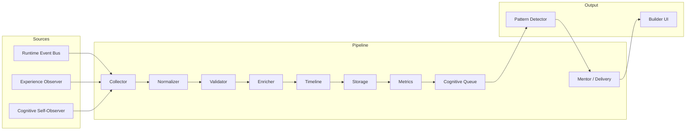

# ARCH-0033 — Observation Pipeline

| Field | Value |
|-------|-------|
| **ID** | ARCH-0033 |
| **Name** | Observation Pipeline |
| **Version** | 1.0 |
| **Status** | Draft |
| **Category** | Architecture |
| **Owner** | Chief Architect |
| **Derived from** | DOC-0000 North Star, DOC-0007 Engineering Philosophy, DOC-0009 Architectural Invariants, ARCH-0003 Core Engine Specification, ARCH-0030 Cognitive Architecture, ARCH-0031 Observation Model |
| **Referenced by** | ARCH-0032 Event Taxonomy, ARCH-0034 Behavioral Metrics, ARCH-0035 Observation Schema, SPEC-0005 Cognitive Protocol |
| **Principle** | Every insight must be traceable to a deterministic, testable pipeline stage |

---

## 1. Purpose

Every observation begins as an event. Before the Cognitive Layer can detect patterns, compute metrics, or generate insights, raw events must travel through a structured pipeline that normalizes, validates, enriches, orders, stores, and queues them for processing. This pipeline is the backbone of the entire observation system.

This document defines the complete pipeline from event origination to storage and cognitive processing. Every stage is deterministic, testable, and operates without AI. Each stage has a single responsibility, well-defined inputs and outputs, explicit failure modes, and bounded retry behavior. The pipeline is designed to be observable itself — every transformation, rejection, and enrichment is logged and traceable.

The pipeline exists to enforce a strict separation of concerns: no collector validates, no enricher stores, no storage stage interprets. This modularity ensures that each stage can be tested in isolation, replaced without side effects, and audited independently. It also ensures that the system can function correctly with zero AI models installed — every stage from raw event capture to queued insight processing is implementable in fewer than 200 lines of deterministic code.

> **Core Guarantee:** Any event that enters Stage 1 and survives to Stage 8 can be traced back through every transformation it underwent, with full auditability of why each decision was made at each stage.

---

## 2. Pipeline Overview

The Observation Pipeline consists of nine sequential stages. Every raw event that enters the pipeline passes through every stage. No stage is optional. No stage is skipped for performance. If an event fails at any stage, it is either rejected with a logged reason or processed with flagged degraded data — but the pipeline never stalls, deadlocks, or loses events silently.

### ASCII Flow

```
Experience / Runtime
    │
    ▼
┌──────────────────────┐
│  Collector           │  Stage 1: Receives raw events from sources
└──────────┬───────────┘
           ▼
┌──────────────────────┐
│  Normalizer          │  Stage 2: Standardizes format to canonical shape
└──────────┬───────────┘
           ▼
┌──────────────────────┐
│  Validator           │  Stage 3: Checks event against taxonomy
└──────────┬───────────┘
           ▼
┌──────────────────────┐
│  Enricher            │  Stage 4: Adds context (session, builder, environment)
└──────────┬───────────┘
           ▼
┌──────────────────────┐
│  Timeline            │  Stage 5: Orders and assigns sequence metadata
└──────────┬───────────┘
           ▼
┌──────────────────────┐
│  Storage             │  Stage 6: Persists to SQLite observation store
└──────────┬───────────┘
           ▼
┌──────────────────────┐
│  Metrics             │  Stage 7: Computes incremental behavioral metrics
└──────────┬───────────┘
           ▼
┌──────────────────────┐
│  Cognitive Queue     │  Stage 8: Queues for pattern detection
└──────────┬───────────┘
           ▼
┌──────────────────────┐
│  Mentor (Delivery)   │  Stage 9: Presents insights to Builder
└──────────────────────┘
```

### Mermaid Diagram



### Stage Characteristics

Every stage in the pipeline shares a common contract:

| Property | Requirement |
|----------|-------------|
| **Input** | Well-defined type; each stage declares its accepted input schema |
| **Output** | Well-defined type; output is always the input type plus additional fields |
| **Failure** | Never panics or crashes the pipeline; always logs and returns a structured error |
| **Retry** | At most 3 retries with exponential backoff (100ms, 500ms, 2s) |
| **Side effects** | Explicitly declared; no hidden file writes, network calls, or state mutations |
| **Logging** | Every stage logs entry, exit, and any warnings in structured format |
| **Determinism** | Given identical input and identical context, output must be identical |

### Data Flow per Stage

The event object accumulates fields as it progresses:

```
RawEvent → NormalizedEvent → ValidatedEvent → EnrichedEvent → TimelinedEvent → StoredEvent → MetricEvent → QueuedEvent
```

Each arrow represents a transformation that adds fields without removing existing ones. The event is immutable after Stage 2 — no stage may delete or overwrite fields set by a previous stage. Fields may only be added or flagged (e.g., `warnings` array).

---

## 3. Stage 1 — Collector

**ID:** `pipeline.stage.collector`

**Responsibility:** Capture raw events from their originating sources with minimal processing. The Collector is the outermost boundary of the pipeline — it receives signals from the Runtime, the Experience Layer, and the Cognitive Layer itself, and converts them into a uniform raw event format that downstream stages can process.

**Inputs:**
- Runtime domain events (published on the Runtime Event Bus)
- Experience interaction events (UI clicks, navigation, form submissions)
- Cognitive internal events (self-observations, metric threshold crossings, insight acknowledgments)

**Outputs:** RawEvent objects with minimal processing — timestamps are system-local, field names are source-native, and payloads are unmodified.

### 3.1 Collector Sub-types

**PushCollector**

The PushCollector subscribes to the Runtime Event Bus (see ARCH-0026 Domain Event Catalog) and receives events asynchronously as they are published. This is the primary collector for domain events such as `mission.completed`, `evidence.submitted`, `competency.advanced`, and `milestone.reached`.

Behavior:
- Maintains a persistent subscription to the event bus
- Receives events in publication order
- Each event is wrapped into a RawEvent with source metadata
- Acknowledge receipt immediately; processing is asynchronous

Implementation notes:
- The subscription uses a channel with a buffer of 1024 events
- If the buffer is full, the subscriber blocks (applies back-pressure to the Runtime)
- The Runtime's event bus is non-blocking; this back-pressure only affects the Cognitive Layer's connection to the bus

**PollCollector**

The PollCollector periodically queries the Experience Layer for state snapshots. It is used for observations that are not event-driven — such as current UI state, session duration, navigation path, and builder presence.

Behavior:
- Runs on a configurable interval (default: 5 seconds)
- Captures a snapshot of the current Experience state
- Computes deltas from the previous snapshot
- Emits RawEvents only for changed state (no duplicate snapshots)

Implementation notes:
- Poll interval is configurable via `pipeline.pollInterval`
- Delta computation uses a simple diff: if a field changed, emit an event for that field
- Full snapshots are emitted every 60 seconds regardless of changes (heartbeat)

**HookCollector**

The HookCollector receives direct emissions from Cognitive Layer components. Cognitive components such as the Pattern Detector, Metric Engine, and Insight Generator can emit internal events (e.g., `pattern.detected`, `insight.generated`, `recommendation.delivered`).

Behavior:
- Components call a hook function with the event payload
- The hook wraps the payload into a RawEvent with source metadata
- No buffering — the hook is synchronous and returns immediately

Implementation notes:
- Hook functions are registered at startup
- Each hook has a unique identifier for logging and debugging
- Hook calls are non-blocking; the calling component does not wait for pipeline processing

### 3.2 RawEvent Structure

```typescript
interface RawEvent {
  source: string           // e.g., 'runtime', 'experience', 'cognitive'
  sourceType: string       // e.g., 'mission.completed', 'navigation.changed'
  payload: unknown         // source-native payload, unmodified
  receivedAt: string       // ISO 8601, system clock
  collectorTag: string     // which collector instance received this
}
```

### 3.3 Failure Modes

| Failure | Behavior |
|---------|----------|
| Source unavailable (Runtime bus down) | Retry connection with exponential backoff (100ms, 500ms, 2s); max 3 retries; log warning and skip if all fail |
| Source unavailable (Experience not ready) | Poll collector waits for next interval; no retry needed |
| Malformed event from source | Log full event payload at DEBUG level; discard event; do not crash pipeline |
| Overflow (buffer full) | Push collector blocks until buffer drains; log warning when buffer exceeds 75% capacity |
| Hook collector exception | Catch exception, log error with stack trace, discard event |

### 3.4 Determinism

The Collector preserves event ordering within a single source. Events from different sources may interleave based on arrival time. Ordering within source is guaranteed by the sequential nature of each collector sub-type:
- PushCollector processes events in the order received from the bus
- PollCollector emits events in the order of poll cycles
- HookCollector emits events in the order components call the hook

Given the same sequence of incoming events from the same sources at the same times, the Collector always produces the same sequence of RawEvents. This is a weak guarantee (it depends on external timing), but it is sufficient for testing with recorded event sequences.

---

## 4. Stage 2 — Normalizer

**ID:** `pipeline.stage.normalizer`

**Responsibility:** Convert raw events from their source-native format into the canonical ObservationEvent format defined in ARCH-0032. The Normalizer is the first stage that produces a structured, predictable output: after this stage, every event has the same shape regardless of its origin.

**Inputs:** RawEvent objects from any collector sub-type.

**Outputs:** Normalized ObservationEvent objects conforming to the canonical schema.

### 4.1 Transforms

The Normalizer applies the following transformations in order:

**Field mapping.** Source-specific field names are mapped to canonical names via a lookup table. For example, the Runtime field `mission_id` maps to `data.missionId`, and the Experience field `current-screen` maps to `data.screen`. Unknown source fields are preserved under `data.raw` for debugging.

**Timestamp conversion.** All timestamps are converted to ISO 8601 format in UTC. Supported input formats:
- ISO 8601 (any timezone) — converted to UTC
- Unix epoch milliseconds — converted to ISO 8601
- RFC 2822 — converted to ISO 8601
- Unparseable — replaced by receipt timestamp and flagged with `warnings: ['unparseable_timestamp']`

**Identifier generation.** If the raw event does not already contain an `id`, one is generated using ULID (Universally Unique Lexicographically Sortable Identifier). The ULID is chosen over UUID because it is sortable by creation time, which aids in timeline reconstruction.

**Correlation identifiers.** The Normalizer generates:
- `correlationId` — a ULID shared by all events that originate from the same triggering action (e.g., a single builder action that produces multiple events)
- `causationId` — the `id` of the event that directly caused this event (if known)

If the raw event already contains these identifiers, they are preserved. If the `causationId` is missing, it is left null.

**Collector tag.** The `metadata.collector` field is set to the `collectorTag` from the RawEvent, preserving provenance information.

**Field stripping.** The following fields are prohibited and stripped from the event payload before normalization:
- Passwords, tokens, secrets (matched by field name pattern)
- PII content (matched by field name pattern: `email`, `phone`, `ssn`, `address`, `name` in combination with `raw` or `personal` prefixes)
- Binary blobs larger than 64KB

Stripped fields are logged at DEBUG level with their field names (not values).

### 4.2 Failure Modes

| Failure | Behavior |
|---------|----------|
| Missing required field (source, timestamp) | Drop event, log warning with event source |
| Unparseable timestamp | Use receipt timestamp, add `warnings: ['unparseable_timestamp']` |
| Unknown source identifier | Set `source: 'unknown'`, add `warnings: ['unknown_source']`, process normally |
| Stripped field present | Strip silently, log at DEBUG |
| Payload exceeds size limit (1MB) | Drop event, log warning with size |

### 4.3 Determinism

Given the exact same raw event, the Normalizer always produces the exact same ObservationEvent. This is guaranteed by:
- Deterministic ULID generation (seeded correctly, ULIDs embed timestamp so they are deterministic for the same input at the same time — but for testability, a deterministic ULID source can be injected)
- Deterministic field mapping (pure function + lookup table)
- Deterministic timestamp conversion (pure function)

For testing purposes, the Normalizer accepts an optional ULID generator override to produce fully deterministic output regardless of clock time.

---

## 5. Stage 3 — Validator

**ID:** `pipeline.stage.validator`

**Responsibility:** Verify that the normalized event conforms to the Observation Event Taxonomy (ARCH-0032). The Validator enforces schema compliance at runtime — it is the gate that prevents malformed, unknown, or unsupported events from entering the cognitive system.

**Inputs:** Normalized ObservationEvent.

**Outputs:** Validated event or rejection with structured reason.

### 5.1 Validation Rules

**Event type existence.** The event's `type` field must exist in the registered taxonomy (ARCH-0032). The taxonomy is loaded at startup and contains every known event type with its schema, version, and description. If the type is not found, the event is rejected.

**Payload schema match.** The event's `data` payload must match the JSON Schema registered for that event type. The schema defines which fields are required, their types, allowed values, and structural constraints. Validation uses a schema validator with no external dependencies.

**Required field presence.** Every event must have at minimum:
- `id` (string, non-empty)
- `type` (string, must exist in taxonomy)
- `source` (one of `runtime`, `experience`, `cognitive`, `unknown`)
- `timestamp` (string, valid ISO 8601)
- `data` (object, may be empty)

If any required field is missing or invalid, the event is rejected.

**Version support.** The event must carry a `version` field indicating the taxonomy version it conforms to. The Validator supports events at the current version (N) and the two previous versions (N-1, N-2). Events at version N-3 or older are either:
- Rejected if no downgrade transform exists, or
- Downgrade-transformed if a registered downgrade path is available (the transform converts the old format to the current format)

**Version downgrade transform.** When an event at version N-2 or N-1 is received and a downgrade transform is registered, the Validator applies the transform and processes the event as if it were at version N. The transform is a pure function that maps old-format payloads to current-format payloads. Downgrade transforms are registered at startup alongside the taxonomy.

### 5.2 Rejection Handling

When an event is rejected, the Validator:
1. Creates a structured rejection record containing the event ID, the validation rule that failed, the expected value, and the actual value
2. Writes the rejection record to the invalid-event-log (a separate SQLite table)
3. Logs the rejection at WARN level
4. Does NOT pass the event to Stage 4

The invalid-event-log is queryable by operators and is used for:
- Debugging integration issues with event sources
- Identifying taxonomy drift
- Auditing the pipeline's rejection behavior

### 5.3 Failure Modes

| Failure | Behavior |
|---------|----------|
| Unknown event type | Reject with reason `unknown_type`, log to invalid-event-log |
| Schema mismatch | Reject with reason `schema_mismatch`, include expected vs actual in rejection record |
| Missing required field | Reject with reason `missing_field`, include field name |
| Version too old (N-3+) and no downgrade path | Reject with reason `unsupported_version` |
| Version too old but downgrade available | Apply transform silently, flag event with `downgraded_from: version` |
| Taxomony not loaded (startup error) | Fail-open: allow events through with WARNING log; do not block pipeline |

### 5.4 Determinism

Given the same normalized event and the same taxonomy, the Validator always produces the same result (pass or fail with the same rejection reason). This is guaranteed by:
- Purely functional validation (no state, no I/O)
- Deterministic schema matching (same schema, same payload, same result)
- Deterministic downgrade transforms (pure functions)

---

## 6. Stage 4 — Enricher

**ID:** `pipeline.stage.enricher`

**Responsibility:** Add contextual data that is not present in the raw event and cannot be derived from the event alone. The Enricher bridges the gap between what the event says and what the system knows about the current environment, session, and builder state.

**Inputs:** Validated ObservationEvent.

**Outputs:** Enriched event with additional context fields under `context`.

### 6.1 Enrichment Fields

The Enricher populates the following fields on the event's `context` object:

**Builder session information:**
- `sessionId` — the current session identifier (from session store)
- `sessionStart` — ISO 8601 timestamp of when the current session began
- `sessionEventCount` — number of events in this session so far (including this one)

**Builder journey/mission context:**
- `currentJourneyId` — the builder's currently active journey, if any
- `currentMissionId` — the builder's currently active mission, if any
- `currentCompetencyId` — the competency being developed, if applicable

**Temporal context:**
- `deltaFromLastEvent` — milliseconds since the last event from this builder (computed from session store)
- `sessionDuration` — milliseconds since session start

**Environment flags:**
- `isOffline` — whether the system is in offline mode
- `isLowPower` — whether the device is in low-power mode
- `isBackground` — whether the application is in the background
- `platform` — platform identifier (e.g., `web`, `desktop`, `mobile`)

### 6.2 Context Sources

**Session Store (in-memory).** The session store maintains a lightweight in-memory map of active builder sessions. Each session record contains:
- `sessionId`, `sessionStart`, `eventCount`
- `lastEventTimestamp` (for delta computation)
- `currentJourneyId`, `currentMissionId`, `currentCompetencyId`

The session store is updated by the Enricher after each event is enriched (the event count increments, the last event timestamp updates).

**Builder State Snapshot (cached).** The Enricher maintains a cached snapshot of the builder's current state, refreshed from the Runtime on session start and whenever the cache expires (TTL: 30 seconds). The snapshot contains the builder's current journey, mission, and competency context.

**Environment Probe.** The Enricher probes the environment at enrichment time using platform APIs. The probe is called once per enrichment and caches results for 1 second to avoid redundant probes on burst events.

### 6.3 Failure Modes

| Failure | Behavior |
|---------|----------|
| Session store unavailable | Enrich with empty context fields (nulls), add `warnings: ['session_store_unavailable']` |
| Builder state cache expired | Return cached data as-is, add `warnings: ['stale_builder_context']` |
| Environment probe fails | Set environment flags to defaults (offline=false, lowPower=false), add `warnings: ['environment_probe_failed']` |
| Delta computation overflow | Clamp delta to 0 or maximum (24 hours), add warning |

### 6.4 Determinism

Given the same validated event and the same in-memory context (session store + builder cache + environment probe results), the Enricher always produces the same enriched event. In practice, context changes over time, so the same event enriched at two different times may produce different results. This is acceptable because:
- The context reflects real-world conditions that genuinely differ
- For testing, the context sources are injectable and can be frozen to a known state
- The pipeline logs the context state alongside each enrichment for auditability

---

## 7. Stage 5 — Timeline

**ID:** `pipeline.stage.timeline`

**Responsibility:** Assign temporal ordering and sequence metadata to each event. The Timeline stage is responsible for ensuring that events can be replayed in order, that gaps between events are measurable, and that session structure is preserved.

**Inputs:** Enriched ObservationEvent.

**Outputs:** Timeline-ordered event with sequence number, delta, and session segment metadata.

### 7.1 Operations

**Global sequence number.** Each event receives a monotonically increasing sequence number unique to the builder. The sequence counter is stored in-memory and persisted to SQLite every 100 events (checkpoint). On recovery, the counter is loaded from the database.

Sequence number properties:
- Starts at 1 for each builder's first event
- Monotonically increasing (no gaps)
- Never reused, even after event rejection or rollback
- The counter is per-builder, not global (each builder has their own sequence)

**Delta from previous event.** The Timeline computes the time gap in milliseconds between this event and the previous event from the same builder. The previous event's timestamp is read from the in-memory session store (last event timestamp, updated by Stage 4's Enricher).

Edge cases:
- First event in session — delta is 0
- Clock skew detected (client timestamp is before previous event's timestamp) — delta is 0, and the event is flagged with `warnings: ['negative_delta_clamped']`
- Previous event timestamp is unavailable — delta is null

**Parent event linking.** If this event is part of a known session or flow, the Timeline links it to the parent event that started the session. Session start is identified by events with `source: 'runtime'` and `type: 'session.started'`. The parent event ID is stored in the event's `context.parentEventId`.

**Session segment tagging.** The Timeline assigns a session segment tag based on the event's position within the session:
- `session_start` — the first event of a new session
- `session_middle` — any event that is not the first or last (within the current batch window)
- `session_end` — the last event before a gap longer than 30 minutes (computed in post-processing; during real-time pipeline, this is speculative and tagged as `session_end_candidate`)

### 7.2 Failure Modes

| Failure | Behavior |
|---------|----------|
| Clock skew (client timestamp before server timestamp by > 5s) | Use server timestamp as event time, flag with `warnings: ['clock_skew_detected']` |
| Missing previous event (session store lost) | Start new segment, set `segment: 'session_start'`, add `warnings: ['missing_previous_event']` |
| Sequence counter not persisted yet (crash before checkpoint) | On recovery, reconstruct counter from max sequence number in database; accept potential gap of up to 100 events |

### 7.3 Determinism

Given an ordered sequence of enriched events and a stable session store, the Timeline produces the same sequence numbers, deltas, and segment tags every time. The sequence counter is the only stateful component, and it is deterministic given the same event order.

---

## 8. Stage 6 — Storage

**ID:** `pipeline.stage.storage`

**Responsibility:** Persist the fully processed event to the observation database (SQLite). The Storage stage is the first point at which the event becomes durable — once written, it is immutable and queryable.

**Inputs:** Timeline-ordered event with all accumulated fields.

**Outputs:** Persisted event with storage metadata (row ID, storage timestamp, checksum).

### 8.1 Operations

**Write to observation table.** The event is written to the `observations` table in the SQLite observation database. The schema is defined in ARCH-0035. Each event is stored as a single row with:
- All top-level fields as columns (id, type, source, timestamp, version, sequence, etc.)
- The `data` and `context` payloads as JSON-encoded columns
- A `checksum` computed over the entire serialized event (SHA-256 of the canonical JSON representation)

The write is executed inside a transaction. If the write fails, the transaction is rolled back and no partial data is written.

**Update materialized aggregates.** The Storage stage maintains a set of materialized aggregates that are updated incrementally with each event:
- `event_count_total` — incremented by 1
- `event_count_by_type` — per-type counter incremented
- `event_count_by_source` — per-source counter incremented
- `last_event_timestamp` — updated to the event timestamp
- `session_count` — incremented if the event has `segment: 'session_start'`

These aggregates are stored in a separate `observation_aggregates` table and are used for dashboard metrics, pipeline health monitoring, and quick queries without scanning the full event table.

**Retention/pruining check.** After each write, the Storage stage checks whether the total event count exceeds the configured retention threshold (default: 1,000,000 events per builder). If the threshold is exceeded, the oldest events are pruned to bring the count to 80% of the threshold. Pruning is logged and the number of deleted events is recorded.

Pruning rules:
- Oldest events are pruned first (by sequence number ASC)
- Events marked as `protected` (by configuration) are never pruned
- Pruning runs at most once per 100 events to avoid excessive I/O

### 8.2 Failure Modes

| Failure | Behavior |
|---------|----------|
| Write failure (disk full, I/O error) | Retry 3 times (100ms, 500ms, 2s); if all fail, buffer event to in-memory queue (max 1000 buffered events); log CRITICAL |
| Database locked | Wait with exponential backoff (100ms, 500ms, 2s); max 3 retries; then buffer to memory |
| Checksum mismatch on read-after-write | Log ERROR, do not crash; the event was written, but verification failed — flag for operator review |
| Retention prune fails | Log WARNING, skip prune, retry on next event |

### 8.3 Determinism

The Storage stage is deterministic: given the same event, the same SQL is executed, and the same row is written (assuming the event ID is unique). The checksum provides a verifiable guarantee that what was written matches what was computed upstream.

---

## 9. Stage 7 — Metrics

**ID:** `pipeline.stage.metrics`

**Responsibility:** Update behavioral metrics in real-time as events flow through the pipeline. The Metrics stage is the bridge between raw observed events and the computed metrics that drive pattern detection and insight generation.

**Inputs:** Persisted event (from Stage 6).

**Outputs:** Updated metric values stored in the metrics store (see ARCH-0034 for metric definitions).

### 9.1 Operations

**Incremental metric computation.** Each event triggers updates to the relevant behavioral metrics. Metrics are computed incrementally — they are not recalculated from scratch on each event. The incremental approach ensures that metric updates are O(1) per event regardless of the total event count.

The following metrics are updated by type:

- **Focus Score** — Updated on events with type `navigation.*`, `mission.started`, `mission.completed`. Formula: rolling window of 50 events, ratio of mission-focused events to total events.
- **Learning Velocity** — Updated on events with type `mission.completed`, `evidence.submitted`, `competency.advanced`. Formula: XP gained per unit time, smoothed with exponential moving average (alpha = 0.15).
- **Consistency Score** — Updated on events with type `session.*`, `login`, `logout`. Formula: ratio of active days to total days in the current streak window.
- **Completion Rate** — Updated on events with type `mission.completed`, `mission.failed`, `mission.abandoned`. Formula: completed missions / (completed + failed + abandoned).
- **Stagnation Risk** — Updated on events with type `mission.failed`, `session.ended`, `navigation.*`. Formula: time since last completion / average time between completions. If ratio exceeds 3.0, risk is flagged.
- **Cognitive Load** — Updated on events with type `session.*`, `navigation.*`, `evidence.submitted`. Formula: event density (events per minute) in the last 30-minute window, normalized to a 0–100 scale.

Each metric update is a pure function of:
- The current metric value (loaded from the metrics store)
- The incoming event
- The metric's configuration parameters (window size, alpha, thresholds)

**Metric snapshot persistence.** Metric values are periodically persisted to the metrics store (SQLite, separate from the observation database). Snapshots are taken:
- Every 10 events (lightweight checkpoint)
- Every 60 seconds (time-based checkpoint)
- On pipeline shutdown (final checkpoint)

Snapshots store the metric name, its current value, the timestamp, and the event count at the time of snapshot.

### 9.2 Failure Modes

| Failure | Behavior |
|---------|----------|
| Metric computation error (division by zero, overflow) | Log ERROR with metric name and event ID; skip metric update for this event; continue pipeline |
| Metric value overflow | Clamp to valid range (each metric defines its valid range, typically 0–100 or 0.0–1.0) |
| Metric store unavailable | Cache updates in memory (max 1000); flush when store is available; log WARNING |
| Unknown event type for metrics | No metric update triggered; this is normal for events that carry no metric relevance |

### 9.3 Determinism

Given the same sequence of persisted events and the same initial metric state, the Metrics stage always produces the same sequence of metric values. This is guaranteed by:
- Incremental update formulas that are pure functions
- Deterministic decimal arithmetic (no floating-point ambiguity — metrics use scaled integers or Decimal types)
- The same event sequence always triggers the same updates

This determinism is critical for testing: a recorded event sequence replayed through the pipeline must produce the exact same metric trajectory.

---

## 10. Stage 8 — Cognitive Queue

**ID:** `pipeline.stage.queue`

**Responsibility:** Queue fully processed events for consumption by the Pattern Detector and other cognitive processors. The Cognitive Queue decouples the real-time event pipeline from the batch-oriented pattern detection system.

**Inputs:** Persisted event with updated metrics.

**Outputs:** Queued event ready for retrieval by the Pattern Detector.

### 10.1 Operations

**FIFO queue insertion.** Each event is added to a FIFO (First-In, First-Out) queue. The queue preserves the order in which events exited Stage 7 — this is the same as the original event order from Stage 5 (Timeline), which guarantees that the Pattern Detector receives events in temporal order.

**Priority levels.** Events are assigned a priority level based on their type. The queue maintains three priority levels, each with its own FIFO sub-queue:

| Priority | Types | Description |
|----------|-------|-------------|
| High | `achievement.*`, `milestone.*`, `error.*`, `competency.*`, `risk.*` | Time-sensitive events that need immediate pattern detection |
| Normal | `mission.*`, `evidence.*`, `session.*`, `builder.*` | Standard events that drive core metrics |
| Low | `navigation.*`, `ui.*`, `heartbeat`, `poll.*` | Low-significance events that can wait |

Within each priority level, events are strictly FIFO. Across priority levels, the queue uses weighted fair scheduling: for every 10 events dequeued, the distribution is approximately 5 high, 3 normal, 2 low. This prevents high-priority events from starving normal and low events while ensuring time-sensitive events are processed promptly.

**Batching.** The queue groups events into batches for efficient processing by the Pattern Detector. The default batch size is 50 events. A batch is formed when:
- The batch reaches 50 events, OR
- A configurable flush interval elapses (default: 1000ms), whichever comes first

Batches are homogeneous in priority (all events in a single batch share the same priority level). When forming a batch from the high-priority sub-queue, the batch size may be smaller (minimum 5) to avoid delays in high-priority processing.

### 10.2 Failure Modes

| Failure | Behavior |
|---------|----------|
| Queue full (buffer exceeded) | Block producer with back-pressure; wait until queue drops below 80% capacity; log WARNING |
| Consumer slow (Pattern Detector not keeping up) | Spill to disk: serialize queue to temporary SQLite table; log WARNING |
| Disk spill fails | Drop oldest events (from low-priority queue first); log CRITICAL |
| Priority misclassification | Events with unregistered types default to `normal` priority; log WARNING for unrecognized type |

### 10.3 Determinism

The queue preserves ordering within each priority level. Given the same sequence of input events, the queue always yields the same sequence of batches (same events in the same order, split into the same batches). The batch boundaries depend on the flush interval, which is a configurable parameter — for testing, the interval can be set to 0 (flush immediately) to produce deterministic batch boundaries.

---

## 11. Stage 9 — Mentor (Delivery)

**ID:** `pipeline.stage.mentor`

**Responsibility:** Deliver insights and recommendations from the Cognitive Layer to the Experience Layer for presentation to the Builder. The Mentor is the terminal stage of the pipeline — it is the interface between processed understanding and human consumption.

**Inputs:** Insights from cognitive processing (Pattern Detector, Insight Generator, Recommendation Engine).

**Outputs:** Presented insights in the Builder UI, with tracking of acknowledgment and dismissal.

### 11.1 Operations

**Subscribe to insight stream.** The Mentor subscribes to the insight stream produced by the Cognitive Layer's processing components. The subscription follows the ACP (SPEC-0005) protocol:

```
Pattern Detector → [publishes] → Insight Stream
Insight Generator → [publishes] → Insight Stream
Mentor → [subscribes] → Insight Stream → Experience Layer
```

The Mentor receives insights asynchronously and does not block the cognitive processing pipeline.

**Format insights for presentation.** Each insight is transformed from its internal representation into a presentation format suitable for the Experience Layer. The transformation includes:
- Selecting the appropriate UI component (notification, card, modal, badge)
- Composing the display text (title, body, action label)
- Setting the display priority (urgent, normal, low)
- Determining the display duration (persistent, timed, dismissible)

The formatting rules are deterministic and configurable via a presentation configuration file. No AI is involved in the formatting — every insight type has a registered presentation template.

**Track acknowledgment and dismissal.** When the Builder interacts with a presented insight (accepts, dismisses, snoozes), the Mentor:
1. Records the interaction as a new ObservationEvent (source: `experience`, type: `insight.acknowledged` / `insight.dismissed` / `insight.snoozed`)
2. Forwards the interaction back to the Cognitive Layer for processing (the interaction becomes input to future insight generation)
3. Updates the insight's status in the local insight registry

This feedback loop ensures that the Cognitive Layer learns which insights are useful to the Builder and which are not — without using any AI.

### 11.2 Failure Modes

| Failure | Behavior |
|---------|----------|
| Experience Layer unavailable (UI not ready) | Buffer insights in memory (max 100); retry delivery every 5 seconds; discard oldest if buffer full |
| Insight formatting fails (missing template) | Use generic template, log ERROR with insight type |
| Acknowledgment recording fails | Log ERROR; insight status remains in registry for retry |

### 11.3 Determinism

The Mentor is deterministic given the same insight stream and the same presentation configuration. The same insight always produces the same formatted output. The acknowledgment feedback loop introduces state (which insights were dismissed), which affects future presentation — this is expected behavior and is traceable through the observation event stream.

---

## 12. Pipeline Configuration

All pipeline stages share a common configuration namespace under `pipeline.*`. Configuration is loaded at startup from a TOML or JSON file and can be overridden by environment variables.

| Parameter | Type | Default | Description |
|-----------|------|---------|-------------|
| `pipeline.batchSize` | integer | 50 | Number of events per batch for Cognitive Queue |
| `pipeline.flushInterval` | integer | 1000 | Milliseconds between queue flushes |
| `pipeline.maxRetries` | integer | 3 | Maximum retry attempts per stage |
| `pipeline.bufferSize` | integer | 10000 | Maximum in-memory events before back-pressure |
| `pipeline.pollInterval` | integer | 5000 | Milliseconds between PollCollector cycles |
| `pipeline.retentionThreshold` | integer | 1000000 | Maximum events per builder before pruning |
| `pipeline.retentionTarget` | float | 0.8 | Target fraction of threshold after pruning |
| `pipeline.clockSkewThreshold` | integer | 5000 | Milliseconds above which clock skew is flagged |
| `pipeline.sessionTimeout` | integer | 1800000 | Milliseconds of inactivity before session ends (30 min) |
| `pipeline.stage.<name>.enabled` | boolean | true | Enable/disable specific stages (for debugging) |

### Configuration Profiles

Pre-defined configuration profiles allow quick switching between operational modes:

**Default profile.** Balanced settings for normal operation. Events are processed in batches of 50, flushed every second, with a buffer of 10,000 events.

**Low-latency profile.** Optimized for real-time feedback. Batch size reduced to 10, flush interval reduced to 200ms, buffer increased to 50,000 events. Suitable for interactive experiences where builders expect immediate cognitive feedback.

**Batch profile.** Optimized for offline/sync operation. Batch size increased to 500, flush interval increased to 10 seconds, buffer increased to 200,000 events. Suitable for mobile devices or environments with intermittent connectivity.

**Debug profile.** Every stage logs at DEBUG level. Batch size set to 1, flush interval set to 0. No buffering. All events are processed synchronously. Suitable for testing, auditing, and troubleshooting.

---

## 13. Error Handling Summary

| Stage | Error | Behavior | Log Level | Retry |
|-------|-------|----------|-----------|-------|
| Collector | Source unavailable | Retry connection, skip if all fail | WARNING | 3x (100ms, 500ms, 2s) |
| Collector | Malformed event | Discard event | DEBUG | None |
| Collector | Buffer overflow | Block producer (back-pressure) | WARNING | N/A |
| Normalizer | Missing required field | Drop event | WARNING | None |
| Normalizer | Unparseable timestamp | Use receipt timestamp, flag warning | WARNING | None |
| Normalizer | Unknown source | Tag as `unknown`, process normally | WARNING | None |
| Normalizer | Payload exceeds size limit | Drop event | WARNING | None |
| Validator | Unknown event type | Reject, log to invalid-event-log | WARNING | None |
| Validator | Schema mismatch | Reject, log expected vs actual | WARNING | None |
| Validator | Missing field | Reject | WARNING | None |
| Validator | Version too old (no downgrade) | Reject | WARNING | None |
| Validator | Taxonomy not loaded | Fail-open (allow events) | WARNING | N/A |
| Enricher | Context unavailable | Use defaults, flag warning | WARNING | None |
| Enricher | Stale context | Proceed with available data | INFO | None |
| Enricher | Environment probe fails | Use defaults | WARNING | None |
| Timeline | Clock skew | Flag, use server time | WARNING | None |
| Timeline | Missing previous event | Start new segment | INFO | None |
| Timeline | Sequence counter not persisted | Reconstruct from DB | INFO | None |
| Storage | Write failure | Retry, then buffer to memory | ERROR | 3x (100ms, 500ms, 2s) |
| Storage | Database locked | Retry with backoff | WARNING | 3x (100ms, 500ms, 2s) |
| Storage | Checksum mismatch | Log error, flag for review | ERROR | None |
| Storage | Retention prune fails | Skip prune, retry next event | WARNING | None |
| Metrics | Computation error | Skip metric, log error | ERROR | None |
| Metrics | Metric overflow | Clamp to valid range | WARNING | None |
| Metrics | Metric store unavailable | Cache in memory | WARNING | None |
| Queue | Buffer full (back-pressure) | Block producer | WARNING | N/A |
| Queue | Consumer slow | Spill to disk | WARNING | N/A |
| Queue | Disk spill fails | Drop oldest (low priority first) | CRITICAL | None |
| Queue | Priority misclassification | Default to `normal` | WARNING | None |
| Mentor | UI unavailable | Buffer in memory, retry | WARNING | Repeated (5s interval) |
| Mentor | Formatting fails | Use generic template | ERROR | None |
| Mentor | Acknowledgment fails | Log error, retry | ERROR | None |

### Error Propagation Rules

1. **Errors do not propagate upstream.** If a stage fails, the error is handled locally. No exception propagates to the calling stage. The pipeline remains operational.
2. **Warnings do not stop processing.** Events with warnings continue through the pipeline with flagged metadata. Rejections stop only at the rejecting stage.
3. **Critical errors are always logged.** Any error that causes data loss or pipeline degradation is logged at CRITICAL level and triggers an operator alert if configured.
4. **Recovery is automatic.** No manual intervention is required to recover from any failure mode. Buffered events are replayed when the failing stage recovers.
5. **Silent drops are forbidden.** If an event is dropped at any stage, the reason is always logged at WARNING or higher.

---

## 14. Testing Strategy

Every stage in the pipeline must be independently testable. The following testing approach applies to all stages:

**Unit tests.** Each stage has a unit test suite that covers:
- Happy path (valid input produces expected output)
- Edge cases (empty payload, boundary values, null fields)
- Each failure mode (stage fails gracefully)
- Determinism (same input always produces same output)

**Integration tests.** Pipeline integration tests verify:
- End-to-end flow: a recorded sequence of raw events flows through all stages and produces the expected stored events and metrics
- Error propagation: a failure in one stage does not crash the pipeline or corrupt downstream data
- Configuration changes: different profiles produce expected behavior (batch sizes, flush intervals, etc.)

**Replay tests.** The pipeline must be able to replay a recorded event sequence and produce identical output. Replay tests verify:
- Deterministic metric computation
- Deterministic sequence numbering
- Deterministic batch formation

**Chaos tests.** Random failures are injected at each stage to verify:
- Pipeline recovers automatically
- No data loss occurs
- Buffered events are eventually processed

---

## 15. Performance Characteristics

Each stage declares its expected performance characteristics:

| Stage | Latency (p50) | Latency (p99) | Throughput | Memory per event |
|-------|---------------|---------------|------------|------------------|
| Collector | < 1µs | < 100µs | 100,000/s | 512 bytes |
| Normalizer | < 10µs | < 1ms | 50,000/s | 1 KB |
| Validator | < 50µs | < 5ms | 20,000/s | 512 bytes |
| Enricher | < 100µs | < 10ms | 10,000/s | 2 KB |
| Timeline | < 10µs | < 1ms | 50,000/s | 256 bytes |
| Storage | < 1ms | < 50ms | 5,000/s | 0 (disk) |
| Metrics | < 100µs | < 5ms | 20,000/s | 1 KB |
| Queue | < 10µs | < 1ms | 50,000/s | 512 bytes |

**End-to-end latency** (p50): < 2ms
**End-to-end latency** (p99): < 100ms
**Maximum sustainable throughput**: 5,000 events/second (storage-bound)

These targets assume SQLite in WAL mode on local SSD storage. Throughput degrades predictably with slower storage and increases with faster storage.

---

## 16. References

| Reference | Description |
|-----------|-------------|
| ARCH-0030 | Cognitive Architecture — the layer that owns this pipeline |
| ARCH-0031 | Observation Model — the data model that flows through this pipeline |
| ARCH-0032 | Event Taxonomy — the classification system that Stage 3 validates against |
| ARCH-0034 | Behavioral Metrics — the metric definitions that Stage 7 computes |
| ARCH-0035 | Observation Schema — the SQLite schema that Stage 6 writes to |
| SPEC-0005 | ASCEND Cognitive Protocol — the protocol governing Stage 9 delivery |
| DOC-0007 | Engineering Philosophy — the principles that guide all engineering decisions |
| DOC-0009 | Architectural Invariants — the invariant rules this pipeline must satisfy |
