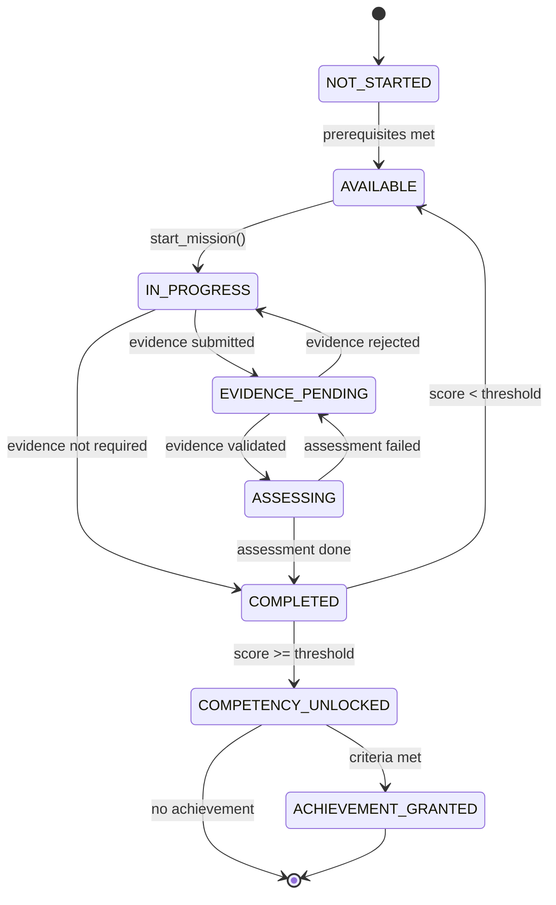
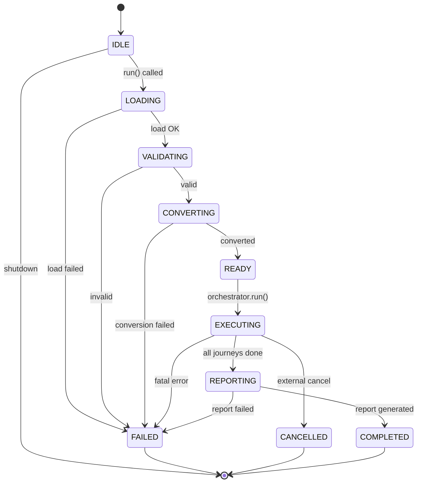
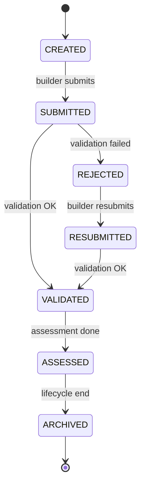
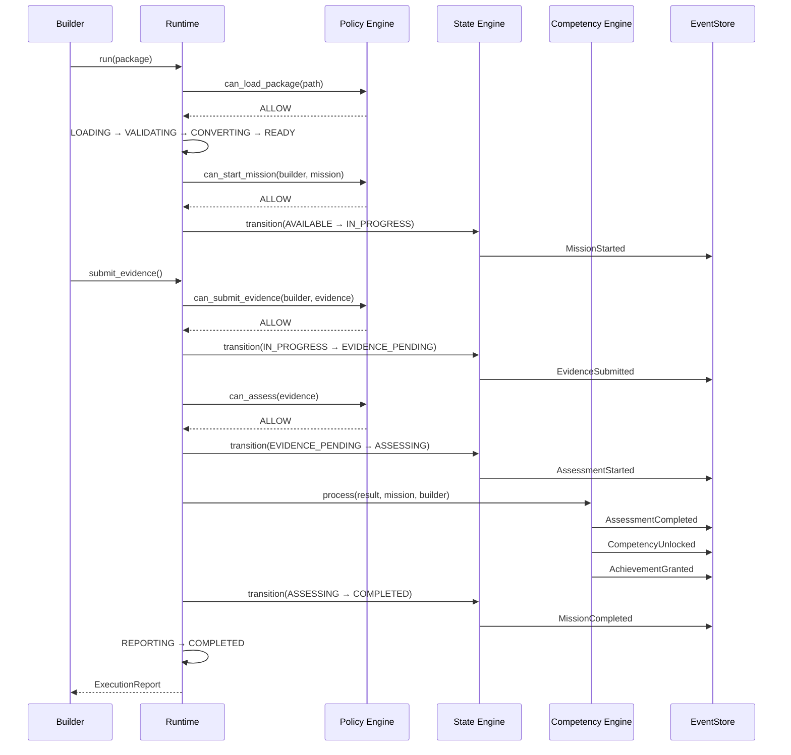

# PROTOCOL-0003 — State Protocol

| Campo | Valor |
|-------|-------|
| **ID** | PROTOCOL-0003 |
| **Nome** | State Protocol |
| **Versão** | 1.0 |
| **Status** | Stable |
| **Categoria** | Protocol |
| **Owner** | Chief Architect |
| **Derivado de** | Constituição, ARCH-0008, ARCH-0009, PROTOCOL-0001, PROTOCOL-0002 |
| **Linguagem** | Independente |

---

## 1. Propósito

Este protocolo formaliza **todos os estados, eventos, transições, pré-condições, pós-condições e estados inválidos** do ASCEND.

Ele unifica as máquinas de estado definidas em ARCH-0008 (Competency Lifecycle) e ARCH-0009 (Runtime State Machine) em um único protocolo independente de linguagem.

---

## 2. Princípios do State Protocol

| # | Princípio | Descrição |
|---|-----------|-----------|
| S1 | Tudo que muda tem estado | Toda entidade mutável possui um campo `status` |
| S2 | Toda transição é atômica | A transição completa ou falha como um todo |
| S3 | Toda transição gera um evento | Toda mudança de estado produz um DomainEvent ou RuntimeEvent |
| S4 | Estado não regride | Nenhuma transição retorna a um estado anterior |
| S5 | Estados terminais são imutáveis | COMPLETED, FAILED, CANCELLED, ARCHIVED não mudam |
| S6 | Pré-condições são obrigatórias | Toda transição exige pré-condições satisfeitas |
| S7 | Pós-condições são verificáveis | Após a transição, o estado deve ser consistente |

---

## 3. Máquinas de Estado

### 3.1 Builder State Machine

```
CREATED ──→ ACTIVE ──→ INACTIVE ──→ ARCHIVED
              ↑            │
              └────────────┘
```

| De | Para | Gatilho | Pré-condição | Pós-condição |
|----|------|---------|-------------|--------------|
| CREATED | ACTIVE | Primeira missão iniciada | Builder existe | Builder pode iniciar missões |
| ACTIVE | INACTIVE | Inatividade > N dias | Builder está ACTIVE | Builder não pode iniciar missões |
| INACTIVE | ACTIVE | Nova missão iniciada | Builder está INACTIVE | Builder retoma atividades |
| ACTIVE | ARCHIVED | Solicitação do builder | Builder está ACTIVE | Builder não pode mais ser usado |

### 3.2 Mission State Machine (Domain)

Conforme ARCH-0008:

```
NOT_STARTED ──→ AVAILABLE ──→ IN_PROGRESS ──→ EVIDENCE_PENDING ──→ ASSESSING ──→ COMPLETED
     ↑               ↑              │  ↑                │  ↑              │
     │               │              │  │                │  │              │
     └───────────────┘              └──┘                └──┘              │
                                                                          │
                                                                    COMPETENCY_UNLOCKED ──→ ACHIEVEMENT_GRANTED
```

| De | Para | Gatilho | Pré-condição | Pós-condição |
|----|------|---------|-------------|--------------|
| NOT_STARTED | AVAILABLE | Pré-requisitos cumpridos | `can_start() == True` | Missão pronta para execução |
| AVAILABLE | IN_PROGRESS | Builder chama `start_mission()` | Missão AVAILABLE, builder autorizado | Missão em execução |
| IN_PROGRESS | EVIDENCE_PENDING | Builder submete evidência | Missão IN_PROGRESS, evidência não vazia | Evidência aguardando validação |
| IN_PROGRESS | COMPLETED | `evidence_required == false` | Missão não exige evidência | Missão concluída sem evidência |
| EVIDENCE_PENDING | ASSESSING | Evidência validada | Evidência válida estruturalmente | Assessment em andamento |
| EVIDENCE_PENDING | IN_PROGRESS | Evidência rejeitada | Evidência inválida | Builder pode reenviar |
| ASSESSING | COMPLETED | Assessment finalizado | Score calculado | Missão concluída |
| ASSESSING | EVIDENCE_PENDING | Falha técnica no assessment | Erro recuperável | Retry permitido |
| COMPLETED | COMPETENCY_UNLOCKED | Score >= mastery_threshold | Missão COMPLETED, threshold atingido | Competência desbloqueada |
| COMPLETED | AVAILABLE | Score < mastery_threshold | Missão COMPLETED, threshold não atingido | Missão disponível para retry |
| COMPETENCY_UNLOCKED | ACHIEVEMENT_GRANTED | Critérios do achievement satisfeitos | Competência UNLOCKED | Achievement concedido |

### 3.3 Evidence State Machine

```
CREATED ──→ SUBMITTED ──→ VALIDATED ──→ ASSESSED ──→ ARCHIVED
              │              │
              ▼              ▼
          REJECTED ────→ RESUBMITTED
```

| De | Para | Gatilho | Pré-condição | Pós-condição |
|----|------|---------|-------------|--------------|
| CREATED | SUBMITTED | Builder envia evidência | Evidência criada | Evidência aguardando validação |
| SUBMITTED | VALIDATED | Validação estrutural OK | Evidência SUBMITTED | Evidência apta para assessment |
| SUBMITTED | REJECTED | Validação falha | Evidência SUBMITTED | Evidência rejeitada |
| REJECTED | RESUBMITTED | Builder corrige e reenvia | Evidência REJECTED | Evidência reenviada |
| RESUBMITTED | VALIDATED | Validação OK no reenvio | Evidência RESUBMITTED | Evidência apta para assessment |
| VALIDATED | ASSESSED | Assessment concluído | Evidência VALIDATED | Evidência avaliada |
| ASSESSED | ARCHIVED | Fim do ciclo de vida | Evidência ASSESSED | Evidência arquivada |

### 3.4 Assessment State Machine

```
PENDING ──→ IN_PROGRESS ──→ COMPLETED
                │
                ▼
             FAILED ──→ RETRY
```

| De | Para | Gatilho | Pré-condição | Pós-condição |
|----|------|---------|-------------|--------------|
| PENDING | IN_PROGRESS | Pipeline inicia avaliação | Evidência VALIDATED | Assessment em andamento |
| IN_PROGRESS | COMPLETED | Score calculado | Rubrica aplicada | Assessment concluído |
| IN_PROGRESS | FAILED | Erro no pipeline | Falha técnica | Assessment falhou |
| FAILED | RETRY | Nova tentativa autorizada | Assessment FAILED | Retry em andamento |
| RETRY | IN_PROGRESS | Pipeline reinicia | Retry autorizado | Assessment reiniciado |

### 3.5 Competency State Machine

```
LOCKED ──→ AVAILABLE ──→ IN_PROGRESS ──→ UNLOCKED ──→ MASTERED
```

| De | Para | Gatilho | Pré-condição | Pós-condição |
|----|------|---------|-------------|--------------|
| LOCKED | AVAILABLE | Package define a competência | Competência definida no pacote | Competência visível |
| AVAILABLE | IN_PROGRESS | Builder inicia missão relacionada | Missão associada iniciada | Progresso sendo medido |
| IN_PROGRESS | UNLOCKED | Assessment aprovado >= threshold | Missão COMPLETED, score >= threshold | Competência desbloqueada |
| UNLOCKED | MASTERED | Múltiplas evidências de alto nível | N evidências com score >= 0.9 | Competência dominada |

### 3.6 Achievement State Machine

```
NOT_EARNED ──→ EARNED ──→ REVOKED
```

| De | Para | Gatilho | Pré-condição | Pós-condição |
|----|------|---------|-------------|--------------|
| NOT_EARNED | EARNED | Critérios do achievement satisfeitos | Competência UNLOCKED | Achievement concedido |
| EARNED | REVOKED | Evidência invalidada em auditoria | Achievement EARNED | Achievement removido |

### 3.7 Runtime State Machine

Conforme ARCH-0009:

```
IDLE ──→ LOADING ──→ VALIDATING ──→ CONVERTING ──→ READY ──→ EXECUTING ──→ REPORTING ──→ COMPLETED
  │         │              │              │           │          │              │
  │         ▼              ▼              ▼           │          ▼              ▼
  │      FAILED          FAILED         FAILED        │      FAILED          FAILED
  │                                                    │     CANCELLED
  └────────────────────────────────────────────────────┘
```

| De | Para | Gatilho | Pré-condição | Pós-condição |
|----|------|---------|-------------|--------------|
| IDLE | LOADING | `Kernel.run()` chamado | Builder existe, path válido | Pacote sendo carregado |
| LOADING | VALIDATING | `PackageLoader.load()` OK | package.yaml parseável | Pacote carregado |
| LOADING | FAILED | `PackageLoader.load()` falha | Erro de leitura | Estado terminal |
| VALIDATING | CONVERTING | `PackageValidator.validate()` OK | Nenhum erro de validação | Pacote validado |
| VALIDATING | FAILED | `PackageValidator.validate()` falha | Erros de validação | Estado terminal |
| CONVERTING | READY | `PackageConverter.convert()` OK | APS convertido | Pacote pronto |
| CONVERTING | FAILED | `PackageConverter.convert()` falha | Erro de conversão | Estado terminal |
| READY | EXECUTING | `RuntimeOrchestrator.run()` | Contexto montado | Execução iniciada |
| EXECUTING | REPORTING | Todas as journeys processadas | Nenhum erro fatal | Relatório sendo gerado |
| EXECUTING | FAILED | Erro fatal não recuperável | Exceção não capturada | Estado terminal |
| EXECUTING | CANCELLED | Cancelamento externo | Sinal de interrupção | Estado terminal |
| REPORTING | COMPLETED | `ExecutionReport` gerado | Relatório montado | Estado terminal |
| REPORTING | FAILED | Falha ao gerar relatório | Erro de consolidação | Estado terminal |

---

## 4. Estados Inválidos

### 4.1 Combinações Proibidas

| Combinação | Motivo | Invariante |
|------------|--------|------------|
| Mission COMPLETED sem evidence | Violação do ciclo de vida | CL-001 |
| Competency UNLOCKED sem assessment | Violação da North Star | I-002 |
| Achievement EARNED sem competency | Violação da dependência | CL-002 |
| Assessment COMPLETED sem evidence | Violação do pipeline | CL-003 |
| Evidence ASSESSED sem challenge | Violação da ordem causal | CL-004 |
| Mission IN_PROGRESS sem prerequisites | Violação de regra de domínio | CL-005 |
| Runtime COMPLETED sem REPORTING | Pipeline incompleto | ARCH-0009 |
| Runtime EXECUTING sem CONVERTING | Pipeline incompleto | ARCH-0009 |

### 4.2 Transições Proibidas

| Tentativa | Motivo |
|-----------|--------|
| NOT_STARTED → ASSESSING | Pula desafio e evidência |
| AVAILABLE → EVIDENCE_PENDING | Pula IN_PROGRESS |
| IN_PROGRESS → COMPETENCY_UNLOCKED | Pula assessment |
| EVIDENCE_PENDING → COMPLETED | Pula assessment |
| ASSESSING → ACHIEVEMENT_GRANTED | Pula COMPLETED e COMPETENCY_UNLOCKED |
| COMPLETED → ASSESSING | Regressão de estado |
| IDLE → EXECUTING | Pula LOADING, VALIDATING, CONVERTING |
| LOADING → READY | Pula VALIDATING e CONVERTING |
| VALIDATING → EXECUTING | Pula CONVERTING |
| READY → FAILED | Estado impossível |
| EXECUTING → COMPLETED | Pula REPORTING |
| COMPLETED → EXECUTING | Regressão de estado |

---

## 5. Diagramas Mermaid

### 5.1 Domain State Machine (ARCH-0008)



### 5.2 Runtime State Machine (ARCH-0009)



### 5.3 Evidence State Machine



### 5.4 Fluxo Completo de Estados



---

## 6. Garantias do State Protocol

| Garantia | Descrição | Verificação |
|----------|-----------|-------------|
| **Unicidade de estado** | Entidade está em exatamente um estado por vez | Enum, sem overlap |
| **Transições atômicas** | Transição completa ou falha como um todo | Unit of Work |
| **Não regressão** | Nenhuma transição retorna a estado anterior | State machine validation |
| **Eventos imutáveis** | Eventos são append-only | EventStore |
| **Rastreabilidade** | Toda transição deixa evento rastreável | trace_id |
| **Pré-condições verificadas** | Toda transição valida pré-condições | Policy Engine |
| **Pós-condições garantidas** | Estado consistente após transição | Invariants check |
| **Determinismo** | Mesmo input → mesma sequência de estados | Clock injetado |

---

## 7. Compliance com a Constituição

| Elemento do State Protocol | Constituição | ARCH | Invariante |
|---------------------------|-------------|------|------------|
| Builder State Machine | DOC-0004 | ARCH-0002 | — |
| Mission State Machine | North Star | ARCH-0008 | CL-001 a CL-007 |
| Evidence State Machine | P1, P7 | ARCH-0008 | CL-003, CL-004 |
| Assessment State Machine | P1 | ARCH-0008 | CL-001 |
| Competency State Machine | North Star | ARCH-0008 | I-002 |
| Achievement State Machine | — | ARCH-0008 | CL-002 |
| Runtime State Machine | — | ARCH-0009 | ARCH-0009-001 |
| Princípios S1-S7 | DOC-0007 | ARCH-0003 | — |

---

## 8. Declaração Final

> **PROTOCOL-0003 é a especificação formal de todos os estados do ASCEND.**
>
> Cada entidade tem seu ciclo de vida. Cada ciclo de vida tem suas regras.
>
> As máquinas de estado aqui definidas são a base para:
> - O State Engine (que valida transições)
> - O Policy Engine (que autoriza transições)
> - O Event Protocol (que registra transições)
> - A implementação em qualquer linguagem
>
> Um sistema sem máquina de estados formal é um sistema que pode entrar em estados inconsistentes.
>
> O ASCEND não corre esse risco.
