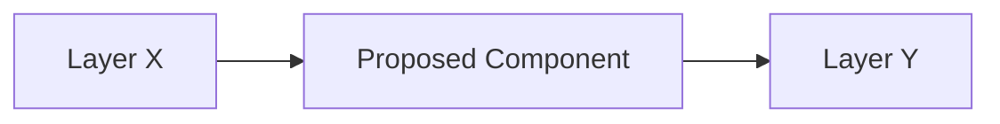

# RFC-[XXXX] — [Title]

| Field | Value |
|-------|-------|
| **ID** | RFC-[XXXX] |
| **Title** | [Short descriptive title] |
| **Version** | 1.0 |
| **Status** | Draft → Proposed → Accepted → Rejected → Superseded |
| **Author** | [Name] |
| **Champion** | [Name] |
| **Sprint** | [Sprint ID] |
| **Target** | [Component/Area] |

---

## 1. Problem

> What problem are we solving? Be specific. Include user impact if applicable.

---

## 2. Motivation

> Why now? What forces this change (technical debt, user demand, strategic shift)?

Inspired by / Required by:
- [Reference link or document ID]
- [Reference link or document ID]

---

## 3. Proposed Solution

> High-level description of the change. Keep it scannable — details go in sections below.

---

### 3.1 Architecture

> How does this fit into the existing architecture? Which layers are touched?



### 3.2 Interfaces

> Public API changes. Types, endpoints, events, DTOs.

```typescript
interface ProposedInterface {
  // ...
}
```

### 3.3 Data Model

> New or modified data structures. Database schema changes.

```typescript
type ProposedType = {
  // ...
}
```

### 3.4 Error Handling

> New error codes? New recovery flows? New retry policies?

---

## 4. Alternatives Considered

| Alternative | Pros | Cons |
|-------------|------|------|
| [Option A] | ... | ... |
| [Option B] | ... | ... |

Why chosen: [Reasoning]

---

## 5. Trade-offs

| Trade-off | Decision |
|-----------|----------|
| [e.g. Performance vs. Simplicity] | [What we chose] |
| [e.g. Consistency vs. Speed] | [What we chose] |

---

## 6. Impact

### Positive

- [Benefit 1]
- [Benefit 2]

### Negative

- [Cost / Risk 1]
- [Cost / Risk 2]

### Out of Scope (will not address)

- [Item 1]
- [Item 2]

---

## 7. Tests

| Test type | Scope |
|-----------|-------|
| Unit | [What will be unit tested] |
| Integration | [What will be integration tested] |
| E2E | [What will be e2e tested] |

Success criteria:
- [Criterion 1]
- [Criterion 2]

---

## 8. Rollout Plan

| Phase | Description | Criteria to advance |
|-------|-------------|---------------------|
| 1 | [Phase 1] | [Criteria] |
| 2 | [Phase 2] | [Criteria] |
| 3 | [Phase 3] | [Criteria] |

---

## 9. References

- [Related RFC or ARCH document]
- [Technical reference]

---

## 10. Change History

| Version | Date | Author | Change |
|---------|------|--------|--------|
| 1.0 | [Date] | [Author] | Initial draft |
