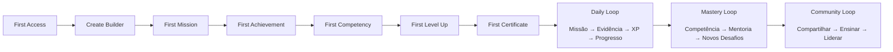
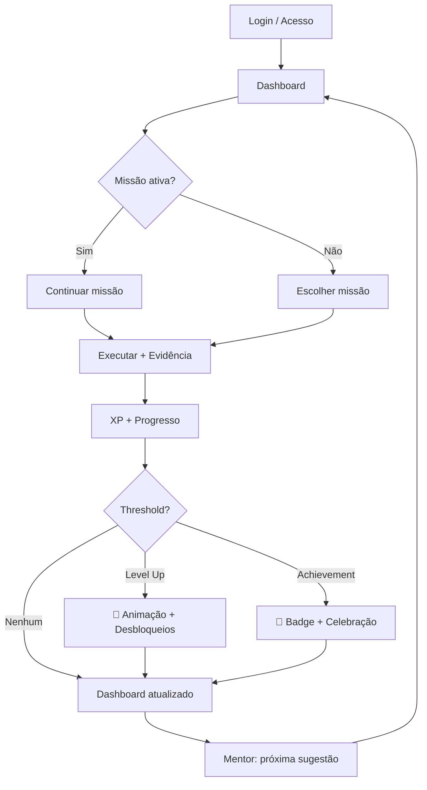

# UI-0002 — Builder Journey

| Campo | Valor |
|-------|-------|
| **ID** | UI-0002 |
| **Nome** | Builder Journey |
| **Versão** | 1.0-DRAFT |
| **Status** | Draft |
| **Categoria** | UI/UX |
| **Derivado de** | ARCH-0011 Experience Layer, UI-0001 Design System, ARCH-0003 Core Engine Spec |
| **Será utilizado por** | UI-0003 Information Architecture, UI-0004 Component Library, Frontend Implementation |

---

## 1. Journey Philosophy

A Builder Journey não é linear.

É um **ciclo virtuoso** que se repete em escalas cada vez maiores:

```
Motivação → Ação → Realização → Reconhecimento → Nova Motivação
```

Cada etapa deve responder emocionalmente:

| Etapa | Pergunta emocional | Resposta que o sistema deve dar |
|-------|-------------------|-------------------------------|
| **Primeiro acesso** | "Vale a pena?" | "Sim, e aqui está seu primeiro passo." |
| **Criar Builder** | "Sou bem-vindo?" | "Sim, você pertence aqui." |
| **Primeira missão** | "Consigo fazer?" | "Sim, é desafiador mas possível." |
| **Primeira conquista** | "Isso importa?" | "Sim, e está registrado." |
| **Primeira competência** | "Estou evoluindo?" | "Sim, olhe o que você já construiu." |
| **Primeiro level up** | "Estou crescendo?" | "Sim, e tem mais pela frente." |
| **Primeiro certificado** | "Sou competente?" | "Sim, você provou." |

---

## 2. Full Journey Map



---

## 3. Stage by Stage — Emotional Design

### Stage 1 — First Access

**Cena:** O Builder abre o ASCEND pela primeira vez.

**Estado emocional:** Curiosidade + ceticismo.

**O que o sistema precisa transmitir:**
- Profissionalismo (isso é sério)
- Beleza (isso é agradável)
- Clareza (isso é compreensível)
- Baixo compromisso inicial (posso experimentar)

**Tela:** Landing Page com:
- Logo + tagline
- "Começar jornada" (CTO único e claro)
- Mínimo texto, máxima intenção
- Visual limpo, fundo com gradiente sutil

**Micro-cópia:**
> *"Toda competência reivindicada deve ser uma competência comprovada."*

**Ritmo:**
- Sem cadastro complexo
- Login com GitHub/Google como primary
- E-mail como fallback

### Stage 2 — Create Builder

**Cena:** O Builder faz login e precisa se apresentar.

**Estado emocional:** Expectativa + leve ansiedade.

**Onboarding — 3 passos:**

```
Passo 1: "Qual seu objetivo principal?"
         [ ] Transição de carreira
         [ ] Avançar na área atual
         [ ] Dominar uma tecnologia específica
         [ ] Apenas explorar

Passo 2: "Qual sua área de interesse?"
         [ ] Segurança
         [ ] Desenvolvimento
         [ ] Cloud
         [ ] Dados
         [ ] Infraestrutura

Passo 3: "Qual seu nível atual?"
         [ ] Iniciante — "Nunca fiz isso antes"
         [ ] Intermediário — "Já mexi um pouco"
         [ ] Avançado — "Tenho experiência prática"
```

**Feedback emocional:**
- Cada passo tem uma micro-animação de confirmação
- Ao final: animação de "Builder criado" + primeiro badge: **Explorer**

**Micro-cópia:**
> *"Pronto. Sua jornada começa agora."*

### Stage 3 — First Mission

**Cena:** Dashboard vazio, primeira missão sugerida.

**Estado emocional:** Ansiedade leve ("será que vou conseguir?").

**O que o sistema faz:**
- Dashboard não está vazio — tem uma carta de boas-vindas com a primeira missão destacada
- A missão é curta (30 min) — vitória rápida
- Briefing claro: objetivo, critérios, dicas
- Timer opcional para criar foco

**Visual da missão:**
```
┌─────────────────────────────────────────┐
│  🗡️ Sua Primeira Missão                   │
│                                          │
│  "Configurar um ambiente de              │
│   desenvolvimento Linux"                 │
│                                          │
│  ⏱️ Estimado: 30 min  |  🎯 Fácil       │
│                                          │
│  [Iniciar Missão]                        │
└─────────────────────────────────────────┘
```

**Feedback emocional:**
- Ao iniciar: transição suave para o modo "missão ativa"
- O header muda para mostrar o progresso em tempo real

**Micro-cópia:**
> *"Primeiro passo. O mais simples. O mais importante."*

### Stage 4 — First Achievement

**Cena:** Builder completa a primeira missão e submete evidência.

**Estado emocional:** Satisfação + orgulho.

**O que o sistema faz:**
- Review é rápido (pode ser automático na primeira missão)
- Ao completar: animação de achievement (confetti sutil)
- Badge aparece com som (opcional)
- XP counter incrementa animado (0 → 100)

**Tela de conclusão:**
```
┌─────────────────────────────────────────┐
│  🎉 Missão Concluída!                    │
│                                          │
│  +100 XP                                 │
│                                          │
│  🏅 Novo Badge: "First Steps"           │
│                                          │
│  Desbloqueado: Linux Basics — Missão 2   │
│                                          │
│  [Continuar Jornada]  [Compartilhar]     │
└─────────────────────────────────────────┘
```

**Feedback emocional:**
- O badge aparece com glow e scale-in
- A nova missão aparece com destaque

**Micro-cópia:**
> *"Não é sorte. É começo."*

### Stage 5 — First Competency

**Cena:** Builder completa missões suficientes para ter uma competência reconhecida.

**Estado emocional:** Realização ("eu sei fazer isso agora").

**O que o sistema faz:**
- Notificação: "Nova competência detectada"
- Tela de Competency Tree mostra o nó sendo preenchido
- Animação de preenchimento gradual
- Nível da competência aparece

**Visual:**
```
┌─────────────────────────────────────────┐
│  🧠 Competência Reconhecida              │
│                                          │
│  Linux System Administration             │
│  ▓▓▓▓▓▓▓▓▓▓▓▓░░░░  Level 1 — Novice    │
│                                          │
│  Evidências: 3 missões concluídas        │
│                                          │
│  Próximo nível: 4 missões                │
│                                          │
│  [Ver Árvore]                            │
└─────────────────────────────────────────┘
```

**Feedback emocional:**
- A competência na árvore "acende" com cor
- Tooltip mostra: "Comprovado por evidência"

**Micro-cópia:**
> *"Não é autoconfiança. É evidência."*

### Stage 6 — First Level Up

**Cena:** XP acumulado atinge o threshold do próximo nível.

**Estado emocional:** Empolgação + antecipação.

**O que o sistema faz:**
- A tela inteira pode escurecer levemente
- Animação de level up no centro
- Novo nível aparece com efeito de desbloqueio
- Badge de nível aparece
- Novas habilidades desbloqueadas são listadas

**Animação de Level Up:**
```
  ╔══════════════════════════════╗
  ║                              ║
  ║         ▲ ▲ ▲               ║
  ║        LEVEL UP!             ║
  ║                              ║
  ║     Builder → Apprentice     ║
  ║                              ║
  ║   ▓▓▓▓▓▓▓▓▓▓▓▓▓▓▓▓▓▓  5    ║
  ║                              ║
  ║   Desbloqueado:              ║
  ║   • Mentor Agent             ║
  ║   • Advanced Missions        ║
  ║                              ║
  ╚══════════════════════════════╝
```

**Feedback emocional:**
- Som de achievement (opcional)
- O level badge no header muda com animação
- Novos recursos aparecem destacados

**Micro-cópia:**
> *"Cada nível é uma porta que se abre."*

### Stage 7 — First Certificate

**Cena:** Builder completa todas as missões de uma jornada e todas as competências são validadas.

**Estado emocional:** Orgulho máximo + sensação de missão cumprida.

**O que o sistema faz:**
- Página de certificado gerada
- Design formal (para compartilhar/profissional)
- Nome do Builder + competências + evidências
- QR code para verificação
- Botão para LinkedIn, download PDF

**Visual do certificado:**
```
┌─────────────────────────────────────────┐
│                                         │
│           ASCEND CDF                    │
│                                         │
│    CERTIFICADO DE COMPETÊNCIA           │
│                                         │
│    Certificamos que                     │
│    [Builder Name]                       │
│                                         │
│    demonstrou competência em             │
│    Linux System Administration          │
│    Nível: Proficient                    │
│                                         │
│    Evidências analisadas: 12            │
│    Missões concluídas:   8              │
│    Projetos:             2              │
│                                         │
│    🔗 ascend.dev/cert/abc123            │
│                                         │
│    Emitido em: 19/07/2026               │
│                                         │
└─────────────────────────────────────────┘
```

**Feedback emocional:**
- A conquista é adicionada ao perfil permanente
- Notificação para a comunidade (se ativado)
- O Mentor Agent parabeniza

**Micro-cópia:**
> *"Competência reivindicada. Competência comprovada."*

---

## 4. The Daily Loop

Após o onboarding, o Builder entra no ciclo diário:



---

## 5. Emotional Arc — Complete Journey

```
Emoção
  ^
  │           🎉 (Level Up)
  │          /
  │    🧠---/  (Competency)
  │   /
  │  🏅  (Achievement)
  │ /
  │/ 🗡️ (First Mission)
  │
  │  👤 (Create Builder)
  │ /
  │/ 👀 (First Access)
  └───────────────────────────────→ Tempo

Legenda:
  👀 Curiosidade
  👤 Pertencimento
  🗡️ Determinação
  🏅 Satisfação
  🧠 Realização
  🎉 Empolgação
```

---

## 6. Retention Mechanisms

### Streaks

| Dias consecutivos | Recompensa |
|-------------------|------------|
| 3 | +50 XP bônus |
| 7 | Badge "Consistent" |
| 14 | +100 XP bônus |
| 30 | Badge "Dedicated" |
| 60 | Badge "Unstoppable" |

### Notification Cadence

| Momento | Canal | Conteúdo |
|---------|-------|----------|
| Manhã (8h) | Push/Email | "Bom dia! Sua missão te espera." |
| 24h sem atividade | Push | "Saudades do seu progresso." |
| 72h sem atividade | Email | "Aqui está um resumo do que você perdeu." |
| Achievement | Push (imediato) | "🎉 Nova conquista desbloqueada!" |

### Progress Transparency

O Builder sempre sabe:
- Onde está (`Level 3 — 450/800 XP`)
- Para onde vai (próxima competência)
- Quanto falta (progresso visível)
- O que ganha (recompensas claras)

---

## 7. Error States — Emotional Handling

| Situação | O que o sistema diz | Tom |
|----------|--------------------|-----|
| Falha na missão | "Toda falha é feedback. Tente novamente quando estiver pronto." | Apoiador |
| Review negativo | "O reviewer apontou pontos de melhoria. Isso é crescimento." | Construtivo |
| Bug/Erro no sistema | "Algo deu errado. Já estamos cuidando disso." | Transparente |
| Inatividade longa | "Não se preocupe. Sua jornada continua de onde parou." | Acolhedor |

---

## 8. Definition of Done

UI-0002 aprovado quando:

- [ ] Cada etapa emocional está mapeada
- [ ] First Access tem design de experiência claro
- [ ] Create Builder tem onboarding em 3 passos
- [ ] First Mission tem vitória rápida garantida
- [ ] First Achievement tem celebração
- [ ] First Competency tem reconhecimento visual
- [ ] First Level Up tem animação de payoff
- [ ] First Certificate tem formato compartilhável
- [ ] Daily Loop está definido
- [ ] Retention mechanisms documentados
- [ ] Error states com tom emocional correto

---

## Status

**UI-0002 — Builder Journey**

- Estado: 🟡 Draft técnico
- Resultado: Jornada emocional completa mapeada — 7 estágios, daily loop, retention, error handling
- Próximo: UI-0003 — Information Architecture
