# UI-0003 — Information Architecture

| Campo | Valor |
|-------|-------|
| **ID** | UI-0003 |
| **Nome** | Information Architecture |
| **Versão** | 1.0-DRAFT |
| **Status** | Draft |
| **Categoria** | UI/UX |
| **Derivado de** | ARCH-0011 Experience Layer, UI-0001 Design System, UI-0002 Builder Journey |
| **Será utilizado por** | UI-0004 Component Library, Frontend Implementation |

---

## 1. IA Philosophy

A Information Architecture do ASCEND segue três princípios:

| Princípio | Descrição |
|-----------|-----------|
| **Depth over Breadth** | Até 3 níveis de profundidade, nunca mais |
| **Context over Menu** | O Builder nunca precisa caçar — o contexto certo aparece na hora certa |
| **Progressive Disclosure** | Mostre apenas o necessário agora, revelue complexidade gradualmente |

---

## 2. Global Navigation Map

```
ASCEND
│
├── Dashboard                    (Home — /)
│
├── Journeys                     (/journeys)
│   ├── Active Journey
│   ├── Journey Detail
│   │   ├── Missions
│   │   ├── Competencies
│   │   └── Progress
│   └── Completed Journeys
│
├── Missions                     (/missions)
│   ├── Available
│   ├── Active
│   ├── Completed
│   └── Mission Detail
│       ├── Briefing
│       ├── Evidence Upload
│       └── Review / Feedback
│
├── Competencies                 (/competencies)
│   ├── Competency Tree
│   ├── Competency Detail
│   │   ├── Skills
│   │   ├── Evidence
│   │   └── Level Progress
│   └── All Competencies
│
├── Achievements                 (/achievements)
│   ├── Badges
│   ├── Level History
│   └── Certificates
│       └── Certificate Detail
│
├── Evidence                     (/evidence)
│   ├── All Evidence
│   ├── Pending Review
│   ├── Approved
│   └── Evidence Detail
│
├── Labs                         (/labs)
│   ├── Active Lab
│   ├── Lab Catalog
│   └── Lab Detail
│
├── AI Mentor                    (/mentor)
│   ├── Chat
│   ├── Suggestions
│   └── Career Path
│
├── Community                    (/community)
│   ├── Leaderboard
│   ├── Activity Feed
│   ├── Builders
│   └── Builder Profile
│
├── Marketplace                  (/marketplace)
│   ├── Packages
│   ├── Templates
│   └── Integrations
│
└── Settings                     (/settings)
    ├── Profile
    ├── Preferences
    ├── Notifications
    └── Account
```

---

## 3. Navigation Structure

### 3.1 Primary Navigation (Sidebar)

A sidebar é o centro de navegação primário no desktop.

```
┌──────────────────┐
│  🔷 ASCEND       │  ← Logo + home
│                  │
│  ■ Dashboard     │  ← Home, overview
│                  │
│  🗡️ Journeys     │  ← Jornadas de aprendizado
│                  │
│  ◆ Missions      │  ← Missões disponíveis
│                  │
│  🧠 Competencies │  ← Árvore de competências
│                  │
│  🏅 Achievements │  ← Badges, níveis, certificados
│                  │
│  📁 Evidence      │  ← Evidências submetidas
│                  │
│  ⚗️ Labs         │  ← Laboratórios práticos
│                  │
│  🤖 AI Mentor    │  ← Mentor inteligente
│                  │
│  🌐 Community    │  ← Leaderboard, feed, builders
│                  │
│  🛒 Marketplace  │  ← Pacotes, integrações
│                  │
│  ⚙️ Settings     │  ← Perfil, preferências
│                  │
│  ─────────────  │
│                  │
│  👤 BuilderName  │  ← Perfil rápido
│  Level 3 — 450 XP│
└──────────────────┘
```

### 3.2 Secondary Navigation (Tab Bars)

Telas com múltiplas visões usam tab bars.

**Exemplo — Missions:**
```
┌─────────────────────────────────────┐
│  [Available] [Active] [Completed]   │  ← Tabs
│                                     │
│  (conteúdo da tab selecionada)      │
└─────────────────────────────────────┘
```

**Exemplo — Evidence:**
```
┌─────────────────────────────────────┐
│  [All] [Pending] [Approved] [Rejected]│
│                                     │
│  (conteúdo)                         │
└─────────────────────────────────────┘
```

### 3.3 Contextual Navigation (Breadcrumbs)

Telas de detalhe usam breadcrumbs.

**Exemplo — Mission Detail:**
```
Home > Journeys > Linux Basics > Mission 4
```

---

## 4. Page Descriptions

### 4.1 Dashboard (`/`)

**Propósito:** Visão geral do estado atual do Builder.

**Elementos:**
- **Header:** Nível, XP, streak, notificações
- **Current Mission Card:** Missão ativa com progresso
- **Quick Stats:** Missões concluídas, competências, achievements
- **Activity Feed:** Timeline de últimas ações
- **Next Achievement:** Progresso para próxima conquista
- **Mentor Suggestion:** Card com dica do Mentor Agent
- **Journey Progress:** Barra de progresso da jornada ativa

**Estados:**
| Estado | Conteúdo |
|--------|----------|
| Novo (sem dados) | CTA para primeira missão, empty states com ilustrações |
| Ativo | Cards com dados reais |
| Inativo (sem missão ativa) | Sugestão de próxima missão |

### 4.2 Journeys (`/journeys`)

**Propósito:** Gerenciar jornadas de aprendizado.

**Elementos:**
- Active Journey (destaque)
- Journey Catalog (grid de cards)
- Journey Detail (abre ao clicar)

**Journey Card:**
```
┌──────────────────────────┐
│  🗡️ Linux Basics          │
│                           │
│  12 missões · 4 competências│
│                           │
│  ▓▓▓▓▓▓▓▓▓░░░  75%      │
│                           │
│  [Continuar]              │
└──────────────────────────┘
```

### 4.3 Missions (`/missions`)

**Propósito:** Explorar, iniciar e gerenciar missões.

**Elementos:**
- Tabs: Available / Active / Completed
- Mission Card grid
- Mission Detail (briefing, evidência, feedback)
- Filtros: área, dificuldade, duração

**Mission Detail:**
```
┌─────────────────────────────────────┐
│  Back to Missions                   │
│                                     │
│  Mission: Configure Linux Users     │
│  Status: Active                     │
│                                     │
│  ┌─ Briefing ─────────────────────┐ │
│  │ Objetivo, critérios, dicas     │ │
│  └────────────────────────────────┘ │
│                                     │
│  ┌─ Evidence ────────────────────┐  │
│  │ Drag files or click to upload │  │
│  │ [Submit for Review]           │  │
│  └────────────────────────────────┘ │
│                                     │
│  ┌─ Feedback ────────────────────┐  │
│  │ (aparece após review)         │  │
│  └────────────────────────────────┘ │
└─────────────────────────────────────┘
```

### 4.4 Competencies (`/competencies`)

**Propósito:** Visualizar e gerenciar competências.

**Elementos:**
- Competency Tree (visualização gráfica interativa)
- Competency Detail (skills, evidências, progresso)
- Search/Filtro

**Competency Tree visual:**
```
         Linux System Admin
         │
    ┌────┼────┐
    │         │
  File     User      Network
  Mgmt    Admin      Basics
    │         │         │
  L1─L4    L1─L4     L1─L4
```

### 4.5 Achievements (`/achievements`)

**Propósito:** Coleção de badges, níveis e certificados.

**Elementos:**
- Badge grid (conquistados × bloqueados)
- Level timeline
- Certificates list

### 4.6 Evidence (`/evidence`)

**Propósito:** Gerenciar evidências submetidas.

**Elementos:**
- Evidence list (table/cards)
- Evidence Detail (preview, status, feedback)
- Upload flow

### 4.7 Labs (`/labs`)

**Propósito:** Laboratórios práticos interativos.

**Elementos:**
- Lab Catalog
- Active Lab (terminal/editor embarcado)
- Lab Detail

### 4.8 AI Mentor (`/mentor`)

**Propósito:** Interface com o Mentor Agent.

**Elementos:**
- Chat interface
- Suggestion cards
- Career path visualization
- Quick actions

### 4.9 Community (`/community`)

**Propósito:** Conexão com outros Builders.

**Elementos:**
- Leaderboard (ranking semanal, mensal, all-time)
- Activity Feed (timeline global)
- Builder Profiles
- Search/Filtro

### 4.10 Marketplace (`/marketplace`)

**Propósito:** Descobrir e instalar pacotes.

**Elementos:**
- Package grid
- Package Detail
- Installed packages
- Integrations

### 4.11 Settings (`/settings`)

**Propósito:** Configurar perfil e preferências.

**Elementos:**
- Profile (name, bio, avatar, links)
- Preferences (theme, language, notifications)
- Account (email, password, danger zone)

---

## 5. Mobile Navigation

No mobile, a sidebar é substituída por bottom tab bar.

```
┌──────────────────────────────────────┐
│                                      │
│           (Content Area)             │
│                                      │
│                                      │
│                                      │
├──────────────────────────────────────┤
│  🏠  │  🗡️  │  🧠  │  🤖  │  ⚙️   │
│ Home │ Miss.│ Comp.│ Mentor│ More  │
└──────────────────────────────────────┘
```

**More sheet:**
```
┌──────────────────────┐
│  Achievements        │
│  Evidence            │
│  Labs                │
│  Community           │
│  Marketplace         │
│  Settings            │
└──────────────────────┘
```

---

## 6. Navigation Rules

| Regra | Descrição |
|-------|-----------|
| **R1 — Always known location** | Breadcrumb ou header indica onde o Builder está |
| **R2 — Back is always available** | Botão de voltar em todas as telas de detalhe |
| **R3 — Context not lost** | Mudar de seção não perde o estado da seção anterior |
| **R4 — Search everywhere** | Command Palette (`Cmd+K`) acessível de qualquer tela |
| **R5 — Shortcuts for power users** | Atalhos de teclado para navegação frequente |
| **R6 — Minimal clicks** | Três cliques no máximo para qualquer ação principal |

---

## 7. Command Palette

A Command Palette é o mecanismo de navegação avançado.

**Atalho:** `Cmd+K` (Mac) / `Ctrl+K` (Windows/Linux)

**Funciona como:**
- Spotlight/Raycast dentro do ASCEND
- Busca por páginas, missões, competências, configurações
- Ações rápidas: "iniciar missão", "submeter evidência", "ver progresso"

**Exemplo:**
```
┌──────────────────────────────────────┐
│  🔍 Buscar no ASCEND...              │
│                                      │
│  Páginas                             │
│  ├ Dashboard                         │
│  ├ Missions > Active                  │
│  └ Competencies > Linux              │
│                                      │
│  Ações                               │
│  ├ 🗡️ Iniciar próxima missão          │
│  ├ 📁 Submeter evidência             │
│  └ 🤖 Falar com Mentor               │
│                                      │
│  Missões                             │
│  ├ Linux Basics — Mission 3          │
│  └ Security — Mission 1              │
└──────────────────────────────────────┘
```

---

## 8. Search Architecture

### 8.1 Global Search

Acessível via Command Palette ou ícone de busca no header.

**Indexa:**
- Páginas
- Missões (título, descrição)
- Competências (nome, skills)
- Builders (community)
- Labs

### 8.2 Contextual Search

Dentro de cada seção, a busca filtra apenas aquela categoria.

---

## 9. Page Layout Template

Todas as páginas seguem este layout base:

```
┌──────────────────────────────────────────────────┐
│  Header                                           │
│  ┌──────┬──────────────────────────────────────┐ │
│  │ Logo │  Nível   Streak   Notif   Avatar     │ │
│  └──────┴──────────────────────────────────────┘ │
├──────┬───────────────────────────────────────────┤
│      │                                            │
│ Side │            Content Area                     │
│ Bar  │                                            │
│      │                                            │
│      │                                            │
│      │                                            │
├──────┴───────────────────────────────────────────┤
│  Footer (minimal: links, versão)                  │
└──────────────────────────────────────────────────┘
```

### Header Content

| Elemento | Esquerda | Centro | Direita |
|----------|----------|--------|---------|
| **Dashboard** | — | — | Streak, Notificações, Avatar |
| **Seções** | Breadcrumb | Page Title | Streak, Notif, Avatar |
| **Detalhe** | Back + Breadcrumb | Page Title | Ações contextuais |

---

## 10. URL Structure

```
/                                    → Dashboard
/journeys                            → Journeys list
/journeys/[slug]                     → Journey detail
/missions                            → Missions list
/missions/[id]                       → Mission detail
/competencies                        → Competency tree
/competencies/[id]                   → Competency detail
/achievements                        → Achievements
/achievements/badges                 → Badges only
/achievements/certificates           → Certificates only
/achievements/certificates/[id]      → Certificate detail
/evidence                            → Evidence list
/evidence/[id]                       → Evidence detail
/labs                                → Labs catalog
/labs/[id]                           → Lab detail
/mentor                              → AI Mentor chat
/community                           → Community
/community/builders/[id]             → Builder profile
/community/leaderboard               → Leaderboard
/marketplace                         → Marketplace
/marketplace/packages/[id]           → Package detail
/settings                            → Settings
/settings/profile                    → Profile edit
/settings/preferences                → Preferences
/settings/notifications              → Notifications
/settings/account                    → Account settings
```

---

## 11. Information Architecture Diagram

```mermaid
graph TD
    DASH["/ Dashboard"] --> JOURNEYS["/journeys"]
    DASH --> MISSIONS["/missions"]
    DASH --> COMP["/competencies"]
    DASH --> ACH["/achievements"]
    DASH --> EVID["/evidence"]
    DASH --> LABS["/labs"]
    DASH --> MENTOR["/mentor"]
    DASH --> COMM["/community"]
    DASH --> MARKET["/marketplace"]
    DASH --> SETTINGS["/settings"]

    JOURNEYS --> JDETAIL["/journeys/[slug]"]
    JDETAIL --> JMISSIONS["Missions list"]
    JDETAIL --> JCOMP["Competencies"]
    JDETAIL --> JPROG["Progress"]

    MISSIONS --> MDETAIL["/missions/[id]"]
    MDETAIL --> MBRIEF["Briefing"]
    MDETAIL --> MEVID["Evidence Upload"]
    MDETAIL --> MFEED["Review / Feedback"]

    COMP --> CDETAIL["/competencies/[id]"]
    CDETAIL --> CSKILLS["Skills"]
    CDETAIL --> CEVID["Evidence"]
    CDETAIL --> CPROG["Level Progress"]

    ACH --> ABADGES["/achievements/badges"]
    ACH --> ALEVELS["Level History"]
    ACH --> ACERTS["/achievements/certificates"]
    ACERTS --> CERTDETAIL["/achievements/certificates/[id]"]

    EVID --> EPENDING["Pending Review"]
    EVID --> EAPPROVED["Approved"]
    EVID --> EDETAIL["/evidence/[id]"]

    LABS --> LACTIVE["Active Lab"]
    LABS --> LCATALOG["Lab Catalog"]
    LCATALOG --> LDETAIL["/labs/[id]"]

    MENTOR --> MCHAT["Chat"]
    MENTOR --> MSEGG["Suggestions"]
    MENTOR --> MCAREER["Career Path"]

    COMM --> CLEADER["Leaderboard"]
    COMM --> CFEED["Activity Feed"]
    COMM --> CBUILDERS["Builders"]
    CBUILDERS --> CPROFILE["/community/builders/[id]"]

    MARKET --> MPACKAGES["Packages"]
    MARKET --> MTEMPLATES["Templates"]
    MARKET --> MINTEG["Integrations"]
    MPACKAGES --> MPKDETAIL["/marketplace/packages/[id]"]

    SETTINGS --> SPROFILE["Profile"]
    SETTINGS --> SPREF["Preferences"]
    SETTINGS --> SNOTIF["Notifications"]
    SETTINGS --> SACC["Account"]
```



---

## 12. Global Elements (Present in All Pages)

| Elemento | Localização | Descrição |
|----------|-------------|-----------|
| **Sidebar** | Left | Navegação primária |
| **Header** | Top | Status do Builder + notificações |
| **Command Palette** | `Cmd+K` | Busca e ações rápidas |
| **Notification Center** | Header | Bell icon → dropdown |
| **Profile Dropdown** | Header | Avatar → menu (settings, logout) |
| **Level Badge** | Header/Sidebar | Nível atual + XP bar |
| **Streak Indicator** | Header | Dias consecutivos |

---

## 13. Empty States

Cada seção deve ter um empty state bem projetado.

| Seção | Empty State | CTA |
|-------|-------------|-----|
| Dashboard (novo) | Ilustração + "Sua jornada começa aqui" | "Iniciar primeira missão" |
| Journeys | "Nenhuma jornada ativa" | "Explorar jornadas" |
| Missions | "Nenhuma missão disponível" | "Ver jornadas" |
| Evidence | "Nenhuma evidência ainda" | "Iniciar uma missão" |
| Achievements | "Nenhuma conquista ainda" | "Completar primeira missão" |
| Community | "Comunidade em crescimento" | "Convidar amigos" |

---

## 14. Definition of Done

UI-0003 aprovado quando:

- [ ] Mapa completo da navegação está documentado
- [ ] Primary navigation (sidebar) está definida
- [ ] Secondary navigation (tabs, breadcrumbs) está definida
- [ ] Cada página tem propósito, elementos e estados documentados
- [ ] Mobile navigation está mapeada
- [ ] Navigation rules estão estabelecidas
- [ ] Command Palette está especificada
- [ ] Search architecture está documentada
- [ ] Page layout template está definido
- [ ] URL structure está completa
- [ ] Diagrama Mermaid da IA está completo
- [ ] Global elements estão listados
- [ ] Empty states estão documentados

---

## Status

**UI-0003 — Information Architecture**

- Estado: 🟡 Draft técnico
- Resultado: Arquitetura de informação completa — 11 seções principais, navegação multi-nível, mobile adaptation, command palette, URL structure, diagrama
- Próximo: UI-0004 — Component Library
