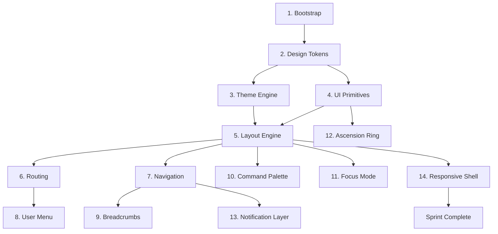

# IMPLEMENTATION PLAN — Sprint 001

| Field | Value |
|-------|-------|
| **Operation** | OPERAÇÃO PROMETHEUS |
| **Sprint** | Sprint 001 — App Shell Foundation |
| **Objective** | Build the visual infrastructure of ASCEND. No features, no Runtime, no API calls. |
| **Stack** | Next.js 15, TypeScript, Tailwind CSS, shadcn/ui, React Query, Zustand, Framer Motion, Lucide React, React Hook Form, Zod |
| **Role** | Implementation Engineer — executes contracts defined by Architecture |
| **Decision** | App Shell first. Every screen borns inside the definitive environment. |

---

## Dependency Graph



---

## Task 1: Bootstrap

| Field | Detail |
|-------|--------|
| **ID** | SPRINT-001-T1 |
| **Estimate** | 2h |
| **Objective** | Scaffold `apps/web` with Next.js 15 + all official dependencies. No custom components yet. |
| **Depends on** | — |

### What to implement

```bash
npx create-next-app@latest apps/web --typescript --tailwind --eslint --app --src-dir --import-alias "@/*"
```

Then install all stack dependencies:
- `tailwindcss-animate` (shadcn/ui requirement)
- `class-variance-authority`, `clsx`, `tailwind-merge` (shadcn/ui utilities)
- `lucide-react`
- `framer-motion`
- `zustand`
- `@tanstack/react-query`
- `react-hook-form`, `@hookform/resolvers`, `zod`
- `next-themes` (theme engine foundation)

Initialize shadcn/ui with:
- Components path: `@/components/ui`
- Utils path: `@/lib/utils`
- CSS variables for colors (will be overridden in T2)
- Yes to all defaults

Create folder structure per ARCH-0022:

```
apps/web/
├── app/
├── components/
│   ├── ui/          (shadcn components)
│   └── layout/
├── features/
│   ├── auth/
│   ├── dashboard/
│   ├── missions/
│   ├── journeys/
│   ├── competencies/
│   ├── achievements/
│   ├── evidence/
│   ├── mentor/
│   ├── builder/
│   ├── community/
│   ├── marketplace/
│   ├── settings/
│   └── shared/
├── hooks/
├── lib/
├── store/
├── styles/
└── services/
```

Create alias paths in `tsconfig.json`:
- `@/` → `apps/web/*`
- `@ui/` → `packages/ui/*` (keep path even if package not created yet)

### Files affected

- `apps/web/package.json`
- `apps/web/tsconfig.json`
- `apps/web/tailwind.config.ts`
- `apps/web/next.config.ts`
- `apps/web/components.json` (shadcn)
- `apps/web/src/app/layout.tsx`
- `apps/web/src/lib/utils.ts`

### Acceptance criteria

- [ ] `npm run dev` starts without errors
- [ ] `npm run build` succeeds
- [ ] shadcn/ui components render (test with `Button`)
- [ ] Folder structure matches ARCH-0022

### Expected commit

```
chore(web): bootstrap nextjs 15 application with shadcn/ui
```

---

## Task 2: Design Tokens

| Field | Detail |
|-------|--------|
| **ID** | SPRINT-001-T2 |
| **Estimate** | 3h |
| **Objective** | Implement ALL CSS custom properties from UI-0001. Zero hardcoded colors anywhere. |
| **Depends on** | T1 |

### What to implement

Create `apps/web/src/styles/tokens.css`:

- Brand palette (50–900, light + dark)
- Neutral palette (50–900, light + dark)
- Semantic colors (success, warning, error, info, xp)
- Gamification colors (gold, silver, bronze, platinum)
- Typography tokens (font-family, text-xs through text-5xl, font-weight)
- Spacing tokens (space-0 through space-24)
- Border radius tokens (radius-none through radius-full)
- Shadow tokens (sm, md, lg, xl, glow — light + dark)
- Icon size tokens (icon-xs through icon-2xl)
- Duration tokens (dur-instant through dur-celebrate)
- Easing tokens (ease-default through ease-spring)

Override shadcn/ui CSS variables in `globals.css` to point to ASCEND tokens:

```css
:root {
  --background: var(--ascend-neutral-50);
  --foreground: var(--ascend-neutral-900);
  --card: white;
  --card-foreground: var(--ascend-neutral-900);
  --primary: var(--ascend-brand-500);
  --primary-foreground: white;
  /* ... map ALL shadcn variables to ASCEND tokens */
}

.dark {
  --background: var(--ascend-neutral-50);
  --foreground: var(--ascend-neutral-900);
  /* ... dark overrides */
}
```

### Files affected

- `apps/web/src/styles/tokens.css` (new)
- `apps/web/src/app/globals.css` (modify)
- `apps/web/tailwind.config.ts` (extend with token values)

### Acceptance criteria

- [ ] All UI-0001 tokens present as CSS variables
- [ ] shadcn/ui components render using ASCEND colors
- [ ] Tailwind config extends with `--ascend-*` values
- [ ] No hardcoded hex colors in any component
- [ ] Light mode renders neutral-50 background, dark mode renders dark neutral-50

### Expected commit

```
feat(ui): implement design token system from UI-0001
```

---

## Task 3: Theme Engine

| Field | Detail |
|-------|--------|
| **ID** | SPRINT-001-T3 |
| **Estimate** | 2h |
| **Objective** | Implement Light / Dark / System theme switching with persistence. |
| **Depends on** | T2 |

### What to implement

Use `next-themes` as the foundation. Create:

- `apps/web/src/components/theme/theme-provider.tsx` — wraps `next-themes` `ThemeProvider` with `attribute="class"` and `enableSystem`
- `apps/web/src/components/theme/theme-toggle.tsx` — toggle button using `Sun`/`Moon` Lucide icons
- `apps/web/src/components/theme/theme-selector.tsx` — dropdown with Light / Dark / System options

Configure `layout.tsx`:
- Wrap app in `<ThemeProvider>`
- Apply smooth transition: `transition: background-color var(--dur-normal), color var(--dur-normal)`
- Respect `prefers-reduced-motion`

Persistence:
- `next-themes` saves to `localStorage` automatically
- Persist choice even after browser close

### Files affected

- `apps/web/src/components/theme/theme-provider.tsx` (new)
- `apps/web/src/components/theme/theme-toggle.tsx` (new)
- `apps/web/src/components/theme/theme-selector.tsx` (new)
- `apps/web/src/app/layout.tsx` (modify)
- `apps/web/src/styles/tokens.css` (add transition)

### Acceptance criteria

- [ ] Light/Dark/System toggle works
- [ ] Choice persists across page reload
- [ ] System preference respected on first visit
- [ ] Transition is smooth (no flash of wrong theme)
- [ ] `prefers-reduced-motion` disables transitions

### Expected commit

```
feat(theme): add theme engine with light, dark, and system modes
```

---

## Task 4: UI Primitives

| Field | Detail |
|-------|--------|
| **ID** | SPRINT-001-T4 |
| **Estimate** | 4h |
| **Objective** | Build the core UI primitive components. Not shadcn — those are already installed. Build the ASCEND-specific ones. |
| **Depends on** | T2 |

### What to implement

Create these custom primitives in `apps/web/src/components/ui/`:

- `skeleton.tsx` — shimmer animation per UI-0001 §10.3
- `empty-state.tsx` — illustration + title + description + optional CTA
- `status-dot.tsx` — colored dot (success, warning, error, info, neutral)
- `progress-bar.tsx` — animated bar with optional label, XP variant (purple)
- `badge.tsx` — extends shadcn badge with ASCEND variants (xp, level, achievement)

Composition:
- All primitives use ASCEND tokens (no hardcoded values)
- All support `className` prop for extension
- All respect `prefers-reduced-motion`

### Files affected

- `apps/web/src/components/ui/skeleton.tsx` (new)
- `apps/web/src/components/ui/empty-state.tsx` (new)
- `apps/web/src/components/ui/status-dot.tsx` (new)
- `apps/web/src/components/ui/progress-bar.tsx` (new)
- `apps/web/src/components/ui/badge.tsx` (new)
- `apps/web/src/components/ui/index.ts` (new barrel)

### Acceptance criteria

- [ ] Each primitive renders with correct tokens
- [ ] Skeleton has shimmer animation
- [ ] Empty state accepts `icon`, `title`, `description`, `action` props
- [ ] Progress bar has XP variant (purple gradient)
- [ ] Badge renders all ASCEND variants
- [ ] No component exceeds ~300 lines

### Expected commit

```
feat(ui): add ascendant primitives — skeleton, empty-state, status-dot, progress-bar, badge
```

---

## Task 5: Layout Engine — AppShell

| Field | Detail |
|-------|--------|
| **ID** | SPRINT-001-T5 |
| **Estimate** | 6h |
| **Objective** | Build the complete layout engine: AppShell, Sidebar, TopBar, Content, RightPanel. |
| **Depends on** | T2, T3, T4 |

### What to implement

Create `apps/web/src/components/layout/`:

**`app-shell.tsx`** — root layout wrapper
- Manages sidebar state (open/closed)
- Manages right panel state (open/closed)
- Manages focus mode state
- Provides context via `AppShellContext`
- Responsive: sidebar collapsible on tablet, bottom nav on mobile

```tsx
// Interface
<AppShell>
  <AppShell.Sidebar>...</AppShell.Sidebar>
  <AppShell.TopBar>...</AppShell.TopBar>
  <AppShell.Content>...</AppShell.Content>
  <AppShell.RightPanel>...</AppShell.RightPanel>
</AppShell>
```

**`app-shell-context.tsx`** — React context for shell state
- `sidebarOpen: boolean`
- `setSidebarOpen: (open: boolean) => void`
- `rightPanelOpen: boolean`
- `setRightPanelOpen: (open: boolean) => void`
- `focusMode: boolean`
- `setFocusMode: (focus: boolean) => void`

**`sidebar.tsx`**
- Fixed left panel, 240px wide
- Navigation items (empty links for now)
- Collapsible to icons-only (64px)
- Animated with Framer Motion
- AppShell.Sidebar compound component

**`topbar.tsx`**
- Fixed top bar
- Mobile hamburger menu button
- Breadcrumb slot
- Theme toggle
- Placeholder for user menu
- AppShell.TopBar compound component

**`content.tsx`**
- Main content area
- Handles padding based on sidebar state
- Renders `children`
- AppShell.Content compound component

**`right-panel.tsx`**
- Optional right panel, 320px wide
- Slide-in animation from right
- Close button
- AppShell.RightPanel compound component

**`index.ts`** — barrel export

Update `app/layout.tsx` to use `<AppShell>` wrapping `<Content>`.

### Files affected

- `apps/web/src/components/layout/app-shell.tsx` (new)
- `apps/web/src/components/layout/app-shell-context.tsx` (new)
- `apps/web/src/components/layout/sidebar.tsx` (new)
- `apps/web/src/components/layout/topbar.tsx` (new)
- `apps/web/src/components/layout/content.tsx` (new)
- `apps/web/src/components/layout/right-panel.tsx` (new)
- `apps/web/src/components/layout/index.ts` (new)
- `apps/web/src/app/layout.tsx` (modify)

### Acceptance criteria

- [ ] AppShell renders with sidebar + topbar + content
- [ ] Sidebar toggles open/closed with animation
- [ ] Right panel slides in/out
- [ ] Layout is responsive (desktop sidebar, mobile bottom nav placeholder)
- [ ] Layout uses CSS variables from tokens
- [ ] Framer Motion animations respect `prefers-reduced-motion`
- [ ] No component exceeds ~300 lines

### Expected commit

```
feat(layout): implement app shell with sidebar, topbar, content, and right panel
```

---

## Task 6: Routing

| Field | Detail |
|-------|--------|
| **ID** | SPRINT-001-T6 |
| **Estimate** | 1h |
| **Objective** | Create empty route pages with placeholders. No business logic. |
| **Depends on** | T5 |

### What to implement

Create pages per ARCH-0022 §8:

```
apps/web/app/
├── page.tsx                    → Redirect to /dashboard or show dashboard placeholder
├── (auth)/
│   ├── login/page.tsx          → "Login — Coming Soon"
│   └── register/page.tsx       → "Register — Coming Soon"
├── (authenticated)/
│   ├── layout.tsx              → Auth guard placeholder (just renders children for now)
│   ├── dashboard/page.tsx      → "Dashboard — Coming Soon"
│   ├── journeys/
│   │   ├── page.tsx            → "Journeys — Coming Soon"
│   │   └── [slug]/page.tsx     → "Journey Detail — Coming Soon"
│   ├── missions/
│   │   ├── page.tsx            → "Missions — Coming Soon"
│   │   └── [id]/page.tsx       → "Mission Workspace — Coming Soon"
│   ├── competencies/
│   │   ├── page.tsx            → "Competencies — Coming Soon"
│   │   └── [id]/page.tsx       → "Competency Detail — Coming Soon"
│   ├── achievements/
│   │   └── page.tsx            → "Achievements — Coming Soon"
│   ├── profile/page.tsx        → "Profile — Coming Soon"
│   ├── settings/
│   │   ├── page.tsx            → "Settings — Coming Soon"
│   │   ├── preferences/page.tsx
│   │   └── account/page.tsx
```

Each page uses `<EmptyState>` with appropriate Lucide icon.

### Files affected

- All page files listed above (new)
- `apps/web/src/app/(authenticated)/layout.tsx` (new)

### Acceptance criteria

- [ ] All routes resolve without 404
- [ ] Each page shows a placeholder with appropriate icon
- [ ] No business logic anywhere
- [ ] No API calls

### Expected commit

```
feat(routing): add empty route placeholders for all pages
```

---

## Task 7: Navigation — Sidebar

| Field | Detail |
|-------|--------|
| **ID** | SPRINT-001-T7 |
| **Estimate** | 3h |
| **Objective** | Implement working sidebar navigation with active state and icons. |
| **Depends on** | T5, T6 |

### What to implement

Create `apps/web/src/components/layout/sidebar-nav.tsx`:

- Navigation items from ARCH-0022 §8 and UI-0001 §8.3:
  - Dashboard (`LayoutDashboard`)
  - Journeys (`Map`)
  - Missions (`Sword`)
  - Competencies (`BarChart3`)
  - Achievements (`Trophy`)
  - Profile (`UserCheck`)
  - Settings (`Settings`)

Each item:
- Lucide icon (per UI-0001 §8.3 convention)
- Label
- Active state via `usePathname()`
- Link to route
- Focus mode-aware (hide when focus mode active)

Implement keyboard navigation:
- Arrow Up/Down to navigate items
- Enter to select

Responsive:
- Desktop: full labels + icons
- Tablet: collapsed (icons only)
- Mobile: sidebar becomes bottom navigation (implemented in T14)

### Files affected

- `apps/web/src/components/layout/sidebar-nav.tsx` (new)
- `apps/web/src/components/layout/sidebar.tsx` (modify)

### Acceptance criteria

- [ ] All nav items render with correct icons and labels
- [ ] Active route is highlighted
- [ ] Click navigates to correct route
- [ ] Keyboard navigation works (Arrow Up/Down, Enter)
- [ ] Sidebar collapses to icons-only on tablet

### Expected commit

```
feat(nav): implement sidebar navigation with active state and icons
```

---

## Task 8: User Menu — TopBar

| Field | Detail |
|-------|--------|
| **ID** | SPRINT-001-T8 |
| **Estimate** | 2h |
| **Objective** | Implement TopBar with breadcrumb, theme toggle, and user menu placeholder. |
| **Depends on** | T5, T7 |

### What to implement

Update `topbar.tsx`:

- **Mobile hamburger** — toggles sidebar
- **Breadcrumb slot** — `<Breadcrumb />` component (T9)
- **Theme toggle** — from T3
- **User menu** — placeholder avatar + dropdown skeleton
  - Avatar circle with initials placeholder
  - Dropdown: Profile, Settings, Sign Out (disabled, "Coming Soon")

Create `apps/web/src/components/layout/user-menu.tsx`:
- Avatar placeholder (first letter of "B" for Builder)
- Dropdown with Framer Motion animation
- Items: Profile → `/profile`, Settings → `/settings`, divider, Sign Out (disabled)

### Files affected

- `apps/web/src/components/layout/user-menu.tsx` (new)
- `apps/web/src/components/layout/topbar.tsx` (modify)

### Acceptance criteria

- [ ] TopBar renders hamburger, breadcrumb placeholder, theme toggle, user avatar
- [ ] User menu dropdown opens/closes with animation
- [ ] Menu items navigate to correct routes
- [ ] Sign Out is visually disabled with "Coming Soon" tooltip

### Expected commit

```
feat(nav): add user menu to topbar with avatar and dropdown
```

---

## Task 9: Breadcrumbs

| Field | Detail |
|-------|--------|
| **ID** | SPRINT-001-T9 |
| **Estimate** | 1.5h |
| **Objective** | Implement dynamic breadcrumb component. |
| **Depends on** | T6, T7 |

### What to implement

Create `apps/web/src/components/layout/breadcrumbs.tsx`:

- Reads current path from `usePathname()`
- Maps path segments to human-readable labels:
  - `/dashboard` → "Dashboard"
  - `/journeys` → "Journeys"
  - `/journeys/[slug]` → "Journeys / [Slug]"
  - `/missions` → "Missions"
  - etc.
- Shows chevron separators
- Last item is bold, not clickable
- All other items are links

Configurable label map:

```typescript
const LABEL_MAP: Record<string, string> = {
  dashboard: 'Dashboard',
  journeys: 'Journeys',
  missions: 'Missions',
  competencies: 'Competencies',
  achievements: 'Achievements',
  profile: 'Profile',
  settings: 'Settings',
  preferences: 'Preferences',
  account: 'Account',
  login: 'Login',
  register: 'Register',
}
```

### Files affected

- `apps/web/src/components/layout/breadcrumbs.tsx` (new)
- `apps/web/src/components/layout/topbar.tsx` (modify — integrate breadcrumbs)

### Acceptance criteria

- [ ] Breadcrumb renders path as navigable hierarchy
- [ ] Last segment is bold, not linked
- [ ] Intermediate segments are links
- [ ] Labels are human-readable
- [ ] Works for all routes from T6
- [ ] Returns null on root `/`

### Expected commit

```
feat(nav): implement dynamic breadcrumbs
```

---

## Task 10: Command Palette

| Field | Detail |
|-------|--------|
| **ID** | SPRINT-001-T10 |
| **Estimate** | 3h |
| **Objective** | Implement the Command Palette UI structure. No runtime integration yet. |
| **Depends on** | T4, T5 |

### What to implement

Create `apps/web/src/components/layout/command-palette.tsx`:

- Triggered by `Cmd+K` / `Ctrl+K`
- Also triggered by clicking a search icon in TopBar
- Overlay with backdrop blur
- Search input at top with Lucide search icon
- Empty state: "Start typing to search..."
- Mock results section (no actual search yet)
- Keyboard: `Escape` to close, Arrow keys to navigate results

Structure:

```tsx
<CommandPalette>
  <CommandPalette.Input />
  <CommandPalette.Results>
    <CommandPalette.Group label="Pages">
      <CommandPalette.Item icon={Map} label="Journeys" href="/journeys" />
      ...
    </CommandPalette.Group>
    <CommandPalette.Group label="Actions">
      <CommandPalette.Item icon={Zap} label="Quick Start Mission" disabled />
      ...
    </CommandPalette.Group>
  </CommandPalette.Results>
</CommandPalette>
```

Use Framer Motion for:
- Scale + fade overlay entrance (scale: 0.95 → 1, opacity: 0 → 1)
- Results stagger animation

### Files affected

- `apps/web/src/components/layout/command-palette.tsx` (new)
- `apps/web/src/components/layout/command-palette-item.tsx` (new)
- `apps/web/src/components/layout/command-palette-group.tsx` (new)
- `apps/web/src/components/layout/command-palette-input.tsx` (new)
- `apps/web/src/components/layout/app-shell.tsx` (modify — integrate)
- `apps/web/src/components/layout/topbar.tsx` (modify — add search icon)

### Acceptance criteria

- [ ] `Cmd+K` opens the palette
- [ ] `Escape` closes it
- [ ] Backdrop blur overlay
- [ ] Input accepts text (no search yet)
- [ ] Mock results render with icons
- [ ] Keyboard navigation works (Arrow Up/Down, Enter)
- [ ] Animation is smooth
- [ ] Respects `prefers-reduced-motion`

### Expected commit

```
feat(ui): implement command palette with keyboard navigation
```

---

## Task 11: Focus Mode

| Field | Detail |
|-------|--------|
| **ID** | SPRINT-001-T11 |
| **Estimate** | 3h |
| **Objective** | Build Focus Mode infrastructure. No mission integration yet. |
| **Depends on** | T5 |

### What to implement

Create `apps/web/src/components/focus/`:

**`focus-provider.tsx`** — wraps AppShellContext focus state
- Provides `isFocusMode`, `enterFocusMode()`, `exitFocusMode()`
- Integrates with `AppShellContext`

**`focus-layout.tsx`** — alternative layout for focus mode
- Hides Sidebar
- Hides TopBar (or minimal version)
- Centers content
- Provides distraction-free environment

**`focus-transition.tsx`** — animated transition when entering/exiting focus mode
- Content expands to fill space
- Sidebar slides out
- Framer Motion `layout` animation

**`focus-overlay.tsx`** — subtle overlay/indicator showing focus mode is active
- Small badge "Focus Mode" at top
- Option to exit

**`focus-toggle.tsx`** — button to enter/exit focus mode
- Uses `Focus`
- Located in TopBar (right side)

Integration:
- FocusProvider wraps AppShell
- FocusContext available via hook `useFocusMode()`
- FocusLayout renders inside Content when focus mode is active

### Files affected

- `apps/web/src/components/focus/focus-provider.tsx` (new)
- `apps/web/src/components/focus/focus-layout.tsx` (new)
- `apps/web/src/components/focus/focus-transition.tsx` (new)
- `apps/web/src/components/focus/focus-overlay.tsx` (new)
- `apps/web/src/components/focus/focus-toggle.tsx` (new)
- `apps/web/src/components/focus/index.ts` (new)
- `apps/web/src/components/layout/app-shell.tsx` (modify — integrate FocusProvider)
- `apps/web/src/components/layout/topbar.tsx` (modify — add focus toggle)

### Acceptance criteria

- [ ] Focus toggle visible in TopBar
- [ ] Clicking toggles focus mode
- [ ] Focus mode hides sidebar and collapses TopBar
- [ ] Content area expands to fill space
- [ ] Animation is smooth
- [ ] Exiting focus mode restores previous layout
- [ ] No business logic (no mission integration)

### Expected commit

```
feat(focus): add focus mode infrastructure — provider, layout, transition, overlay
```

---

## Task 12: Ascension Ring

| Field | Detail |
|-------|--------|
| **ID** | SPRINT-001-T12 |
| **Estimate** | 3h |
| **Objective** | Implement the Ascension Ring as a visual-only component. Receives mock props, no Runtime. |
| **Depends on** | T4 |

### What to implement

Create `apps/web/src/components/shared/ascension-ring.tsx`:

```tsx
interface AscensionRingProps {
  level: number
  xp: number
  xpMax: number
  title?: string
  size?: 'sm' | 'md' | 'lg'
  animated?: boolean
}
```

- Circular progress ring using SVG `circle` + `stroke-dasharray`
- Level number displayed in center
- XP text below level: "XP / MAX"
- Color transitions based on level thresholds
- Optional glow effect at higher levels
- Optional entrance animation (draw ring on mount)

Size variants per ARCH-0014:
- `sm`: 48px (sidebar)
- `md`: 80px (cards)
- `lg`: 120px (profile header)

Use Framer Motion for `animated` prop:
- `initial: { strokeDashoffset: circumference }`
- `animate: { strokeDashoffset: 0 }`
- Duration: `var(--dur-slow)`

### Files affected

- `apps/web/src/components/shared/ascension-ring.tsx` (new)
- `apps/web/src/components/shared/index.ts` (new)

### Acceptance criteria

- [ ] Ring renders with correct SVG arc
- [ ] Level number centered
- [ ] XP/Max displayed below
- [ ] Three size variants work
- [ ] `animated` prop draws ring on mount
- [ ] Colors change with level (bronze → silver → gold → platinum)
- [ ] No Runtime dependency — purely visual

### Expected commit

```
feat(ui): implement ascension ring component with svg progress
```

---

## Task 13: Notification Layer

| Field | Detail |
|-------|--------|
| **ID** | SPRINT-001-T13 |
| **Estimate** | 2h |
| **Objective** | Implement notification toast system. No actual notifications yet. |
| **Depends on** | T5 |

### What to implement

Create `apps/web/src/components/layout/notification-layer.tsx`:

- Positioned fixed top-right
- Toast stack with animation (new toasts slide in from right, old ones slide out)
- Each toast has: icon, message, optional action, dismiss button
- Types per UI-0001 §10.2: success (green), error (red), warning (amber), info (blue)
- Auto-dismiss after `var(--dur-slow)` for success/info, persistent for error/warning
- Zustand store for toast queue: `useNotificationStore`

```typescript
interface Notification {
  id: string
  type: 'success' | 'error' | 'warning' | 'info'
  title: string
  description?: string
  duration?: number // ms, 0 = persistent
  action?: {
    label: string
    onClick: () => void
  }
}
```

Create `apps/web/src/store/notification-store.ts`:
- `notifications: Notification[]`
- `addNotification(notification)`
- `removeNotification(id)`
- `clearAll()`

Export `useNotify()` hook as convenience:
```typescript
const notify = useNotify()
notify.success('Mission completed!')
notify.error('Upload failed')
notify.warning('Session expiring')
notify.info('New achievement unlocked')
```

### Files affected

- `apps/web/src/components/layout/notification-layer.tsx` (new)
- `apps/web/src/components/layout/notification-toast.tsx` (new)
- `apps/web/src/store/notification-store.ts` (new)
- `apps/web/src/hooks/use-notify.ts` (new)
- `apps/web/src/components/layout/app-shell.tsx` (modify — integrate)

### Acceptance criteria

- [ ] Toast renders with correct type (icon + color)
- [ ] Toast slides in from right
- [ ] Auto-dismiss works (configurable duration)
- [ ] Error/warning are persistent
- [ ] Queue works (multiple toasts stack)
- [ ] `useNotify()` convenience hook works
- [ ] No business logic

### Expected commit

```
feat(ui): implement notification layer with toast system
```

---

## Task 14: Responsive Shell

| Field | Detail |
|-------|--------|
| **ID** | SPRINT-001-T14 |
| **Estimate** | 2h |
| **Objective** | Ensure the entire shell works across all breakpoints. |
| **Depends on** | T5, T7, T8, T9, T10, T11 |

### What to implement

Refine responsive behavior per UI-0001 §12:

**Desktop (>= 1024px):**
- Full sidebar (240px, labels + icons)
- TopBar with breadcrumbs + theme toggle + user menu
- Content + optional right panel

**Tablet (768–1023px):**
- Sidebar collapses to icons-only (64px)
- TopBar shows hamburger menu
- Content full width

**Mobile (< 768px):**
- Sidebar hidden, replaced by bottom navigation bar
- TopBar minimal (hamburger + title)
- Content full width
- Command palette becomes full-screen overlay
- Right panel becomes bottom sheet

Create `apps/web/src/components/layout/bottom-nav.tsx`:
- Fixed bottom bar
- 5 main icons: Dashboard, Journeys, Missions, Achievements, Profile
- Active state with indicator dot
- Hidden when focus mode is active

### Files affected

- `apps/web/src/components/layout/bottom-nav.tsx` (new)
- `apps/web/src/components/layout/sidebar.tsx` (modify — responsive)
- `apps/web/src/components/layout/topbar.tsx` (modify — responsive)
- `apps/web/src/components/layout/app-shell.tsx` (modify — responsive)
- `apps/web/src/styles/tokens.css` (ensure mobile variables)

### Acceptance criteria

- [ ] Desktop: full layout renders correctly
- [ ] Tablet: sidebar collapses, hamburger works
- [ ] Mobile: bottom nav appears, sidebar hidden
- [ ] Focus mode hides bottom nav on mobile
- [ ] All breakpoints tested
- [ ] No horizontal scroll on any breakpoint

### Expected commit

```
feat(layout): add responsive shell with bottom navigation for mobile
```

---

## Integration Test

| Field | Detail |
|-------|--------|
| **ID** | SPRINT-001-T15 |
| **Estimate** | 1h |
| **Objective** | Verify sprint acceptance criteria. |
| **Depends on** | All previous |

### What to verify

- [ ] `npm run build` succeeds (zero errors)
- [ ] `npm run lint` is green (zero warnings)
- [ ] TypeScript strict mode — no `any` (documented exceptions allowed)
- [ ] All routes render placeholders
- [ ] Sidebar navigation works on all routes
- [ ] Theme toggle works (Light/Dark/System)
- [ ] Command palette opens/closes with `Cmd+K`
- [ ] Focus mode hides sidebar
- [ ] Ascension ring renders with mock props
- [ ] Notification toasts display with correct types
- [ ] Responsive: desktop, tablet, mobile layouts
- [ ] No HTTP calls anywhere
- [ ] No business rules anywhere
- [ ] No Runtime dependency anywhere
- [ ] No component exceeds ~300 lines (soft limit)
- [ ] Imports follow ARCH-0022 conventions

### Expected commit

```
chore: sprint 001 integration verification
```

---

## Commit Order (12 commits)

```
 1. chore(web): bootstrap nextjs 15 application with shadcn/ui
 2. feat(ui): implement design token system from UI-0001
 3. feat(theme): add theme engine with light, dark, and system modes
 4. feat(ui): add ascendant primitives
 5. feat(layout): implement app shell with sidebar, topbar, content, and right panel
 6. feat(routing): add empty route placeholders for all pages
 7. feat(nav): implement sidebar navigation with active state and icons
 8. feat(nav): add user menu to topbar with avatar and dropdown
 9. feat(nav): implement dynamic breadcrumbs
10. feat(ui): implement command palette with keyboard navigation
11. feat(focus): add focus mode infrastructure
12. feat(ui): implement ascension ring component with svg progress
13. feat(ui): implement notification layer with toast system
14. feat(layout): add responsive shell with bottom navigation for mobile
15. chore: sprint 001 integration verification
```

Each commit is independent and reversible.

---

## Summary

| Metric | Value |
|--------|-------|
| Total tasks | 14 + 1 integration |
| Total estimate | 38.5h (≈1 week for 1 dev, ≈3.5 days for 2 devs) |
| Total commits | 15 |
| New files | ~45 |
| Modified files | ~8 |
| HTTP calls | 0 |
| Runtime imports | 0 |
| Business rules | 0 |

---

## Change History

| Version | Date | Author | Change |
|---------|------|--------|--------|
| 1.0 | 2026-07-20 | Implementation Engineer | Initial plan |
