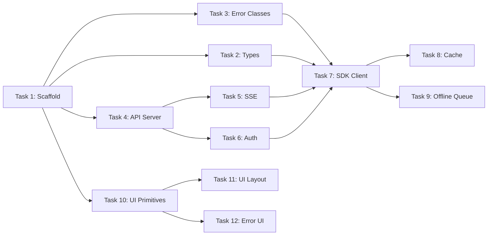

# SPRINT-000 — Platform Foundation

| Field | Value |
|-------|-------|
| **ID** | SPRINT-000 |
| **Name** | Platform Foundation |
| **Version** | 1.0 |
| **Status** | Draft |
| **Category** | Sprint Plan |
| **Owner** | Chief Architect |
| **Derived from** | ARCH-0015 through ARCH-0022 |
| **Duration** | 2 weeks |
| **Team size** | 2 developers |

---

## 1. Objective

Build the foundational infrastructure layer: API server, Platform SDK, shared types, package scaffolding, and base UI components. No business features — only the pipes.

---

## 2. Tasks

### Task 1: Scaffold Monorepo

| Field | Detail |
|-------|--------|
| **Estimate** | 4 hours |
| **Objective** | Create Nx/Turborepo monorepo with all packages and apps |
| **Files** | `package.json`, `turbo.json`, `tsconfig/base.json`, `apps/web/`, `packages/ui/`, `packages/sdk/`, `packages/types/`, `tooling/` |
| **Definition of Done** | `npm run build` succeeds across all packages |
| **Tests** | CI passes |
| **Expected commit** | `chore: scaffold monorepo structure` |

### Task 2: Shared Types (Contracts)

| Field | Detail |
|-------|--------|
| **Estimate** | 6 hours |
| **Objective** | Implement all UI contract interfaces from ARCH-0020 |
| **Files** | `packages/types/contracts/` (dashboard, missions, journeys, competencies, evidence, achievements, mentor, analytics) |
| **Definition of Done** | All interfaces compile, 80%+ match ARCH-0020 |
| **Tests** | `npm run typecheck` passes, 5+ type-level tests |
| **Expected commit** | `feat(types): platform contracts` |

### Task 3: Error Classes

| Field | Detail |
|-------|--------|
| **Estimate** | 4 hours |
| **Objective** | Implement error hierarchy from ARCH-0021 |
| **Files** | `packages/sdk/src/errors/index.ts`, `packages/sdk/src/errors/runtime-error.ts`, `packages/sdk/src/errors/application-error.ts`, `packages/sdk/src/errors/validation-error.ts`, `packages/sdk/src/errors/policy-error.ts`, `packages/sdk/src/errors/domain-error.ts`, `packages/sdk/src/errors/auth-error.ts`, `packages/sdk/src/errors/network-error.ts`, `packages/sdk/src/errors/offline-error.ts`, `packages/sdk/src/errors/ui-error.ts` |
| **Definition of Done** | All 9 error classes implemented with correct inheritance, code property, and `instanceof` checks |
| **Tests** | Unit tests for each class, `instanceof` tests |
| **Expected commit** | `feat(sdk): error hierarchy` |

### Task 4: API Server Scaffold

| Field | Detail |
|-------|--------|
| **Estimate** | 6 hours |
| **Objective** | Set up Fastify API server with the URL structure from ARCH-0015 |
| **Files** | `apps/api/` (separate app or within monorepo), routes skeleton for all resources, health endpoint |
| **Definition of Done** | Server starts, health endpoint returns 200, all route groups registered |
| **Tests** | Health check test, route registration test |
| **Expected commit** | `feat(api): server scaffold with route skeleton` |

### Task 5: SSE Transport

| Field | Detail |
|-------|--------|
| **Estimate** | 4 hours |
| **Objective** | Implement SSE event bus for real-time communication (ARCH-0015) |
| **Files** | `apps/api/src/events/event-bus.ts`, `apps/api/src/events/sse-handler.ts`, `packages/sdk/src/events/` |
| **Definition of Done** | Server can push events, SDK can subscribe, reconnect works |
| **Tests** | Event subscription test, reconnection test |
| **Expected commit** | `feat(api+sdk): SSE transport` |

### Task 6: Auth Middleware + Flow

| Field | Detail |
|-------|--------|
| **Estimate** | 8 hours |
| **Objective** | Implement JWT auth flow, token refresh, anonymous identity (ARCH-0017) |
| **Files** | `apps/api/src/auth/`, `packages/sdk/src/auth/`, `apps/web/src/features/auth/` |
| **Definition of Done** | Anonymous → registered flow works, token refresh transparent, session state machine (ARCH-0017) |
| **Tests** | Auth flow integration test, token refresh test, session state transitions |
| **Expected commit** | `feat(api+sdk): authentication` |

### Task 7: SDK Client Core

| Field | Detail |
|-------|--------|
| **Estimate** | 8 hours |
| **Objective** | Implement `AscendSDK` class from ARCH-0016 with all resource methods |
| **Files** | `packages/sdk/src/client/client.ts`, `packages/sdk/src/resources/*.ts` |
| **Definition of Done** | Client exposes all resource methods, retry/timeout/cache/offline-queue/optimistic-update policies implemented |
| **Tests** | Resource method unit tests, retry test, cache test, offline queue test |
| **Expected commit** | `feat(sdk): client core` |

### Task 8: Cache Layer

| Field | Detail |
|-------|--------|
| **Estimate** | 4 hours |
| **Objective** | Implement in-memory + IndexedDB cache with TTL (ARCH-0016) |
| **Files** | `packages/sdk/src/cache/` |
| **Definition of Done** | Cache hit/miss works, TTL eviction, IndexedDB persists across sessions |
| **Tests** | Cache unit tests, TTL test, IndexedDB persistence test |
| **Expected commit** | `feat(sdk): cache layer` |

### Task 9: Offline Queue

| Field | Detail |
|-------|--------|
| **Estimate** | 6 hours |
| **Objective** | Implement offline queue with sync-on-reconnect (ARCH-0021) |
| **Files** | `packages/sdk/src/offline/` |
| **Definition of Done** | Actions queued offline, retried on reconnect, conflicts handled with LWW |
| **Tests** | Offline queue test, sync test, conflict resolution test |
| **Expected commit** | `feat(sdk): offline queue` |

### Task 10: UI Component Library — Primitives

| Field | Detail |
|-------|--------|
| **Estimate** | 8 hours |
| **Objective** | Build base UI components (ARCH-0022) |
| **Files** | `packages/ui/src/primitives/` (Button, Input, Card, Badge, Modal, Skeleton, Toast) |
| **Definition of Done** | All primitives render correctly, accessible (a11y), responsive |
| **Tests** | Component render tests, accessibility tests |
| **Expected commit** | `feat(ui): primitives` |

### Task 11: UI Component Library — Layout

| Field | Detail |
|-------|--------|
| **Estimate** | 6 hours |
| **Objective** | Build layout components (ARCH-0022) |
| **Files** | `packages/ui/src/layout/` (AppShell, Sidebar, Header, MainContent) |
| **Definition of Done** | Layout adapts to auth/welcome states, responsive sidebar |
| **Tests** | Layout render tests, responsive breakpoint test |
| **Expected commit** | `feat(ui): layout` |

### Task 12: Error Boundaries + Toast System

| Field | Detail |
|-------|--------|
| **Estimate** | 4 hours |
| **Objective** | Implement error boundaries, toast system (ARCH-0021) |
| **Files** | `packages/ui/src/feedback/` (ErrorBoundary, ToastProvider, Toast), `apps/web/src/app/error.tsx` |
| **Definition of Done** | Error boundary catches render errors, toast system displays all types with correct policy |
| **Tests** | Error boundary test, toast display/dismiss test |
| **Expected commit** | `feat(ui): error handling` |

---

## 3. Dependencies

---

## 4. Parallelization Plan

| Track 1 (Dev A) | Track 2 (Dev B) |
|-----------------|-----------------|
| Task 1: Scaffold | Task 1: Scaffold |
| Task 4: API Server | Task 2: Types |
| Task 5: SSE | Task 3: Error Classes |
| Task 6: Auth | Task 10: UI Primitives |
| Task 7: SDK Client | Task 11: UI Layout |
| Task 8: Cache | Task 12: Error UI |
| Task 9: Offline Queue | — |

---

## 5. Definition of Sprint Done

- [ ] All 12 tasks complete
- [ ] All tests pass
- [ ] `npm run build` succeeds
- [ ] `npm run typecheck` passes
- [ ] API serves health endpoint
- [ ] SDK resolves all resource methods
- [ ] Auth flow works (anonymous → registered)
- [ ] Offline queue syncs on reconnect
- [ ] UI primitives render
- [ ] Error boundaries catch and display

---

## 6. Change History

| Version | Date | Author | Change |
|---------|------|--------|--------|
| 1.0 | 2026-07-20 | Chief Architect | Initial version |
